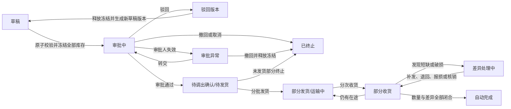

# ERP 前端全量重建与库存调拨实施方案

> 日期：2026-08-01
> 状态：业务方向与关键决策已确认，尚未开始实施
> 决策人：项目负责人
> 执行方式：Codex 分阶段实施，项目负责人逐阶段确认，真实岗位用户完成最终验收
> 当前分支：`codex/erp-product-optimization`
> 当前现场：工作区超过 1,300 项未提交状态；开始实施前必须先形成干净、可追溯的基线

## 1. 方案结论

本项目按以下优先级推进：

1. 业务功能逻辑正确；
2. 页面让真实岗位用户更容易完成任务；
3. 安全、可重复、可回滚的发布能力在核心产品方案稳定后继续治理。

本次不是对现有 Vue 2 页面做渐进升级，而是：

- 从空目录建立新的 Vue 3 前端；
- 重建整个 ERP 的信息架构、视觉系统、页面和交互；
- 不复用旧页面、旧样式或旧组件；
- 后端 API 和核心业务契约原则上保持稳定，只修正确认过的逻辑缺陷；
- 开发期间在 `erp-ui-next/` 独立运行，最终全量替换 `erp-ui/`；
- 最终上线后不保留旧前端运行入口或只读入口；
- 不做原生 App，只交付桌面与移动浏览器可用的 Web 系统。

本方案取代 `docs/项目整体改造方案-20260716.md` 中“前端小切片渐进迁移、保留旧壳并行运行”的前端战略。该文档中的后端一致性、数据库、交付和运行治理结论仍作为补充约束。

`docs/erp-pc-mobile-consistency-audit-20260729/` 中的功能地图、页面清单和业务一致性原则继续作为迁移盘点输入；其中 Capacitor、原生发布和原生能力部分被本方案的“纯 Web”决策取代。

## 2. 目标与完成定义

### 2.1 产品目标

- 每个业务对象只有一套状态、权限、数据和审计语义。
- 用户进入系统后能直接看到自己当前需要完成的任务。
- 每个业务详情明确显示当前状态、等待对象和下一步操作。
- 桌面端适合高密度管理，移动网页适合审批、扫码、发货、收货和现场录入。
- 页面不依赖培训教程；真实用户在无人提示时也能完成核心任务。

### 2.2 技术目标

- Vue 3 + Vite + TypeScript 严格模式。
- Pinia + Vue Router。
- Element Plus 作为底层控件库，外部统一使用项目设计系统和 ERP 业务组件。
- Vitest 负责纯逻辑与组件测试，Playwright 负责真实浏览器业务流程。
- 后端发布版本化 OpenAPI，前端生成 TypeScript 类型和基础客户端。
- 登录切换到服务端 `HttpOnly` 会话 Cookie，配套 CSRF 和统一会话失效处理。
- 单一 Web 应用支持桌面和移动浏览器，不保留 Capacitor、iOS、Android 工程。

### 2.3 完成定义

只有同时满足以下条件，才允许用新前端替换旧前端：

- 功能迁移矩阵中的每项旧能力均已明确为保留、重设计、合并或下线。
- 所有保留、重设计和合并能力均关联新页面、权限、API 和自动化用例。
- 所有下线能力均取得项目负责人逐项确认。
- 生产等价环境中全量业务矩阵通过，要求的 MySQL 集成测试无跳过。
- 申请人、审批人、仓库发货人、收货人、差异负责人等真实岗位用户可在无人指导下完成任务。
- 库存、金额、审批、附件、权限和审计对账差异为 0。
- 桌面与移动浏览器验收、性能验收和无障碍验收通过。

## 3. 范围与非目标

### 3.1 纳入范围

以 `docs/erp-pc-mobile-consistency-audit-20260729/01-ERP系统功能地图.md` 为现有能力基线，覆盖：

- 个人工作：登录、组织选择、工作台、统一待办、消息、个人资料；
- 客户与销售：销售、销售退货、客户服务卡、配送通知；
- 采购与库存：商品、分类、供应商、采购、退货、仓库与门店库存、调拨、盘点、流水、报表；
- OA 与审批：OA 采购、考勤、固定资产、审批定义、实例、任务和异常处理；
- 人事与合同：员工、入职、完整度、岗位配置、健康证、薪资、劳动合同、签署包和签署任务；
- 文件：空间、上传、下载、预览、移动、回收站和配额；
- 系统管理：用户、角色、菜单、部门、岗位、组织授权、字典、配置、公告、日志、在线用户和任务；
- 经营分析：当前已经存在的库存、销售、采购和毛利类报表。

### 3.2 明确不纳入首期

- 当前系统不存在的独立总账、应收、应付和完整财务核算模块；
- iOS、Android 或 Capacitor 原生应用；
- 离线执行审批、发货、收货等改变业务状态的操作；
- 多语言；首期只交付简体中文，但文案和枚举必须集中管理；
- 深色模式和多套用户主题；首期只交付一套品牌主题；
- 内置新手教程或全屏引导；页面本身必须做到可理解；
- 在前端全量重建期间同时推倒重写后端架构。

## 4. 库存调拨：首个业务标准样板

库存调拨作为第一个完整业务切片，用来建立全系统后续应遵循的状态机、权限、幂等、审计和交互标准。

### 4.1 业务流程



### 4.2 库存不变量

- 草稿不影响库存。
- 提交审批时，全单、全商品在同一事务中校验并冻结；任一商品不足则全部失败，不能部分冻结。
- 草稿允许记录超过可用库存的期望数量，但页面必须显示缺口，提交时禁止通过。
- 驳回、撤回或未发货取消时立即释放对应冻结库存。
- 发货时调出方实物库存减少，数量进入在途。
- 分次收货时，合格数量进入调入方可用库存；破损进入残损/待处理；缺失保留为在途差异。
- 普通业务不允许任何角色强制产生负库存。
- 已发生发货或收货后不得删除、回写或反向修改原事实；纠错通过终止剩余量、退回调拨或补偿记录完成。
- 全部数量和差异闭合后系统自动完成，不要求用户额外点击“完成”。

数量守恒至少满足：

```text
审批数量 = 未发终止数量 + 累计发货数量
累计发货数量 = 合格收货 + 残损 + 已裁决短缺 + 退回 + 尚未裁决在途差异
```

### 4.3 审批规则

- 调入方审批需求真实性和合理性；调出方在审批通过后确认可供并执行发货。
- 跨区域或达到金额阈值时增加固定上级节点。
- 发起人不得审批自己的单据。
- 提交时冻结审批链、规则和候选人快照；组织和人员后续变化不修改已在途审批事实。
- 审批人离职、停用或超时后先提醒，再转交给合法上级或代理人；不得超时自动通过。
- 转交记录原审批人、新审批人、原因、操作者和时间。
- 无合法接替人时进入审批异常，允许撤回并释放冻结。
- 提交后的商品、数量、调入方和调出方不可直接修改；修改必须撤回到新草稿版本并重新审批。

### 4.4 发货、批次与库位

- 支持分批发货，累计发货不得超过审批数量。
- 未发部分继续冻结；无法继续发货时由调出方发起短缺结案，调入方确认后释放剩余冻结。
- 超额发货禁止，必须新建关联调拨。
- 请求阶段只冻结商品级可用量；发货阶段再分配实际批次和库位。
- 有效期商品默认 FEFO，无有效期商品默认 FIFO。
- 过期、冻结、残损、待检、隔离和禁用库存不参与分配。
- 仓库人员可以调整系统建议的批次和库位，但必须具备权限并填写原因。
- 高价值、序列号或易错商品要求逐件扫码。

该部分必须与 `docs/architecture/warehouse-lot-location-design.md` 的批次、库位、序列号、双写和对账协议保持一致，不得在新前端自行计算库存余额。

### 4.5 收货与差异

- 收货页默认带出本批待收数量，支持一键全收，也允许按实收修改。
- 同一发货批次可以分次收货，累计收货不得超过累计发货。
- 每个发货批次生成唯一二维码；扫码后打开精确批次并校验当前组织权限。
- 正常发货、收货不强制上传附件；破损、短缺、封签异常或人工覆盖批次建议时必须上传证据。
- 调出方或调入方不得单方面关闭差异。
- 双方确认事实后，由独立“库存差异处理”角色选择补发、退回、报损、责任调整或运输损耗核销。
- 所有差异处理保留数量、金额、证据、责任方、操作者和前后状态。

### 4.6 成本与单位

- 调入库存沿用实际调出批次成本，不重新取商品当前价格，不产生内部销售利润。
- 多批次发货按实际批次计算加权成本；运输费等附加费用单独记录和分摊。
- 破损、短缺损失单独记账，不能静默摊入正常收货成本。
- 库存统一使用最小基础单位记账；页面允许输入箱、盒、袋、件等常用包装单位。
- 提交时冻结单位换算快照；换算关系后续变更不影响在途单据。
- 不可拆分商品禁止小数；称重商品按配置精度处理。
- 前端金额和数量使用十进制字符串与 Decimal 类库，不使用 JavaScript 浮点数承担业务结算。

### 4.7 幂等、权限与审计

- 提交、审批、发货、收货、差异处理等命令均携带唯一请求标识。
- 重复请求返回第一次结果，不重复冻结、扣减、入库或创建批次。
- 并发状态冲突明确提示刷新，不能静默覆盖。
- 单据只对发起人、调入/调出授权人员、当前和历史审批人及审计角色可见。
- 成本价、总成本和损失金额使用独立成本权限。
- 所有状态变化和库存变化只追加审计记录，不允许通过普通功能删除或覆盖。
- 驳回后原审批版本永久保留，系统生成新草稿版本。

### 4.8 调拨类型内部实施顺序

1. 门店向仓库要货；
2. 异店调货与调出方确认；
3. 门店返仓；
4. 销售发货自动生成的在途调拨。

四类业务共用库存账和状态机基础，但页面、权限和方向策略分别实现，不在一个巨型表单中堆条件分支。

## 5. 新前端目标架构

### 5.1 计划目录

```text
erp-ui-next/
├─ package.json
├─ vite.config.ts
├─ tsconfig*.json
├─ src/
│  ├─ app/                 # 启动、路由、布局、全局 Provider
│  ├─ design-system/       # 设计令牌、基础组件、业务组件、图标
│  ├─ platform/            # 会话、权限、组织、消息、错误、文件、遥测
│  ├─ api/                 # OpenAPI 生成代码与业务适配层
│  ├─ domains/
│  │  ├─ workbench/
│  │  ├─ inventory/
│  │  ├─ purchasing/
│  │  ├─ sales/
│  │  ├─ oa/
│  │  ├─ approval/
│  │  ├─ hr/
│  │  ├─ signing/
│  │  ├─ drive/
│  │  ├─ reporting/
│  │  └─ system/
│  ├─ pages/               # 路由级页面组合
│  └─ test-support/        # Mock、fixture、权限角色、测试工厂
├─ tests/
│  ├─ contract/
│  └─ e2e/
└─ public/
```

目录可以在脚手架验证后微调，但必须保持领域隔离；禁止重新形成单个 2,000～3,000 行万能页面。

### 5.2 应用结构

- 单一 Web 应用、单一路由体系和单一会话。
- 桌面和移动共享业务模型、API、权限、状态与设计令牌。
- 页面布局可以按设备分别实现；禁止在巨型组件中堆叠大量设备判断。
- 移动核心任务不得依赖横向滚动大表格；使用任务卡片、分组详情和底部主操作。
- 复杂配置、批量导入和多维报表以桌面为主；审批、扫码、发货、收货和现场录入必须在手机浏览器闭环。

### 5.3 信息架构

一级导航目标：

- 工作台；
- 客户与销售；
- 采购与库存；
- OA 协同；
- 人事；
- 财务与报表（只展示当前已经存在的经营和薪资能力）；
- 系统设置。

工作台聚合待办、异常、常用入口和最近访问。业务域保留稳定导航，个人任务不要求用户反复进入模块菜单寻找。

用户拥有多个组织权限时：

- 顶部固定显示当前组织；
- 切换组织后统一刷新工作台、菜单、数据和新建表单；
- 区分跨组织汇总查看与代表具体组织执行操作；
- 所有写操作页面再次明确显示实际操作组织。

### 5.4 设计系统

- 视觉方向：暖白、墨色、茶绿色为基础，少量金色用于重点和价值信息。
- 桌面采用高信息密度专业工作台，提供舒适/紧凑两种密度。
- 移动采用大触控区域、单任务页面和固定主操作。
- 首期只交付一套主题，不提供深色模式。
- 状态颜色采用统一语义，不能只靠颜色表达状态。
- 先建立颜色、字体、间距、表格、筛选器、表单、详情、时间线、状态、错误、权限按钮和移动底部操作栏，再批量建设页面。
- 文字对比度、键盘焦点、弹窗焦点管理、读屏标签和约 44px 移动触控区域作为硬性验收。

### 5.5 平台约束

- 前端只注册已知功能清单；后端返回功能标识和数据范围，未知功能默认拒绝。
- 路由、按钮、接口和待办深链共用同一功能标识。
- API 类型从 OpenAPI 生成；页面不能直接依赖未经适配的原始响应。
- 校验错误定位字段，状态冲突提示刷新，库存不足展示缺口，未知错误展示追踪编号。
- 业务日期使用无时区年月日；操作时间使用带时区时间点并统一按 `Asia/Shanghai` 展示。
- 自动保存服务端草稿，显示最后保存时间；跨设备并发编辑必须检测版本冲突。
- 改变业务状态的操作必须在线提交；弱网中断后先查询原请求结果，再决定是否重试。

## 6. 页面体验标准

### 6.1 任务型工作台

- 申请人：新建、草稿、被驳回和进度跟踪；
- 审批人：待审批和完整审批上下文；
- 调出方：待确认、待拣货和待发货；
- 调入方：待收货和待确认差异；
- 差异负责人：待裁决事项；
- 每个详情页突出唯一的下一步操作，历史动作进入时间线。

### 6.2 表单和列表

- 简单表单单页完成；复杂表单通常按基本信息、业务明细、确认提交三步组织。
- 错误直接定位字段和步骤，不能只在页面顶部显示失败。
- 商品选择支持名称、编码、扫码、最近使用和批量选择；重复添加自动合并。
- 标准数据工作台支持保存筛选、列设置、密度、返回后恢复查询条件。
- 小数据同步导出，大数据后台异步导出并通知；导出继承权限和数据范围。
- 页面展示稳定业务阶段，并明确“当前等待谁做什么”，不直接暴露技术状态码。

### 6.3 通知

- 待审批、待发货、待收货和差异待处理通知当前责任人。
- 通过、驳回、取消、短缺结案和完成通知发起人。
- 同一事件只产生一次通知，可直接跳转到精确任务。
- 临近超时先提醒本人，超时后升级，不自动通过。

### 6.4 浏览器与性能

- 支持当前及前一个主要版本的 Chrome、Edge、Safari 和微信 WebView；不支持 IE。
- 常用列表和详情在正常企业网络下，95% 请求在 2 秒内完成。
- 点击状态变更操作后 300ms 内必须出现处理中反馈。
- 超过 2 秒的操作显示进度或当前阶段。
- 商品搜索采用防抖、分页或虚拟列表。
- 手机在普通 4G 和微信内置浏览器中能够完成扫码、审批、发货与收货。

## 7. 分阶段实施

### 阶段 0：保护现场并建立基线

目标：在不丢失任何用户改动的前提下，得到干净、唯一、可追溯的起点。

工作：

1. 以当前工作区为功能盘点基线，生成变更路径、大小和内容哈希清单。
2. 由项目负责人确认现有改动全部保留。
3. 将现有改动整理为干净基线提交；不使用 `reset --hard`、`clean` 或批量覆盖。
4. 固定 JDK 17、Maven 3.9.x、Node 22.23.1 和项目声明的 npm 版本。
5. 记录当前 Maven、前端测试、依赖审计和发布门禁结果。
6. 从干净基线创建新的 `codex/` 开发分支。

验收：

- `git status` 为空；
- 基线提交和变更清单一致；
- `mvn test` 通过；
- `cd erp-ui && npm test` 通过；
- `git diff --check` 通过。

### 阶段 1：功能迁移矩阵与后端契约冻结

目标：删除旧前端之前，先证明每项业务能力的去向。

工作：

1. 以现有功能地图、PC 页面清单、移动页面清单和源码路由为输入。
2. 建立矩阵字段：旧菜单/路由、页面、操作、权限、数据范围、API、异常分支、目标处置、新路由、新组件、测试和确认状态。
3. 每项标记为保留、重设计、合并或下线；下线项由项目负责人逐项确认。
4. 生成后端 OpenAPI 基线，识别不一致的分页、错误、日期、金额、文件和权限结构。
5. 冻结业务 API 契约；只允许兼容性增加和已确认逻辑修复。

验收：全部现有有效入口和隐藏/条件入口均进入矩阵，不存在“暂时没看见所以没迁移”的页面。

### 阶段 2：新前端骨架和设计系统

目标：建立后续所有页面共用的技术和视觉基础。

工作：

1. 创建独立 `erp-ui-next/`，禁止引用 `erp-ui/src`。
2. 配置 Vue 3、Vite、TypeScript strict、Pinia、Vue Router、Element Plus、Vitest、Playwright、ESLint 和格式化门禁。
3. 建立品牌设计令牌和第一批基础/业务组件。
4. 建立桌面布局、移动布局、响应式断点和无障碍基线。
5. 建立 Mock API、角色 fixture 和可复用测试工厂。

验收：类型检查、lint、组件测试、空壳构建和桌面/移动基础视觉测试通过。

### 阶段 3：三个可运行原型

目标：在批量编码前确认视觉与交互方向。

原型：

1. 桌面工作台与全局导航；
2. 库存调拨任务工作台和新建流程；
3. 手机网页待办和收货流程。

原型只接 Mock 数据，不执行真实业务写操作。项目负责人在桌面和手机浏览器实际操作后确认设计系统、信息密度、导航、表格、表单、状态和移动交互。

未获得确认前不批量复制页面模式。

### 阶段 4：平台能力

目标：让所有领域页面复用同一会话、权限、组织、数据和错误语义。

工作：

- HttpOnly Cookie 会话、CSRF、登录失效和多标签页同步；
- 全局组织上下文与组织切换；
- 功能清单、路由守卫、操作权限和数据范围；
- OpenAPI 类型生成和 API 适配层；
- Decimal、日期时间、枚举和文案中心；
- 文件上传、下载、预览和失败重试；
- 消息、待办深链、统一错误和追踪编号；
- 标准表格、筛选、导出和用户偏好。

验收：角色切换、组织切换、越权负向用例、401/403、会话过期、弱网重试和文件错误全部通过真实浏览器测试。

### 阶段 5：库存调拨垂直切片

目标：实现本方案第 4 节全部业务规则，并将其作为后续模块模板。

重点后端范围：

- `erp-modules/erp-inventory/src/main/java/com/erp/inventory/controller/InvTransferController.java`
- `erp-modules/erp-inventory/src/main/java/com/erp/inventory/service/impl/InvTransferServiceImpl.java`
- `erp-modules/erp-inventory/src/main/java/com/erp/inventory/service/impl/InvTransferApprovalServiceImpl.java`
- `erp-modules/erp-inventory/src/main/java/com/erp/inventory/service/impl/InvTransferReceiptProcessor.java`
- `erp-modules/erp-inventory/src/main/java/com/erp/inventory/service/impl/InvTransferDiscrepancyProcessor.java`
- `erp-modules/erp-inventory/src/main/java/com/erp/inventory/service/impl/InvTransferDirectionPolicy.java`
- 对应 domain、DTO、mapper、MyBatis XML 和新增 roll-forward SQL。

实施时优先抽出状态机、库存预留、履约、差异和成本策略，禁止继续扩大已有巨型 Service。

重点前端范围计划位于：

- `erp-ui-next/src/domains/inventory/transfer/`
- `erp-ui-next/src/pages/inventory/transfer/`
- `erp-ui-next/tests/e2e/inventory-transfer/`

验收场景：

- 整单提交和原子冻结；
- 驳回、撤回、取消和库存释放；
- 审批人失效、转交和审批异常；
- 分批发货、分次收货；
- FEFO/FIFO、批次改选和序列号扫码；
- 短缺、破损、补发、退回、报损和核销；
- 重复请求、并发争抢、版本冲突和事务回滚；
- 成本、单位换算、权限、数据范围和审计；
- 桌面与手机浏览器完整流程。

### 阶段 6：全 ERP 领域迁移

内部顺序：

1. 工作台、组织、统一待办和消息；
2. 采购、库存、调拨、盘点和报表；
3. 客户、销售、退货和配送；
4. OA 和统一审批；
5. 人事、入职、薪资和合同；
6. 文件、签署和经营分析；
7. 用户、角色、组织、配置、日志和任务。

每个领域必须完成：

- 迁移矩阵更新；
- 业务状态和权限评审；
- 桌面与移动网页布局；
- OpenAPI 类型和适配层；
- Vitest 逻辑/组件测试；
- Playwright 主流程、异常流程和越权用例；
- 项目负责人阶段确认。

### 阶段 7：生产等价全量验收

本项目不安排门店试点，但直接上线前必须建立比试点更严格的生产等价门禁。

工作：

1. 在与生产表结构、配置、数据规模和浏览器组合相近的环境部署完整新前端。
2. 运行全部后端单元测试和 `new-business-mysql-it` MySQL 集成测试。
3. 运行前端类型、lint、单元、组件、契约、E2E、视觉和无障碍检查。
4. 由真实岗位用户在无人提示下完成申请、审批、发货、收货、差异、销售、采购、OA、人事、文件和管理任务。
5. 核对库存、成本、审批、待办、附件、权限和审计。
6. 所有要求执行的测试必须实际执行；环境缺失导致的跳过视为失败。

验收：核心任务完成率 100%，严重误操作为 0，库存与金额差异为 0，越权访问为 0，不依赖人工改数据库完成单据。

### 阶段 8：全量切换与旧前端删除

目标：一次性将生产入口切换到新 Web 系统，不保留旧前端入口。

前置条件：

- 功能迁移矩阵 100% 闭合；
- 全量生产等价验收通过；
- 项目负责人签字确认；
- 新前端构建、静态资源、Nginx 路由和会话配置完成；
- 切换目标和旧目录精确解析并再次确认。

工作：

1. 停止旧前端变更。
2. 构建新前端正式产物并校验 manifest。
3. 切换 Web 静态入口。
4. 验证登录、组织、工作台和每个核心领域入口。
5. 在获得最终明确批准后删除旧前端源码和 Capacitor/iOS/Android 相关内容。
6. 将 `erp-ui-next` 收敛为正式 `erp-ui` 目录，并更新构建与部署脚本。

旧前端删除属于不可逆范围较大的操作，执行前必须单独展示精确删除清单并取得确认；本方案本身不授权提前删除。

## 8. 验证命令

现有仓库基线命令：

```bash
mvn test
mvn -Pnew-business-mysql-it verify

cd erp-ui
npm test

git diff --check
```

`erp-ui-next/package.json` 建立后必须提供并在 CI 中执行以下目标命令：

```bash
cd erp-ui-next
npm ci
npm run typecheck
npm run lint
npm run test:unit
npm run test:e2e
npm run build
```

这些新前端命令是目标契约；在脚手架创建前尚不存在，不应在阶段 0 假装已经通过。

## 9. 主要风险与控制

| 风险 | 控制方式 |
|---|---|
| 整个前端全量重建导致功能遗漏 | 功能迁移矩阵、旧路由/API/权限全量盘点、逐项确认 |
| 业务逻辑、视觉和框架同时变化 | 库存调拨样板、三个原型确认、内部领域分阶段验收 |
| 后端和前端同时漂移 | 冻结 API 契约，仅允许兼容增加和确认过的逻辑修复 |
| 当前工作区不干净 | 先生成清单和哈希，再形成干净基线；不使用破坏性清理 |
| 不做试点导致真实场景遗漏 | 生产等价环境、真实岗位无指导 UAT、要求的测试跳过即失败 |
| 旧前端不保留 | 删除前迁移矩阵 100% 闭合，并单独批准精确删除清单 |
| 新页面再次形成巨型组件 | 领域目录、业务组件、代码体积门禁和独立状态/策略模块 |
| 移动 Web 在微信/Safari 行为不同 | 浏览器矩阵、真实扫码/拍照/下载/登录回跳测试 |
| HttpOnly Cookie 切换影响登录 | dual 环境联调、CSRF/CORS 负向测试、会话失效 E2E |

## 10. 决策检查点

需要项目负责人明确确认的检查点：

1. 当前工作区基线清单和基线提交；
2. 功能迁移矩阵中的下线、合并和业务规则争议；
3. 三个可运行原型；
4. 库存调拨完整业务矩阵；
5. 每个领域迁移完成状态；
6. 生产等价验收结果；
7. 旧前端精确删除清单；
8. 最终全量切换。

在任一检查点未确认前，后续不可逆步骤不得开始。

## 11. 下一步

下一次实施从阶段 0 开始：只读盘点当前 1,300 余项工作区状态，生成基线清单、分类和哈希，提出可审查的提交划分；不修改业务代码、不清理文件、不创建提交，直到项目负责人确认清单和提交范围。
