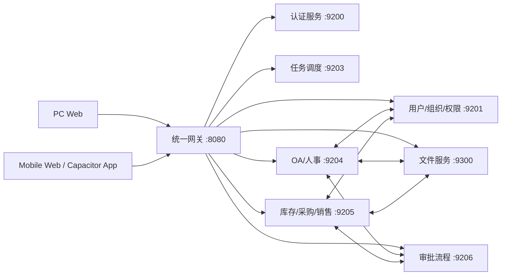

# ERP 系统功能地图

> 审计日期：2026-07-29
> 审计范围：当前工作区源码、路由、菜单、接口、权限标识、服务调用关系，以及 2026-07-27 至 2026-07-28 的既有 PC/移动端运行审计记录。
> 本阶段约束：仅分析和设计，未修改业务代码，未执行会改变业务数据的写操作。

## 1. 结论摘要

当前 ERP 已形成覆盖系统管理、人事、仓储、门店库存、OA、审批、文件与个人工作的业务骨架。PC 与移动端并非两套独立后端：两端位于同一个 Vue 项目中，复用 API 模块，并通过同一个网关访问用户、权限、组织、库存、OA、审批和文件服务。这为“一套业务系统、两套终端体验”提供了良好基础。

主要问题不是“完全没有统一”，而是以下四类不一致：

1. **入口不统一**：PC 菜单由后台动态菜单驱动；移动端另有 59 个固定路由及多套工作台，信息架构没有统一产品模型。
2. **能力边界不清**：移动端存在用户、角色、菜单、参数、日志、定时任务等偏 PC 管理型入口；同时扫码、离线恢复等移动执行能力尚未落地。
3. **业务闭环未被同一验收标准覆盖**：已有运行记录主要验证页面可访问和只读行为，角色化写流程、异常流程、原生包和真实数据闭环尚未完整验证。
4. **功能状态表达混杂**：部分页面已实现但受开关、权限或组织上下文限制；部分旧入口仍保留；财务独立核算等用户期望模块当前并不存在。

## 2. 状态图例

| 标识 | 含义 | 纳入本次设计方式 |
|---|---|---|
| A | 已实现且当前有有效入口 | 作为现状基线，校验 PC/移动一致性 |
| C | 已实现但受功能开关、权限、组织或运行条件限制 | 保留但必须显式展示可用条件 |
| H | 源码存在，但菜单隐藏、旧入口或替代入口 | 决定迁移、合并或下线 |
| P | 规划能力，当前未发现完整实现 | 不计入现有功能，进入整改待办 |
| N | 当前明确不在系统中 | 需单独立项，禁止在页面文档中伪装为已实现 |
| V | 已有页面/接口，但写流程或多角色运行尚未验证 | 上线前必须补齐场景化验收 |

## 3. 系统级功能树

```text
ERP
├─ 个人工作
│  ├─ 首页工作台
│  │  ├─ 组织/门店/仓库上下文
│  │  ├─ 待办摘要
│  │  ├─ 风险与异常摘要
│  │  └─ 快捷入口
│  ├─ 统一待办
│  │  ├─ 待审批
│  │  ├─ 待执行
│  │  ├─ 被退回
│  │  ├─ 风险提醒
│  │  └─ 个人事项
│  ├─ 消息中心
│  │  ├─ 系统通知
│  │  ├─ 业务通知
│  │  └─ 已读/未读
│  ├─ 个人资料
│  └─ 登录、安全与组织选择
│
├─ 人事管理
│  ├─ 员工档案
│  ├─ 入职管理
│  ├─ 入职数据导入导出
│  ├─ 资料完整度
│  ├─ 岗位入职配置
│  ├─ 健康证管理
│  ├─ 团队员工查询
│  ├─ 劳动合同档案
│  └─ 薪资
│
├─ OA 与行政
│  ├─ OA 工作台
│  ├─ OA 采购申请
│  ├─ 考勤
│  ├─ 固定资产配置
│  ├─ 固定资产报修
│  ├─ 签署包管理
│  └─ 签署任务
│
├─ 仓储与采购
│  ├─ 商品档案
│  ├─ 商品分类
│  ├─ 供应商
│  ├─ 采购单
│  ├─ 采购退货
│  ├─ 仓库库存
│  ├─ 仓库调拨
│  ├─ 调拨记录
│  ├─ OE 分类/OE 商品
│  ├─ 赠品分类/赠品
│  └─ OE 补货
│
├─ 门店销售与库存
│  ├─ 销售单
│  ├─ 销售退货
│  ├─ 客户服务卡
│  ├─ 门店库存
│  ├─ 补货/调拨
│  ├─ 出库/配送通知
│  ├─ 盘点
│  ├─ 库存流水
│  ├─ 调拨审批与记录
│  └─ 库存报表
│
├─ 审批与流程
│  ├─ 流程定义与版本
│  ├─ 审批规则配置
│  ├─ 审批实例监控
│  ├─ 任务转交/终止/回调重放
│  └─ 各业务单据统一审批
│
├─ 文件与电子签
│  ├─ 文件空间
│  ├─ 上传/下载/预览
│  ├─ 移动/重命名/回收站
│  ├─ 配额
│  ├─ 合同档案
│  └─ 签署包/签署任务
│
├─ 系统管理
│  ├─ 用户
│  ├─ 角色
│  ├─ 菜单
│  ├─ 部门
│  ├─ 岗位
│  ├─ 用户组织授权
│  ├─ 参数配置
│  ├─ 字典
│  ├─ 通知公告
│  ├─ 在线用户
│  ├─ 操作日志
│  ├─ 登录日志
│  └─ 定时任务
│
└─ 经营与财务相关
   ├─ 库存/销售/采购/毛利报表
   ├─ 员工薪资
   └─ 独立总账、应收、应付、报销、对账：当前不存在
```

## 4. 一级模块盘点

| 一级模块 | 二级能力 | PC 现状 | 移动现状 | 状态与说明 |
|---|---|---|---|---|
| 个人工作 | 首页、待办、消息、个人资料、组织选择 | 已有统一首页、待办、消息与个人资料入口 | 已有门店/仓库/HR 工作台、待办、公告、我的 | A/V；移动端尚未形成稳定五栏主导航 |
| 人事管理 | 员工、入职、完整度、岗位配置、健康证、合同、薪资 | 管理能力较完整 | 具备查询、入职、完整度、健康证、团队、合同、薪资 | A/V；角色化写流程需要专项验收 |
| OA 与行政 | OA 采购、考勤、固定资产、电子签 | 配置、批量、档案和任务处理较完整 | 具备快速填报、查看和处理入口 | A/C/V；部分新建或发布能力受开关或当前配置限制 |
| 仓储采购 | 商品、分类、供应商、采购、退货、库存、调拨 | 主数据、复杂单据、报表和批量操作较完整 | 具备采购、收货、质检、退货、库存、调拨等执行能力 | A/V；扫码作业尚未形成完整能力 |
| 门店销售库存 | 销售、退货、客户服务、补货、出库、盘点 | 全量列表、单据、审批、报表 | 具备主要现场执行动作 | A/V；移动端异常恢复和原生真机尚需验证 |
| 审批流程 | 定义、发布、实例、任务、回调 | PC 负责设计、发布和监控 | 移动端负责查看、同意、退回、撤回等任务 | A/V；业务审批应继续统一到同一流程引擎 |
| 文件与电子签 | 文件空间、合同、签署包、签署任务 | 管理、配置和复杂异常处理 | 查看合同、处理签署任务 | C/V；文件空间默认关闭，签署闭环需真实环境验收 |
| 系统管理 | 用户、角色、菜单、组织、字典、配置、日志、任务 | 完整管理入口 | 当前也暴露大量管理列表及部分危险操作 | A/V；目标态应以 PC 为主，移动仅保留必要应急动作 |
| 经营分析 | 库存、销售、采购、毛利 | 有报表入口 | 以摘要和详情查看为宜 | A/V；公式、口径和测试夹具必须统一 |
| 财务管理 | 应收、应付、报销、对账、总账 | 未发现独立业务模块 | 未发现 | N；若列入 ERP 总体范围需单独立项 |

## 5. PC 功能地图

### 5.1 个人与工作台

| 页面/能力 | 核心功能 | 状态 |
|---|---|---|
| 首页工作台 | 当前组织、待办分类汇总、异常摘要、快捷入口、刷新 | A |
| 统一待办 | 聚合审批、库存、OA、系统来源；查询、分页、跳转详情、来源失败重试 | A/V |
| 消息中心 | 消息列表、未读数量、单条/批量已读、业务详情跳转 | A/V |
| 个人资料 | 基础资料、联系信息、身份/银行卡/任职信息、头像、密码 | A/V |
| 登录与安全 | 登录、注册入口、强制改密、锁屏、401/404 | A |
| 组织选择 | 选择门店/仓库/部门上下文，影响后续数据范围 | A/V |

### 5.2 人事

| 页面/能力 | 核心功能 | 状态 |
|---|---|---|
| 员工档案 | 列表、筛选、详情、编辑、转岗、离职、导出、字段列配置 | A/V |
| 入职管理 | 新建、导入预览、补资料、确认/取消、状态跟踪、生成员工资料 | A/V |
| 资料完整度 | 按员工/部门汇总缺失资料、账号与主数据问题 | A |
| 人事导入导出 | 新入职导入预览、逐行处理、旧员工导入导出 | A/V |
| 岗位入职配置 | 岗位角色、数据范围、默认职级和账号策略 | A/V |
| 健康证 | 员工申报/续期、HR 审核、提醒、档案投影 | A/V |
| 劳动合同档案 | 查询、详情、文件预览、文件哈希核验 | A/C/V |
| 薪资 | 本人/管理视图、计算、配置、导出 | A/V |

### 5.3 仓储采购与门店库存

| 子域 | PC 能力 | 状态 |
|---|---|---|
| 商品主数据 | 商品、分类、OE、赠品档案；增删改查、导入导出、成本权限 | A/V |
| 供应商 | 档案、关联商品、结算信息、启停用 | A/V |
| 采购 | 草稿、编辑、提交、收货、逐行质检、取消、导出 | A/V |
| 采购退货 | 建单、提交、确认出库、取消、导出 | A/V |
| 销售 | 草稿、提交、取消、生成配送通知、导出 | A/V |
| 销售退货 | 建单、提交、确认入库、取消、导出 | A/V |
| 库存 | 仓库/门店库存、预警、调整、流水、导出 | A/V |
| 调拨/补货 | 申请、审批、发货、收货、差异、取消、记录、规则 | A/V |
| 配送通知 | 明细、部分/全部出库、取消、导出 | A/V |
| 盘点 | 建单、盘点录入、提交、审批、退回、重开、取消 | A/V |
| 客户服务卡 | 建档、编辑、归档、照片、服务记录、审计 | A/V |
| 经营报表 | 库存健康、销售、采购、毛利等 | A/V |

### 5.4 OA、审批、文件

| 页面/能力 | 核心功能 | 状态 |
|---|---|---|
| OA 首页 | 权限过滤后的业务卡片和快捷入口 | A |
| OA 采购申请 | 草稿、编辑、提交、撤回、关闭、导出、统一审批 | A/C/V |
| 考勤 | 上下班打卡、本人记录、管理查询和导出 | A/V |
| 固定资产配置 | 资产与额度配置、发放/交付、编辑、导出 | A/V |
| 固定资产报修 | 申报、确认、处理状态、详情、导出 | C/V |
| 审批管理 | 流程定义、规则、版本、发布、实例监控、转交、终止、回调重放 | A/V |
| 文件空间 | 空间/节点、上传下载、预览、移动、重命名、回收站、配额 | C；默认关闭 |
| 签署包管理 | 包、计划、模板、企业印章、签署记录、发送、预览、归档、异常处理 | A/V |
| 签署任务 | 任务认领、补资料、选企业/印章、发送、异常处理、批量完成/删除 | A/V |

### 5.5 系统与运维管理

| 页面/能力 | 核心功能 | 状态 |
|---|---|---|
| 用户 | 用户 CRUD、导入导出、状态、重置密码、角色、隐私字段、组织预览 | A/V |
| 角色 | 角色 CRUD、状态、数据权限、成员授权、导出 | A/V |
| 菜单 | 树形菜单、增改删、排序、权限标识 | A |
| 部门 | 组织树、负责人、法定/合同组织属性、排序 | A/V |
| 岗位 | CRUD、状态、选项、导出 | A |
| 用户组织授权 | 组织树、权限预览、保存数据范围 | A/V |
| 参数配置/字典 | 系统参数、字典类型与数据维护 | A/V |
| 通知公告 | 草稿、编辑、删除、发布生命周期、阅读情况 | C/V；当前发布能力需按配置复核 |
| 在线用户 | 查询、强制退出 | A/V |
| 操作/登录日志 | 查询、详情、删除、清空、导出、账号解锁 | A/V |
| 定时任务 | CRUD、启停、立即执行、执行日志、导出 | A/V |
| 表单构建/代码生成 | 源码仍有工具页面 | H；不属于本轮业务一致性核心范围 |

## 6. 移动端当前功能地图

当前源码定义 59 个移动端页面路由。以下为按业务归类后的现状：

| 移动模块 | 当前页面/能力 | 当前定位 | 状态 |
|---|---|---|---|
| 工作台 | 门店工作台、仓库工作台、库存入口、HR 工作台 | 按组织/岗位展示入口 | A/V |
| 个人工作 | 待办、公告、个人资料、我的 | 快速查看与处理 | A/V |
| 人事 | 入职列表/新建/编辑/详情、员工、完整度、健康证、团队 | 查询、补资料、现场录入、审核 | A/V |
| 销售门店 | 销售、客户服务卡、销售退货、补货、配送通知 | 开单、提交、确认、查看 | A/V |
| 仓储采购 | 采购、采购退货、供应商、收货/质检、OE 补货 | 现场执行和查询 | A/V |
| 库存 | 库存、商品、OE、赠品、分类、流水、盘点、调拨、调拨审批/记录 | 查询、盘点、发收货、审批 | A/V |
| OA | OA 采购、考勤、薪资、固定资产报修 | 申报、打卡、查看、处理 | A/C/V |
| 合同签署 | 合同、签署包、签署任务旧入口重定向 | 查看与任务处理 | A/V |
| 文件空间 | 移动文件入口 | 文件查看与操作 | C；默认关闭 |
| 系统管理 | 用户、角色、岗位、部门、菜单、组织授权、配置、字典、日志、任务、在线用户、薪资方案、调拨规则 | 多数为管理列表，部分含高风险动作 | A/V；目标态需精简 |

移动端尚未发现完整实现的目标能力：

- 条码/二维码扫描驱动的入库、出库、盘点和员工识别；
- 离线作业队列、网络恢复后的冲突处理；
- 全局稳定的“工作台、消息、待办、应用、我的”五栏结构；
- 一致的深链、返回栈、失败重试和跨业务详情容器；
- 原生 iOS/Android 生产签名包的完整业务验收。

## 7. 后端服务与数据归属地图



| 服务域 | 数据所有者 | 两端共享方式 | 一致性要求 |
|---|---|---|---|
| 身份认证 | 认证服务 | 同一令牌和会话机制 | 移动端不得另建账号体系 |
| 用户、角色、组织、数据范围 | 系统服务 | 同一权限接口和组织上下文 | 前端隐藏不能替代服务端授权 |
| 人事、OA、考勤、薪资、资产、合同 | OA 服务 | PC/移动复用同一 API 模块 | 同一状态机、单据号和审计记录 |
| 商品、采购、销售、库存、调拨、盘点 | 库存服务 | PC/移动复用同一 API 模块 | 同一库存账、冻结量、批次与幂等规则 |
| 审批 | 审批服务 | 业务单据挂接同一流程实例 | 不允许客户端自行改变业务状态 |
| 文件 | 文件服务 | 同一文件 ID、权限和预览链路 | 禁止移动端保存独立文件副本作为业务真相 |
| 待办 | 多服务 Provider 聚合 | 同一聚合契约 | 数量与列表必须同口径、可追溯到业务单据 |

## 8. 统一业务对象

PC 和移动端必须围绕以下对象，而不是围绕各自页面定义业务：

| 对象 | 主标识 | 关键统一字段 |
|---|---|---|
| 用户 | userId | 账号状态、员工关联、角色、数据范围 |
| 组织上下文 | orgId / deptNumId | 组织类型、可访问范围、当前选择、版本 |
| 员工 | employeeId | 入职状态、任职、合同、健康证、账号关联 |
| 业务单据 | businessId + businessType | 单据号、状态、发起人、所属组织、版本 |
| 审批实例 | instanceId | 流程版本、当前任务、审批历史、业务对象 |
| 库存记录 | org + product + lot/location | 现存、可用、冻结、成本、版本 |
| 文件 | fileId | 所有者、业务归属、权限、哈希、版本 |
| 待办 | todoId + source | 分类、优先级、截止时间、目标路由、状态 |
| 消息 | messageId | 类型、业务引用、已读状态、发送时间 |

## 9. 明确保留、精简、补齐和不纳入

### 9.1 必须保留并统一

- 统一登录、用户、角色、组织和数据权限；
- 员工入职到档案、合同、健康证、离职的生命周期；
- 采购、收货、质检、入库、退货；
- 销售、配送、出库、退货；
- 补货、调拨、发货、收货、差异处理；
- 盘点和库存调整；
- OA 采购、固定资产、考勤、薪资；
- 审批、消息、待办、文件和电子签；
- 所有业务状态、权限校验、审计日志和数据口径。

### 9.2 移动端需要精简

- 复杂配置、批量导入导出、流程设计、字段级配置；
- 跨组织大范围分析、复杂报表、多维查询；
- 菜单、字典、参数、定时任务等平台管理；
- 大批量数据维护、历史日志清理等不可逆操作；
- 需要大屏横向比较的主数据和规则维护。

### 9.3 移动端需要补齐

- 稳定五栏导航和全局组织上下文；
- 首页 10 秒任务感知；
- 消息与待办分工及业务深链；
- 扫码入库、出库、盘点、查商品/员工；
- 拍照、附件压缩、断点续传和失败重试；
- 长表单分步保存、草稿和恢复；
- 网络异常、重复提交、版本冲突的明确反馈；
- 原生安全区、键盘遮挡、相机权限和弱网真机测试。

### 9.4 当前不应虚构为已实现

- 独立财务总账；
- 应收、应付、费用报销和财务对账；
- 完整生产制造、BOM、工单和 MRP；
- 已验证的离线库存作业；
- 已验证的生产级原生推送与扫码全流程。

## 10. 审计边界与后续确认点

本功能地图是“源码现状 + 最新运行记录”的产品基线，不等同于生产验收结论。已有运行审计证明核心 PC 页面和 59 个移动路由能够访问，但以下事项仍需在后续阶段确认：

1. 普通员工、部门经理、门店人员、仓库人员、HR、财务相关人员、系统管理员的真实权限矩阵；
2. 采购、销售、调拨、盘点、人事、合同签署等写流程在隔离业务数据中的完整闭环；
3. 弱网、重复提交、越权直链、跨组织切换、并发修改等异常场景；
4. iOS/Android 生产候选包的真机验收；
5. 报表公式、库存成本、数量和金额的统一数据夹具测试；
6. 当前受功能开关限制的文件空间、通知发布、固定资产报修等能力是否纳入本期上线范围。

## 11. 审计依据与可信度

本次结论按以下证据优先级形成：

1. 当前服务端权限、状态校验和领域实现；
2. 当前前端路由、页面动作和实际 API 调用；
3. 最新运行审计的页面和接口证据；
4. 旧审计报告中尚未由当前运行证据重新验证的风险；
5. 用户提出的目标能力。

其中第 5 类只作为规划，不计入“当前已实现”。第 4 类标记为“需要当前版本回归”，不直接断言仍为缺陷。

主要源码依据：

- `erp-ui/src/router/index.js`：PC 常量路由、动态辅助路由和移动路由装配；
- `erp-ui/src/views/mobile/mobileRouteDefinitions.js`：59 个移动固定路由；
- `erp-ui/src/views/mobile/mobileNavigation.js`：移动入口、权限和组织条件；
- `erp-ui/src/views/mobile/feature/featureActions.js`：移动业务状态动作；
- `erp-ui/src/views/mobile/feature/featureService.js`：移动页面复用的业务 API；
- `erp-ui/src/api/workbench/todo.js`：多来源统一待办；
- `erp-ui/src/utils/request.js`：统一会话、请求头、组织上下文和错误处理基础；
- `erp-api/`：系统、OA、库存、审批跨服务 API 契约；
- `erp-modules/erp-system`、`erp-oa`、`erp-inventory`、`erp-approval`、`erp-file`、`erp-job`：领域服务实现；
- `erp-auth`、`erp-gateway`：认证和统一接入。

主要运行证据：

- `output/desktop-frontend-audit-20260728/qa/00-测试矩阵与前置条件.md`；
- `output/desktop-frontend-audit-20260728/qa/evidence/browser/route-readonly-summary.json`；
- `output/desktop-frontend-audit-20260728/电脑端Web生产发布最终验收报告.md`；
- `output/mobile-page-audit-20260727/手机端页面全面审计报告.md`；
- `output/mobile-page-audit-20260727/手机端前端最终优化报告.md`；
- `output/mobile-page-audit-20260727/阶段1.5-主控真实环境验收结论.md`；
- `output/mobile-page-audit-20260727/阶段2-综合回归与真机尺寸验收-20260728.md`。
