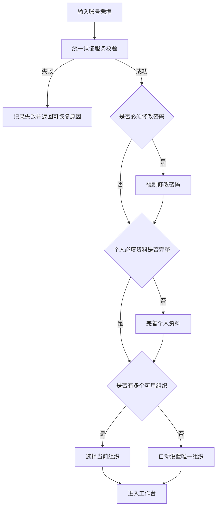
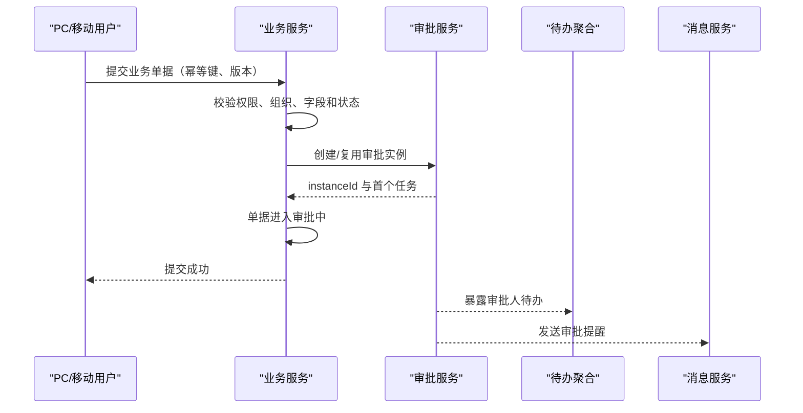
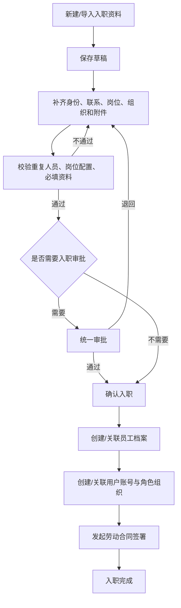
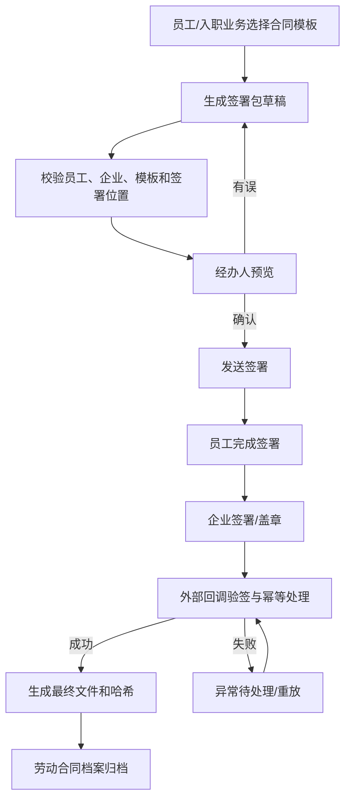
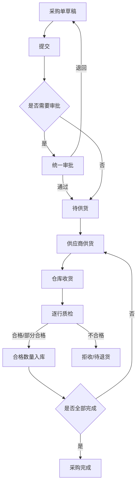
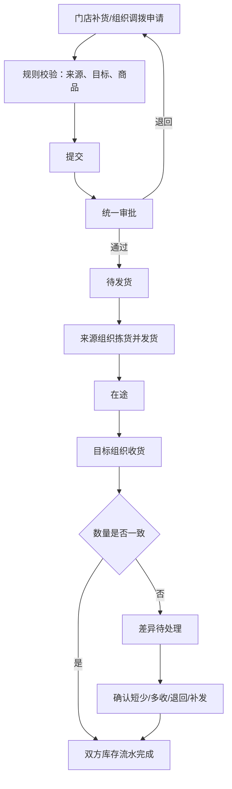
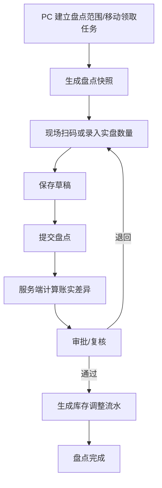

# 统一业务流程设计

> 设计日期：2026-07-29
> 目标：PC 与移动端使用同一业务对象、状态机、权限规则、审批实例、库存账和审计记录。
> 说明：本文使用中文语义状态描述目标流程；实施前应建立“现有状态码 → 统一语义状态”的映射，不能直接假设当前数据库状态码与本文命名相同。

## 1. 统一流程总原则

1. **服务端状态机唯一**：客户端只能请求动作，不能直接提交目标状态。
2. **动作来自当前状态**：服务端根据用户、权限、组织、任务所有权和数据版本返回允许动作。
3. **审批实例唯一**：同一业务单据一次有效提交只关联一个有效审批实例。
4. **库存账唯一**：采购、销售、退货、调拨和盘点只能通过库存服务记账。
5. **业务完成与待办完成原子关联**：业务动作成功后，对应审批/执行待办必须同步完成或进入下一节点。
6. **消息是结果通知**：消息失败不得回滚已完成业务，但需要可靠重试；消息不能代替待办。
7. **幂等**：提交、审批、收货、出库、入库、发货、签署回调等动作必须可安全重试。
8. **可补偿而非静默失败**：跨服务后续步骤失败时，业务进入可见异常状态和补偿队列。
9. **不可变审计**：所有状态变化记录操作者、代理人、组织、时间、客户端、前后状态、理由和请求标识。

## 2. 统一业务状态框架

不同单据不必使用完全相同的状态，但需遵守共同语义：

```text
草稿
├─ 提交 → 审批中 / 待执行
└─ 删除 → 已删除（仅逻辑审计，不作为业务记录展示）

审批中
├─ 通过 → 待执行
├─ 退回 → 已退回（允许修改后重新提交）
├─ 驳回 → 已驳回（默认结束，按规则决定是否可重开）
└─ 撤回 → 草稿/已撤回

待执行
├─ 部分执行 → 执行中
├─ 全部执行 → 已完成
├─ 取消 → 已取消
└─ 异常 → 异常待处理

异常待处理
├─ 补偿成功 → 原目标状态/已完成
├─ 修正后重试 → 执行中
└─ 管理关闭 → 异常关闭
```

通用禁止项：

- 已完成单据不能直接编辑关键业务字段；
- 已取消单据不能继续收货、出库或审批；
- 已被处理的审批任务不能再次处理；
- 退回和驳回不能使用同一语义；
- 页面显示的“完成”必须有服务端最终状态和审计记录。

## 3. 身份、资料与组织上下文流程

### 3.1 登录与首次使用



| 端 | 责任 |
|---|---|
| PC | 完整登录、首次资料补全、组织选择 |
| 移动 | 使用同一流程；优化键盘、安全存储和深链恢复 |
| 服务端 | 认证、密码策略、资料完成度、授权组织集合和会话 |

异常规则：

- 无可用组织：进入受限帮助页，不得默认选择未授权组织；
- 组织已停用：清除当前上下文并要求重新选择；
- 会话过期：保存未提交表单草稿，重新登录后由用户确认是否恢复；
- 深链登录：登录完成后重新校验目标页面权限，不直接信任旧链接。

### 3.2 切换组织

```text
用户发起切换
→ 查询本人当前可用组织
→ 用户确认目标组织
→ 服务端/会话记录当前上下文
→ 清理旧组织的列表缓存、草稿引用和待办摘要
→ 重新加载权限可见数据
→ 页面显著显示新组织
```

库存业务请求必须携带并由服务端校验组织上下文；客户端传入的组织不能扩大用户授权范围。

## 4. 消息、待办与审批统一流程

### 4.1 业务提交到审批



### 4.2 审批处理

```text
打开统一待办
→ 根据 businessType + businessId 加载业务详情
→ 加载同一 instanceId 的审批轨迹
→ 服务端确认当前任务仍属于本人/合法代理人
→ 同意 / 退回 / 驳回 / 转交
→ 审批服务原子完成当前任务并产生下一任务或最终结果
→ 回调业务服务
→ 业务服务按结果改变状态
→ 当前待办消失，下一节点待办生成
→ 发送结果消息
```

| 决策 | 业务结果 | 是否允许修改后再提交 |
|---|---|---|
| 同意且还有节点 | 保持审批中 | 否 |
| 最终同意 | 进入待执行或已生效 | 否 |
| 退回 | 已退回 | 是 |
| 驳回 | 已驳回/结束 | 默认否，重开需独立动作 |
| 撤回 | 草稿或已撤回 | 仅发起人且尚未形成不可逆执行 |
| 转交 | 业务状态不变，任务所有人改变 | 不适用 |

PC 与移动差异仅在展示：PC 可做流程监控和批量查看；移动做单条快速处理。审批结果必须来自同一接口和实例。

## 5. 人事业务流程

### 5.1 入职到员工档案



| 端 | 主要责任 |
|---|---|
| PC | 批量导入、复杂校验、岗位配置、异常补偿、全量档案管理 |
| 移动 | 单人分步录入、拍照附件、补资料、查看状态、单条确认 |
| 服务端 | 去重、必填规则、账号/员工/合同关联、状态和补偿 |

关键异常：

- 身份证/手机号/员工号重复：阻断并指向既有记录；
- 岗位未配置默认角色或组织：不得静默创建无权限账号；
- 员工创建成功、账号创建失败：进入“账号待补偿”，不能回滚丢失员工；
- 合同发起失败：入职可进入“合同待处理”，生成明确待办；
- 移动编辑重新打开后必须完整回填此前保存的人员类型、负责人等字段。

### 5.2 员工资料变更、转岗与离职

```text
发起变更
→ 区分普通资料字段与任职/权限关键字段
→ 普通字段按字段权限直接保存
→ 关键字段进入审批
→ 审批通过
→ 同事务/受控编排更新员工任职
→ 更新用户角色和组织数据范围
→ 保留变更前快照
→ 发送本人及相关管理者通知
```

离职流程：

```text
发起离职
→ 校验未完成待办、资产、合同和业务责任
→ 审批
→ 确定离职生效时间
→ 交接任务和业务责任
→ 停用账号/撤销组织权限
→ 员工状态改为离职
→ 合同和档案归档
```

PC 管理全流程；移动可以让经理审批、员工查看进度或完成交接确认，不在移动端配置角色和数据范围。

### 5.3 健康证

```text
员工本人提交/续期
→ 上传证件照片
→ 服务端识别或人工填写证号、有效期
→ HR 待审核
→ 通过：证件生效并投影到员工档案
→ 退回：员工收到原因并补充
→ 到期前分级提醒
→ 到期：状态变为已过期并产生风险待办
```

权限：

- 本人只能操作本人健康证；
- HR 审核人不能通过篡改 employeeId 审核范围外员工；
- 部门经理只读本管理范围内的状态，不默认查看证件敏感字段。

### 5.4 劳动合同与电子签



PC 负责模板、印章、批量签署包和异常；移动负责本人查看/签署或经办单条任务。最终合同文件只归档一次。

## 6. OA 与行政流程

### 6.1 OA 采购申请

OA 采购是行政费用/物品申请，与库存商品采购单必须使用不同业务类型和明确名称。

```text
新建 OA 采购草稿
→ 填写用途、明细、预算/金额和附件
→ 提交统一审批
→ 部门负责人/相关节点审批
→ 通过后进入待执行
→ 经办采购并记录结果
→ 关闭/完成
```

移动端允许快速填报和拍照附件；PC 支持复杂明细、查询、导出和关闭。若当前环境关闭提交能力，入口必须明确显示“暂未开放”而不是让用户填写到最后才失败。

### 6.2 考勤

```text
员工进入考勤
→ 获取服务端当前时间与当天状态
→ 按规则显示“上班打卡”或“下班打卡”
→ 采集允许的位置/设备信息
→ 服务端校验重复、时间窗、人员和组织
→ 写入不可变打卡记录
→ 返回成功凭证和下一状态
→ 异常由独立补卡/申诉流程处理
```

PC 用于管理查询、异常处理和导出；移动是本人打卡主场景。客户端时间不可作为考勤真相。

### 6.3 薪资

```text
选择薪资期间和方案版本
→ 锁定计算输入快照
→ 计算草稿
→ HR/薪资管理员核对
→ 修正输入后重新计算或确认
→ 发布
→ 员工可见本人薪资
→ 更正需生成新版本和原因
```

| 状态 | 员工移动端 | 管理 PC |
|---|---|---|
| 草稿/计算中 | 不可见 | 可查看和重算 |
| 待确认 | 不可见 | 可核对 |
| 已发布 | 可查看本人 | 可按范围查看/导出 |
| 已更正 | 查看最新版本并可看更正提示 | 查看版本历史 |

### 6.4 固定资产配置、发放与报修

资产发放：

```text
PC 建立资产与额度
→ 选择员工/组织发放
→ 必要审批
→ 现场交付
→ 员工移动确认
→ 资产台账变为在用
```

资产报修：

```text
移动选择本人/本店资产
→ 填写故障并拍照
→ 提交报修
→ 维修负责人受理
→ 处理并记录结果/费用
→ 申请人确认
→ 完成并更新资产维修历史
```

若新建报修受功能开关控制，工作台、应用、接口和待办必须使用同一开关结果。

## 7. 采购、库存与销售流程

### 7.1 库存商品采购



PC 负责复杂建单、批量、查询和异常；移动负责扫码收货、实际数量、质检结果和照片。收货不能直接修改采购计划数量。

采购关键不变量：

- 累计收货量不得超过允许数量；
- 每次收货有独立记录和幂等标识；
- 只有合格数量进入可用库存；
- 部分收货保持可继续执行状态；
- 库存入账失败时收货记录进入异常，不显示完成。

### 7.2 销售到出库

```text
销售草稿
→ 校验客户、商品、价格、门店和可用库存
→ 提交/审批
→ 占用或校验库存
→ 生成唯一配送通知
→ 仓库/门店拣货
→ 扫码复核
→ 部分或全部出库
→ 扣减库存并记录流水
→ 销售完成
```

PC 适合复杂销售和批量查询；移动适合快速开单、选品和现场出库。生成配送通知必须幂等，不能重复生成。

### 7.3 采购退货

```text
选择原采购/收货记录
→ 服务端计算可退数量
→ 建采购退货草稿
→ 提交/审批
→ 仓库复核商品、批次和数量
→ 确认出库
→ 扣减库存并记录退货流水
→ 退货完成
```

### 7.4 销售退货

```text
选择原销售/出库记录
→ 服务端计算可退数量和金额
→ 建销售退货草稿
→ 提交/审批
→ 验收商品状态
→ 合格数量确认入库
→ 更新库存并记录金额冲销
→ 退货完成
```

两类退货均禁止仅凭客户端输入原单号和数量绕过服务端可退计算。

### 7.5 补货与调拨

补货是调拨的业务入口之一，底层共用调拨对象和状态机：



关键不变量：

- 申请、审批、发货、收货使用同一 transferId；
- 发货扣减来源库存或进入在途账，收货增加目标库存；
- 同一发货批次只能被确认一次；
- 差异不可由移动端静默改平；
- 取消只能发生在规则允许且未产生不可逆库存动作时。

### 7.6 库存盘点



并发规则必须由业务确认并配置为一种明确策略：

- 冻结盘点范围内出入库；或
- 允许出入库，但使用快照时间后的流水推算应有数量。

移动端断网时可以保留未提交的扫描草稿，但不得离线生成最终库存调整。

### 7.7 库存手工调整

```text
PC 查询库存
→ 发起调整并填写原因、证据和数量
→ 独立权限校验
→ 必要审批
→ 服务端校验版本与可用量
→ 生成不可变调整流水
→ 更新库存
```

移动端默认不提供直接调整，只通过盘点、退货、调拨等可审计业务修正库存。

## 8. 客户服务卡

```text
门店检索客户
→ 已存在：打开服务卡
→ 不存在：最小信息建档并完成隐私告知
→ 添加本次服务记录
→ 拍照/上传附件
→ 关联销售或商品
→ 保存
→ 后续查询、补充或归档
```

手机号等标识需做去重和脱敏；照片归属文件服务，访问继承客户卡权限。

## 9. 通知公告

```text
PC 起草公告
→ 选择受众和有效期
→ 审核/发布
→ 服务端生成公告和消息
→ PC/移动用户读取
→ 记录已读
→ 管理端查看阅读情况
→ 到期归档
```

若发布流程尚未开放，应只允许保存草稿，并在页面入口明确状态；不能让移动端显示尚未正式发布的草稿。

## 10. 文件生命周期

```text
客户端请求上传会话
→ 文件服务校验业务权限和配额
→ 上传文件
→ 完成校验（大小、类型、哈希、安全扫描）
→ 生成 fileId
→ 业务服务关联 fileId
→ PC/移动按业务权限预览或下载
→ 业务删除时解除关联
→ 无引用文件按保留规则进入回收/清理
```

客户端临时路径和原生设备相册路径都不能成为业务文件地址。合同最终文件需保存哈希和版本。

## 11. 主数据与系统配置变更

商品、供应商、组织、岗位、角色、字典、参数、流程规则等采用统一发布规则：

```text
PC 创建/编辑草稿
→ 校验唯一性、依赖、影响范围
→ 必要审批或双人复核
→ 按生效时间发布
→ 刷新服务端缓存/版本
→ PC 和移动收到新版本
→ 旧业务单据仍保留创建时快照
```

移动端只消费生效版本，不自行维护一套字典或配置副本。

## 12. 报表数据流程

```text
用户选择组织、期间和维度
→ 服务端验证权限
→ 从统一业务事实表/业务表按固定公式聚合
→ 返回指标值、单位、币种、口径版本和更新时间
→ PC 展示多维分析
→ 移动展示摘要和异常
```

必须为以下指标建立固定测试夹具：

- 现存、可用、冻结、在途库存；
- 采购计划、实际收货、合格入库；
- 销售下单、实际出库、退货净额；
- 采购退货和销售退货影响；
- 成本、毛利和跨期冲销；
- 组织切换与数据范围过滤。

## 13. 跨端继续处理

PC 与移动端允许用户在另一端继续，但不能产生第二份草稿：

```text
端 A 保存服务端草稿（version = n）
→ 端 B 打开同一 businessId
→ 获取 version = n
→ 端 B 修改并保存 version = n
→ 服务端成功后 version = n+1
→ 端 A 再保存 version = n
→ 服务端返回“数据已被更新”
→ 用户查看差异并选择重新加载
```

本地移动草稿只用于恢复未提交输入；一旦关联服务端 businessId，必须以服务端版本为主。

## 14. 统一异常和补偿流程

| 异常 | 服务端状态 | 用户看到 | 恢复方式 |
|---|---|---|---|
| 参数校验失败 | 状态不变 | 定位到字段 | 修正后重试 |
| 权限/组织变化 | 状态不变 | 无权限或需切换组织 | 重新授权/切换 |
| 重复提交 | 返回首次结果 | “已处理”并刷新 | 不重复执行 |
| 并发版本冲突 | 状态保持最新 | “数据已被他人更新” | 查看差异后重载 |
| 审批回调失败 | 审批已决策，业务标记回调异常 | 管理待办和明确处理中提示 | 自动重试/PC 回调重放 |
| 库存记账失败 | 单据进入执行异常 | 不显示完成 | 补偿任务重试 |
| 文件上传失败 | 业务未关联文件 | 逐文件失败原因 | 续传/重传 |
| 消息发送失败 | 业务成功 | 不影响业务结果 | 消息队列重试 |
| 外部签署回调重复 | 首次结果保留 | 无重复合同 | 幂等忽略并审计 |

## 15. 流程验收模板

每条流程必须至少覆盖：

1. 正常完成；
2. 草稿保存和跨端继续；
3. 退回后修改重提；
4. 驳回和结束；
5. 发起人撤回；
6. 重复点击和网络超时重试；
7. 两人并发处理；
8. 处理中权限或组织被撤销；
9. 附件失败；
10. 下游服务失败和补偿；
11. PC 发起、移动处理、PC 查看结果；
12. 移动发起、PC 处理、移动查看结果；
13. 待办、消息、业务状态和审计四方一致。
