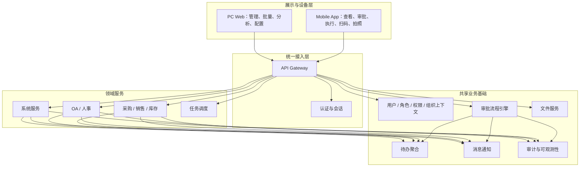

# 接口与数据一致性方案

> 设计日期：2026-07-29
> 目标：PC Web 与 Mobile App 只负责不同呈现和设备交互；用户、权限、业务状态、流程、数据和规则由同一服务体系提供。

## 1. 现状判断

当前系统已经具备统一基础：

- PC 与移动页面位于同一个 `erp-ui` 项目；
- 两端复用 `src/api` 下的业务 API 模块；
- 统一请求层处理会话、错误、签名范围和库存组织请求头；
- 所有客户端通过同一网关进入认证、系统、OA、库存、审批和文件服务；
- 待办已采用审批、库存、OA、系统等多 Provider 聚合；
- OA、库存、审批等服务通过共享 API 契约进行跨服务调用。

因此，本方案不是重建第二套移动后端，而是加强现有统一边界，消除页面层和状态表达分叉。

当前需要重点治理：

1. 权限标识、数据范围和组织上下文必须有一致且可测试的服务端规则；
2. 移动路由中个别能力存在权限语义过宽，例如店仓授权不应借用泛化的用户编辑权限；
3. 业务状态和可执行动作需要由服务端统一返回，避免 PC/移动分别硬编码；
4. 写操作幂等、并发版本、跨服务补偿和错误模型需要统一；
5. 待办、消息、业务详情和审批实例需要稳定关联；
6. 报表与详情需统一数据口径和公式版本；
7. 文件、合同和签署回调需要同一文件 ID、哈希、权限和生命周期。

## 2. 目标逻辑架构



客户端平台信息只能用于展示适配、遥测和灰度，不能改变业务授权或状态机。

## 3. 统一服务边界

| 服务域 | 唯一职责 | 禁止事项 |
|---|---|---|
| 认证 | 登录、令牌、会话、强制改密、注销 | 移动自建长期登录态或跳过强制改密 |
| 系统/权限 | 用户、角色、菜单、部门、岗位、组织授权、数据范围 | 业务服务仅相信前端传来的组织或角色 |
| OA/人事 | 员工、入职、考勤、薪资、资产、合同业务 | 移动建立独立员工表或独立状态 |
| 库存 | 商品、采购、销售、库存、退货、调拨、盘点、报表事实 | 其他服务或客户端直接改库存数量 |
| 审批 | 流程定义、实例、任务、决策、轨迹 | 各业务分别实现一套移动审批状态 |
| 文件 | 上传、元数据、访问控制、预览、哈希、生命周期 | 业务库保存设备本地路径作为附件 |
| 待办 | 聚合各来源可执行事项 | 聚合层自行修改业务状态 |
| 消息 | 可靠发送事件通知和业务深链 | 以消息已读代替待办完成 |
| 调度 | 受控计划任务和运行记录 | 移动仅凭列表权限立即运行任意任务 |

## 4. API 设计规则

### 4.1 一项业务，一个资源契约

同一资源禁止按端拆成：

```text
/pc/purchase/*
/app/purchase/*
```

推荐按业务资源表达：

```text
/inventory/purchases
/inventory/purchases/{id}
/inventory/purchases/{id}/actions/submit
/inventory/purchases/{id}/receipts
```

如果为移动端提供摘要接口，应是只读聚合或字段裁剪，例如：

```text
/workbench/summary
/todos
```

聚合接口不得复制采购、库存、审批等状态转换逻辑。

### 4.2 查询与命令分离

| 类型 | 特征 | 要求 |
|---|---|---|
| 查询 | 不改变业务状态 | 可分页、可缓存、字段受权限过滤 |
| 命令 | 产生业务变化 | 使用动作端点、幂等键、版本、明确结果 |
| 文件上传 | 产生文件对象 | 先上传完成，再关联业务；支持逐文件状态 |
| 批量命令 | PC 管理场景 | 返回逐项结果，不因单项失败隐瞒其他结果 |

不要使用“保存一个包含新状态的完整对象”来代替审批、收货、出库等动作。

### 4.3 请求公共上下文

| 上下文 | 来源 | 服务端规则 |
|---|---|---|
| 用户身份 | 认证令牌 | 不接受客户端覆盖 |
| 当前组织 | 已授权组织选择；库存请求当前已有组织头基础 | 必须校验属于用户可访问组织 |
| 请求 ID | 网关生成或接受合规值 | 跨服务透传，便于追踪 |
| 幂等键 | 客户端为业务命令生成 | 按用户 + 业务动作 + 键保存首次结果 |
| 数据版本 | 查询返回的 version | 更新时做乐观锁 |
| 客户端平台 | PC/Mobile/iOS/Android | 仅遥测和展示适配，不参与授权 |
| 客户端版本 | 应用版本 | 用于兼容提示和灰度，不改变历史状态语义 |
| 语言/时区 | 会话/用户设置 | 服务端保存 UTC 或明确时区，展示层转换 |

组织上下文可以沿用现有库存组织请求头机制，但应完成：

- 名称和语义标准化；
- 网关或服务统一解析；
- 所有库存相关命令强制要求；
- 切换组织时刷新会话/缓存；
- 服务端将其与角色数据范围取交集；
- 日志记录实际生效组织，而非只记录客户端输入值。

### 4.4 统一响应封装

查询响应至少包含：

```json
{
  "code": "OK",
  "data": {},
  "requestId": "traceable-id",
  "serverTime": "2026-07-29T10:00:00+08:00"
}
```

分页响应统一：

```json
{
  "items": [],
  "page": 1,
  "pageSize": 20,
  "total": 0,
  "hasMore": false
}
```

命令响应应返回业务结果，而不是只返回“成功”：

```json
{
  "businessId": "123",
  "businessNo": "DB-20260729-003",
  "status": "IN_TRANSIT",
  "version": 4,
  "completedAction": "DELIVER",
  "nextActions": ["RECEIVE", "REPORT_DIFFERENCE"]
}
```

字段名为设计示意，实施时可映射现有响应结构，但语义必须完整。

## 5. 统一错误模型

错误应分层，PC 与移动使用同一错误码和业务语义：

| 类别 | HTTP 建议 | 错误示例 | 客户端动作 |
|---|---:|---|---|
| 参数错误 | 400 | `VALIDATION_FAILED` | 定位字段并保留输入 |
| 未登录/会话失效 | 401 | `AUTH_EXPIRED` | 重新登录并可恢复草稿 |
| 无功能权限 | 403 | `PERMISSION_DENIED` | 显示无权限，不显示空列表 |
| 无数据范围 | 403 | `DATA_SCOPE_DENIED` | 说明不可访问该记录 |
| 组织不匹配 | 403/409 | `ORG_CONTEXT_REQUIRED` | 引导切换组织 |
| 记录不存在 | 404 | `RESOURCE_NOT_FOUND` | 返回列表并刷新 |
| 状态不允许 | 409 | `ACTION_NOT_ALLOWED` | 刷新状态和允许动作 |
| 并发冲突 | 409 | `VERSION_CONFLICT` | 对比/重载，禁止覆盖 |
| 重复业务 | 409 或返回首次结果 | `DUPLICATE_BUSINESS_KEY` | 打开既有记录 |
| 业务规则 | 422 | `QUANTITY_EXCEEDS_RETURNABLE` | 展示业务原因和允许值 |
| 功能关闭 | 423/业务码 | `FEATURE_DISABLED` | 展示本期关闭说明 |
| 限流 | 429 | `TOO_MANY_REQUESTS` | 按重试时间恢复 |
| 下游暂不可用 | 503 | `DEPENDENCY_UNAVAILABLE` | 局部重试/显示上次数据 |

错误响应建议包含：

```json
{
  "code": "VERSION_CONFLICT",
  "message": "数据已被其他用户更新",
  "fieldErrors": [],
  "details": {
    "currentVersion": 5
  },
  "retryable": false,
  "requestId": "traceable-id"
}
```

生产环境不得把堆栈、SQL、密钥、内部服务地址或敏感参数返回客户端。

## 6. 权限与数据范围

### 6.1 统一授权决策

```text
是否登录
AND 是否有动作权限
AND 目标记录是否在数据范围
AND 当前组织是否合法且匹配
AND 是否为当前任务所有人/合法代理人
AND 当前状态是否允许动作
AND 数据版本是否最新
```

任一条件失败即拒绝，默认 fail-closed。

### 6.2 权限粒度

每个领域至少拆分：

- `list/query`：查看列表/详情；
- `add/edit/delete`：草稿维护；
- `submit/withdraw/cancel`：生命周期动作；
- `approve/return/reject/transfer`：审批动作；
- `receive/deliver/check/adjust`：现场执行；
- `import/export`：批量数据；
- `viewSensitive/viewCost`：敏感字段；
- `admin/replay/terminate/forceLogout`：高风险动作。

不允许用 `list` 权限推导“立即执行任务”，也不允许用泛化的用户编辑权限替代店仓授权专用权限。

### 6.3 字段级权限

| 字段类型 | 规则 |
|---|---|
| 身份证、银行卡、手机号 | 默认脱敏；本人或专门权限查看完整值 |
| 薪资 | 本人只看本人已发布结果；管理者按范围和专权 |
| 成本、毛利 | 独立权限，不因有库存列表权限自动可见 |
| 供应商结算信息 | 采购/财务授权范围 |
| 客户照片和服务信息 | 门店业务范围 + 隐私审计 |
| 合同文件 | 本人或合同管理数据范围，下载另受控 |

服务端应直接裁剪或脱敏，不能把完整字段发给客户端后再隐藏。

## 7. 状态与动作契约

### 7.1 状态字典

建立中央业务状态登记：

| 字段 | 含义 |
|---|---|
| domain | 采购、销售、调拨、入职等 |
| code | 稳定机器状态码 |
| label | 统一中文名称 |
| terminal | 是否终态 |
| editable | 是否允许编辑草稿字段 |
| allowedActions | 在满足权限后的候选动作 |
| colorToken | 统一视觉语义，可选 |
| version | 状态词典版本 |

PC 与移动不各自维护状态中文和动作条件。

### 7.2 能力返回

业务详情可返回当前用户的可执行动作：

```json
{
  "status": "PENDING_RECEIPT",
  "version": 3,
  "allowedActions": [
    {
      "code": "RECEIVE",
      "label": "确认收货",
      "requiresReason": false
    },
    {
      "code": "CANCEL",
      "label": "取消调拨",
      "requiresReason": true,
      "dangerous": true
    }
  ]
}
```

服务端在真正执行动作时仍需重新校验，不能只相信先前返回的动作列表。

## 8. 幂等与并发

### 8.1 必须幂等的动作

- 创建并提交业务单据；
- 创建审批实例；
- 审批任务决策；
- 采购收货/质检入库；
- 配送出库；
- 采购/销售退货入出库；
- 调拨发货和收货；
- 盘点生成调整；
- 文件上传完成回调；
- 外部电子签回调；
- 消息发送和待办生成。

### 8.2 幂等策略

| 场景 | 幂等业务键示例 |
|---|---|
| 客户端命令 | userId + action + idempotencyKey |
| 审批任务 | taskId + decision |
| 收货 | purchaseId + receiptBatchNo |
| 出库 | deliveryNoticeId + deliveryBatchNo |
| 调拨收货 | transferId + shipmentId |
| 签署回调 | provider + callbackEventId |
| 消息 | eventId + recipient + messageType |

首次成功结果应可被重复请求读取；不能因第二次请求返回模糊错误而让用户误以为失败。

### 8.3 乐观锁

所有可编辑业务对象返回 `version`。保存和状态动作携带版本：

```text
查询 version=3
→ 用户修改
→ 提交 expectedVersion=3
→ 服务端原子更新为 version=4
→ 另一个 version=3 请求返回冲突
```

库存扣减还必须使用数据库原子条件或库存领域锁，不能只依赖页面版本。

## 9. 跨服务一致性

### 9.1 本地事务 + 可靠事件

推荐每个领域服务在本地事务中完成：

1. 业务状态更新；
2. 本服务审计记录；
3. 可靠事件/Outbox 记录。

随后异步发布事件给待办、消息、报表或其他服务。消费者按 eventId 幂等。

### 9.2 需要编排的流程

| 流程 | 主控服务 | 下游 | 失败策略 |
|---|---|---|---|
| 入职确认 | OA/人事 | 系统账号、合同签署 | 员工保留，账号/合同进入补偿待办 |
| 业务审批 | 业务服务 + 审批服务 | 待办、消息 | 审批结果回调可重放 |
| 采购收货 | 库存服务 | 库存账、消息 | 同库本地事务；后续通知异步 |
| 调拨 | 库存服务 | 来源/在途/目标库存 | 单一领域事务或可证明的状态编排 |
| 合同签署 | OA/合同 | 外部签署、文件服务 | 回调幂等、异常队列、人工重放 |
| 文件关联 | 业务服务 + 文件服务 | 文件元数据 | 未关联文件可回收，不让业务引用未完成文件 |

分布式失败不能通过客户端再次“保存整个对象”修复。

## 10. 待办与消息契约

### 10.1 待办统一模型

| 字段 | 说明 |
|---|---|
| todoId | 来源内稳定标识 |
| source | approval / inventory / oa / system |
| category | approval / execution / returned / risk / personal |
| businessType | 业务类型 |
| businessId | 业务主键 |
| businessNo | 用户可识别单号 |
| orgId | 所属组织 |
| assignee | 当前处理人 |
| priority / dueAt | 排序依据 |
| status | open / completed / cancelled |
| mobileRoute / pcRoute | 仅作为展示深链，不参与授权 |
| updatedAt | 新鲜度 |

待办数量必须从与列表相同的过滤条件计算。某来源失败时聚合响应返回来源状态：

```json
{
  "items": [],
  "sources": {
    "approval": {"status": "ok", "updatedAt": "..."},
    "inventory": {"status": "unavailable", "lastSuccessAt": "..."}
  }
}
```

### 10.2 消息统一模型

消息应包含 eventId、recipient、messageType、businessType、businessId、title、summary、sentAt、readAt。业务详情打开时重新授权。

消息和待办的关系：

- 提醒可以产生消息和待办；
- 消息已读不完成待办；
- 业务完成自动完成待办，但不必删除历史消息；
- 撤销业务时取消未完成待办并发送结果消息。

## 11. 文件与附件

### 11.1 上传协议

```text
请求上传会话
→ 返回 uploadId、限制和短期凭证
→ 客户端上传一个或多个文件
→ 完成上传
→ 服务端校验类型、大小、哈希和安全
→ 返回 fileId
→ 业务命令提交 fileId 列表
```

### 11.2 统一规则

- 文件名、类型、大小、哈希、上传者和业务关联均在服务端保存；
- 预览/下载使用短期授权；
- 合同最终文件不可被普通编辑覆盖；
- 文件删除先解除业务引用，再按保留期进入回收；
- 上传成功但未关联的临时文件按计划任务清理；
- PC 拖拽上传与移动拍照最终得到相同 fileId 契约；
- 同一附件权限继承业务对象，不能只凭猜测 URL 下载。

## 12. 主数据、字典、时间、金额和数量

### 12.1 主数据唯一来源

| 数据 | 唯一来源 |
|---|---|
| 用户、角色、组织、岗位 | 系统服务 |
| 员工及任职 | OA/人事服务 |
| 商品、分类、OE、赠品、供应商 | 库存服务 |
| 流程定义和任务 | 审批服务 |
| 文件元数据 | 文件服务 |

移动端可以缓存用于展示，但缓存必须有版本/更新时间，不能在本地新增业务主数据真相。

### 12.2 精度和格式

| 类型 | 统一规则 |
|---|---|
| 时间 | 服务端保存带时区的时间或 UTC；API 使用 ISO 8601；展示按用户时区 |
| 日期 | 无时间语义时使用 `YYYY-MM-DD` |
| 金额 | 十进制定点数 + currency，禁止浮点累计 |
| 数量 | 十进制定点数 + unit + scale |
| 比率 | 明确 0—1 或 0—100 语义，不由页面猜测 |
| ID | 作为字符串传输，避免移动 JS 大整数精度问题 |
| 枚举 | 稳定 code + 服务端统一 label |
| 空值 | 区分 null、空字符串、0 和未返回字段 |

## 13. 缓存和同步

### 13.1 可缓存

- 当前用户基本信息和授权组织摘要；
- 生效字典和只读主数据摘要；
- 工作台上次成功摘要；
- 未提交的本地表单草稿；
- 最近访问记录。

### 13.2 不应长期缓存

- 可用库存、审批任务所有权；
- 已发布薪资明细；
- 高敏感完整字段；
- 当前允许动作；
- 文件短期访问地址；
- 会影响授权的角色和组织结果。

切换账号、退出登录或切换组织时，必须清除对应作用域缓存。

## 14. 报表一致性

所有报表返回：

- 指标编码和中文名称；
- 公式/口径版本；
- 组织、期间和筛选条件；
- 数值、单位、币种和精度；
- 数据更新时间；
- 是否包含退货、取消、在途和未完成单据；
- 下钻所使用的业务记录集合。

PC 与移动只选择不同指标和图形，不能在客户端分别计算毛利、净销售、实际收货等核心指标。

建立数据夹具示例：

```text
采购 10，合格收货 8，不合格 1，未收 1
销售出库 6，销售退货入库 2
采购退货出库 1
调拨在途 2，目标尚未收货
盘点调整 +1
```

用该夹具同时校验库存详情、库存流水、采购报表、销售报表和移动摘要。

## 15. API 兼容与版本治理

- 优先保持资源和状态语义向后兼容；
- 新增字段默认可忽略；
- 删除/改名字段需要弃用期和客户端版本统计；
- 状态码含义不得原地改变；
- 移动原生应用发布滞后于 Web，服务端必须保留明确的最低支持版本；
- 不使用 User-Agent 隐式切换业务逻辑；
- 功能开关由服务端返回统一能力，PC、移动、待办和消息共同遵守；
- 旧移动路径重定向需记录使用量，确认无流量后再下线。

## 16. 可观测性与审计

### 16.1 每个写操作记录

- requestId；
- idempotencyKey；
- userId、代理人；
- 当前组织；
- 客户端平台和版本；
- 业务类型、businessId；
- 动作；
- 前后状态和版本；
- 成功/失败业务码；
- 服务端时间和耗时；
- 关联审批 instanceId、taskId；
- 敏感内容脱敏后的摘要。

### 16.2 关键监控

| 指标 | 告警意义 |
|---|---|
| 同一幂等键多次产生不同业务 ID | 严重幂等缺陷 |
| 审批已完成但业务仍审批中 | 回调/补偿异常 |
| 待办存在但业务已终态 | 聚合一致性异常 |
| 业务完成但库存流水缺失 | 记账异常 |
| PC/移动同接口错误率差异显著 | 版本、网络或交互问题 |
| 组织权限拒绝突增 | 授权配置或客户端上下文问题 |
| 文件上传完成但长期未关联 | 孤儿文件/流程中断 |
| 签署回调重复或失败 | 外部集成异常 |

## 17. 契约测试与一致性测试

### 17.1 自动测试层

| 层 | 测试 |
|---|---|
| API 契约 | 必填字段、类型、枚举、错误码、分页 |
| 权限矩阵 | 角色 × 动作 × 数据范围 × 组织 |
| 状态机 | 每个状态允许/禁止动作、终态不可逆 |
| 幂等 | 同请求重复、超时重试、并发相同动作 |
| 报表 | 固定夹具与公式 |
| 文件 | 上传、关联、预览、越权、孤儿清理 |
| 待办 | 数量与列表、完成/取消、来源部分失败 |
| 跨端 E2E | PC 发起移动处理、移动发起 PC 处理 |

### 17.2 一致性断言

对每个核心流程自动或半自动验证：

```text
PC 详情 status == 移动详情 status
PC 允许动作集合 == 移动允许动作集合（剔除端专属展示动作）
PC 单据 version == 移动单据 version
审批 instanceId 相同
附件 fileId 集合相同
库存流水业务引用相同
待办处理后不再出现在 open 列表
操作日志包含客户端来源但业务结果一致
```

## 18. 实施顺序

1. 冻结并登记业务状态、动作、错误码和权限字典；
2. 统一组织上下文和字段级权限；
3. 为核心写动作补齐幂等和乐观锁；
4. 统一详情返回的 `status/version/allowedActions`；
5. 统一审批、待办、消息的引用和完成规则；
6. 统一文件上传和附件引用；
7. 建立报表夹具与公式版本；
8. 增加契约、权限、状态机、幂等和跨端测试；
9. 再实施移动信息架构和页面交互，避免 UI 继续硬编码旧规则；
10. 在真实角色和原生候选包上完成验收。

## 19. 架构验收门槛

- [ ] PC 与移动未新增平行业务 Service/Controller/表；
- [ ] 核心状态和动作有中央登记及契约测试；
- [ ] 权限、数据范围、组织和任务所有权均在服务端校验；
- [ ] 店仓授权等高风险能力使用专用权限；
- [ ] 核心写动作支持幂等和版本冲突；
- [ ] 审批、待办、消息、业务状态有一致性监控；
- [ ] 附件使用统一 fileId 和受控访问；
- [ ] 报表只由服务端统一计算；
- [ ] 移动聚合接口不包含领域状态转换；
- [ ] 跨端 E2E 和六类角色测试通过。
