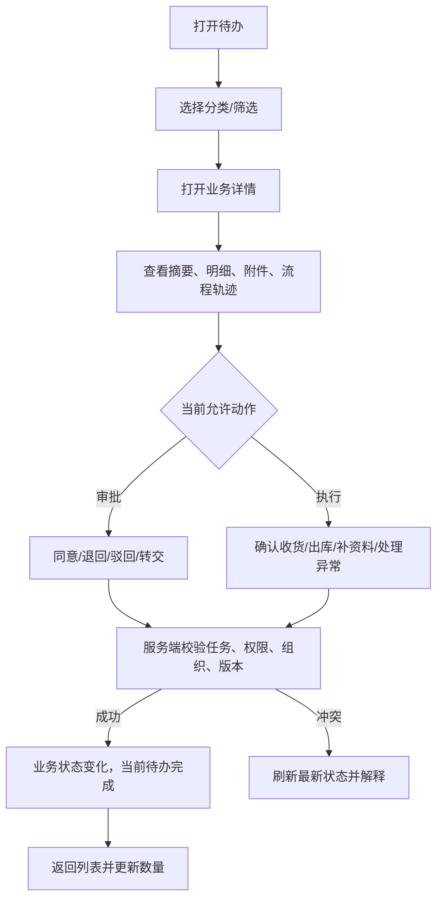

# 移动端新版信息架构

> 版本：Mobile IA V2 设计确认稿
> 设计日期：2026-07-29
> 一级结构：工作台、消息、待办、应用、我的
> 约束：本文件定义目标产品结构，不代表已修改移动路由或导航。

## 1. 产品定位

移动端是 ERP 的执行终端，不是缩小版 PC 后台。

移动端负责：

- 查看本人、团队和当前组织的关键信息；
- 快速审批、确认、退回和异常响应；
- 打卡、资料填写、签署、现场收货、出库和盘点；
- 扫码、拍照、上传附件和快速录入；
- 接收消息并进入准确的业务详情；
- 在弱网和中断场景下保护尚未提交的输入。

移动端不负责：

- 角色、菜单、参数、字典、流程、薪资方案和调拨规则配置；
- 大批量导入导出和大范围数据清理；
- 复杂跨组织报表分析；
- 定时任务运行、日志清空等高风险后台运维；
- 在客户端复制业务状态机或自行修改库存。

## 2. 五个固定一级入口


所有角色看到相同的五栏结构；角色、权限、组织和最近使用决定每栏内容，不改变一级导航。

| 一级入口 | 核心问题 | 主内容 | 不应出现 |
|---|---|---|---|
| 工作台 | 今天最重要的是什么？ | 今日数据、待办数量、快捷入口、常用功能、业务提醒 | 大幅轮播、复杂配置、无法操作的图表 |
| 消息 | 发生了什么？ | 系统、审批、任务、库存、合同等事件通知 | 可执行任务的第二套状态机 |
| 待办 | 现在需要我做什么？ | 待审批、待执行、被退回、风险、个人事项 | 已读即完成、各模块重复待办 |
| 应用 | 我要主动发起或查询什么？ | 按角色/组织动态展示的全部授权应用 | 无权限入口、PC 后台配置堆叠 |
| 我的 | 与我本人有关的内容在哪里？ | 资料、组织、考勤、工资、合同、签约、设置 | 他人敏感资料和管理配置 |

## 3. 工作台

### 3.1 目标

员工打开 App 第一屏，在 10 秒内知道：

1. 当前所在组织；
2. 今天有多少待审批、待执行和异常；
3. 最紧急的三件事；
4. 高频操作从哪里开始；
5. 数据是否完整、是否有来源加载失败。

### 3.2 页面结构

```text
┌────────────────────────────────┐
│ 早上好，张三       华东一店 ▾  │
│ 数据更新 09:42       [刷新]     │
├────────────────────────────────┤
│ 今日数据                        │
│ [待审批 12] [待执行 8]          │
│ [被退回 2]  [风险 5]            │
│ 审批来源暂不可用  [重试]         │
├────────────────────────────────┤
│ 业务提醒                        │
│ 紧急  1 个调拨存在收货差异   >  │
│ 到期  2 份健康证将在 7 天到期 > │
│ 库存  3 个商品低于安全库存   >  │
├────────────────────────────────┤
│ 快捷入口                        │
│ 考勤  审批  查库存  入职         │
│ 采购  出库  盘点    我的合同     │
├────────────────────────────────┤
│ 最近使用                        │
│ 销售单 XS-20260729-08  已提交 >  │
└────────────────────────────────┘
 工作台     消息     待办     应用     我的
```

### 3.3 今日数据

| 卡片 | 定义 | 点击结果 |
|---|---|---|
| 待审批 | 当前用户拥有有效审批任务的数量 | 打开待办并筛选“待审批” |
| 待执行 | 当前用户需要收货、出库、补资料、确认等数量 | 打开待办并筛选“待执行” |
| 被退回 | 由当前用户发起且需要修改重提的数量 | 打开待办并筛选“被退回” |
| 风险 | 已授权且需要响应的库存、到期、差异和补偿异常数量 | 打开待办并筛选“风险” |

数量必须与待办列表使用相同服务端过滤规则。某来源超时或失败时显示“暂不可用”，不能显示 0。

### 3.4 快捷入口

每人最多显示 8 个：

1. 角色默认入口；
2. 当前组织可用入口；
3. 有有效权限的入口；
4. 用户固定入口；
5. 最近 30 天使用频率；
6. 当前存在待办的应用。

排序只影响展示，不能扩大权限。

### 3.5 角色化工作台

| 角色 | 今日重点 | 默认快捷入口 | 业务提醒 |
|---|---|---|---|
| 普通员工 | 考勤状态、个人待办、合同/健康证到期 | 考勤、申请、工资、合同、签约 | 资料缺失、考勤异常、合同/健康证到期 |
| 部门经理 | 团队审批、团队资料和超期任务 | 审批、团队、员工查询、经营摘要 | 超期审批、团队资料缺失 |
| HR | 入职、健康证、合同、资料完整度 | 入职任务、员工、完整度、健康证 | 待审核、合同异常、资料缺失 |
| 门店人员 | 销售、补货、客户、门店库存 | 销售、查库存、补货、退货、客户 | 缺货、待收货、销售退货异常 |
| 仓库人员 | 收货、质检、出库、盘点、调拨 | 采购、扫码收货、出库、盘点、调拨 | 待收货、待出库、盘点差异、调拨差异 |
| 审批人 | 高优先级审批和超时 | 待审批、已处理查询 | 临期、超期和被转交任务 |
| 有限管理员 | 安全和服务异常摘要 | 管理员中心、在线摘要 | 登录异常、任务失败、服务告警 |

管理员可以看到“系统管理”应用分组，但移动端系统管理只提供受控摘要和必要的只读诊断；角色、菜单、参数等配置仍在 PC。

## 4. 消息

### 4.1 统一消息模型

所有模块通过统一消息服务发送，不再各自维护孤立消息页。

```text
业务事件
→ 统一消息规则
→ 确定接收人和消息类型
→ 发送站内消息/原生推送
→ 点击后重新鉴权
→ 打开目标业务详情
```

统一消息类型：

| 类型 | 示例 | 是否通常产生待办 |
|---|---|---|
| 系统通知 | 版本维护、安全提示、服务公告 | 否 |
| 审批通知 | 已提交、审批通过、退回、驳回、转交 | 仅需要用户行动时 |
| 任务提醒 | 待收货、待出库、待补资料、待确认 | 是 |
| 库存异常 | 安全库存不足、调拨差异、盘点异常 | 是，若需当前用户处理 |
| 合同提醒 | 待签署、签署失败、即将到期 | 是，若需当前用户处理 |
| 人事提醒 | 健康证到期、入职资料缺失 | 是，若需当前用户处理 |

### 4.2 消息与待办边界

| 行为 | 消息 | 待办 |
|---|---|---|
| 告知事件结果 | 是 | 通常否 |
| 要求用户完成动作 | 发送提醒 | 创建待办 |
| 用户阅读 | 标记已读 | 状态不变 |
| 用户完成业务 | 历史消息保留 | 待办完成/转下一处理人 |
| 业务撤销 | 发送结果消息 | 取消未完成待办 |

禁止使用“消息已读”完成审批、收货或资料补充任务。

### 4.3 页面结构

- 顶部分类：全部、系统、审批、任务、库存、合同；
- 消息卡片：标题、摘要、业务对象、组织、时间、未读；
- 支持单条已读、全部已读；
- 点击业务消息后重新校验功能权限、数据范围、组织和任务所有权；
- 旧消息无权访问时只显示“权限已变化”，不泄露业务内容；
- 某模块功能关闭后，不继续发送指向不可用页面的待处理消息。

### 4.4 推送与深链

```text
收到推送
→ 打开 App
→ 检查登录
→ 必要时重新登录
→ 检查功能开关
→ 检查权限和组织
→ 打开移动详情
→ 若只能 PC 管理，显示只读摘要和明确说明
```

推送内容不直接携带身份证、工资、客户联系方式等敏感值。

## 5. 待办

### 5.1 统一工作流入口

待办统一承接：

- 采购审批；
- 合同/签署审批；
- 人事和入职审批；
- 调拨审批；
- OA 采购审批；
- 未来财务项目中的付款/费用审批；
- 库存异常处理；
- 收货、出库、盘点、资料补充等执行任务。

付款审批在当前轻 ERP 中不创建业务实现，只作为未来财务项目接入统一待办的扩展类型。

### 5.2 分类

| 分类 | 内容 | 默认排序 |
|---|---|---|
| 待审批 | 当前用户拥有的有效审批任务 | 截止时间、优先级、等待时长 |
| 待执行 | 收货、出库、质检、补资料、确认等 | 截止时间、业务优先级 |
| 被退回 | 当前用户发起且需修改重提 | 最近退回时间 |
| 风险 | 库存不足、调拨差异、到期、补偿异常 | 风险等级、截止时间 |
| 个人 | 本人合同、健康证、考勤异常、资料 | 截止时间 |

### 5.3 待办卡片

每张卡片只显示决策和行动所需内容：

- 业务类型；
- 单号、员工或商品等主对象；
- 当前状态；
- 关键金额/数量；
- 发起人和组织；
- 等待时长或截止时间；
- 风险标签；
- 下一动作。

### 5.4 处理流程



独立采购审批、调拨审批页面保留路由作为深链，但不再出现在应用目录或工作台中形成第二套入口。

## 6. 应用

### 6.1 展示规则

应用集合由：

```text
登录状态
∩ 功能开关
∩ 功能权限
∩ 数据范围
∩ 当前组织类型
∩ 页面生命周期状态
```

共同决定。无权限应用不显示；有查看权限但无新增权限时可进入，但不显示新增动作。

### 6.2 应用分组

| 分组 | 应用 | 端定位 |
|---|---|---|
| 人事 | 入职任务、员工档案、资料完整度、健康证 | 查询、补资料、单条审核 |
| OA | 行政采购申请、考勤、资产报修 | 快速申报、打卡、跟踪 |
| 门店 | 销售、客户服务、销售退货、补货、门店库存 | 门店现场执行 |
| 仓库 | 采购收货、采购退货、出库、盘点、调拨 | 仓库现场执行 |
| 查询 | 商品资料、库存、供应商、业务流水 | 搜索、扫码、只读详情 |
| 合同与文件 | 我的合同、我的签约、文件空间 | 本人查看、签署、上传 |
| 审批 | 待办入口、已处理查询 | 单条快速决策 |
| 报表 | 关键经营摘要、库存风险 | 只显示移动适合的指标 |
| 系统管理 | 管理员中心 | 条件开放的安全/运行摘要 |

### 6.3 角色应用

| 应用 | 普通员工 | 经理 | HR | 门店 | 仓库 | 有限管理员 |
|---|:---:|:---:|:---:|:---:|:---:|:---:|
| 考勤 | ✓ | ✓ | ✓ | ✓ | ✓ | 按本人身份 |
| 工资/合同/签约 | 本人 | 本人 | 本人 + 授权管理查看 | 本人 | 本人 | 本人 |
| 入职任务 | 资料填写 | 团队查看/审批 | 管理 | — | — | 按授权 |
| 员工/团队 | 本人 | 管理范围 | HR 范围 | 按授权 | 按授权 | 按授权 |
| 销售/客户/退货 | — | 按业务角色 | — | ✓ | — | 按授权 |
| 采购/收货/出库 | — | 按业务角色 | — | 补货/收货 | ✓ | 按授权 |
| 库存/盘点/调拨 | 按查询权 | 按业务角色 | — | 门店范围 | 仓库范围 | 按授权 |
| 审批 | 本人任务 | ✓ | ✓ | 按任务 | 按任务 | 按任务 |
| 报表摘要 | — | 管理范围 | 人事摘要 | 门店摘要 | 仓库摘要 | 授权范围 |
| 管理员中心 | — | — | — | — | — | 条件开放 |

符号 `—` 表示默认不显示，不代表可以跳过服务端授权直接访问。

## 7. 我的

### 7.1 页面结构

```text
头像、姓名、岗位
当前组织与切换
────────────
我的资料
我的考勤
我的工资
我的合同
我的签约
我的健康证
────────────
消息与隐私设置
网络与版本诊断
帮助
退出登录
```

### 7.2 数据规则

- “我的”接口从当前会话确定用户，不接受客户端指定其他 userId；
- 工资只展示已发布版本；
- 身份证、银行卡和联系方式默认脱敏；
- 合同文件使用短期授权预览；
- 切换组织不改变本人身份，但会刷新组织业务数据；
- 退出登录清理会话、组织缓存、敏感缓存和未关联上传凭证；
- 未提交本地草稿按用户和组织隔离，换账号不得恢复。

## 8. 导航与路由映射

| 目标入口 | 当前来源 | 目标路由/承载 | 兼容策略 |
|---|---|---|---|
| 工作台 | `/mobile/store`、`/warehouse`、`/inventory`、`/hr` | 规划 `/mobile/workbench` | 旧路径按角色和组织重定向 |
| 消息 | `/mobile/notice` 及模块消息 | 规划 `/mobile/messages` | 旧通知路径打开消息筛选结果 |
| 待办 | `/mobile/todo`、采购审批、调拨审批 | 沿用 `/mobile/todo` | 审批旧路径打开对应业务详情 |
| 应用 | 各工作台内入口和固定导航 | 规划 `/mobile/apps` | 旧业务路由保持可直达 |
| 我的 | `/mobile/mine`、`/profile`、`/contract`、`/sign-package` | 沿用 `/mobile/mine` | 子页面继续保留深链 |

路由重构顺序：

1. 先建立新容器，不移动业务状态逻辑；
2. 再调整应用目录和快捷入口；
3. 再迁移消息、待办和收藏深链；
4. 旧路由保留重定向和访问统计；
5. 最后按版本门槛废弃旧兼容入口。

## 9. 页面通用结构

### 9.1 列表页

- 关键字 + 状态为首屏筛选；
- 其他条件进入底部筛选抽屉；
- 卡片显示主对象、状态、组织、关键数字和下一动作；
- 支持下拉刷新、分页、失败重试；
- 返回时保留筛选和滚动位置；
- 无数据、查询无结果、无权限、功能关闭和加载失败分别呈现。

### 9.2 详情页

```text
状态头：单号、状态、组织、风险
业务摘要
明细
附件
审批/操作轨迹
底部固定动作区
```

服务端未确认前不能提前显示最终成功状态。

### 9.3 表单页

- 超过 10 个字段采用分步表单；
- 支持本地临时草稿和服务端业务草稿；
- 提交携带幂等键和数据版本；
- 字段错误定位到具体步骤；
- 相机、相册和文件逐项显示上传进度；
- 切后台和会话过期不丢未提交输入；
- 换用户或组织不恢复错误草稿。

### 9.4 扫码

扫码作为以下业务的输入模式：

- 查商品/库存；
- 采购收货和质检；
- 配送出库；
- 盘点；
- 调拨发货和收货；
- 资产/员工二维码查询。

扫码结果必须调用原业务接口校验商品、组织、任务和数量，不能在本地直接改变业务状态。

## 10. 信息优先级

### 10.1 状态优先

移动详情首屏顺序：

1. 是否需要本人处理；
2. 业务状态和风险；
3. 当前组织；
4. 关键金额/数量；
5. 对方/发起人；
6. 明细和附件；
7. 历史轨迹。

### 10.2 主动作优先

每个页面首屏最多一个强调主动作，例如：

- 上班打卡；
- 提交审批；
- 确认收货；
- 确认出库；
- 保存并继续；
- 同意。

取消、驳回、删除等危险动作放入次级区或“更多”，并说明后果。

## 11. 管理员中心边界

移动“系统管理”不是 PC 后台复制版，只包含：

- 登录异常摘要；
- 关键操作失败摘要；
- 调度失败摘要；
- 在线会话数量；
- 服务/数据来源健康；
- 跳转 PC 管理说明。

默认不包含：

- 用户角色和组织授权编辑；
- 菜单、参数和字典编辑；
- 调度任务运行或启停；
- 日志清空；
- 薪资方案和调拨规则配置；
- 在线用户强制退出。

若未来确需应急强退，必须使用独立权限、双确认、强制填写原因和完整审计，不能仅凭在线列表权限开放。

## 12. 功能开关与灰度

Mobile IA V2 使用总开关，并支持子能力灰度：

| 开关 | 作用 | 灰度单位 |
|---|---|---|
| `移动新版导航` | 五栏容器和新应用目录 | 测试用户/角色 |
| `统一工作台` | 角色化首页摘要 | 用户/组织 |
| `统一消息` | 消息分类和深链 | 用户/角色 |
| `统一待办` | 新分类和 Provider 状态 | 用户/组织 |
| `扫码作业` | 相机和连续扫码 | 设备/角色/组织 |
| `管理员中心` | 受控管理摘要 | 专用角色 |

开关关闭时必须回到旧入口，不能导致无首页、无待办或深链失效。

## 13. 验收标准

### 13.1 结构

- [ ] 所有角色均显示五个固定一级入口；
- [ ] 工作台内容随角色变化，但底部结构不变化；
- [ ] 旧工作台、通知和审批入口可正确重定向；
- [ ] 后台配置页面不再出现在普通移动应用目录；
- [ ] 应用集合与功能开关、权限和组织一致。

### 13.2 十秒感知

- [ ] 1 秒内显示壳和当前组织；
- [ ] 3 秒内可显示带时间的上次成功摘要；
- [ ] 5 秒内完成主要实时数据；
- [ ] 10 秒内至少有一个有效任务或明确空状态；
- [ ] 某来源失败不阻断其他来源，不显示假 0。

### 13.3 业务与安全

- [ ] 消息已读不改变待办；
- [ ] 待办处理后业务、数量和 PC 状态同步；
- [ ] 深链重新校验功能权限、数据范围、组织和任务所有权；
- [ ] 换组织后旧缓存和动作失效；
- [ ] 本人敏感数据不接受可篡改 userId；
- [ ] 管理员中心无后台配置和危险动作泄露。

### 13.4 移动体验

- [ ] 320×568、390×844 和主流 Android 尺寸可用；
- [ ] 键盘不遮挡字段和主按钮；
- [ ] 底部操作避开安全区；
- [ ] 断网、超时、上传失败和版本冲突可恢复；
- [ ] 相机权限拒绝时有手工搜索或文件选择替代路径；
- [ ] iOS/Android 生产候选包完成真实角色验收。
