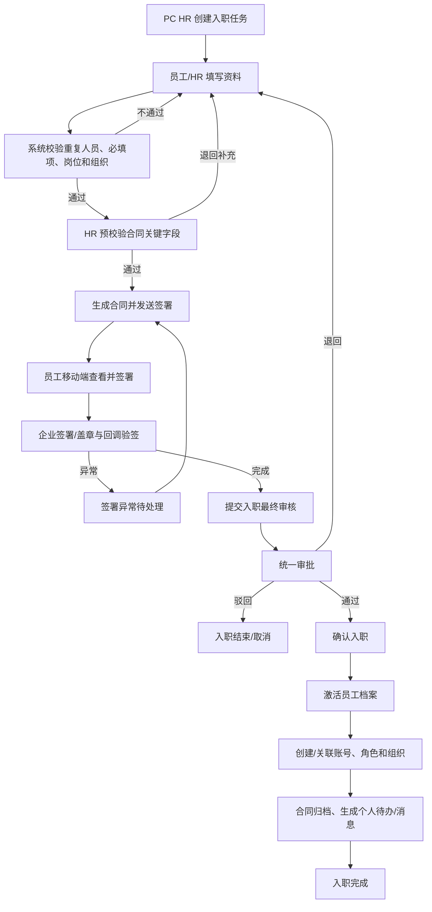
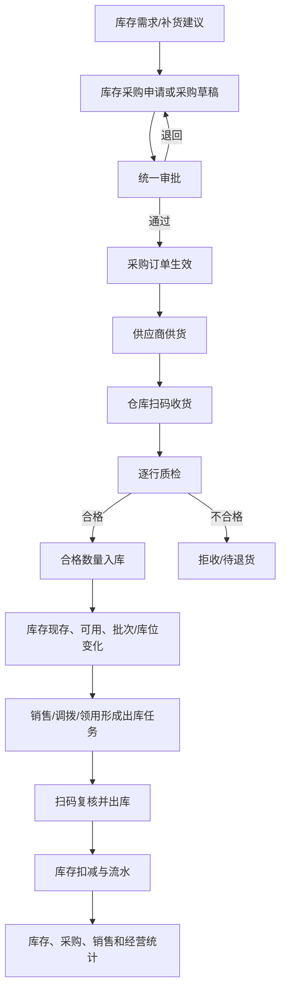
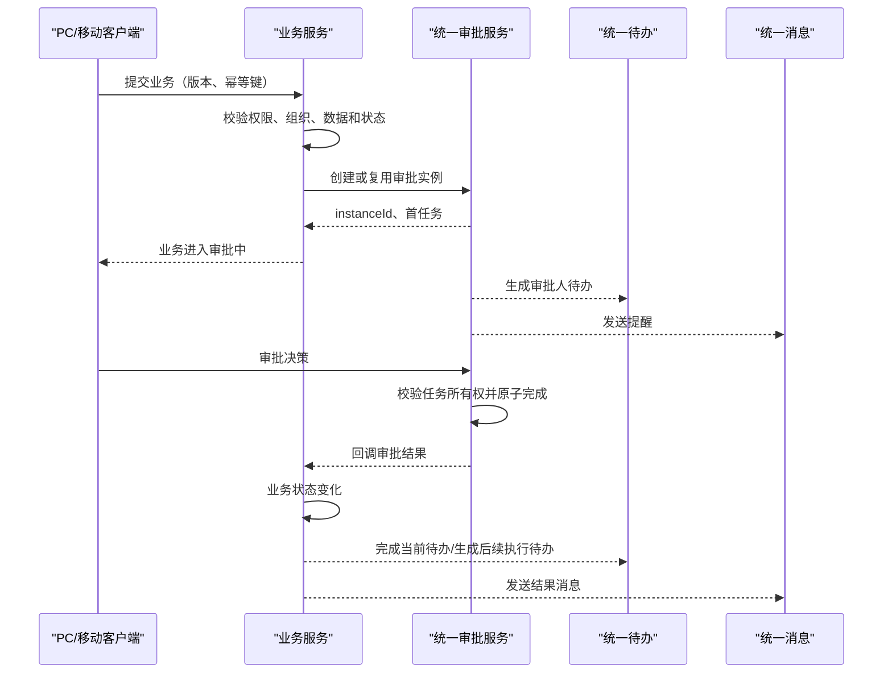

# ERP 核心业务流程确认文档

> 阶段：第二阶段产品架构确认
> 日期：2026-07-29
> 范围：人事、采购库存、销售出库、审批，以及 B03 涉及的考勤和文件。
> 状态说明：本文是建议确认稿，需业务、产品、技术和测试共同评审签字后，才成为开发基线。

## 1. 本阶段确认结论

| 决策编号 | 结论 | 约束 |
|---|---|---|
| FLOW-01 | PC 和移动共用同一业务状态机 | 客户端只能请求动作，不能直接提交目标状态 |
| FLOW-02 | “创建员工”在流程开始阶段应解释为创建入职任务，不是创建正式在职员工主档 | 正式员工档案在入职完成时激活 |
| FLOW-03 | 合同签署前必须完成身份和合同关键字段预校验，最终入职审核在签署后完成 | 避免错误身份信息生成正式合同 |
| FLOW-04 | 库存采购与 OA 行政采购是两种业务，名称、对象和待办必须分开 | 禁止用 OA 采购替代库存采购申请 |
| FLOW-05 | 采购申请、采购订单、收货、质检、入库、库存流水和报表形成可追溯链 | 每个后续对象保留来源 ID |
| FLOW-06 | 所有审批使用统一审批实例、任务、决策和回调契约 | 采购、合同、人事和调拨不得各自复制审批逻辑 |
| FLOW-07 | 移动端人事只负责资料填写、签署、审批和查看；HR 可创建“入职任务”，但不能绕过流程直接建立正式员工 | 配置、批量、异常补偿在 PC |
| FLOW-08 | 移动库存重点为扫码、查询、确认、异常处理；复杂订单、主数据和报表管理在 PC | 扫码只是输入方式，不是独立状态机 |
| FLOW-09 | 消息用于通知，待办用于行动 | 已读消息不能完成待办 |
| FLOW-10 | 跨服务失败必须进入可见补偿状态 | 不允许页面显示完成而账号、库存、合同或待办未完成 |

## 2. 通用流程模型

### 2.1 统一状态语义

```text
草稿
→ 已提交
→ 审批中
→ 待执行
→ 执行中
→ 已完成

异常分支：
已退回 → 修改 → 重新提交
已驳回 → 结束或按专用动作重开
已撤回 → 草稿/已撤回
已取消 → 终态
异常待处理 → 自动重试/人工补偿 → 目标状态
```

不同领域可拥有特有状态，但必须映射到上述共同语义，以便工作台、待办、消息和报表一致。

### 2.2 一次业务动作的统一校验

```text
有效会话
AND 功能权限
AND 数据范围
AND 当前组织合法
AND 任务属于本人/合法代理人
AND 当前状态允许动作
AND 数据版本最新
AND 幂等请求未重复执行
```

任一条件失败即拒绝，不能由前端按钮隐藏代替。

### 2.3 PC 与移动的共同结果

任一端完成动作后，以下内容必须同步：

- 业务状态；
- 数据版本；
- 允许动作；
- 审批任务和轨迹；
- 待办数量和列表；
- 消息结果；
- 业务附件；
- 库存流水或员工档案等领域结果；
- 审计日志。

## 3. 人事：入职到员工档案

### 3.1 业务对象定义

| 对象 | 创建时点 | 用途 | 是否正式员工 |
|---|---|---|---|
| 入职任务/入职档案 | HR 发起入职时 | 收集候选员工资料、合同、审核和异常状态 | 否 |
| 员工档案 | 入职最终通过并完成时激活 | 作为任职、考勤、薪资、合同和权限的员工主数据 | 是 |
| 用户账号 | 入职完成时创建或关联 | 登录系统和承载权限 | 否，账号与员工一对一/受控关联 |
| 劳动合同 | 资料预校验后生成，签署完成后归档 | 法律合同和签署证据 | 关联员工/入职任务 |
| 审批实例 | 入职提交审核时创建 | 记录最终入职决策 | 关联入职任务 |

流程起点使用“创建入职任务”，避免在资料未齐、合同未签和审核未通过时产生一个看似正式在职的员工。

### 3.2 标准流程



该流程保留用户提出的核心顺序：

```text
创建入职任务
→ 资料填写
→ 合同签署
→ 最终审核
→ 入职完成
→ 激活员工档案
```

额外增加“合同字段预校验”，它不是最终入职审批，只用于避免以错误姓名、证件、企业或岗位生成合同。

### 3.3 状态建议

| 统一语义状态 | 用户可见名称 | 允许动作 |
|---|---|---|
| DRAFT | 草稿 | 编辑、删除草稿 |
| WAITING_DATA | 待填写资料 | 填写、上传、保存 |
| DATA_REVIEW | 资料预校验 | HR 通过、退回 |
| WAITING_SIGN | 待签署 | 员工签署、经办重发 |
| SIGN_EXCEPTION | 签署异常 | 查看原因、重试、人工处理 |
| WAITING_APPROVAL | 待入职审核 | 审批、转交、撤回 |
| RETURNED | 已退回 | 修改、重新提交 |
| REJECTED | 已驳回 | 查看；重开需专用权限 |
| ACTIVATING | 入职处理中 | 等待员工/账号/权限/归档编排 |
| ACTIVATION_EXCEPTION | 入职异常待处理 | 自动重试、PC 人工补偿 |
| COMPLETED | 入职完成 | 查看员工档案和合同 |
| CANCELLED | 已取消 | 查看历史 |

实施时需把现有状态码映射到统一语义，不直接替换数据库状态值。

### 3.4 端职责

| 环节 | PC | 移动 |
|---|---|---|
| 创建入职任务 | HR 单条/批量、导入、岗位配置 | HR 可快速创建单条任务，不创建正式员工主档 |
| 资料填写 | HR 全量维护和异常修正 | 员工/HR 分步填写、拍照、续填 |
| 资料预校验 | HR 复杂校验和退回 | HR 可单条审批；员工查看退回原因 |
| 合同签署 | 模板、企业、印章、批量、异常 | 员工签署、查看；经办单条处理 |
| 最终审核 | 统一待办、监控 | 单条审批 |
| 激活员工/账号 | PC 监控和补偿 | 只查看处理进度 |
| 员工档案 | 全量管理、转岗、离职、导出 | 查看优先，少量授权字段补充 |

### 3.5 异常与补偿

| 异常 | 业务结果 | 恢复 |
|---|---|---|
| 重复身份证/手机号/员工号 | 阻止提交 | 指向既有记录或由 HR 合并 |
| 岗位未配置默认角色/组织 | 阻止最终激活 | PC 补齐岗位配置后重试 |
| 合同生成/发送失败 | `SIGN_EXCEPTION` | 经办重试，不重复生成签署包 |
| 合同已签、审批退回 | 合同保留但不激活员工 | 仅允许修正不影响合同法律要素的字段；关键字段变更需重签 |
| 员工创建成功、账号失败 | `ACTIVATION_EXCEPTION` | 保留 employeeId，重试账号关联 |
| 账号成功、组织授权失败 | 账号保持受限/禁用 | 补偿组织授权后再启用 |
| 消息发送失败 | 入职结果不回滚 | 消息队列重试 |

## 4. 人事：员工变更、合同和健康证

### 4.1 员工关键变更

```text
发起转岗/组织变更/离职
→ 校验交接、资产、合同、待办
→ 统一审批
→ 按生效时间更新员工任职
→ 更新用户角色和组织范围
→ 保存变更前快照
→ 发送本人和管理者消息
```

普通联系资料可按字段权限直接保存；岗位、组织、状态、薪资权限等关键字段必须走受控流程。

### 4.2 健康证

```text
员工移动拍照申报/续期
→ 填写证号和有效期
→ HR 待审核
→ 通过：生效并投影员工档案
→ 退回：本人补充
→ 到期前提醒
→ 到期：进入风险待办
```

### 4.3 合同

```text
合同模板和企业配置（PC）
→ 生成签署包
→ 经办预览
→ 员工移动签署
→ 企业签署
→ 外部回调验签
→ 最终文件与哈希归档
→ PC/移动查看同一合同
```

合同、签署包、签署任务和最终文件必须保留一一可追溯关系。

## 5. 库存：采购到库存变化

### 5.1 两类采购边界

| 业务 | 用途 | 当前页面 | 目标名称 |
|---|---|---|---|
| 库存采购 | 采购可入库、可销售的商品 | 仓储采购管理 | 库存采购订单 |
| OA 行政采购 | 办公、行政或费用类申请 | OA 采购申请 | 行政采购申请 |

两类采购可以共用审批引擎，但不能共用错误的业务表、库存记账或页面名称。

### 5.2 采购申请与采购订单决策

目标业务模型确认包含：

```text
库存采购申请
→ 采购订单
```

但第一阶段未确认当前已有独立、完整的“库存采购申请”对象。因此采用两步实施策略：

1. **当前整改期**：现有采购单的草稿/提交/审批承担“申请到订单生效”的最小闭环，不使用 OA 行政采购替代；
2. **后续业务确认**：若存在多部门需求汇总、一申请多订单、一订单合并多申请等场景，再独立建立“库存采购申请”对象。

在未确认上述业务复杂度前，不在 B01 直接新增采购申请表和页面。

### 5.3 完整闭环



### 5.4 业务对象追溯

| 对象 | 必须关联 |
|---|---|
| 采购申请 | 需求来源、申请组织、审批实例 |
| 采购订单 | 来源申请、供应商、采购组织、审批结果 |
| 收货记录 | 采购订单、收货批次、执行人、组织 |
| 质检记录 | 收货记录、商品行、合格/不合格数量、证据 |
| 入库流水 | 收货/质检记录、商品、批次、库位、数量 |
| 出库任务 | 销售、调拨、退货等来源业务 |
| 出库流水 | 出库任务、商品、批次、库位、数量 |
| 统计指标 | 明细业务集合、组织、期间、公式版本 |

### 5.5 数量不变量

- 累计收货数量不得超过订单允许数量；
- 只有合格数量进入可用库存；
- 不合格数量进入拒收、隔离或退货状态，不得混入可用库存；
- 部分收货保持可继续执行；
- 每次入库和出库只记账一次；
- 库存现存、可用、冻结和在途必须分别表达；
- 报表不能用计划数量替代实际收货/出库数量；
- 客户端超时重试不能产生第二条库存流水。

### 5.6 端职责

| 环节 | PC | 移动 |
|---|---|---|
| 需求与订单 | 复杂申请、订单、供应商、批量、导出 | 查看、少字段快速草稿 |
| 审批 | 监控、批量查看 | 单条快速审批 |
| 收货 | 调度、台账、异常管理 | 扫码、数量确认、拍照 |
| 质检 | 规则、异常复核 | 逐行合格/不合格、证据 |
| 入库 | 查看结果和流水 | 确认现场结果；最终记账由服务端 |
| 出库 | 任务调度、批量 | 扫码拣货、部分/全部确认 |
| 统计 | 多维报表、下钻和导出 | 关键 KPI 和风险摘要 |

## 6. 库存：调拨、盘点和异常

### 6.1 补货与调拨

```text
门店补货/组织调拨申请
→ 调拨规则校验
→ 统一审批
→ 来源组织发货
→ 在途
→ 目标组织收货
→ 数量一致：完成
→ 数量不一致：差异待处理
→ 确认短少/多收/补发/退回
→ 双方库存和流水完成
```

补货和调拨使用同一 `transferId` 和状态机；“补货”只是门店使用场景，不建立第二套发收货逻辑。

### 6.2 盘点

```text
PC 建立范围或移动领取任务
→ 生成账面快照
→ 移动扫码/录入实盘
→ 保存草稿
→ 提交
→ 服务端计算差异
→ 审批/复核
→ 生成库存调整流水
→ 完成
```

盘点并发策略必须由业务在 B03 前选择：

- 方案 1：盘点范围内暂停出入库；
- 方案 2：允许出入库，以快照后流水推算应有数量。

未确认策略前，不实施最终盘点调整优化。

### 6.3 移动异常处理

移动端负责上报和确认：

- 扫描到非任务商品；
- 数量超计划；
- 条码无法识别；
- 收货不合格；
- 出库短缺；
- 调拨收货差异；
- 盘点账实差异；
- 网络中断和数据已被他人更新。

复杂差异核销、库存手工调整和跨组织规则修正回 PC，但移动必须能保存证据并形成待办，不能卡在无出口的错误提示。

## 7. 审批：统一流程引擎

### 7.1 标准流程



### 7.2 决策语义

| 动作 | 业务含义 | 后续 |
|---|---|---|
| 同意 | 当前节点通过 | 下一审批节点或业务待执行 |
| 退回 | 允许发起人修正 | 返回可编辑状态，可重新提交 |
| 驳回 | 本次申请终止 | 默认不能直接编辑重提；重开需专用动作 |
| 撤回 | 发起人在不可逆执行前收回 | 返回草稿/已撤回 |
| 转交 | 当前任务所有人变更 | 业务状态不变，完整记录原处理人 |
| 终止 | 管理员异常处置 | 仅 PC 专权，填写原因并审计 |

### 7.3 接入目录

| 业务 | 必须接入统一审批 | 审批后业务回写 |
|---|:---:|---|
| 入职最终审核 | ✓ | 激活员工流程 |
| 员工转岗/离职 | ✓ | 任职和权限变更 |
| 健康证审核 | 可用轻量统一任务 | 证件状态和员工投影 |
| 库存采购 | 按金额/规则 | 采购订单生效 |
| 行政采购 | ✓ | 进入行政采购执行 |
| 调拨/补货 | 按规则 | 待发货 |
| 盘点差异 | 按差异规则 | 生成库存调整 |
| 合同/签署相关审核 | 按流程 | 允许发送/归档 |
| 固定资产发放/报修 | 按规则 | 发放/受理 |
| 未来财务付款/费用 | 未来项目接入 | 财务业务状态变化 |

禁止为采购、合同、调拨、入职分别实现独立的审批任务表和移动决策逻辑。

### 7.4 回调异常

审批决策成功、业务回写失败时：

```text
审批任务保持已处理
→ 业务标记“审批结果待回写”
→ 自动重试
→ 超阈值生成管理待办
→ PC 审批管理可重放
→ 不允许审批人再次点击同一任务
```

## 8. 考勤

```text
移动打开考勤
→ 获取服务端时间和当天状态
→ 显示上班/下班打卡
→ 采集允许的位置/设备信息
→ 服务端校验人员、组织、时间窗和重复
→ 写入不可变记录
→ 返回打卡凭证
→ 异常进入补卡/申诉流程
→ PC 管理查询和处理
```

客户端时间不能作为考勤真相；重新安装或修改设备时间不能产生合法重复打卡。

## 9. 文件与附件

```text
PC 拖拽或移动拍照/选文件
→ 请求上传会话
→ 上传并显示逐文件进度
→ 服务端校验类型、大小、哈希和权限
→ 返回 fileId
→ 业务对象关联 fileId
→ PC/移动按业务权限预览
→ 解除关联后按保留期回收
```

关键规则：

- 设备本地路径不是业务附件地址；
- 上传成功但业务未关联的文件需要回收；
- 合同最终文件不可覆盖，必须保存版本和哈希；
- 移动上传失败可单项重试；
- 文件空间功能关闭时，业务必需附件仍需有明确替代存储策略，不能让业务提交失败到最后一步。

## 10. 跨端继续处理

```text
PC 保存服务端草稿 version=3
→ 移动打开同一 businessId/version=3
→ 移动保存成功，version=4
→ PC 旧页面再次保存 version=3
→ 服务端返回版本冲突
→ PC 展示最新状态和重新加载
```

不允许最后保存者静默覆盖另一端已完成的审批、收货、资料或附件。

## 11. 流程验收矩阵

每条核心流程至少覆盖：

| 场景 | 人事 | 库存 | 审批 | 考勤/文件 |
|---|:---:|:---:|:---:|:---:|
| 正常完成 | ✓ | ✓ | ✓ | ✓ |
| 草稿跨端继续 | ✓ | ✓ | 不适用 | 文件关联 ✓ |
| 退回后重提 | ✓ | ✓ | ✓ | 申诉/补传 |
| 驳回 | ✓ | ✓ | ✓ | 按业务 |
| 撤回/取消 | ✓ | ✓ | ✓ | 按业务 |
| 重复点击/超时 | ✓ | ✓ | ✓ | ✓ |
| 两人并发 | ✓ | ✓ | ✓ | ✓ |
| 权限/组织中途变化 | ✓ | ✓ | ✓ | ✓ |
| 附件失败 | ✓ | 质检证据 ✓ | 审批附件 ✓ | ✓ |
| 下游失败和补偿 | ✓ | ✓ | ✓ | ✓ |
| PC 发起、移动处理 | ✓ | ✓ | ✓ | ✓ |
| 移动发起、PC 处理 | ✓ | ✓ | ✓ | ✓ |

## 12. 评审时必须确认的业务问题

### 人事

- [ ] 合同签署前由谁完成关键字段预校验？
- [ ] 哪些岗位入职必须最终审批？
- [ ] 合同已签但最终入职被驳回时的法律和文件处理规则是什么？
- [ ] 员工档案是在审批通过后立即激活，还是按入职日期定时激活？
- [ ] 账号是否在激活时创建，失败时是否保持禁用？

### 库存

- [ ] 是否真实需要独立“库存采购申请”，还是采购草稿审批即可？
- [ ] 一份申请是否会拆分为多个采购订单？
- [ ] 采购是否允许超收，允许范围是多少？
- [ ] 不合格品进入拒收、隔离库存还是直接退货？
- [ ] 盘点采用冻结还是快照流水策略？
- [ ] 调拨差异由来源、目标还是第三方角色确认？

### 审批

- [ ] 退回和驳回的业务语义是否被所有模块接受？
- [ ] 哪些流程允许发起人撤回？
- [ ] 代理审批和转交如何授权？
- [ ] 管理员终止和回调重放由谁负责？
- [ ] 超时升级是否改变审批人还是只发送提醒？

未确认的问题进入产品决策台账，不允许开发人员自行选择业务规则。

## 13. 流程确认签字条件

- [ ] 业务对象和主数据产生时点明确；
- [ ] 正常、退回、驳回、撤回、取消和异常状态明确；
- [ ] PC 与移动职责明确；
- [ ] 所有审批接入方式明确；
- [ ] 待办和消息产生、完成、取消规则明确；
- [ ] 跨服务失败补偿责任明确；
- [ ] 数量、金额、库存和文件不变量明确；
- [ ] 评审未决问题均有负责人和截止条件；
- [ ] 完成签字后才允许进入 B01/B03 对应开发。
