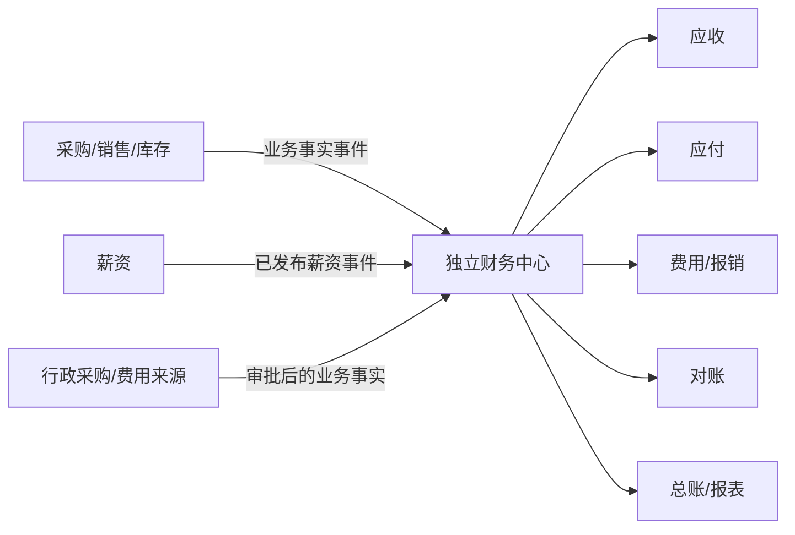

# ERP 财务范围确认文档

> 决策主题：当前整改采用轻 ERP，还是同步建设完整财务中心
> 日期：2026-07-29
> 建议结论：当前 B01—B04 按方案 A“轻 ERP”执行；方案 B“完整 ERP 财务中心”必须独立立项，不混入本次一致性整改。

## 1. 当前事实

第一阶段源码和页面审计未发现独立的：

- 应收管理；
- 应付管理；
- 费用报销；
- 费用归集；
- 银行/业务对账；
- 会计总账；
- 凭证、会计期间、科目和结账；
- 税务、发票和财务报表体系。

当前存在的财务相关数据：

- 采购单金额和供应商资料；
- 销售单金额和客户服务资料；
- 采购/销售退货金额；
- 库存成本、销售和毛利类报表；
- 员工薪资计算、查询和导出；
- OA 行政采购金额。

这些属于采购、库存、人事和经营数据，不等同于完整财务核算。

## 2. 方案 A：轻 ERP

### 2.1 范围

```text
采购
库存
销售与基础经营数据
人事
考勤与薪资
OA
统一审批
合同与文件
系统管理
```

### 2.2 能解决的问题

- 商品采购、收货、入库和退货；
- 销售、出库、销售退货；
- 库存、调拨、盘点和库存统计；
- 员工入职、档案、合同、考勤、工资；
- 行政申请、审批和资产报修；
- 基础销售、采购、库存和毛利分析。

### 2.3 明确不承诺

- 客户欠款余额和收款核销；
- 供应商欠款余额和付款计划；
- 报销单到付款的财务闭环；
- 银行流水自动对账；
- 借贷记账和会计凭证；
- 科目余额、试算平衡、结账和反结账；
- 资产负债表、利润表和现金流量表；
- 发票、税务和法定会计合规。

### 2.4 适用条件

- 企业已有外部财务软件或由财务人员线下核算；
- 当前首要问题是采购、库存、人事和审批协同；
- 业务规模尚不要求 ERP 内完成会计总账；
- 希望先稳定基础数据和业务流程；
- 能接受经营金额与法定财务报表不在同一系统闭环。

## 3. 方案 B：完整 ERP 财务中心

### 3.1 独立项目范围

```text
财务中心
├─ 财务基础
│  ├─ 会计主体
│  ├─ 会计科目
│  ├─ 会计期间
│  ├─ 币种、税率和结算方式
│  └─ 客户/供应商财务主数据
├─ 应收
│  ├─ 应收确认
│  ├─ 收款
│  ├─ 核销
│  ├─ 退款
│  └─ 账龄
├─ 应付
│  ├─ 应付确认
│  ├─ 付款申请
│  ├─ 付款
│  ├─ 核销
│  └─ 账龄
├─ 费用与报销
│  ├─ 费用申请
│  ├─ 报销单
│  ├─ 借款/冲借款
│  ├─ 预算控制
│  └─ 付款
├─ 对账
│  ├─ 客户对账
│  ├─ 供应商对账
│  ├─ 银行流水
│  └─ 差异处理
├─ 总账
│  ├─ 凭证
│  ├─ 自动凭证规则
│  ├─ 过账
│  ├─ 结账/反结账
│  └─ 科目余额
└─ 财务报表
   ├─ 资产负债表
   ├─ 利润表
   ├─ 现金流量表
   └─ 管理报表
```

### 3.2 为什么必须独立立项

财务中心不是增加几个菜单和表格。它会引入：

- 会计主体和组织映射；
- 客户、供应商与财务往来单位治理；
- 科目、期间、币种、税率和结算规则；
- 单据确认与会计确认的时点差异；
- 应收应付核销和红冲；
- 不可随意修改的凭证和结账规则；
- 审计、合规、权限分离和财务数据保留；
- 与采购、销售、库存、薪资、银行和发票的接口；
- 历史期初余额和数据迁移；
- 专门的财务业务验收和上线切换。

若把这些内容混入 PC-Mobile 一致性整改，会同时改变基础业务、数据模型和财务核算，无法控制风险和验收边界。

## 4. 方案比较

| 维度 | 方案 A：轻 ERP | 方案 B：完整 ERP |
|---|---|---|
| 当前基础 | 已有主要模块 | 当前不存在 |
| 本次目标匹配 | 高 | 低，会扩大项目目标 |
| 业务范围 | 采购、库存、人事、审批、基础经营 | 业务运营 + 财务核算 |
| 数据改造 | 统一现有对象、状态和接口 | 新建财务主数据、账务模型和迁移 |
| 合规要求 | 一般业务审计 | 财务内控、凭证、结账、法定报表 |
| 项目风险 | 可按模块小批推进 | 高，需要独立治理和专业财务参与 |
| 与 B01—B04 关系 | 当前执行方案 | 禁止直接并入 |
| 推荐 | 是 | 仅单独立项后 |

## 5. 第二阶段范围决策

### 5.1 推荐决策

**当前项目采用方案 A：轻 ERP。**

B01—B04 允许整改：

- 采购、销售和库存金额/数量口径；
- 库存成本和毛利公式；
- 供应商、客户和结算基础字段的权限；
- 薪资状态、发布和本人查看；
- OA 行政采购的审批和执行状态；
- 未来财务中心需要的稳定业务 ID、组织、金额、币种、时间和审计信息。

B01—B04 禁止新增：

- 财务中心一级菜单；
- 应收、应付、报销、对账、总账页面；
- 财务凭证、科目、期间和账簿表；
- “付款完成”等没有真实财务业务支持的状态；
- 伪造的应收应付统计卡片；
- 把采购单“已完成”解释为“已付款”；
- 把销售单“已完成”解释为“已收款”。

### 5.2 当前页面文案边界

| 当前业务状态 | 可以表达 | 不能推断 |
|---|---|---|
| 采购完成 | 采购业务已收货/完成 | 供应商已付款、应付已核销 |
| 销售完成 | 商品已出库/销售业务完成 | 客户已收款、应收已核销 |
| 销售退货完成 | 退货和库存已处理 | 财务退款已完成 |
| 采购退货完成 | 退货出库已完成 | 供应商退款/冲应付已完成 |
| 工资已发布 | 员工可查看薪资结果 | 银行已代发、会计已记账 |
| 行政采购完成 | 行政采购业务关闭 | 费用已报销/付款/入账 |

## 6. 轻 ERP 为未来财务预留的接口

预留不等于当前开发财务模块。现有业务只需保证：

| 业务对象 | 需要稳定的信息 |
|---|---|
| 采购订单 | businessId、单号、组织、供应商、金额、币种、税额字段若业务已有、状态、时间 |
| 收货/退货 | 原单、实际数量、金额影响、发生时间 |
| 销售订单 | businessId、客户、组织、金额、币种、实际出库和退货 |
| 库存流水 | 商品、数量、单位成本、来源业务、组织、时间 |
| 薪资结果 | 员工、期间、已发布版本、应发/扣减/实发等现有字段 |
| OA 行政采购 | 申请人、部门、用途、金额、审批结果、执行状态 |
| 审批 | instanceId、业务类型、结果、处理人和时间 |

不得为了“预留”在当前数据库提前创建未经设计的会计字段和凭证表。

## 7. 启动完整财务项目的触发条件

满足任一业务需求并完成管理决策后，可启动方案 B 立项：

- 需要在 ERP 内追踪客户欠款和供应商欠款；
- 需要付款申请、付款审批和核销闭环；
- 需要员工报销、借款、预算和费用归集；
- 需要银行流水和自动对账；
- 需要会计凭证、结账和财务报表；
- 外部财务软件与 ERP 双录已造成显著风险；
- 管理层要求经营与会计口径在同一平台可追溯。

立项前必须具备：

1. 财务负责人和专业会计参与；
2. 会计主体、科目、期间和核算规则；
3. 客户/供应商主数据治理；
4. 期初余额和历史数据迁移方案；
5. 与采购、销售、库存、薪资和银行的边界；
6. 权限分离、审计和合规要求；
7. 独立预算、里程碑、测试环境和上线切换方案。

## 8. 未来财务项目的架构边界



财务中心消费稳定的业务事实，不反向修改库存、员工或审批历史。财务冲销通过独立财务单据并引用原业务，不篡改已完成业务事实。

## 9. 决策风险

### 9.1 选择方案 A 的风险

- 仍需外部财务软件或线下财务流程；
- 经营报表与法定财务报表存在边界；
- 收付款状态无法在当前 ERP 内完整反映。

控制方式：

- 页面文案不冒充财务状态；
- 导出/接口提供稳定业务事实；
- 明确外部财务系统责任；
- 未来立项时保留可追溯业务 ID。

### 9.2 现在混入方案 B 的风险

- B01 统一状态时被迫同时设计会计状态；
- 库存和财务两个记账体系同时变化；
- 95 项整改失去边界，无法小批交付；
- 页面看似增加，核心会计规则却不完整；
- 可能产生错误应收、应付和财务报表。

因此本项目禁止采用“先加几个财务页面，以后再补逻辑”的方式。

## 10. 财务范围签字项

- [ ] 当前 B01—B04 采用方案 A“轻 ERP”；
- [ ] 当前系统不宣称具备应收、应付、报销、对账和总账；
- [ ] 采购完成不等于已付款，销售完成不等于已收款；
- [ ] 财务中心不进入本轮页面、API 和数据库整改；
- [ ] 若选择方案 B，必须新建立项、团队、预算和验收；
- [ ] 当前业务接口只做稳定业务事实，不提前虚构会计模型；
- [ ] 业务负责人和财务负责人完成范围确认。

## 11. 决策记录

| 项目 | 建议值 | 最终签字值 |
|---|---|---|
| 当前方案 | A：轻 ERP | 待业务确认 |
| 是否建设财务中心 | 否，不在本项目 | 待管理层确认 |
| 外部财务责任方 | 由企业现行财务流程承担 | 待补充 |
| 未来立项触发条件 | 见第 7 节 | 待确认 |
| 决策负责人 | 业务负责人 + 财务负责人 + 项目负责人 | 待指定 |
