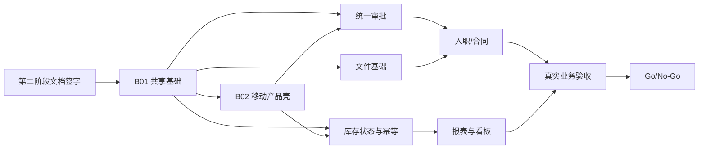

# ERP PC-Mobile 一致性整改路线图

> 阶段：第二阶段产品架构确认
> 日期：2026-07-29
> 目标：把第一阶段 95 项原子任务重新编排为 B01—B04 四个可验收批次。
> 当前状态：设计待评审；本文件不授权立即修改代码。

## 1. 路线图结论

不同时启动 95 项整改。

采用四批次：

| 批次 | 目标 | 核心范围 | 进入条件 | 完成门禁 |
|---|---|---|---|---|
| B01 基础统一 | 先让两端遵守同一规则 | 权限、组织、状态、动作、API、幂等、功能开关、页面入口规则 | 第二阶段 5 份文档签字 | 契约、权限、状态机和幂等测试通过 |
| B02 移动体验 | 建立稳定的移动产品壳 | 五栏、工作台、消息、待办、应用、我的、深链 | B01 共享契约可用 | 六类角色导航和信息架构通过 |
| B03 高频业务 | 让高频执行场景真正闭环 | 审批、考勤、库存、入职、文件/合同 | B01、B02 完成 | 隔离数据跨端写流程通过 |
| B04 管理增强 | 提升管理效率并完成发布验收 | 数据看板、报表、配置体验、PC 效率、管理员摘要、原生/真实业务验收 | B03 核心业务稳定 | Go/No-Go 门禁通过 |

## 2. 排序原则

优先级按以下顺序决定：

1. 数据错误、越权或重复记账风险；
2. PC 与移动业务状态不一致；
3. 核心业务无法闭环；
4. 高频任务步骤和移动现场效率；
5. 管理看板、报表和配置体验；
6. 低频视觉与技术债。

任何批次都遵守：

- 一次只改一个核心状态机；
- 共享契约先于页面；
- 服务端校验先于按钮显隐；
- 自动测试先于下一模块；
- 每个子批次使用有限角色和隔离数据验收；
- 未通过当前门禁，不叠加下一项核心流程改造。

## 3. B01：基础统一

### 3.1 目标

让 PC 和移动端对同一用户、组织、业务对象和动作得到同一结果，为后续页面重构建立稳定地基。

### 3.2 工作包

| 工作包 | 内容 | 来源任务 | 交付物 | 验收 |
|---|---|---|---|---|
| B01-01 范围与基线 | 文档签字、轻 ERP 边界、代码/配置/数据库基线、六类账号、隔离数据 | GOV-001—008 | 冻结基线、角色矩阵、测试数据、开关登记 | 可复现同一环境，财务不混入 |
| B01-02 页面生命周期规则 | 112 个页面处置、路由兼容、合并和废弃规则 | GOV-005、页面治理表 | 页面登记和变更检查 | 新增/删除入口必须更新生命周期 |
| B01-03 权限与组织 | 功能权限、数据范围、店仓授权专权、组织上下文、字段脱敏 | CORE-003—007 | 权限字典、组织规范、字段权限 | 改 ID/改组织/直调接口均不能越权 |
| B01-04 状态与动作 | 核心状态目录、服务端允许动作、统一文案 | CORE-001—002、UX-002 | 状态/动作契约 | 同一记录两端状态和动作一致 |
| B01-05 API 正确性 | 统一错误、版本、幂等、契约测试 | API-001—003、API-008 | 错误目录、乐观锁、幂等、契约测试 | 超时重试不重复建单、审批或记账 |
| B01-06 审批与待办基础 | 回调可靠化、统一待办契约、一致性监控 | API-004、API-006、API-009 | instanceId/待办/回调规则和监控 | 审批完成后业务和待办可自动对齐 |
| B01-07 功能开关 | 统一能力接口，入口/API/待办/消息共同遵守 | CORE-008、SYS-004 | 开关契约和登记 | 关闭能力不产生孤儿待办或假空页 |
| B01-08 安全与基础测试 | 数据范围、越权、幂等、并发和补偿演练 | QA-001—003、QA-010 | 自动测试与演练记录 | P0 越权、重复和静默不一致为 0 |

### 3.3 推荐子批次

```text
B01.1 冻结基线和业务字典
→ B01.2 权限、数据范围和组织上下文
→ B01.3 状态、动作和统一错误
→ B01.4 版本、幂等和契约测试
→ B01.5 审批回调、待办和一致性监控
→ B01.6 功能开关与页面能力
→ B01 Gate
```

### 3.4 B01 不包含

- 不重做移动五栏视觉；
- 不改采购、入职、盘点等业务流程页面；
- 不新增扫码；
- 不建设财务中心；
- 不直接删除旧移动路由。

### 3.5 B01 完成门禁

- [ ] 轻 ERP 和页面生命周期已签字；
- [ ] 六类角色、组织和隔离数据可用；
- [ ] 核心状态和允许动作由服务端统一；
- [ ] 功能、数据范围、组织和字段权限均有测试；
- [ ] 核心命令支持幂等和版本冲突；
- [ ] 审批、业务、待办和监控可关联；
- [ ] 功能开关同时控制入口和后端能力；
- [ ] 未新增 PC/移动平行业务服务。

## 4. B02：移动端体验优化

### 4.1 目标

在不改变业务状态机的前提下，建立“工作台、消息、待办、应用、我的”统一移动产品结构。

### 4.2 工作包

| 工作包 | 内容 | 来源任务 | 交付物 | 验收 |
|---|---|---|---|---|
| B02-01 五栏壳 | 固定五栏、原生返回、浏览器返回、安全区 | MOB-001 | 新移动壳 | 六类角色结构相同 |
| B02-02 统一工作台 | 合并门店、仓库、HR 工作台；今日数据、提醒、快捷入口 | MOB-002—003 | 角色化工作台 | 10 秒内看见有效任务，无假 0 |
| B02-03 消息中心 | 统一消息类型、已读、业务深链和可靠发送 | API-007 | 一级消息 | 模块不再自建孤立消息入口 |
| B02-04 待办中心 | 待审批、待执行、退回、风险、个人；独立审批页改深链 | API-006、MOB-004 | 一级待办 | 数量与列表一致，处理后自动刷新 |
| B02-05 应用中心 | 角色/组织/权限动态应用，收缩后台管理入口 | MOB-009、SYS-001 | 应用目录 | 普通用户不见后台配置 |
| B02-06 管理员摘要 | 登录、操作、任务失败和在线摘要；默认只读 | SYS-002—003 | 条件管理员中心 | 专权、脱敏，无危险动作泄露 |
| B02-07 页面通用组件 | 列表、筛选、详情、动作栏、错误状态、深链和返回栈 | MOB-004—005、MOB-008 | 移动组件和路由规范 | 空/错/关/无权限可区分 |
| B02-08 视觉与可访问性 | 状态 Token、文字缩放、焦点、触控尺寸、帮助文案 | UX-001、UX-003、UX-005、QA-005 | 体验验收记录 | 320×568 和 390×844 可用 |

### 4.3 推荐子批次

```text
B02.1 五栏容器 + 旧入口兼容
→ B02.2 工作台 + 当前组织
→ B02.3 消息
→ B02.4 待办
→ B02.5 应用 + 管理入口收缩
→ B02.6 我的 + 通用页面组件
→ B02 Gate
```

“我的”主要沿用现有 `/mobile/mine` 和个人业务页，虽然没有独立旧任务编号，也必须在 B02 完成入口整合。

### 4.4 B02 不包含

- 不修改采购、调拨、入职和签署状态机；
- 不一次性重写 59 个业务页面；
- 不直接下线旧工作台、通知和审批路径；
- 不开放移动角色、菜单、参数和任务配置。

### 4.5 B02 完成门禁

- [ ] 五栏在六类角色下稳定；
- [ ] 工作台、消息、待办职责不重叠；
- [ ] 旧深链、登录恢复和返回栈正确；
- [ ] 当前组织始终可见，切换后旧数据失效；
- [ ] 移动应用目录不再平铺后台配置；
- [ ] 无权限、功能关闭、接口失败和真空数据分别呈现；
- [ ] B02 开关关闭可完整回退旧结构。

## 5. B03：高频业务优化

### 5.1 目标

先完成用户每天真正使用的审批、考勤、库存、入职和文件流程；每个子流程单独开发、测试和验收。

### 5.2 实施顺序

考虑依赖后，建议顺序：

```text
B03.1 统一审批处理
→ B03.2 考勤
→ B03.3 文件上传基础
→ B03.4 入职、合同和签署
→ B03.5 库存查询与扫码
→ B03.6 采购收货/退货
→ B03.7 销售出库/退货
→ B03.8 补货、调拨和盘点
→ B03 Gate
```

文件上传基础提前于入职和库存证据上传，但文件空间完整产品是否开放仍由功能开关控制。

### 5.3 工作包

| 工作包 | 内容 | 来源任务 | 关键验收 |
|---|---|---|---|
| B03-01 审批 | 业务详情、轨迹、同意、退回、驳回、转交、回调异常 | CORE/API 基础 + INV-031 | 所有业务使用同一 instanceId 和任务契约 |
| B03-02 考勤 | 服务端时间、上下班状态、重复校验、异常入口 | OA-003 | 改设备时间不能产生合法记录 |
| B03-03 文件基础 | 上传会话、fileId、拍照/文件、逐项进度、重试 | API-005、MOB-007 | PC/移动看到同一附件；失败可恢复 |
| B03-04 入职 | 字段主从、分步表单、资料完整度、补偿、健康证 | HR-001—006、HR-009、MOB-006 | 入职任务到员工/账号闭环，不重复建档 |
| B03-05 合同签署 | 合同归档、签署对象关系、回调幂等、移动签约 | HR-007—008、SIGN-001—004 | 一个签署结果只归档一份合同 |
| B03-06 库存主数据/查询 | 商品、单位、精度、条码、供应商/客户隐私 | INV-001—002 | 扫码和搜索得到同一商品与库存 |
| B03-07 采购 | 状态机、收货质检、扫码收货、采购退货 | INV-010—013 | 不超收、不超退、合格数量才入库 |
| B03-08 销售与出库 | 销售状态、快速录入、扫码出库、销售退货、客户服务 | INV-020—024 | 配送通知幂等，库存与金额冲销可追溯 |
| B03-09 调拨与盘点 | 补货/调拨统一、审批、扫码发收、差异、盘点并发和调整 | INV-030—036 | 同一 transferId；差异不静默抹平；调整只记一次 |
| B03-10 OA 高频业务 | 行政采购、资产交付/报修和跨端验收 | OA-002、OA-004—006 | 名称边界清楚，开关和流程一致 |
| B03-11 弱网与原生能力 | 草稿恢复、相机/文件权限、推送/深链 | QA-004、QA-008 | 失败不误报成功，权限拒绝有替代路径 |

### 5.4 每个 B03 子批次的固定检查

- 正常完成；
- 退回、驳回、撤回和取消；
- 部分执行和异常；
- 重复点击和网络超时；
- 两人并发；
- 中途撤销权限或切换组织；
- PC 发起、移动处理、PC 查看；
- 移动发起、PC 处理、移动查看；
- 待办、消息、业务状态、附件和审计一致。

### 5.5 B03 不包含

- 不建设完整财务；
- 不同时重构所有库存状态机；
- 不在移动开放复杂主数据和规则配置；
- 不以视觉完成代替隔离数据写流程；
- 不在未确认盘点策略前实现最终调整逻辑。

### 5.6 B03 完成门禁

- [ ] 审批、考勤、入职、文件和库存核心流程分别通过；
- [ ] 员工、经理、HR、门店、仓库账号完成真实写流程；
- [ ] 重复操作不重复建档、审批、入库、出库或归档；
- [ ] 异常和补偿有明确待办；
- [ ] 手机扫码有手工搜索替代；
- [ ] 原生相机、文件、推送和深链通过测试；
- [ ] 核心业务无需因普通执行字段被迫返回 PC。

## 6. B04：管理能力增强

### 6.1 目标

在业务正确、移动执行闭环后，再增强管理看板、报表、配置效率和发布质量。

### 6.2 工作包

| 工作包 | 内容 | 来源任务 | 关键验收 |
|---|---|---|---|
| B04-01 数据口径 | 固定数据夹具、采购/销售/退货/调拨/盘点公式 | INV-003 | 详情、流水、PC 报表和移动摘要对账 |
| B04-02 追溯与质量 | 批次、库位、质检和来源单据追溯 | INV-004 | 任一库存可追到来源业务和操作 |
| B04-03 数据看板 | PC 多维分析；移动关键 KPI 和风险摘要 | INV-003、页面治理 | 指标返回公式版本、单位、更新时间和下钻集合 |
| B04-04 配置优化 | 用户、角色、组织、流程、岗位、薪资、调拨等配置体验 | UX-004、PC 页面治理 | 影响预览、版本、生效时间和审计清晰 |
| B04-05 PC 效率 | 默认筛选、列宽、固定列、批量结果、错误状态 | UX-004 | 高频管理任务步骤减少且不破坏权限 |
| B04-06 原生候选包 | iOS/Android 正式签名、真机验收，并回归 B03 已完成的原生能力测试 | QA-006、QA-007；回归 QA-008 | 非 debug 包通过真实角色流程 |
| B04-07 真实业务演练 | 采购、销售、调拨、盘点、入职、合同 | QA-009 | 无人工补数据库、无跨端断点 |
| B04-08 发布门禁 | 差异审计、Go/No-Go、灰度和回退 | REL-001—003 | 所有 P0 清零，监控和回退可执行 |

### 6.3 B04 不包含

- 不因报表需求新建未经确认的财务中心；
- 不在看板客户端重新计算核心指标；
- 不为移动复制 PC 复杂配置；
- 不在真实流程未通过时发布生产包。

### 6.4 B04 完成门禁

- [ ] 固定夹具下库存和经营报表全部对账；
- [ ] 配置页面具备影响预览、权限和审计；
- [ ] iOS/Android 为生产候选签名包；
- [ ] 六类角色和真实业务演练通过；
- [ ] 所有 P0 清零；
- [ ] P1 遗留有业务接受人、规避方案和计划；
- [ ] 灰度、监控和回退已演练；
- [ ] 完成 Go/No-Go 签字。

## 7. 功能开关发布顺序

| 顺序 | 开关 | 首次范围 | 扩大条件 |
|---:|---|---|---|
| 1 | 统一错误/动作契约 | 测试环境 | 契约和回归通过 |
| 2 | 统一待办 | 测试账号 | 数量/列表/业务状态一致 |
| 3 | 移动五栏 | 内部六角色 | 旧入口和深链兼容 |
| 4 | 统一工作台/消息 | 单组织 | 无假 0、消息不丢失 |
| 5 | 入职/文件优化 | HR 测试组织 | 补偿和权限通过 |
| 6 | 扫码查询 | 仓库/门店测试设备 | 条码、权限和手工替代通过 |
| 7 | 扫码收货/出库/盘点 | 单仓库/门店 | 幂等、弱网和库存对账 |
| 8 | 管理员中心 | 专用有限管理员 | 脱敏、只读和审计通过 |

每个开关必须能回退到旧入口或受控关闭状态，不能回退业务数据库到旧状态。

## 8. 依赖与关键路径



关键路径是：

```text
文档签字
→ 权限/状态/API
→ 五栏/消息/待办
→ 审批与文件
→ 入职和库存
→ 报表与真实业务验收
→ 发布
```

## 9. 变更批次约束

每个代码批次必须满足：

| 约束 | 要求 |
|---|---|
| 业务范围 | 一个明确业务目标 |
| 状态机 | 最多一个核心状态机 |
| 数据库 | 迁移独立、前向兼容、可回退应用版本 |
| 前后端 | 先共享契约和服务端测试，再改两端呈现 |
| 角色 | 至少一个有限权限角色验证 |
| 数据 | 使用隔离前缀和可清理数据 |
| 测试 | 正常 + 异常 + 幂等 + 越权 |
| 文档 | 页面、流程、权限和 API 同步更新 |
| 变更面 | 不夹带无关格式化或技术升级 |
| 合并门槛 | 当前批次通过后再启动下一核心流程 |

## 10. 第二阶段评审门槛

进入 B01 前必须确认：

- [ ] 112 个页面生命周期；
- [ ] 移动五栏信息架构；
- [ ] 人事入职对象和档案产生时点；
- [ ] 库存采购与行政采购边界；
- [ ] 统一审批语义；
- [ ] 盘点并发策略的负责人和确认计划；
- [ ] 当前采用轻 ERP，完整财务另立项；
- [ ] 功能开关范围；
- [ ] 六类角色和隔离数据；
- [ ] B01 负责人、验收人和回退责任人。

## 11. 第一阶段 95 项任务重新编组索引

以下索引用于证明原 95 项任务没有丢失，但不代表同一批次内并行启动。

### B01：30 项

```text
GOV-001, GOV-002, GOV-003, GOV-004, GOV-005, GOV-006, GOV-007, GOV-008
CORE-001, CORE-002, CORE-003, CORE-004, CORE-005, CORE-006, CORE-007, CORE-008
API-001, API-002, API-003, API-004, API-006, API-008, API-009
OA-001
SYS-004
UX-002
QA-001, QA-002, QA-003, QA-010
```

### B02：15 项

```text
MOB-001, MOB-002, MOB-003, MOB-004, MOB-005, MOB-008, MOB-009
API-007
SYS-001, SYS-002, SYS-003
UX-001, UX-003, UX-005
QA-005
```

### B03：41 项

```text
API-005
MOB-006, MOB-007
HR-001, HR-002, HR-003, HR-004, HR-005, HR-006, HR-007, HR-008, HR-009
INV-001, INV-002
INV-010, INV-011, INV-012, INV-013
INV-020, INV-021, INV-022, INV-023, INV-024
INV-030, INV-031, INV-032, INV-033, INV-034, INV-035, INV-036
OA-002, OA-003, OA-004, OA-005, OA-006
SIGN-001, SIGN-002, SIGN-003, SIGN-004
QA-004, QA-008
```

### B04：9 项

```text
INV-003, INV-004
UX-004
QA-006, QA-007, QA-009
REL-001, REL-002, REL-003
```

总计：`30 + 15 + 41 + 9 = 95`。

## 12. 当前下一步

本阶段完成后只允许：

1. 召开产品架构评审；
2. 记录未决问题和签字；
3. 冻结 B01 范围；
4. 为 B01 建立独立、可回退的小批次实施计划。

在上述条件满足前，不进入 B01 业务代码修改，更不同时启动 B02—B04。
