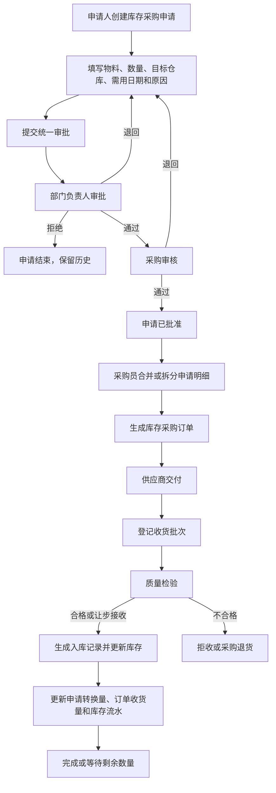
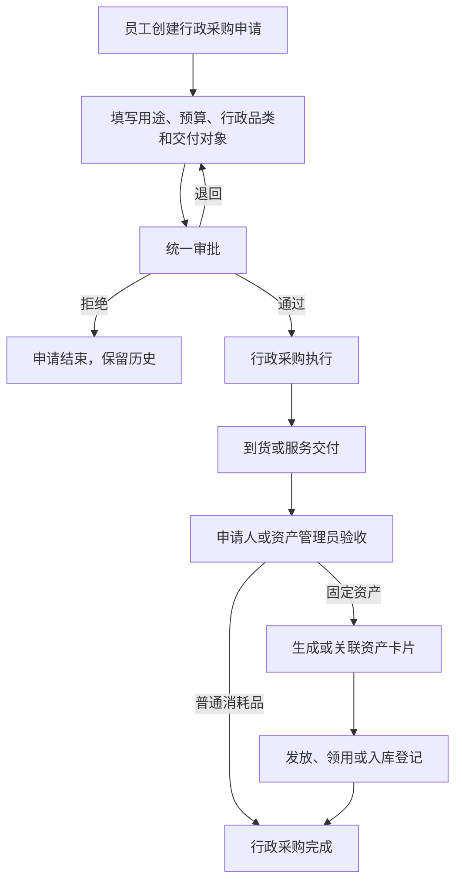
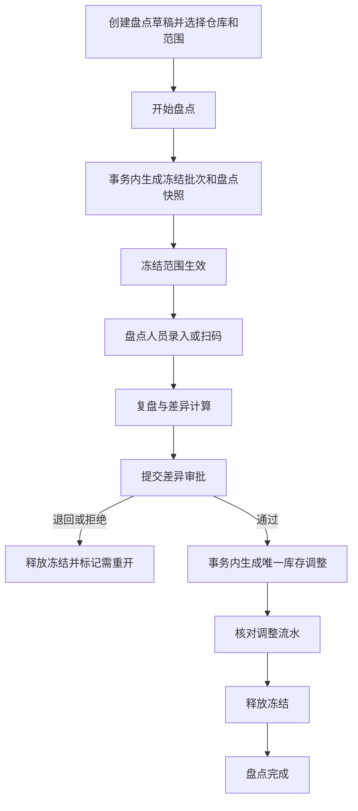
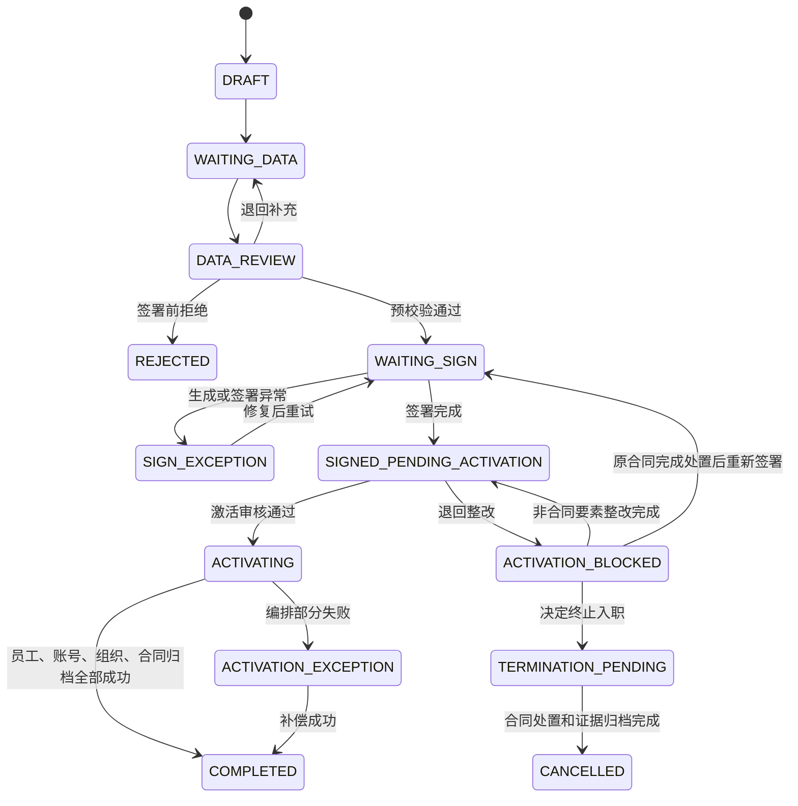

# ERP 第三阶段业务规则冻结文档

> 文档版本：V1.0 评审稿
> 日期：2026-07-29
> 阶段：产品架构评审与开发前基线冻结
> 状态：待产品、业务、技术、测试共同评审；评审通过前不得修改业务代码、数据库或生产配置

## 1. 冻结结论

| 决策编号 | 冻结结论 | 本期处理 |
|---|---|---|
| BR-PUR-01 | 库存采购与行政采购完全分域，不共用申请表、订单表、状态机或成本口径 | 必须执行 |
| BR-PUR-02 | 库存采购申请独立存在，不能再用“采购订单草稿”替代采购申请 | 必须执行 |
| BR-PUR-03 | 库存采购申请与采购订单为多对多来源关系，允许合并采购和拆单采购 | 必须执行 |
| BR-PUR-04 | 行政采购继续由 OA 域承载，固定资产验收后再关联资产登记 | 保留并优化 |
| BR-STK-01 | 一期盘点采用冻结盘点，不采用不停库动态差异算法 | 必须执行 |
| BR-STK-02 | 冻结必须由库存服务统一拦截所有库存写入，不允许只在页面隐藏按钮 | 必须执行 |
| BR-HR-01 | 入职任务不是正式员工档案；最终激活成功后才形成正式员工主档 | 延续第二阶段结论 |
| BR-HR-02 | 合同完成签署后，不再允许普通“驳回并结束”；只能退回整改或进入合同处置流程 | 必须执行 |
| BR-HR-03 | 已签合同、签署证据、入职任务和候选人身份不得物理删除 | 必须执行 |
| BR-HR-04 | 候选人移动填资料和签署使用受限候选人身份，不提前授予正式员工权限 | 必须执行 |
| BR-FLG-01 | 建立统一功能中心；入口、接口、待办、消息和后台任务使用同一有效开关结果 | 必须执行 |
| BR-FLG-02 | 功能开关只负责启停已部署能力，不能让尚未开发的财务模块“无需部署即可上线” | 必须明确 |
| BR-APR-01 | 所有审批共用统一审批实例、节点、任务、动作、回调和审计模型 | 必须执行 |
| BR-SCP-01 | 当前仍按轻 ERP 范围推进；完整财务中心保持独立立项 | 不进入 B01 |

## 2. 审计事实基线

本次结论来自当前仓库中的控制器、领域对象、服务、Mapper、SQL 迁移和前端 API 使用关系，关键事实如下。

1. 库存采购当前使用 `inv_purchase_order`、`inv_purchase_detail`；前端统一调用 `/inventory/purchase/*`。当前“提交”直接把订单置为已提交，没有独立采购申请和统一审批。
2. 行政采购当前使用 `oa_purchase`，已包含统一审批实例、审批轮次、业务行版本和回调事件键；前端调用 `/oa/purchase/*`。
3. 两类采购已经分表，但用户可见名称、申请与订单的业务边界仍需冻结。
4. 盘点当前在创建时保存账面快照，提交时如发现实时库存变化，会把盘点置为失效并要求重开；当前没有库存冻结。
5. `inv_stock.locked_quantity` 表示库存预留/占用数量，已参与可用库存公式，不能复用为盘点冻结标志。
6. 入职当前只有 `DRAFT`、`READY`、`CONFIRMED`、`CANCELLED` 四个状态；`CONFIRMED` 时直接创建或关联用户和员工档案。
7. 入职任务与电子签约包目前没有稳定业务主键关系；电子签约包使用 `employee_id` 识别当前登录人。
8. 电子签约已具备 `signed`、`refused`、`voided` 等状态和不可变事件/证据，但尚未形成“入职最终审核失败后的合同处置”闭环。
9. 统一审批中心当前内置 `OA_PURCHASE`、`INV_TRANSFER`、`INV_STOCK_CHECK`、`HR_HEALTH_CERTIFICATE`；库存采购申请和入职最终审核尚未注册。
10. 功能开关目前同时存在于 `sys_config` 和各服务部署配置中，已具备部分 fail-closed 保护，但没有统一目录、依赖校验、范围发布和完整变更审计。
11. 当前没有独立的请假申请业务聚合；考勤记录只有 `leave` 结果状态。不得为了接入审批中心而虚构请假单据。

## 3. 库存采购模型

### 3.1 领域边界

| 业务域 | 解决的问题 | 核心对象 | 是否影响库存成本 |
|---|---|---|:---:|
| 库存采购 | 采购原材料、商品、库存物资 | 库存采购申请、采购订单、收货批次、质检、入库记录 | 是 |
| 行政采购 | 办公用品、福利用品、行政服务、固定资产申请 | 行政采购申请、行政执行、验收、资产登记 | 默认否；固定资产走资产口径 |

禁止事项：

- 禁止两类采购共用主表或明细表；
- 禁止把 OA 行政采购申请转换成库存采购订单；
- 禁止把办公用品验收直接记入商品库存成本；
- 禁止在移动待办中都显示为模糊的“采购审批”；
- 禁止用客户端参数决定采购类型后写入同一张表。

用户可见名称固定为：

- `库存采购申请`
- `库存采购订单`
- `行政采购申请`
- `行政采购验收`

### 3.2 库存采购申请必须独立

库存采购申请表达“需要买什么、为什么买、需要多少、何时需要、送到哪个仓库”；采购订单表达“向哪个供应商、以什么价格和交付条件购买”。

两者不能合并，原因包括：

- 一份申请可能按供应商、交期或仓库拆成多个采购订单；
- 多个部门申请可能由采购员合并成一张订单；
- 部门审批关注需求合理性，采购审核关注供应商、价格和执行方式；
- 申请驳回不能产生采购订单；
- 订单收货、质检和成本变化必须能追溯到获批需求。

### 3.3 标准流程



### 3.4 申请与订单关系

冻结为“明细级多对多”：

- 一条申请明细可拆到多条订单明细；
- 多条申请明细可合并到一条订单明细；
- 关系必须保存本次转换数量；
- 申请明细维护 `申请量、批准量、已转换量、未转换量`；
- 订单明细维护 `订购量、已收货量、已质检量、已入库量、已退货量`；
- 不允许通过覆盖数量来隐藏转换历史。

已批准申请不默认触发第二套订单审批。采购审核作为采购申请工作流节点完成；只有供应商、价格、金额或数量超出获批边界时，才按规则重新审批或补充审批。

### 3.5 库存采购申请状态

| 状态码 | 用户名称 | 允许动作 |
|---|---|---|
| `DRAFT` | 草稿 | 编辑、删除草稿、提交 |
| `SUBMITTING` | 提交中 | 等待审批实例创建；失败可安全重试 |
| `PENDING_APPROVAL` | 审批中 | 查看、撤回（满足规则时） |
| `RETURNED` | 已退回 | 修改、重新提交、取消 |
| `REJECTED` | 已拒绝 | 查看、复制新建 |
| `APPROVED` | 已批准 | 转采购订单、关闭剩余需求 |
| `PARTIALLY_CONVERTED` | 部分转订单 | 继续转换、关闭剩余需求 |
| `CONVERTED` | 已转订单 | 查看来源订单 |
| `WITHDRAWN` | 已撤回 | 修改、重新提交、取消 |
| `CANCELLED` | 已取消 | 查看历史 |
| `CLOSED` | 已关闭 | 查看关闭原因和未转换量 |

状态变更只能由服务端业务动作产生。PC 和移动端不得直接提交目标状态。

### 3.6 现有库存采购订单兼容规则

当前订单状态不得在一个版本中直接替换。采用兼容演进：

1. 现有订单标记为 `LEGACY_DIRECT` 来源，不伪造历史申请；
2. 新流程订单必须存在申请明细来源关系；
3. 直接创建订单只保留为迁移或应急能力，使用独立权限、填写原因并审计；
4. 当前 `draft/submitted/received/cancelled` 先映射到统一语义；
5. 后续再细分为草稿、已确认、部分收货、质检中、已完成、已取消；
6. 收货、质检、入库继续复用现有库存服务，不复制另一套入库逻辑。

## 4. 行政采购模型

### 4.1 标准流程



### 4.2 冻结规则

- `oa_purchase` 继续作为行政采购申请，不迁移到库存采购表；
- 页面名称由模糊的“采购申请”统一为“行政采购申请”；
- OA 待办标题必须显示“行政采购审批”；
- 关闭、撤回、提交分别拆分权限，不继续全部复用 `oa:purchase:add`；
- 固定资产登记保存行政采购来源 ID，但资产仍由固定资产域负责；
- 行政采购明细化、验收和资产联动属于后续业务增强，不阻塞 B01 基础统一。

## 5. 库存盘点并发规则

### 5.1 一期方案

冻结采用方案 A：冻结盘点。

不采用不停库动态盘点，原因是当前系统已经存在收货质检入库、出库、退货、调拨、调整、批次和库位等多条库存写路径。动态差异需要精确重放盘点期间全部变动，对一期复杂度和测试成本过高。

### 5.2 标准流程



### 5.3 冻结范围

一期限制为同一仓库同一时间最多一个活动冻结盘点批次，避免重叠范围和死锁。

| 盘点类型 | 冻结方式 |
|---|---|
| 全仓盘点 | 冻结该仓库全部库存写入 |
| 分类盘点 | 开始时展开为不可变物料清单，只冻结清单内物料 |
| 指定物料盘点 | 冻结选定物料 |
| 抽盘 | 开始时固定抽样清单，只冻结抽样物料 |

开始后不得改变仓库、范围、物料清单和账面快照。需要改变时必须取消或释放原冻结后重新开始。

### 5.4 冻结期间允许与禁止的动作

允许：

- 查看库存、流水和盘点快照；
- 录入盘点数量和证据；
- 创建尚未过账的业务草稿；
- 查看被阻塞业务及冻结原因。

禁止：

- 收货质检结果过账入库；
- 销售、领用或其他出库扣减；
- 采购退货、销售退货对库存记账；
- 调拨发货、调拨收货；
- 手工库存调整；
- 改变当前量、占用量、可用量、成本、批次或库位余额的任何写入。

被冻结写入统一返回 `INVENTORY_FROZEN`，并包含盘点编号、仓库、负责人和预计处理方式；客户端不得显示通用“操作失败”。

### 5.5 释放规则

| 场景 | 处理 |
|---|---|
| 无差异 | 完成盘点后释放 |
| 有差异且审批通过 | 库存调整成功并校验流水后释放 |
| 审批退回或拒绝 | 释放并把本轮快照标记为不可继续提交；重新盘点需重新冻结 |
| 用户取消 | 有权限、填写原因、确认无调整后释放 |
| 超时 | 产生风险待办，不静默自动释放 |
| 系统故障 | 自动重试；仍失败则进入可见补偿状态 |
| 紧急释放 | 仅 PC 专权、双确认、填写原因；释放后本盘点立即失效 |

库存调整和释放不得由两个相互独立、无补偿关系的客户端请求完成。服务端必须保证“调整唯一、释放可重试、异常可追踪”。

### 5.6 实施约束

- 不复用 `inv_stock.locked_quantity`；
- 不依赖数据库触发器隐藏业务规则；
- 所有库存写服务必须调用同一个冻结守卫；
- 获取库存行锁时按稳定主键排序；
- 冻结批次、库存调整、审批实例和请求 ID 必须可关联；
- 切换前保留现有“库存变化则盘点失效”的逻辑作为回退保护。

## 6. 入职、签署与签署后整改

### 6.1 身份与主数据时点

冻结三个不同对象：

| 对象 | 产生时点 | 权限 | 是否正式员工 |
|---|---|---|:---:|
| 入职任务 | HR 发起时 | HR/负责人管理，候选人仅访问本人 | 否 |
| 候选人身份 | 需要本人移动填资料或签署时 | 仅本人入职、签署和消息；无普通业务菜单 | 否 |
| 员工档案 | 最终通过且激活编排成功时 | 按岗位、角色、组织正式授权 | 是 |

候选人身份复用同一认证中心，但必须标记为 `CANDIDATE`，不进入普通员工目录，不拥有部门业务数据权限。激活时把同一身份升级为 `EMPLOYEE` 并创建员工档案；取消时停用候选人身份，不物理删除。

该规则对第二阶段“账号在完成时创建”的结论做最小修订：正式账号权限仍在激活时授予，但为了本人填资料和电子签署，可以提前创建受限候选人登录身份。

### 6.2 标准状态流



### 6.3 签署后禁止普通驳回

合同进入完整签署状态后，最终审核界面不提供普通“驳回并结束”。审核人只能选择：

1. `通过并激活`；
2. `退回整改`；
3. `终止入职并发起合同处置`。

签署后的任何异常都先进入 `ACTIVATION_BLOCKED` 或 `TERMINATION_PENDING`，不能直接删除入职任务、员工身份或签约包。

### 6.4 整改分类

| 场景 | 系统处理 | 是否需要重签 |
|---|---|:---:|
| 联系方式、紧急联系人、银行卡等不改变已签合同内容的信息 | 保留已签合同，整改后重新提交激活审核 | 否 |
| 姓名、证件、签约主体、岗位、薪资、期限、入职日期等合同关键字段变化 | 锁定激活；由 HR/法务按企业规则处置原签约包，创建新版本并重签 | 是 |
| 签约包处于单方签署或待企业签署 | 保留签署证据，按签约包作废流程处理，不回写为“从未签署” | 视处置结果 |
| 双方已完成签署但企业决定不入职 | 进入合同处置流程，上传处理依据后才能取消入职 | 由 HR/法务决定 |
| 签署文件或证据验签失败 | 进入签署异常，禁止激活 | 修复或重签 |

系统只负责状态、权限、证据和流程控制，不替代企业法务判断合同效力。合同关键字段矩阵和终止材料必须由 HR/法务在上线前签字。

### 6.5 合同记录规则

- 一个入职任务允许关联多个签约包版本；
- 同一时点只能有一个“当前有效候选版本”；
- 旧版本只能标记为已取代、已作废或待处置，不能覆盖或删除；
- 最终文件、哈希、证书、签署事件和操作人必须保留；
- 入职激活只接受验签成功、归档完成且与当前入职任务关键字段一致的签约包；
- 签署回调、最终审核回调和激活编排都必须幂等。

## 7. 功能中心

### 7.1 开关类型

| 类型 | 示例 | 是否可在功能中心直接修改 |
|---|---|:---:|
| 运行时模块开关 | 人事、库存、移动审批 | 是，需权限和审计 |
| 运行时能力开关 | 电子签、扫码库存、新移动工作台 | 是，需依赖校验 |
| 灰度范围 | 指定组织、角色、用户、客户端版本 | 仅在所有消费者已接入统一解析器后开放 |
| 部署/基础设施开关 | 存储服务、推送通道、定时器、调试端点 | 只读展示；仍由部署配置控制 |
| 未安装模块 | 完整财务中心 | 显示“未安装”，不可切换为开启 |

### 7.2 有效状态计算

服务端按以下顺序计算：

```text
代码与数据库能力是否已部署
→ 全局硬关闭是否生效
→ 依赖功能是否全部可用
→ 当前组织/角色/用户是否在发布范围
→ 客户端版本是否满足要求
→ 当前用户是否具有业务权限
→ 当前业务状态是否允许动作
```

任何一层不满足都不能执行写操作。功能开关不授予权限，权限也不能绕过全局硬关闭。

### 7.3 关闭行为

每个开关必须登记：

- 开关编码和用户名称；
- 所属模块、负责人和风险等级；
- 默认值；
- 依赖开关和互斥关系；
- PC、移动、API、待办、消息、定时任务的关闭行为；
- 是否只阻止新建；
- 已创建流程如何完成、终止或补偿；
- 回退入口和监控指标。

默认规则：

- 关闭后不再创建新业务；
- 已创建审批或签署任务不被静默删除；
- 待办和消息不产生孤儿记录；
- 页面显示“功能未开放”及下一步，不显示假空数据；
- 后端写接口必须再次检查；
- 所有修改记录修改前后值、原因、操作人、时间和请求 ID。

### 7.4 首批登记

| 功能编码 | 建议初始状态 | 说明 |
|---|---|---|
| `module.hr` | `ON` | 已部署的人事基础模块 |
| `module.inventory` | `ON` | 已部署的库存模块 |
| `module.finance` | `NOT_INSTALLED` | 完整财务独立立项，不可直接开启 |
| `feature.contract.esign` | 按现网值导入 | 电子签约能力 |
| `feature.inventory.scan` | `OFF` | 通过真机和幂等测试后灰度 |
| `feature.inventory.stock-check-freeze` | `OFF` | 冻结守卫覆盖全部写路径后开启 |
| `feature.approval.mobile` | `OFF` | 新移动待办验收后开启 |
| `feature.mobile.shell-v2` | `OFF` | 五入口新框架回退开关 |

现有 `feature.*` 参数必须登记并迁移到统一目录；部署配置仍保持原职责，不能在 UI 中伪装成无需重启的运行时开关。

## 8. 统一审批规则

### 8.1 单一模型

```text
业务单据
→ 审批实例
→ 不可变流程版本
→ 审批节点
→ 候选审批人
→ 审批动作日志
→ 可靠回调
→ 业务状态更新
→ 待办与消息同步
```

业务模块只负责：

- 校验单据可提交；
- 生成提交快照和审批发起 Outbox；
- 保存 `approvalInstanceId`、轮次、最后回调事件键；
- 幂等消费通过、退回、拒绝、撤回、终止回调；
- 把审批结果映射为业务状态。

业务模块不得自行创建另一套审批任务表和移动审批动作。

### 8.2 业务目录

| 业务编码 | 当前状态 | B01 结论 |
|---|---|---|
| `OA_PURCHASE` | 已存在统一审批能力 | 收敛旧入口并回归 |
| `INV_TRANSFER` | 原生与兼容桥并存 | 分阶段切换并移除双写风险 |
| `INV_STOCK_CHECK` | 原生与旧盘点审批并存 | 与冻结盘点一起收敛 |
| `HR_HEALTH_CERTIFICATE` | 已存在统一审批能力 | 回归并保留 |
| `INV_PURCHASE_REQUEST` | 不存在 | 新增并作为库存采购审批对象 |
| `HR_ONBOARDING` | 不存在 | 新增，审批结果驱动激活或整改 |
| `HR_CONTRACT_REMEDIATION` | 不存在 | 仅在 HR/法务确认需要审批时登记 |
| `OA_LEAVE` | 请假业务对象不存在 | 不得伪造接入；先独立定义请假业务 |

合同签署动作本身不等于审批动作。签署、作废、重签保留在签约域；只有“是否允许发送”“签署后处置”确有审批要求时，才以明确业务单据接入审批中心。

## 9. B01 范围边界

B01 可以实施：

- 权限、组织、状态、错误、版本和幂等统一；
- 功能中心和有效能力接口；
- 移动五入口最小框架及聚合接口；
- 统一审批可靠性、目录和逐业务接入；
- 库存采购申请基础模型；
- 冻结盘点并发保护；
- 入职、签约和激活的关联及异常状态。

B01 不包含：

- 应收、应付、报销、费用、对账和总账；
- 不停库动态盘点；
- 采购成本会计核算或总账凭证；
- 移动端复制 PC 的复杂配置、批量导入和报表设计；
- 未定义业务对象的请假模块；
- 未经 HR/法务确认的合同法律规则自动化。

## 10. 评审签字项

进入开发前必须全部确认：

- [ ] 产品负责人确认两类采购名称、入口和流程；
- [ ] 采购负责人确认独立申请及拆单/合单模型；
- [ ] 仓库负责人确认一期冻结盘点和业务停写范围；
- [ ] HR 负责人确认候选人身份、员工档案激活时点和整改分类；
- [ ] HR/法务确认合同关键字段矩阵和终止所需材料；
- [ ] 技术负责人确认功能中心只能启用已部署能力；
- [ ] 审批负责人确认新增业务编码和回调边界；
- [ ] 安全负责人确认候选人、紧急释放、直接采购和功能发布专权；
- [ ] 测试负责人确认异常、并发、补偿和跨端验收范围；
- [ ] 项目负责人再次确认完整财务不进入 B01。

评审通过后，本文件状态从“评审稿”改为“已冻结”；任何变更必须新增决策记录，不允许口头改变状态机。
