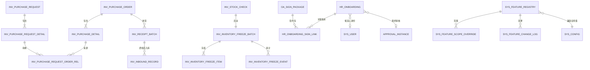

# ERP 第三阶段数据库影响评估

> 文档版本：V1.0 评审稿
> 日期：2026-07-29
> 目的：评估业务规则冻结后的数据模型影响，不包含可执行 SQL
> 约束：评审通过前不得建表、改字段、回填数据或执行生产迁移

## 1. 评估结论

| 领域 | 影响等级 | 结论 |
|---|:---:|---|
| 库存采购申请 | 高 | 需要新增申请主表、明细表、申请—订单明细关系表和审批发起 Outbox |
| 库存采购订单 | 中 | 保留现表，补来源类型、业务版本等兼容字段；历史数据不伪造申请 |
| 行政采购 | 低 | 保留 `oa_purchase`，禁止与库存采购合表；本期主要是权限和名称治理 |
| 冻结盘点 | 高 | 需要新增冻结批次、冻结物料和冻结事件模型，并扩展盘点主表 |
| 入职与签约 | 高 | 扩展入职状态及审批字段，增加候选人身份类型和入职—签约包版本关系 |
| 功能中心 | 中 | 建议在现有 `sys_config` 之上增加功能登记、范围覆盖和变更日志 |
| 统一审批 | 中 | 核心表已存在；增加业务目录、回调适配和各业务本地 Outbox，不重建审批中心 |
| 移动消息 | 中 | 建议增加统一业务消息投影；公告继续使用 `sys_notice` |
| 权限 | 低至中 | 主要新增 `sys_menu` 权限点和角色授权；不另建 PC、移动两套权限表 |
| 完整财务 | 无 | 不在本项目建表 |

推荐采用 `Expand → Backfill → Switch → Contract` 四阶段迁移。B01 只做向前兼容的新增和回填，不删除旧列、旧表或旧状态。

## 2. 当前数据事实

### 2.1 已有对象

| 当前对象 | 已有能力 | 主要缺口 |
|---|---|---|
| `inv_purchase_order` | 采购订单、供应商、金额、状态、收货数量、质检状态 | 无独立申请来源、无审批实例、业务行版本不足 |
| `inv_purchase_detail` | 通用物料、仓库、数量、价格、收货数量 | 无申请明细来源关系和转换数量 |
| `oa_purchase` | 行政采购申请、统一审批实例/轮次、行版本、回调事件键 | 权限过宽；行政执行/验收尚未完整结构化 |
| `inv_stock_check` | 盘点范围、快照、复盘、审批、失效信息、行版本 | 无冻结批次和释放状态 |
| `inv_stock_check_detail` | 账面量、实盘量、复盘量、差异和成本快照 | 无冻结来源和冻结生命周期 |
| `inv_stock` | 当前量、占用量、可用量、成本 | `locked_quantity` 是数量占用，不能代表盘点冻结 |
| `hr_onboarding` | 入职资料、负责人、乐观锁、确认/取消审计 | 只有四态；无统一审批、候选人、签约包和激活异常关系 |
| `oa_sign_package` | 签约包、员工 ID、状态、版本、终态原因和签署证据 | 无 `onboarding_id`；默认假设签署人已是系统用户 |
| `approval_*` | 模板、不可变版本、实例、任务、候选人、动作、可靠回调、验证 | 业务目录未覆盖库存采购申请和入职 |
| `sys_config` | 全局键值、缓存和服务间读取 | 无功能元数据、依赖、范围、发布状态和专用审计 |
| `sys_menu`、`sys_role_menu` | 功能权限与角色授权 | 部分动作共用过宽权限 |
| `sys_role.data_scope`、`sys_user_shop` | 部门数据范围和店仓授权 | 仍需统一组织上下文和 fail-closed 校验 |

### 2.2 不允许复用的字段

| 字段 | 原语义 | 禁止的新用途 |
|---|---|---|
| `inv_stock.locked_quantity` | 被业务预留、占用的数量，影响可用量公式 | 盘点冻结开关 |
| `oa_purchase.status` | 行政采购申请状态 | 库存采购申请状态 |
| `inv_purchase_order.status` | 采购订单执行状态 | 部门采购需求审批状态 |
| `hr_onboarding.linked_user_id` | 确认后关联的正式用户 | 未激活候选人身份 |
| `oa_sign_package.employee_id` | 当前签署人用户 ID | 入职任务 ID |
| `sys_config.config_value` | 通用参数值 | 未登记、无审计的任意范围功能发布 |

## 3. 目标关系模型

图中大写名称为逻辑名称；实际表名使用小写下划线。

## 4. 库存采购申请模型

### 4.1 新增 `inv_purchase_request`

建议字段：

| 字段组 | 建议字段 | 说明 |
|---|---|---|
| 主键与编号 | `request_id`、`request_no` | 编号唯一，不能用订单号 |
| 申请信息 | `title`、`purpose`、`priority`、`need_date` | 表达需求，不表达最终供应商合同 |
| 组织 | `applicant_user_id`、`applicant_dept_id`、`shop_dept_id`、`target_warehouse_id` | 保存 ID 和必要快照 |
| 金额 | `estimated_amount`、`approved_amount_limit`、`currency_code` | 预算/估算，不作为最终成本来源 |
| 状态 | `status` | 使用业务规则冻结状态 |
| 审批 | `approval_instance_id`、`approval_round`、`last_approval_event_key` | 对接统一审批 |
| 并发与幂等 | `row_version`、`submit_request_id` | 防止覆盖和重复提交 |
| 审计 | 提交、撤回、取消、关闭的用户、时间和原因 | 负向动作必须有原因 |
| 基础字段 | `create_by/time`、`update_by/time`、`remark` | 遵循现有规范 |

索引与约束：

- `request_no` 唯一；
- `approval_instance_id + approval_round` 索引；
- `applicant_user_id + status + create_time` 索引；
- `target_warehouse_id + status + need_date` 索引；
- 状态值由服务层白名单校验，不能让客户端任意写入；
- 审批轮次内只允许一个活动实例。

### 4.2 新增 `inv_purchase_request_detail`

建议字段：

- `request_detail_id`、`request_id`；
- `line_no`；
- `item_type`、`item_id`、`product_id` 兼容字段；
- 物料编码、名称、规格、单位快照；
- `requested_qty`、`approved_qty`、`converted_qty`；
- `estimated_unit_price`、`estimated_amount`；
- `target_warehouse_id`、`need_date`、`reason`；
- `line_status`、`row_version`；
- 创建和更新时间。

约束：

- 数量精度与库存主数据一致；
- `requested_qty > 0`；
- `0 <= approved_qty <= requested_qty`；
- `0 <= converted_qty <= approved_qty`；
- 物料和目标仓库必须在提交时重新校验；
- 已提交后的物料关键快照不可直接覆盖。

### 4.3 新增 `inv_purchase_request_order_rel`

该表按明细建立来源关系：

- `relation_id`；
- `request_id`、`request_detail_id`；
- `order_id`、`order_detail_id`；
- `converted_qty`；
- `conversion_request_id`；
- `created_by_user_id`、`create_time`；
- `reversal_status`、`reversal_reason`（如后续支持撤销转换）。

约束：

- `conversion_request_id` 唯一，保证转换幂等；
- 同一申请明细与订单明细组合唯一；
- 转换总量不得超过批准量；
- 订单取消时不能直接删除关系，应写撤销或关闭结果。

选择关系表而不是只在订单明细增加 `request_detail_id`，是为了支持真实的拆单和合单。

### 4.4 新增审批发起 Outbox

建议采用与现有 OA 采购、盘点和健康证相同的可靠发起模式：

`inv_purchase_request_approval_start_outbox`

至少包含：

- 本地事件键；
- 申请 ID、审批轮次、幂等键；
- 提交业务快照和摘要；
- 发送状态、重试次数、下次重试时间；
- 远程审批实例 ID、远程业务轮次；
- 最后错误码和脱敏摘要；
- 乐观锁版本。

### 4.5 扩展现有采购订单

建议仅新增：

| 字段 | 目的 |
|---|---|
| `source_type` | `REQUEST_CONVERSION`、`LEGACY_DIRECT`、`DIRECT_EXCEPTION` |
| `row_version` | 收货、质检、取消和并发编辑保护 |
| `confirmed_time/by` | 区分草稿与可执行订单 |
| `direct_reason` | 应急直接创建时必填 |

不建议：

- 在订单主表复制全部申请字段；
- 把 `approval_instance_id` 同时当申请审批和订单审批；
- 为历史订单批量生成虚假申请；
- 在 B01 直接删除现有 `status` 或更改其物理值。

### 4.6 行政采购不变更边界

`oa_purchase` 不迁移、不合表。B01 数据库只考虑：

- 如权限拆分需要，新增菜单权限记录；
- 修复重复或无效功能开关数据；
- 保留现有统一审批字段；
- 后续行政验收和资产登记另行扩表，不挤入库存采购模型。

## 5. 冻结盘点模型

### 5.1 扩展 `inv_stock_check`

建议新增：

| 字段 | 建议值 | 用途 |
|---|---|---|
| `concurrency_mode` | `FREEZE`，预留 `DYNAMIC` | 冻结本轮策略 |
| `freeze_batch_id` | 冻结批次 ID | 关联当前批次 |
| `freeze_status` | `NOT_STARTED/ACTIVE/RELEASED/FAILED` | 展示与补偿 |
| `frozen_by_user_id/name` | 操作快照 | 审计 |
| `frozen_time` | 时间 | 审计 |
| `freeze_deadline` | 必填时间 | 超时风险识别 |
| `released_by_user_id/name` | 操作快照 | 审计 |
| `released_time` | 时间 | 审计 |
| `release_reason` | 原因 | 正常/取消/退回/紧急 |
| `last_freeze_event_key` | 事件键 | 幂等消费 |

不直接移除现有失效字段；切换期仍用于检测冻结守卫遗漏。

### 5.2 新增 `inv_inventory_freeze_batch`

建议字段：

- `freeze_batch_id`、`freeze_no`、`check_id`；
- `shop_dept_id`、`warehouse_id`；
- `scope_type`、`scope_snapshot_json`；
- `status`：`ACTIVE/RELEASING/RELEASED/INVALIDATED`；
- `freeze_token`；
- `frozen_by/time`、`release_by/time/reason`；
- `expires_time`、`row_version`；
- 创建和更新时间。

约束：

- `freeze_no`、`freeze_token` 唯一；
- `check_id` 每轮只能关联一个活动冻结批次；
- 一期同一仓库最多一个活动批次；
- MySQL 5.7/8.0 兼容方案应通过受控活动键或事务锁保证唯一，不能只依赖先查后插。

### 5.3 新增 `inv_inventory_freeze_item`

建议字段：

- `freeze_item_id`、`freeze_batch_id`；
- `stock_id`；
- `item_type`、`item_id`、`product_id`；
- `warehouse_id`、必要的批次/库位范围；
- `book_qty`、`locked_qty`、`available_qty`、`cost_price` 快照；
- `snapshot_hash`；
- `create_time`。

约束：

- `freeze_batch_id + stock_id` 唯一；
- 生成明细时按 `stock_id` 排序锁定；
- 盘点明细账面量必须来自同一事务生成的冻结快照；
- 全仓冻结即使没有逐项匹配，也必须由冻结批次范围拦截新库存行写入。

### 5.4 新增 `inv_inventory_freeze_event`

保存不可变事件：

- `STARTED`；
- `BLOCKED_MUTATION`；
- `SUBMITTED`；
- `APPROVED`；
- `ADJUSTED`；
- `RETURNED_RELEASED`；
- `CANCELLED_RELEASED`；
- `EMERGENCY_RELEASED`；
- `RELEASE_FAILED/RETRY_SUCCEEDED`。

事件包含：

- 事件键、盘点 ID、冻结批次 ID；
- 请求 ID、库存业务类型和业务 ID；
- 操作人、原因；
- 脱敏上下文；
- 创建时间。

被拦截的每次写入不宜无限生成明细日志；可按业务请求去重，并配合指标统计。

### 5.5 库存流水

盘点调整继续写现有库存流水/明细账，不另建第二套库存余额。需要补充：

- 调整流水引用 `check_id`、`freeze_batch_id`、`approval_instance_id`；
- 调整请求幂等键唯一；
- 调整成功后才可释放；
- 如果批次/库位明细已启用，主库存与明细库存必须在同一事务或可靠补偿中一致。

## 6. 入职、候选人和签约模型

### 6.1 扩展 `hr_onboarding`

建议新增或调整：

| 字段 | 用途 |
|---|---|
| 扩展 `status` 长度和白名单 | 支持资料、签署、激活和异常状态 |
| `candidate_user_id` | 受限候选人登录身份 |
| `approval_instance_id`、`approval_round` | 最终入职审核 |
| `last_approval_event_key` | 回调幂等 |
| `active_sign_link_id` | 当前签约版本快捷引用，可选 |
| `signed_time` | 当前有效签约包完成时间快照 |
| `activation_request_id` | 激活编排幂等键 |
| `activation_status` | `NOT_STARTED/PROCESSING/FAILED/SUCCEEDED` |
| `activation_error_code` | 脱敏稳定错误码 |
| `last_return_reason/code` | 签署后整改原因 |
| `termination_status` | 合同处置进度 |

现有 `version` 保留，并统一为每次业务状态和关键字段更新递增。

需要调整的索引：

- `candidate_user_id + status`；
- `approval_instance_id + approval_round`；
- `status + expected_entry_date`；
- `activation_status + update_time`；
- 身份证、手机号冲突查询继续使用加密/受控方案，不新增明文宽索引。

### 6.2 新增 `hr_onboarding_sign_link`

建议字段：

- `link_id`、`onboarding_id`、`package_id`；
- `version_no`；
- `link_status`：`CURRENT/SUPERSEDED/VOIDED/REMEDIATION_REQUIRED`；
- `contract_key_digest`：合同关键字段摘要；
- `package_status_snapshot`；
- `signed_time`；
- `disposition_reason_code/detail`；
- `created_by/time`、`updated_by/time`；
- `row_version`。

约束：

- `package_id` 唯一，防止一个签约包归属多个入职任务；
- 一个入职任务同一时点只有一个 `CURRENT` 链接；
- 旧链接只改状态，不删除；
- 激活必须校验当前链接状态、签约包状态和关键字段摘要。

不建议只在 `hr_onboarding` 放一个 `package_id`，因为重签和旧版本证据会丢失。

### 6.3 扩展用户身份

当前 `sys_user` 只有启用/停用状态，没有候选人与正式员工类型。建议新增：

- `account_type`：`CANDIDATE/EMPLOYEE/ADMIN/SERVICE`，默认按现有数据回填；
- `account_lifecycle_status`：候选、待激活、正常、停用等受控值，或由账户类型与现有状态组合表达；
- 必要的 `activation_time`、`converted_from_onboarding_id`。

迁移原则：

- 现有普通用户按是否存在正式员工档案和角色进行保守回填；
- 无法自动判断的数据进入人工清单，不猜测；
- 候选人不创建 `sys_user_profile` 正式员工档案；
- 激活时在同一编排中创建档案、变更类型、授权角色/岗位/组织；
- 取消时停用候选人，不硬删除；
- 用户列表和员工列表必须按对象语义分别过滤。

如果评审决定采用外部签署人令牌而不是候选人账号，需要单独重做认证、签署所有权和安全模型；本评审稿推荐候选人账号，以最大限度复用现有登录和签署所有权校验。

### 6.4 签约包兼容

不立即重命名 `oa_sign_package.employee_id`。先通过 `hr_onboarding_sign_link` 和候选人 `user_id` 兼容；后续如签约域扩展到外部签署人，再增加通用 `signer_subject_type/signature_subject_id`，不能在 B01 同时进行大规模重命名。

签约包、签约任务、最终确认、文件证据和事件表全部保留。

## 7. 功能中心模型

### 7.1 兼容策略

当前多个服务通过 `RemoteConfigService` 读取 `sys_config` 中的 `feature.*`。B01 不直接切断该路径。

冻结方案：

1. `sys_config` 在过渡期继续保存全局 ON/OFF 值；
2. 新增功能登记表，绑定一个唯一 `config_key`；
3. 所有新代码只调用统一 Feature Resolver；
4. 旧服务逐个迁移；
5. 在所有写入口迁移前，不开放组织/用户级灰度开启，避免旧服务只看到全局值而放行；
6. 通用参数页面禁止直接修改已登记的 `feature.*`，必须走功能中心。

### 7.2 新增 `sys_feature_registry`

建议字段：

- `feature_id`、`feature_code`、`feature_name`；
- `module_code`、`feature_type`；
- `config_key`；
- `deployment_state`：`AVAILABLE/NOT_INSTALLED/RESTART_REQUIRED`；
- `default_enabled`；
- `rollout_mode`：一期仅 `GLOBAL`，预留 `PILOT`；
- `risk_level`、`owner_user_id/name`；
- `dependency_json`、`conflict_json`；
- `min_pc_version`、`min_mobile_version`；
- `new_entry_only`；
- `status`、`row_version`；
- 审计字段。

约束：

- `feature_code` 唯一；
- `config_key` 唯一；
- 依赖图发布前验证无环；
- `NOT_INSTALLED` 不允许改为开启；
- 全局硬关闭优先于任何范围覆盖。

### 7.3 新增 `sys_feature_scope_override`

预留字段：

- `override_id`、`feature_id`；
- `scope_type`：`ORG/ROLE/USER/CLIENT`；
- `scope_id` 或受控字符串；
- `enabled`；
- `effective_from/to`；
- `reason`、`row_version`；
- 操作人和时间。

一期只建模或关闭写入口；所有服务完成统一解析前不得用于“全局关闭但局部开启”。

### 7.4 新增 `sys_feature_change_log`

不可变记录：

- 功能编码；
- 变更类型；
- 变更前后快照；
- 影响范围；
- 原因、工单或评审编号；
- 操作人、复核人；
- 请求 ID；
- 时间。

高风险模块开关、电子签和库存冻结开关建议要求复核人，且操作人与复核人不能相同。

## 8. 统一业务消息模型

`sys_notice` 继续承载公告和通知发布，不把审批待办塞进公告表。

建议新增 `sys_business_message` 作为统一只读消息投影：

- `message_id`；
- `event_key` 唯一；
- `recipient_user_id`；
- `message_type`：系统、审批、任务、库存异常、合同提醒；
- `source_service`、`business_type`、`business_id`；
- `title`、脱敏摘要；
- `deep_link` 和必要的客户端路由版本；
- `read_time`、`expires_time`；
- `create_time`。

模块通过可靠事件/Outbox 写入消息中心，不直接新增各自的移动消息表。消息已读与业务完成、待办完成保持独立。

如果 B01 先采用只读 Provider 聚合，仍必须冻结以上目标模型，且不得把前端聚合作为最终一致性来源。

## 9. 审批中心影响

现有 `approval_template`、`approval_rule*`、`approval_instance`、`approval_task*`、`approval_action_log`、`approval_callback_outbox` 和验证表继续使用。

需要的数据变化：

1. 注册 `INV_PURCHASE_REQUEST` 和 `HR_ONBOARDING`；
2. 为每个新业务定义权限、待办类型、路由和回调适配器；
3. 新增业务本地审批发起 Outbox；
4. 盘点和调拨完成原生切换后，旧本地审批表只读保留；
5. `OA_LEAVE` 不注册，直到存在真实请假表、状态机和回调；
6. 合同处置是否注册为独立审批业务，等待 HR/法务规则签字。

不新增第二套通用审批实例表。

## 10. 权限与菜单数据

继续使用：

- `sys_menu` 保存菜单和按钮权限码；
- `sys_role_menu` 保存角色授权；
- `sys_role.data_scope` 保存部门数据范围；
- `sys_user_shop` 保存店仓授权。

数据库变更主要是新增权限节点及角色迁移。要求：

- 新权限先插入但默认不授予普通角色；
- 新旧权限并行期保留兼容；
- 高风险权限不自动赋给现有“管理员类”角色；
- 迁移前导出现有角色授权矩阵；
- 回滚只撤销新授权和入口，不删除审计历史。

## 11. 迁移分批

### 11.1 M0：只读预检

- 导出数据库版本、表结构、索引和数据量；
- 检查 `sys_config.config_key` 重复；
- 检查采购、盘点、入职、签约包孤儿数据；
- 检查统一审批业务轮次和回调积压；
- 生成现有用户、角色、组织和店仓授权快照；
- 不修改数据。

### 11.2 M1：Expand

- 新建功能登记和日志表；
- 新建采购申请模型和关系表；
- 新建冻结盘点模型；
- 新建入职—签约关系表；
- 以可空或安全默认值扩展现有表；
- 新权限记录默认不授权；
- 不切换流量。

### 11.3 M2：Backfill

- 现有采购订单标记 `LEGACY_DIRECT`；
- 现有用户保守回填账户类型，异常进入人工清单；
- 现有 `feature.*` 进入功能登记；
- 已有签约包不强行关联入职；仅对能用稳定证据确认的记录回填；
- 现有盘点保持原模式，不补造冻结批次；
- 每批回填记录批次号、数量和校验摘要。

### 11.4 M3：Switch

- 先测试组织、再单组织灰度；
- 新采购从申请入口进入；
- 新盘点使用冻结守卫；
- 新入职使用候选人和签约关联；
- 新代码使用统一功能解析；
- 统一审批按业务编码逐一切换；
- 旧数据仍可读。

### 11.5 M4：Contract

只有在至少一个稳定发布周期、对账通过且回退期结束后才允许：

- 隐藏旧入口；
- 停止旧审批写入；
- 删除兼容分支；
- 评估旧列/旧表归档。

物理删除必须另立迁移，不属于 B01。

## 12. 回退与恢复

| 变更 | 应用回退 | 数据回退 |
|---|---|---|
| 新采购申请 | 关闭新入口，恢复受控旧订单入口 | 保留新申请和来源关系，不删除 |
| 冻结盘点 | 关闭冻结开关，恢复快照失效保护 | 释放活动冻结并记录事件；不得直接删锁 |
| 新入职状态 | 关闭新流程入口，保留只读和补偿 | 不把已签记录降级成未签 |
| 功能中心 | 回退到全局 `sys_config` 读取 | 保留变更日志和登记 |
| 审批原生切换 | 按业务编码切回兼容桥 | 保留实例、任务、动作和回调 |
| 移动聚合 | 切回旧路由/Provider | 消息、待办业务数据不回滚 |

回退不能通过恢复旧数据库备份覆盖已经发生的新业务。应用回退和业务补偿必须分开。

## 13. 数据库验收门槛

- [ ] 所有 DDL 均有 MySQL 5.7 和 8.0 兼容验证；
- [ ] M0 预检对当前环境只读且可重复；
- [ ] 新增字段有安全默认值或允许为空；
- [ ] 无表重命名、无字段删除、无历史伪造；
- [ ] 幂等键和业务唯一性由数据库约束与服务校验共同保证；
- [ ] 新表有必要索引，无明显全表扫描路径；
- [ ] 迁移在生产等量数据副本完成耗时和锁影响测试；
- [ ] 回填可分批、可续跑、可核对；
- [ ] 盘点冻结没有孤儿活动批次；
- [ ] 审批、业务、待办、消息均能通过业务 ID 和请求 ID 追踪；
- [ ] 敏感信息未写入普通日志、变更快照或错误摘要；
- [ ] 回退演练不丢失已发生业务。

## 14. 本阶段不生成的内容

本文件不提供：

- 可直接执行的 DDL/DML；
- 生产迁移时间窗口；
- 财务中心表结构；
- 动态盘点事件重放模型；
- 合同效力的法律判断；
- 未存在请假业务的虚构表。

这些内容必须在本评审稿签字并进入对应开发任务后，按单个迁移脚本逐项设计、审查和验证。
