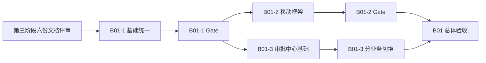

# ERP B01 开发任务拆解

> 文档版本：V1.0 评审稿
> 日期：2026-07-29
> 状态：只用于评审和排期；未通过 01—06 文档评审前不得开始代码修改
> 目标：把 B01 拆成 30 个可独立验收、可灰度、可回退的小任务

## 1. B01 交付目标

B01 完成后应达到：

- PC 与移动端对同一对象使用同一状态、权限、组织、版本、动作和业务接口；
- 移动端具备“工作台、消息、待办、应用、我的”最小稳定框架；
- 统一审批中心成为唯一审批动作入口；
- 库存采购和行政采购边界明确，库存采购申请有独立对象；
- 盘点一期具备冻结并发保护；
- 入职、签署、最终审核和激活异常能闭环；
- 功能中心可以安全启停已部署能力；
- 所有改变均可按开关或兼容路径回退，不回滚已发生业务数据。

## 2. 与第二阶段路线图的关系

第二阶段把第一阶段 95 项任务分为：

```text
B01 30 项
B02 15 项
B03 41 项
B04 9 项
```

本阶段保留原 B01 30 项的完整追踪，同时依据最新评审要求，前置少量 B02/B03 “基础切片”：

| 前置切片 | 本阶段只前置的内容 | 仍留在后续批次的内容 |
|---|---|---|
| `MOB-001` | 五入口路由壳和旧路由兼容 | 视觉、动效、可访问性和全面页面迁移 |
| `MOB-002/003` | 工作台聚合契约和组织上下文 | 角色化内容优化和复杂卡片 |
| `MOB-004` | 空/错/关/无权限基础状态 | 全页面体验治理 |
| `MOB-009`、`SYS-001` | 角色应用目录和后台入口收缩 | 管理员移动安全中心 |
| `API-007` | 统一消息契约和基础聚合 | 完整可靠消息运营能力 |
| `INV-010` | 独立库存采购申请和审批基础 | 收货、退货及采购全链体验优化 |
| `INV-031/033` | 调拨审批收敛、盘点冻结基础 | 扫码发收、移动盘点体验 |
| `HR-003/007`、`SIGN-001/002` | 入职审批、签约关联和补偿基础 | 完整分步表单、合同体验和旧入口清理 |

这些是原 95 项的“前置完成部分”，不是新增第 96 项。第二阶段路线图在本评审通过后应更新剩余工作说明，禁止同一切片在 B02/B03 重复计数。

## 3. 执行批次



规则：

- 一次只改一个核心状态机；
- 单个迁移脚本、单个功能开关、单个业务编码独立发布；
- 服务端契约与测试先于页面；
- 当前任务 Gate 未通过，不启动其依赖任务；
- 任何跨服务写流程都必须先设计补偿；
- 不把代码格式化、框架升级或无关重构混入 B01。

## 4. B01-1：基础统一（12 项）

### B01-1-01 范围与决策基线

- 来源：`GOV-001`、`GOV-002`、`GOV-003`
- 结果：六份第三阶段文档签字；轻 ERP、财务边界和四项核心规则冻结。
- 依赖：无。
- 影响：产品、采购、仓库、HR、法务、技术、测试。
- 验证：每个未决项有责任人和结论；完整财务未进入任务系统。
- 回退：仅文档版本回退；已签版本保留变更记录。

### B01-1-02 技术与数据基线

- 来源：`GOV-004`
- 结果：唯一代码版本、数据库版本、配置清单、菜单权限导出、部署说明。
- 依赖：B01-1-01。
- 可能涉及：Git 基线、`sql/` 迁移清单、各服务配置、菜单导出。
- 验证：同一环境可重复还原；当前脏工作区不被当作发布版本。
- 回退：基线不可覆盖，只能新增后继基线。

### B01-1-03 角色账号与隔离数据

- 来源：`GOV-006`、`GOV-007`
- 结果：候选人、员工、经理、采购员、HR、仓库、有限管理员测试账号及隔离数据。
- 依赖：B01-1-01、B01-1-02。
- 可能涉及：测试数据脚本、非生产环境角色、数据清理策略。
- 验证：不用超级管理员也能完成各自流程；测试数据可清理且不影响现网。
- 回退：禁用测试账号并按批次清理隔离数据。

### B01-1-04 状态与动作目录

- 来源：`CORE-001`、`CORE-002`
- 结果：采购、行政采购、盘点、入职、签约和审批的状态/动作契约。
- 依赖：B01-1-01。
- 可能涉及：领域常量、详情 VO、统一前端映射、契约文档。
- 验证：同一业务 ID 两端返回相同 `status/version/allowedActions`。
- 回退：保留旧状态值映射，不直接删除历史状态。

### B01-1-05 功能权限字典

- 来源：`CORE-003`、`CORE-004`
- 结果：申请、审批、订单、收货、质检、盘点释放、签署处置和功能发布完成拆权。
- 依赖：B01-1-03、B01-1-04。
- 可能涉及：`sys_menu` 权限迁移、控制器注解、角色矩阵。
- 验证：隐藏按钮、修改 ID 或直调接口均不能越权。
- 回退：恢复旧权限兼容映射；不删除新权限审计。

### B01-1-06 数据范围 fail-closed

- 来源：`CORE-005`
- 结果：未知范围、无效组织和无店仓授权一律拒绝。
- 依赖：B01-1-03、B01-1-05。
- 可能涉及：数据范围公共模块、系统/库存/OA 查询和写服务。
- 验证：角色范围、当前组织、店仓授权交叉用例全部通过。
- 回退：按服务回退实现；不得回退成默认全部数据。

### B01-1-07 统一组织上下文

- 来源：`CORE-006`
- 结果：PC/移动使用同一组织解析、验证和缓存失效规则。
- 依赖：B01-1-03、B01-1-06。
- 可能涉及：请求头解析、安全上下文、缓存键、前端组织切换。
- 验证：切换组织后旧查询和旧动作不可继续使用；深链重新授权。
- 回退：切回旧组织选择组件和兼容解析，服务端仍保持范围校验。

### B01-1-08 字段权限与敏感参数

- 来源：`CORE-007`、`SYS-004`
- 结果：身份证、银行卡、薪资、采购成本、合同文件、技术证据和敏感参数受控。
- 依赖：B01-1-05、B01-1-06。
- 可能涉及：响应投影、导出、日志策略、参数敏感策略。
- 验证：列表、详情、导出、消息和日志均不向无权用户返回完整值。
- 回退：优先回退为更严格隐藏，不允许回退成明文全量返回。

### B01-1-09 统一错误与格式

- 来源：`API-001`、`UX-002`
- 结果：错误码、时间、金额、数量、时区和精度契约统一。
- 依赖：B01-1-04。
- 可能涉及：公共响应、前端请求层、格式化工具、导出。
- 验证：无权限、功能关闭、冲突、冻结和下游失败可区分；两端格式一致。
- 回退：错误兼容映射保留；不移除旧客户端可识别字段。

### B01-1-10 版本与幂等

- 来源：`API-002`、`API-003`
- 结果：核心命令具备业务版本和幂等键。
- 依赖：B01-1-04、B01-1-09。
- 可能涉及：采购、盘点、入职、签约、审批、库存写服务和数据库唯一约束。
- 验证：重复点击不重复建单/审批/调整/激活；并发只有一个合法结果。
- 回退：保留新增版本/幂等数据；关闭新入口，不删除请求记录。

### B01-1-11 接口契约测试

- 来源：`API-008`
- 结果：Schema、错误、权限、版本和兼容自动测试。
- 依赖：B01-1-04、B01-1-05、B01-1-09、B01-1-10。
- 可能涉及：各服务测试、`erp-ui/test`、CI 合并门禁。
- 验证：PC/移动共享接口变化能在合并前发现。
- 回退：测试门禁只能因明确故障临时豁免，必须记录责任人与期限。

### B01-1-12 基础越权与并发专项

- 来源：`QA-002`、`QA-003`
- 结果：直接接口越权、双人处理、超时重试和乱序回调测试集。
- 依赖：B01-1-05 至 B01-1-11。
- 可能涉及：自动化测试与隔离数据。
- 验证：P0 越权、重复业务结果和静默覆盖均为 0。
- 回退：不适用；未通过时阻断后续 Gate。

### B01-1 Gate

- [ ] 12 项均有验收证据；
- [ ] 状态、权限、组织、错误、版本和幂等契约稳定；
- [ ] 有限角色可用；
- [ ] 数据库迁移只做 Expand；
- [ ] 无 P0 安全或一致性缺陷；
- [ ] 方可启动 B01-2 页面切换和 B01-3 业务接入。

## 5. B01-2：移动端框架调整（8 项）

### B01-2-01 页面/路由登记自动检查

- 来源：`GOV-005`
- 结果：PC 菜单、移动路由、五入口归属和生命周期表可自动对比。
- 依赖：B01-1-02、B01-1-11。
- 可能涉及：`erp-ui` 路由定义、页面清单生成测试、文档检查。
- 验证：新增、删除、隐藏或重定向页面会触发清单更新提示。
- 回退：检查脚本可关闭，但不得删除页面生命周期基线。

### B01-2-02 功能登记与负责人

- 来源：`GOV-008`
- 结果：现有 `feature.*`、部署开关和新 B01 开关完成登记。
- 依赖：B01-1-01、B01-1-02。
- 可能涉及：`sys_feature_registry` 设计、开关清单、负责人和回退行为。
- 验证：每个开关具备默认值、依赖、端行为、待办/消息行为和责任人。
- 回退：功能目录保留；运行时状态可回退到原 `sys_config` 全局值。

### B01-2-03 有效能力服务

- 来源：`CORE-008`
- 结果：统一 Feature Resolver、有效能力接口和服务端写保护。
- 依赖：B01-1-05、B01-1-09、B01-2-02。
- 可能涉及：`erp-modules/erp-system`、服务间配置 API、各业务 Feature Gate。
- 验证：关闭后入口、API、待办、消息和后台新任务一致；配置不可用时 fail-closed。
- 回退：按功能切回现有全局读取；保留变更日志。

### B01-2-04 五入口路由壳

- 前置切片：`MOB-001`、`MOB-004`
- 结果：工作台、消息、待办、应用、我的固定一级入口；旧深链兼容。
- 依赖：B01-2-01、B01-2-03。
- 可能涉及：`erp-ui/src/views/mobile`、移动路由和导航定义。
- 验证：六类角色结构一致；浏览器返回、原生返回、登录恢复正确。
- 回退：`feature.mobile.shell-v2` 关闭后完整回到旧入口。

### B01-2-05 角色应用目录

- 前置切片：`MOB-009`、`SYS-001`
- 结果：应用按身份、角色、权限、组织、开关和客户端动态返回。
- 依赖：B01-1-05 至 B01-1-08、B01-2-03、B01-2-04。
- 可能涉及：角色菜单 API、移动应用目录、兼容重定向。
- 验证：普通员工和候选人不见后台配置；有限管理员只见安全摘要。
- 回退：切回旧应用列表，但服务端仍阻止无权接口。

### B01-2-06 工作台聚合

- 前置切片：`MOB-002`、`MOB-003`
- 结果：今日数据、待办数、快捷入口、常用功能和业务提醒统一契约。
- 依赖：B01-1-07、B01-2-03、B01-2-05。
- 可能涉及：移动壳聚合 API、现有库存/HR/OA 工作台 Provider。
- 验证：10 秒内识别有效任务；失败、无权限、关闭和真实 0 可区分。
- 回退：关闭新工作台，保留旧工作台入口。

### B01-2-07 统一待办聚合

- 来源：`API-006`
- 结果：审批、库存、OA、系统 Provider 使用统一待办字段、分类、深链和计数口径。
- 依赖：B01-1-04、B01-1-07、B01-2-03。
- 可能涉及：`/approval/todo`、`/inventory/todo`、`/oa/todo`、`/system/todo` 和移动聚合。
- 验证：计数等于同条件列表；Provider 失败显式可见；处理后自动刷新。
- 回退：前端切回分 Provider 读取，业务待办数据不回滚。

### B01-2-08 统一消息与跨端壳测试

- 来源：`QA-001`
- 前置切片：`API-007`
- 结果：系统、审批、任务、库存异常、合同提醒的统一只读消息契约；完成壳层跨端一致性测试。
- 依赖：B01-2-04 至 B01-2-07。
- 可能涉及：消息投影/Provider、深链、已读接口、移动测试。
- 验证：消息已读不完成待办；同业务 ID 的状态、动作和深链两端一致。
- 回退：关闭消息聚合回到公告和旧消息入口；保留已读记录。

### B01-2 Gate

- [ ] 五入口只改变体验层，不复制业务写逻辑；
- [ ] 候选人、员工、经理、采购、HR、仓库、有限管理员导航通过；
- [ ] 当前组织始终可见且切换后缓存失效；
- [ ] 工作台、待办和消息不返回假 0；
- [ ] 旧深链、登录恢复和返回栈通过；
- [ ] 新壳可通过单一开关完整回退。

## 6. B01-3：统一审批中心（10 项）

### B01-3-01 审批发起与回调可靠化

- 来源：`API-004`
- 结果：本地发起 Outbox、回调 Outbox、重试、死信和人工重放统一。
- 依赖：B01-1-09 至 B01-1-12。
- 可能涉及：`erp-modules/erp-approval`、各业务本地 Outbox、服务间 API。
- 验证：审批成功但业务回写失败可自动发现、重试且不重复生效。
- 回退：按业务编码切回兼容桥；保留实例、动作和事件。

### B01-3-02 一致性监控

- 来源：`API-009`
- 结果：审批/业务、待办/业务、库存流水/单据和签约/入职异常指标。
- 依赖：B01-3-01。
- 可能涉及：指标、告警、管理摘要和脱敏追踪。
- 验证：可通过 `requestId/businessId/instanceId` 定位异常。
- 回退：监控不可阻塞业务；关闭告警不删除异常数据。

### B01-3-03 两类采购入口与命名切换

- 来源：`OA-001`
- 结果：“库存采购申请”和“行政采购申请”入口、业务类型、待办标题和深链完全区分。
- 依赖：B01-1-04、B01-2-05、B01-2-07。
- 可能涉及：菜单、移动应用目录、待办映射、页面文案。
- 验证：用户不会从错误入口发起；不存在跨表转换。
- 回退：保留旧路由重定向，不能回退成共表。

### B01-3-04 `OA_PURCHASE` 原生收敛

- 结果：行政采购提交、统一审批、回调、撤回、关闭和待办完成使用同一实例。
- 依赖：B01-3-01 至 B01-3-03。
- 可能涉及：OA 采购服务、审批回调、权限拆分。
- 验证：重复提交/回调不重复；旧审批入口无新增记录。
- 回退：业务编码级开关切回兼容模式。

### B01-3-05 `INV_TRANSFER` 原生收敛

- 前置切片：`INV-031`
- 结果：调拨只有一个审批实例、任务和移动深链。
- 依赖：B01-3-01、B01-3-02。
- 可能涉及：库存调拨、统一审批兼容桥、待办。
- 验证：同一 transferId 不存在原生/旧审批双活动实例。
- 回退：按已有原生审批开关切回，保留动作日志。

### B01-3-06 `INV_STOCK_CHECK` 与冻结盘点

- 前置切片：`INV-033`
- 结果：开始盘点生成冻结批次；差异进入统一审批；通过后唯一调整并释放。
- 依赖：B01-1-10、B01-3-01、B01-3-02、数据库 Expand。
- 可能涉及：库存盘点、全部库存写路径冻结守卫、审批回调。
- 验证：冻结期写入全部被阻止；退回/拒绝/取消/紧急释放无孤儿锁。
- 回退：关闭冻结和原生审批开关，恢复现有快照失效保护。

### B01-3-07 `HR_HEALTH_CERTIFICATE` 回归

- 结果：确认已接入业务在新权限、待办和回调基础下不回归。
- 依赖：B01-3-01、B01-3-02。
- 可能涉及：人事健康证服务、审批权限映射和待办。
- 验证：重复回调不重复投影员工档案；功能关闭不产生新任务。
- 回退：保持现有功能开关。

### B01-3-08 `INV_PURCHASE_REQUEST` 新业务接入

- 前置切片：`INV-010`
- 结果：独立库存采购申请、明细级拆单/合单、部门审批和采购审核。
- 依赖：B01-1 Gate、B01-3-01 至 B01-3-03、采购申请数据库 Expand。
- 可能涉及：库存采购申请领域、审批业务目录、订单来源关系、PC/移动 API。
- 验证：未批准不能转订单；转换不超批准量；历史订单标记为旧来源。
- 回退：关闭新申请入口，恢复受控直接订单；新申请只读保留。

### B01-3-09 `HR_ONBOARDING`、签约与激活

- 前置切片：`HR-003`、`HR-007`、`SIGN-001`、`SIGN-002`
- 结果：候选人身份、入职—签约版本、最终审批、激活编排和签署后整改闭环。
- 依赖：B01-1 Gate、B01-3-01、入职/签约数据库 Expand。
- 可能涉及：系统人事、OA 签约、统一审批、用户/档案/角色组织服务。
- 验证：已签后不能普通驳回删除；激活失败可幂等补偿；只生成一个正式员工档案。
- 回退：关闭新入职流程入口；已签和新状态数据保持只读/补偿，不降级为旧 `READY`。

### B01-3-10 业务目录封口与灾难演练

- 来源：`QA-010`
- 结果：审批业务目录、权限、路由、回调和补偿检查；完成下游失败、回调失败、消息失败和恢复演练。
- 依赖：B01-3-04 至 B01-3-09。
- 可能涉及：审批验证服务、监控、运维手册、测试记录。
- 验证：
  - `OA_LEAVE` 因没有请假业务对象而保持未注册；
  - 合同签署动作不伪装成审批；
  - 如 HR/法务确认合同处置审批，再单独登记业务编码；
  - 所有已接业务异常可检测、可重试、可审计。
- 回退：按单个业务编码关闭；统一审批中心本身不整体回滚。

### B01-3 Gate

- [ ] 一个业务 ID 每轮只有一个审批实例；
- [ ] 同意、退回、拒绝、撤回、终止和转交只有统一动作记录；
- [ ] 业务回调重复和乱序不重复生效；
- [ ] 待办随业务结果自动对齐；
- [ ] 采购、调拨、盘点、入职逐业务通过，不要求同时切换；
- [ ] 未存在的请假业务没有空表、空接口或假待办；
- [ ] 每个业务编码均可独立回退。

## 7. 原 B01 30 项追踪

| 原任务 | 执行卡 |
|---|---|
| `GOV-001/002/003` | B01-1-01 |
| `GOV-004` | B01-1-02 |
| `GOV-005` | B01-2-01 |
| `GOV-006/007` | B01-1-03 |
| `GOV-008` | B01-2-02 |
| `CORE-001/002` | B01-1-04 |
| `CORE-003/004` | B01-1-05 |
| `CORE-005` | B01-1-06 |
| `CORE-006` | B01-1-07 |
| `CORE-007` | B01-1-08 |
| `CORE-008` | B01-2-03 |
| `API-001` | B01-1-09 |
| `API-002/003` | B01-1-10 |
| `API-004` | B01-3-01 |
| `API-006` | B01-2-07 |
| `API-008` | B01-1-11 |
| `API-009` | B01-3-02 |
| `OA-001` | B01-3-03 |
| `SYS-004` | B01-1-08 |
| `UX-002` | B01-1-09 |
| `QA-001` | B01-2-08 |
| `QA-002/003` | B01-1-12 |
| `QA-010` | B01-3-10 |

原 B01 任务数量核对：

```text
GOV 8 + CORE 8 + API 7 + OA 1 + SYS 1 + UX 1 + QA 4 = 30
```

## 8. 推荐开发顺序

```text
B01-1-01 → 02 → 03
→ 04 → 05 → 06 → 07 → 08
→ 09 → 10 → 11 → 12
→ B01-1 Gate

B01-2-01 → 02 → 03 → 04 → 05
→ 06 → 07 → 08
→ B01-2 Gate

B01-3-01 → 02 → 03
→ 04 OA采购
→ 05 调拨
→ 06 盘点
→ 07 健康证
→ 08 库存采购申请
→ 09 入职/签约
→ 10 灾难演练
→ B01-3 Gate
```

B01-2 与 B01-3 可以在 B01-1 Gate 后有限并行，但同一后端负责人、同一数据库迁移和同一移动入口不得无序并行。

## 9. 预计影响组件

后续可能修改：

- 公共安全、数据范围、组织上下文、错误和幂等组件；
- `erp-api/erp-api-system`、`erp-api/erp-api-approval`；
- `erp-modules/erp-system`；
- `erp-modules/erp-approval`；
- `erp-modules/erp-inventory`；
- `erp-modules/erp-oa`；
- `erp-ui/src/api`；
- `erp-ui/src/views/mobile` 和移动路由/导航；
- `sql/` 下按领域独立迁移；
- 前后端契约、越权、并发、回调和跨端测试。

不预先指定未创建的精确源码文件名，也不在一个提交中横扫全部组件。每张执行卡开始前应再形成该卡的文件级小计划。

## 10. 发布与回退策略

| 能力 | 建议开关 | 回退 |
|---|---|---|
| 功能中心新解析 | `feature.system.feature-center` | 切回全局 `sys_config` |
| 移动五入口 | `feature.mobile.shell-v2` | 回旧路由壳 |
| 工作台/消息/待办聚合 | 各自独立开关 | 回 Provider/旧入口 |
| 库存采购申请 | `feature.inventory.purchase-request` | 回受控旧订单入口 |
| 冻结盘点 | `feature.inventory.stock-check-freeze` | 回快照失效保护 |
| 各审批业务原生切换 | 按业务编码独立开关 | 回兼容桥 |
| 新入职流程 | `feature.hr.onboarding-v2` | 关闭新建，保留补偿和只读 |

数据库只向前扩展；回退应用时不删除新数据。

## 11. B01 不做

- 不建设完整财务；
- 不一次性迁移 59 个移动路由；
- 不重写全部库存业务；
- 不实现不停库动态盘点；
- 不开放移动流程配置、角色配置或参数管理；
- 不为不存在的请假模块创建假业务；
- 不在业务规则和验收标准未签字时开工。
