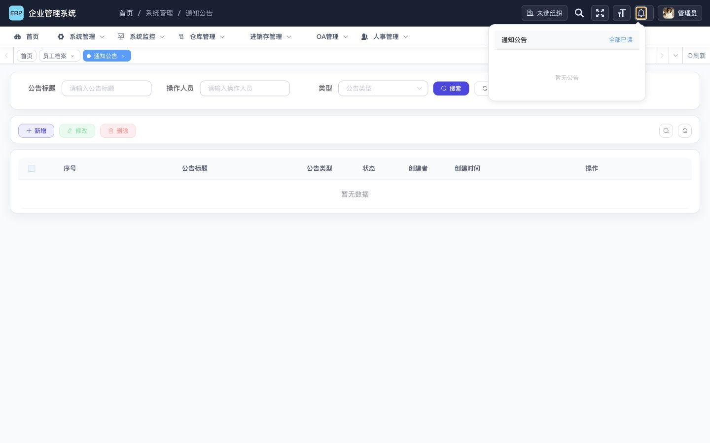
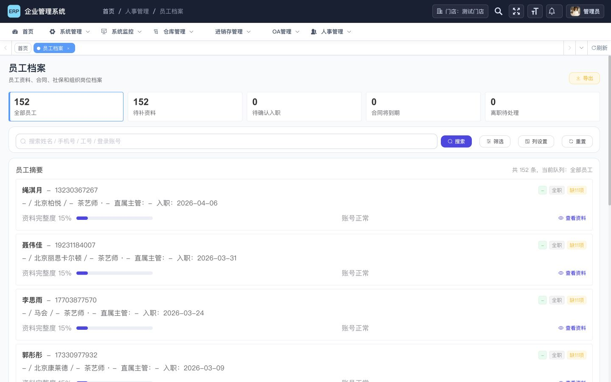

# R1 电脑端真实运行验收

## 结论

R1 可以进入测试环境回归。本次在完整本地服务环境中完成了真实浏览器验收，登录、组织选择、首页、员工档案搜索与服务端分页、全局菜单搜索、公告页和组织上下文保持均可完成。

运行验收新发现的三个入口体验问题已在同一分支修复：

1. 算式验证码改为明确提示“请输入图中算式结果”，并支持键盘刷新、图片替代文本和刷新后清空旧答案。
2. 菜单搜索结果默认选中首项，单结果或多结果均可在输入后直接按 Enter 进入。
3. 顶部搜索和通知入口改为语义化按钮；通知按钮会报告展开状态和未读数，键盘激活后焦点进入浮层，浮层操作支持 Tab/Enter，Escape 可关闭并恢复焦点。

没有发现新的业务阻断。后续收尾已补齐干净克隆缺少的文件服务本地默认配置和 Capacitor 原生源码脚手架；全量前端测试现为 86/86 通过。

## 环境

- 日期：2026-07-10
- 前端：`http://localhost:1025/`
- 网关：`http://localhost:8080/`
- 视口：1440×900
- 测试账号：本地管理员账号
- 业务组织：测试门店
- 分支：`codex/desktop-audit-remediation-r1`
- 浏览器：Codex 电脑端内置浏览器

## 流程健康度

| 编号 | 流程 | 状态 | 关键结果 | 证据 |
| --- | --- | --- | --- | --- |
| 1 | 登录与算式验证码 | 通过 | 输入提示、校验提示、刷新按钮和图片说明一致；Enter 刷新后旧答案为空；正确算式结果可登录 | `21-login-math-captcha.png` |
| 2 | 组织选择 | 通过 | 可搜索和选择“测试门店”，页面说明了门店/仓库与汇总组织的差异 | `09-organization-selected.png` |
| 3 | 首页进入 | 通过 | 首页显示当前组织与常用入口，无流程阻断 | `10-home-entry.png` |
| 4 | 员工档案首屏 | 通过 | 总数 152，待补资料 152，列表、统计和分页一致 | `12-hr-employee.png` |
| 5 | 员工搜索 | 通过 | 搜索“绳淇月”返回 1 条，统计同步为 1，清空后恢复 152 | `15-hr-search-stable.png` |
| 6 | 员工服务端分页 | 通过 | 第 2 页首条为“绳淇月”，总数仍为 152 | `24-context-hr-page-2.png` |
| 7 | 全局搜索直接回车 | 通过 | 输入“通知公告”得到 1 个结果，无需先按方向键，直接 Enter 进入 `/system/notice` | `22-search-direct-enter.png` |
| 8 | 公告空状态 | 通过 | 无公告时表格和顶部通知浮层都显示明确空状态 | `18-notice-page-accepted.png` |
| 9 | 顶部键盘入口 | 通过 | 可访问性树暴露“搜索菜单”和“通知公告”按钮；通知按钮按 Enter 后状态为 expanded/active | `23-header-keyboard-entry.png` |
| 10 | 组织上下文保持 | 通过 | 重新登录、选择门店、进入员工档案第 2 页后仍显示“门店：测试门店” | `24-context-hr-page-2.png` |

## 关键证据

### 算式验证码说明


### 顶部通知键盘入口



### 组织上下文与员工第 2 页



## 已修复问题

### P0/P1：安全与数据准确性

- 公告富文本在后端保存和前端渲染边界进行白名单净化，阻断原始公告内容直接进入 `v-html`。
- Excel 导入结果按纯文本/结构化数据展示，关闭危险 HTML 字符串渲染。
- 菜单搜索高亮改为文本片段渲染，菜单标题与路径不再进入 `v-html`。
- HR 列表、统计、筛选和分页统一使用服务端结果，消除“当前页为空但 total 仍为 152”的错误状态。
- 电脑端组织上下文使用集中路由策略，正常用户流程可选择正确组织并返回目标页面。

### P2：入口体验与无障碍

- 算式验证码不再只写“验证码”，降低误填表达式或图片数字的概率。
- 验证码刷新控件具备按钮语义、可访问名称、Enter/Space 操作和图片替代文本。
- 菜单搜索刷新结果后默认选择首项，Enter 不再静默无响应。
- 搜索入口使用原生按钮并提供“搜索菜单”名称。
- 通知入口使用原生按钮，提供动态名称、展开状态和键盘打开能力；浮层动作使用原生按钮并补齐焦点保持与 Escape 返回。

### 工程门禁

- 文件服务新增可提交的 `application-local.yml`，只包含本地网关地址和环境变量占位，不保存 MinIO 密钥。
- Android/iOS Capacitor 原生源码脚手架进入版本控制，干净克隆可继续执行 `npx cap sync`。
- Android/iOS 同步生成的 Web `public`、Gradle build、Pods 和本机配置继续由原生 `.gitignore` 排除，不把构建产物混入仓库。
- Android 打包继续忽略 Vue 生产构建的 `.gz` 文件，避免重复资源错误。

## 未纳入 R1 的遗留风险

### 高优先级

1. **浏览器会话安全**：令牌仍需按既有 R4 方案迁移到 HttpOnly Cookie，并同步落地 CSRF 防护、CSP 与安全响应头。该项涉及认证兼容和网关回滚开关，不应混入本轮入口体验提交。
2. **依赖生命周期**：生产依赖审计仍报告 4 个 Vue 2 相关低风险项，当前依赖树没有无破坏性直接修复版本。需要在 Vue 3 升级项目中关闭，而不是强制升级单个传递依赖。

### 中优先级

1. **入职闭环**：待入职档案新增、资料补全、确认/取消入职和账号绑定仍按 R3 设计实施。
2. **公共弹窗与桌面适配**：焦点栈、错误字段关联、响应式尺寸和采购高频弹窗仍按 R2 分批迁移。
3. **全站无障碍**：本轮只修复真实验收直接触达的登录、搜索和通知入口；其他历史页面仍需按高频流程检查表单标签、焦点顺序和浮层内部操作。

## 自动化验证

### 聚焦回归

命令：

```bash
cd erp-ui
npm test -- desktopRuntimeEntryUx.test.js desktopSecurityBoundary.test.js mobileAuthEntryPages.test.js desktopAuditRemediation.test.js hrPaginationUx.test.js shopContextUx.test.js
```

结果：6 个测试文件运行，0 失败。

### 前端全量测试

命令：

```bash
cd erp-ui
npm test
```

结果：86 个测试文件运行，0 失败。原先依赖工作区外本地文件的两个门禁已改为干净克隆可复现的仓库契约：安全的本地默认配置进入版本控制，原生源码脚手架进入版本控制，同步生成的 Web 与构建产物保持忽略。

### Capacitor 同步

命令：

```bash
cd erp-ui
npx cap sync
```

结果：Android、iOS 和 Web 同步成功；生成内容落在各平台已忽略目录中，源码脚手架保持可追踪。

### 原生工程解析

命令：

```bash
cd erp-ui/android
JAVA_HOME=/opt/homebrew/opt/openjdk@21/libexec/openjdk.jdk/Contents/Home \
  ./gradlew testDebugUnitTest compileDebugAndroidTestSources --quiet

cd ../ios/App
xcodebuild -list -project App.xcodeproj
```

结果：Android 本地单元测试和仪器测试源码在 JDK 21 下编译通过，应用包名契约为 `com.erp.mobile`；Xcode 成功解析 App 工程、锁定为 Capacitor 8.4.1 的 Swift Package、目标和 Scheme。Capacitor 8 原生编译要求 Java 21，系统默认 JDK 17 只能加载 Gradle 任务，不能完成 Java 编译。

### 生产构建

命令：

```bash
cd erp-ui
npm run build:prod
```

结果：构建成功，退出码 0。Webpack 保留 2 类既有体积警告：部分静态资源超过 244 KiB，以及入口包合计约 1.72 MiB；无编译错误。

## 发布与观察建议

1. 先在测试环境回放登录、组织选择、员工档案、菜单搜索和通知浮层。
2. 发布后观察验证码失败率、菜单搜索导航成功率、员工分页接口错误率和前端异常日志。
3. R1 提交按安全边界、组织策略、HR 分页和入口体验拆分，可按提交独立回滚。
4. 不要在 R1 发布窗口同时合入 HttpOnly Cookie、入职数据模型或全量弹窗改造。
