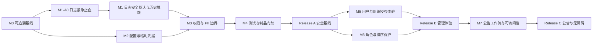

# ERP 系统管理安全、权限与易用性整改详细方案

> 日期：2026-07-14
> 依据：`docs/system-management-audit-20260714.md` 及本项目源码、数据库菜单、测试与发布脚本复核
> 状态：实施记录版 v3；M0–M7 源码实施与本机验证完成，生产发布、目标库迁移与功能开关启用未执行
> 约束：全过程不使用虚拟机、Docker、Testcontainers 或其他虚拟化环境；`docker/` 目录仅作为项目既有发布物目录使用

本次复审针对原方案做了八项关键纠偏：Release A 拆成扩展/代码/收口三段；强制改密改用独立拦截器而不污染 `HeaderInterceptor`；补齐旧账号共享密码识别与轮换；权限迁移取消按旧权限自动扩权；用户安全详情与 PII 详情改成两个固定接口；原生发布门禁与既有 new-business/Docker 门禁隔离；排序保存增加服务端并发校验；公告关闭开关时不再回退到会误发布的旧编辑语义。

### 实施结果摘要（2026-07-14）

- M0–M7 已按本方案落地，Release A/B/C 均使用显式文件清单、版本化 SQL、SHA-256 和本机验证脚本。
- Release C 新增公告 DRAFT/SCHEDULED/PUBLISHED/OFFLINE 生命周期、受众预览、不可变接收人快照、版本化、定时发布、过期下线与独立发布权限。
- 本机 MySQL 8.0.45 迁移双跑、安全回滚和新数据回滚阻断已通过；后端公告专项 32/32、前端系统管理回归 8/8、生产构建和本机 Chrome 全流程已通过。
- 全过程没有使用虚拟机、容器或 Testcontainers；没有连接或修改生产数据库。
- 发布清单仍为 `development`，公告开关默认 `false`，新的 `system:notice:publish` 不自动授予角色。第 15 节复选框是目标环境上线门禁，须在真实发布窗口另行验收，本次不提前勾选。

## 1. 结论与最终目标

当前系统管理核心功能可用，但不能直接作为生产候选。整改按三批发布；Release A 内含一个可提前上线的 A0 止血包：

1. **安全基线发布（Release A）**：A0 先阻断日志新增泄露及日志正文列表/导出；随后废弃固定初始密码，收紧配置读取，修正权限漂移，默认屏蔽个人敏感信息，建立可信制品和测试门禁。
2. **管理体验发布（Release B）**：优化用户、组织授权、角色、部门和菜单的高频操作；增加未保存保护和完整性提示。
3. **公告与可访问性发布（Release C）**：增加公告草稿、受众、定时发布、有效期和版本；完成键盘、焦点和控件可读名称整改。

完成后应达到以下结果：

- 仅拥有操作日志列表权限的人员无法取得请求、响应、签名、薪资、合同或私有路径正文。
- 新建、导入和重置账号不再依赖 `sys.user.initPassword`；每个账号使用不同的短期临时凭据，首次登录只能先改密；已确认仍使用旧共享初始密码的账号也完成分批轮换。
- 参数列表、详情、导出和按键读取遵循最小权限，内置参数不能通过改类型绕过删除保护。
- 数据库菜单权限、前端按钮、后端注解之间不存在未解释的双向差集。
- 用户列表不再通过接口返回完整档案、证件号、银行卡、住址等高敏字段；完整查看、修改、导出分别授权和审计。
- 发布目录中的 JAR、前端资源、SQL 与指定提交 SHA 完全一致，旧 JAR 不能混入发布包。
- 系统管理员在 1018×768 及更大桌面视口下，可以不反复横向滚动完成用户查找、授权、角色配置和排序。
- 公告不会因为保存为“正常”就立即广播给所有人；发布动作、接收人、发布时间和版本可追溯。

## 2. 当前项目基线

| 项目 | 当前值 / 事实 | 对方案的影响 |
| --- | --- | --- |
| 分支 / HEAD | `7月13号` / `b694659d` | 所有发布物必须记录最终实施提交，不能继续使用当前旧制品 |
| 工作区状态 | 2026-07-14 复核时 `git status --short` 共 804 项 | 实施前必须形成显式文件清单；禁止 `git add .` 和从脏 `target` 构建 |
| 操作日志 | 352 条；已发现签名、薪资/合同字段和私有路径 | Release A 阻断项 |
| 配置接口 | ID、键名详情仅要求登录；列表返回明文值 | Release A 阻断项 |
| 初始密码 | UI 读取 `sys.user.initPassword` 并预填；导入也使用该值 | Release A 阻断项 |
| 用户凭据状态 | 只有 `pwd_update_date`，没有临时凭据状态和到期时间 | 需要向 `sys_user` 增加兼容字段 |
| 权限漂移 | 5 个数据库权限无有效映射；重置密码错误复用 `system:user:edit` | 需要代码和幂等 SQL 同版发布 |
| PII | `SysUser` 列表/导出模型包含手机号、证件、地址、银行卡等 | 不能只做前端字符掩码，必须拆 API/导出模型 |
| 系统 JAR | 发布目录中的 system JAR 比当前 target JAR 少 8 个类 | 需要校验和及关键类门禁 |
| 测试 | 前端 180/183；后端专项 79/79；后端全量被重复产物扫描卡住 | Release A 前必须恢复全量可信门禁 |
| 构建污染 | 全项目 2375 个冲突副本；system target 有 616 个重复 `.class` | 只能从原生文件系统的干净检出构建 |
| 公告 | `status=0` 即全员可见；已有 HTML 净化和已读表 | 保留净化与已读能力，扩展发布模型 |

本方案不把当前配置库自动视为生产库，也不在计划阶段执行任何生产写操作。

## 3. 范围、非目标与实施原则

### 3.1 本次范围

- 系统管理：用户、角色、部门、菜单、组织授权、参数、操作日志、登录日志、公告。
- 公共能力：操作日志切面、认证凭据状态、权限一致性检查、制品版本与测试门禁。
- 与高敏日志直接相关的 OA 签约、劳动合同、薪资及 HR 生命周期 Controller 注解。
- 配套 SQL、回滚 SQL、验证脚本、自动化测试和发布清单。

### 3.2 非目标

- 不重写整套 RBAC、网关或前端框架。
- 不在本轮引入外部短信/邮件供应商；先使用一次性临时凭据。后续具备可靠消息渠道时可升级为邀请链接。
- 不把公告并入统一业务待办，也不在第一版公告工作流中重复写入 `sys_user_notification`，避免两个未读数口径冲突。
- 不宣称一次整改即可完整符合 WCAG；本轮只对证据中发现的系统管理路径做可验证改进。
- 不顺带修复与系统管理无关的业务需求；当前 804 项工作区变更必须按文件/补丁隔离。

### 3.3 不可妥协的原则

1. P0 安全能力不设置可关闭开关，也不回退到旧的不安全实现；故障采用向前修复。
2. 历史敏感日志清理与普通结构迁移分开，先受控留档、再脱敏；普通回滚脚本不得恢复敏感正文。
3. 前端隐藏按钮不能代替后端权限；每个敏感动作都要有后端注解、数据范围检查和审计。
4. 列表、详情、导出使用不同 DTO/VO，禁止继续让数据库实体同时承担所有接口和 Excel 输出。
5. 所有迁移幂等、带验收查询；先扩展后收口，禁止在旧代码仍运行时删除其依赖配置。敏感历史日志不复制进普通数据库备份表。
6. 凭据不写入日志、数据库明文字段、Redis 或服务端临时文件。唯一例外是具备授权的创建/重置/导入成功响应可通过 HTTPS 返回一次临时凭据；该例外必须 `no-store`、不可重查、短期过期并有专项测试。
7. 权限迁移默认只保留数据库已表达的角色映射；任何新增授权都必须来自逐角色审批，不允许用旧 edit/list 权限批量推导高风险权限。
8. 构建、测试和浏览器回归全部使用本机原生进程及独立测试库，不使用虚拟机或容器，也不调用现有依赖 Docker 的 `verify-new-business-release.sh --full`。

## 4. 总体依赖与发布拆分



| 里程碑 | 预计工作量 | 主要负责人 | 依赖 | 发布归属 |
| --- | ---: | --- | --- | --- |
| M0 可追溯基线 | 0.5–1 人日 | 技术负责人 / 发布 | 无 | A |
| M1 操作日志止血与历史脱敏 | 4–5 人日 | 后端 / DBA / QA | M0 | A |
| M2 配置与临时凭据 | 6–8 人日 | 后端 / 前端 / QA | M0 | A |
| M3 权限与 PII 边界 | 5–7 人日 | 后端 / 前端 / DBA | M1、M2 | A |
| M4 测试与制品门禁 | 3–4 人日 | QA / 发布 / 全栈 | M1–M3 | A |
| M5 用户与组织授权体验 | 4–6 人日 | 前端 / 后端 | Release A | B |
| M6 角色与排序保护 | 3–4 人日 | 前端 / 后端 | Release A | B |
| M7 公告工作流与可访问性 | 6–8 人日 | 前端 / 后端 / QA | Release B | C |

总量约 **32–43 人日**。按 2 名后端、1 名前端、1 名 QA、发布/DBA 兼职估算，日历周期约 5–6 周；若只有 1 名全栈开发，按 8–10 周安排更合理。A0 日志止血不等待其余工作，可在 1–2 个工作日内单独完成和验证。

## 5. M0：形成可追溯、可审查的实施基线

### 5.1 目标

从当前 804 项状态变更中，只提取系统管理整改相关内容，保证后续测试结果与发布物可对应。

### 5.2 实施任务

1. 重新保存以下只读快照：分支、完整 HEAD、`git status --short`、当前测试结果、当前 system JAR 与 target JAR 的 SHA-256 和类清单。表中“804 项”只是 2026-07-14 检查证据，实施时不得把它当固定值。
2. 建立 Release A 的显式文件清单，按“日志、凭据/配置、权限/PII、SQL、测试、发布脚本”分类；同一文件中的无关 hunk 不进入整改提交。
3. 在非同步盘、非备份目录的原生文件系统中，从最终实施提交做干净检出并构建。当前目录继续用于开发和审查，不直接作为发布构建输入。
4. 新建以下交付物（实施时创建）：
   - `scripts/system-management-release-20260714.json`
   - `scripts/system-management-migrations-20260714.list`
   - `scripts/verify-system-management-release.sh`
   - `scripts/verify-build-tree-clean.sh`
5. `system-management-release-20260714.json` 是独立发布清单，声明对既有 `new-business-20260714` 的前置依赖；系统管理 SQL 不得追加进 new-business 清单。2026-07-16 经审批一致性与发布闭包整改，new-business 清单扩展为 18 项：补齐健康证、库存和 OA 的兼容扩展、审批 schema/seed，以及 4 个审批启动 outbox；自动迁移保持开关默认关闭，破坏性 purge/cutover 仅保留手工路径。这不改变系统管理发布继续独立的边界。
6. 发布清单至少记录：提交 SHA、构建时间、JDK/Node/Maven/浏览器版本、前置 releaseId、SQL 顺序与校验和、各 JAR/前端 dist 校验和、关键类和关键接口列表。

### 5.3 验收

```bash
git status --short
git diff --check -- <Release-A-显式文件清单>
git diff --name-only -- <Release-A-显式文件清单>
git ls-files --others --exclude-standard -- <Release-A-显式文件清单>
bash scripts/verify-build-tree-clean.sh
```

完成门：审查人能够把每一个文件映射到本方案的一个工作包；发布构建目录中不存在 `* 2.class`、`* 3.jar`、AppleDouble 或同步冲突副本。

## 6. M1：操作日志止血、最小化与历史数据脱敏

### 6.1 目标接口模型

- 列表只返回检索和定位所需摘要：日志 ID、模块、类型、请求方式、操作者、IP、状态、时间、耗时。
- 详情必须有 `system:operlog:query`，只返回经过同一策略脱敏的业务摘要和错误摘要。
- 默认导出不包含 `operParam`、`jsonResult`、完整异常栈或私有文件路径。
- `@Log` 默认记录元数据，不默认序列化请求/响应；需要业务主键时只能显式声明允许字段。

### 6.2 现有文件修改

- `erp-common/erp-common-log/src/main/java/com/erp/common/log/annotation/Log.java`
- `erp-common/erp-common-log/src/main/java/com/erp/common/log/aspect/LogAspect.java`
- `erp-common/erp-common-log/src/main/java/com/erp/common/log/service/AsyncLogService.java`
- `erp-api/erp-api-system/src/main/java/com/erp/system/api/domain/SysOperLog.java`
- `erp-modules/erp-system/src/main/java/com/erp/system/controller/SysOperlogController.java`
- `erp-modules/erp-system/src/main/java/com/erp/system/service/ISysOperLogService.java`
- `erp-modules/erp-system/src/main/java/com/erp/system/service/impl/SysOperLogServiceImpl.java`
- `erp-modules/erp-system/src/main/java/com/erp/system/mapper/SysOperLogMapper.java`
- `erp-modules/erp-system/src/main/resources/mapper/system/SysOperLogMapper.xml`
- `erp-ui/src/api/system/operlog.js`
- `erp-ui/src/views/system/operlog/index.vue`
- `erp-ui/src/views/system/operlog/detail.vue`

需要逐一检查并关闭原始请求/响应保存的敏感入口至少包括：

- `erp-modules/erp-oa/src/main/java/com/erp/oa/controller/OaSignPackageController.java`
- `erp-modules/erp-oa/src/main/java/com/erp/oa/controller/OaLaborContractController.java`
- `erp-modules/erp-system/src/main/java/com/erp/system/controller/SysSalaryConfigController.java`
- `erp-modules/erp-system/src/main/java/com/erp/system/controller/SysConfigController.java`
- `erp-modules/erp-system/src/main/java/com/erp/system/controller/SysNoticeController.java`
- `erp-modules/erp-system/src/main/java/com/erp/system/controller/SysUserController.java`
- `erp-modules/erp-system/src/main/java/com/erp/system/controller/SysProfileController.java`
- 所有包含签名、工资、银行卡、证件、合同、令牌、临时密码或文件私有路径 DTO 的 `@Log` Controller。

项目已有 `HrOnboardingController`、`HrHealthCertificateController`、`HrOnboardingImportController`、`HrEmployeeProfileController` 使用 `isSaveRequestData=false/isSaveResponseData=false` 的安全模式，紧急止血先复用该做法。

### 6.3 新建类与职责（实施时创建）

- `erp-common/erp-common-log/src/main/java/com/erp/common/log/support/AuditPayloadSanitizer.java`：仅保留注解显式允许字段；递归拒绝 Base64、令牌、密码、银行卡、证件、签名和私有路径模式。
- `erp-modules/erp-system/src/main/java/com/erp/system/domain/vo/SysOperLogListVo.java`：列表摘要。
- `erp-modules/erp-system/src/main/java/com/erp/system/domain/vo/SysOperLogDetailVo.java`：脱敏详情。
- `erp-modules/erp-system/src/main/java/com/erp/system/domain/vo/SysOperLogExportVo.java`：无正文导出模型。

### 6.4 实施步骤

1. **A0 新增泄露止血**：先给敏感 Controller 的新增、编辑、签署、确认、重置、导入、导出方法设置 `isSaveRequestData=false, isSaveResponseData=false`；此补丁可独立提前发布。
2. **A0 历史正文阻断**：同一补丁把列表 SQL 改为摘要列、把默认导出改为 `SysOperLogExportVo`，并暂时关闭旧的“列表行直接打开正文详情”。A0 上线后即使历史库尚未清理，普通列表与导出也取不到正文。
3. 使用源码扫描生成全部 `@Log` 端点清单，逐项标注 `metadata-only`、允许业务主键或禁止 payload；未分类项使测试失败。完成清单后才把 `@Log` 默认改为不保存原始 request/response，避免一次性失去必要审计定位字段。
4. 增加 `includeParamNames` 一类的显式允许字段；旧布尔字段只保留一个兼容周期并标记弃用。显式允许值仍必须通过 `AuditPayloadSanitizer`，不能绕过中央策略。
5. `LogAspect` 对响应不做任意对象序列化；异常只记录异常类别、稳定错误码和脱敏后的业务消息，不记录 SQL、堆栈、敏感入参或私有路径。
6. 详情按 ID 单独读取并再次经过 `AuditPayloadSanitizer`。新增 `GET /operlog/{operId}`，要求 `system:operlog:query`；前端点击“详细”时调用该接口，不再把列表行直接传给详情组件。
7. 为日志清理本身生成独立、安全摘要日志，记录工单号、命中行数、执行人和校验和，不记录被清理正文。

### 6.5 历史日志处理

新建并单独审批：

- `sql/erp_system_oper_log_redaction_20260714.sql`
- `scripts/verify-system-oper-log-redaction.sh`
- `scripts/classify-system-oper-log.py`

顺序：

1. 由分类脚本按 JSON 键名、路径模式、高熵长串和 Data URL 特征统计命中数与 ID 范围，不输出值；SQL `REGEXP` 只作快速烟测，不能作为唯一证据。
2. 由 DBA 将命中行导出为加密离线证据包，记录文件 SHA-256、保管人、保留期限和销毁日期；不得把备份放进代码库或普通数据库备份表长期保存。
3. SQL 将命中行的 `oper_param/json_result/error_msg` 改为固定脱敏摘要，并记录清理批次 ID。
4. 执行后再次扫描签名 Base64、工资字段、银行卡、证件、令牌、私有路径模式，敏感分类命中必须为 0；允许的短业务摘要须满足字段白名单和长度上限。
5. 普通回滚脚本不恢复敏感正文；确需取证时只能通过受控离线证据包恢复到隔离环境。

### 6.6 测试与完成门

实施时新增：

- `erp-common/erp-common-log/src/test/java/com/erp/common/log/aspect/LogAspectTest.java`
- `erp-common/erp-common-log/src/test/java/com/erp/common/log/support/AuditPayloadSanitizerTest.java`
- `erp-modules/erp-system/src/test/java/com/erp/system/controller/SysOperlogControllerTest.java`
- `erp-modules/erp-system/src/test/java/com/erp/system/mapper/SysOperLogMapperSourceTest.java`

必测场景：

- 请求对象含嵌套 `signatureDataUrl`、`password`、`bankAccount`、`idNumber`、`token` 时不落库。
- Base64 字段名被伪装但值特征命中时仍被拒绝。
- 仅 `system:operlog:list` 可列出摘要但详情 403；拥有 query 可看脱敏详情。
- 导出文件列定义中不存在请求、响应和异常全文。
- 敏感端点成功和失败两条路径都只写元数据。
- 全部 `@Log` 端点都存在策略清单条目；新增未分类端点会使 CI 失败。

完成门：新日志与历史日志敏感分类命中均为 0；列表响应体不含 `operParam/jsonResult/errorMsg`；导出列不含正文；前端静态测试中原有“详情不使用 query 权限”的反向断言被改为正确行为断言。

## 7. M2：配置读取边界与一次性临时凭据

### 7.1 凭据状态模型

在 `sys_user` 增加兼容列：

| 列 | 类型 | 语义 |
| --- | --- | --- |
| `credential_state` | `varchar(24) NOT NULL DEFAULT 'ACTIVE'` | `ACTIVE`、`TEMPORARY` 或 `CHANGE_REQUIRED` |
| `temporary_password_expires_at` | `datetime NULL` | 仅 TEMPORARY 必填；ACTIVE/CHANGE_REQUIRED 必须为空 |

继续使用现有 BCrypt `password` 字段，不新增明文密码列。`pwd_update_date` 继续表示用户最后一次主动改密时间，但不再单独用它推断凭据状态。MySQL 5.7 对 CHECK 约束支持不可靠，状态枚举和上述不变量由服务层、迁移验收查询和单元测试共同保证。

旧账号不能简单全部标记 ACTIVE 后就删除旧配置，切换策略如下：

1. 扩展迁移只新增列，默认现有账号为 ACTIVE，避免部署窗口锁死全部用户。
2. 实施时新建 `scripts/audit-legacy-initial-password.sh` 和非 Web 的 `LegacyCredentialMigrationRunner`，读取一次受控的旧 `sys.user.initPassword`，在应用进程内逐个调用 BCrypt `matchesPassword`；输出仅包含账号 ID、组织、状态分类和数量，不输出配置值、哈希或用户名明文。runner 默认禁用，只有显式 maintenance profile、测试库/批准的目标库名和确认参数同时满足才运行。
3. 对确认仍匹配旧共享密码的账号，在重新开放网关前先全部停用；随后按组织、小批量生成唯一 TEMPORARY 凭据、设置 24 小时到期、使旧会话失效并启用已完成交接的账号，每批最多 50 人，复用一次性凭据交付组件。收口前仍未交接的账号也必须把旧共享哈希替换为不可复用的唯一随机临时哈希、保持停用并设为已过期，日后只能重新生成。超级管理员和应急账号单独提前改成强密码，确认至少一个可用的 break-glass 账号后才能继续。
4. `pwd_update_date IS NULL` 但不匹配旧共享密码的账号设为 CHANGE_REQUIRED：允许用现有密码登录，但进入同一受限改密流程，不设置临时到期时间。
5. 当“代码引用旧 key=0、匹配旧共享密码的有效账号=0、导入/新建/重置专项测试通过”三项同时满足后，才执行收口迁移删除 `sys.user.initPassword`。

### 7.2 目标流程

1. 新增用户时，前端不提交密码；后端用 `SecureRandom` 和无歧义字符表生成满足当前密码策略、熵不低于 80 bit 的随机临时密码；生成器做分布/策略测试，不使用时间戳、用户名或可预测序列。
2. 数据库只保存 BCrypt，设置 `credential_state=TEMPORARY`、24 小时到期、`pwd_update_date=NULL`。
3. 创建接口仅在具备 `system:user:add` 的成功响应中返回一次临时密码，并设置 `Cache-Control: no-store`；`@Log` 不保存请求或响应。这是本方案允许的唯一明文凭据响应之一，不代表可再次查询。
4. 管理员关闭一次性弹窗后不能再次查询；遗失时只能重新生成，旧临时密码立即失效。
5. TEMPORARY 密码过期时认证服务拒绝登录并提示联系管理员重新生成；未过期 TEMPORARY 和 CHANGE_REQUIRED 用户登录后只允许获取最小登录状态、修改密码和退出。
6. 用户改密成功后原子更新为 ACTIVE、清空到期时间、写 `pwd_update_date`，更新当前 token 的状态并使其他会话失效。
7. 管理员重置密码不再输入自定义密码，改为“生成新的临时密码”；后端使用独立 `system:user:resetPwd`。
8. 自助注册若以后开启，仍由用户设置自己的合规密码，创建为 ACTIVE 并写 `pwd_update_date`；不得误走管理员临时凭据流程。
9. `/user/getInfo` 顶层明确返回 `credentialState` 和 `temporaryPasswordExpiresAt`，不要求前端从完整 `SysUser` 推断。ACTIVE 用户继续沿用现有密码有效期提醒；TEMPORARY/CHANGE_REQUIRED 不再触发可取消的 `isDefaultModifyPwd` 弹窗，而是直接进入强制流程。

### 7.3 现有文件修改

- `erp-api/erp-api-system/src/main/java/com/erp/system/api/domain/SysUser.java`
- `erp-api/erp-api-system/src/main/java/com/erp/system/api/model/LoginUser.java`
- `erp-common/erp-common-core/src/main/java/com/erp/common/core/constant/CacheConstants.java`
- `erp-common/erp-common-redis/src/main/java/com/erp/common/redis/service/RedisService.java`
- `erp-common/erp-common-security/src/main/java/com/erp/common/security/config/WebMvcConfig.java`
- `erp-common/erp-common-security/src/main/java/com/erp/common/security/handler/GlobalExceptionHandler.java`
- `erp-common/erp-common-security/src/main/java/com/erp/common/security/service/TokenService.java`
- `erp-modules/erp-system/src/main/java/com/erp/system/controller/SysUserController.java`
- `erp-modules/erp-system/src/main/java/com/erp/system/controller/SysProfileController.java`
- `erp-modules/erp-system/src/main/java/com/erp/system/service/ISysUserService.java`
- `erp-modules/erp-system/src/main/java/com/erp/system/service/impl/SysUserServiceImpl.java`
- `erp-modules/erp-system/src/main/java/com/erp/system/mapper/SysUserMapper.java`
- `erp-modules/erp-system/src/main/resources/mapper/system/SysUserMapper.xml`
- `erp-auth/src/main/java/com/erp/auth/service/SysLoginService.java`
- `erp-ui/src/components/ExcelImportDialog/index.vue`
- `erp-ui/src/utils/importResult.js`
- `erp-ui/src/utils/request.js`
- `erp-ui/src/api/system/user.js`
- `erp-ui/src/views/system/user/index.vue`
- `erp-ui/src/store/modules/user.js`
- `erp-ui/src/utils/passwordResetReminder.js`
- `erp-ui/src/router/index.js`

实施时新建：

- `erp-modules/erp-system/src/main/java/com/erp/system/service/support/TemporaryPasswordGenerator.java`
- `erp-modules/erp-system/src/main/java/com/erp/system/service/support/LegacyCredentialMigrationRunner.java`
- `erp-modules/erp-system/src/main/java/com/erp/system/service/support/LegacyCredentialRotationService.java`
- `erp-modules/erp-system/src/main/java/com/erp/system/service/support/UserSessionInvalidationService.java`
- `erp-modules/erp-system/src/main/java/com/erp/system/domain/vo/SysTemporaryCredentialVo.java`
- `erp-modules/erp-system/src/main/java/com/erp/system/domain/vo/SysUserCreateResultVo.java`
- `erp-modules/erp-system/src/main/java/com/erp/system/domain/vo/SysUserImportResultVo.java`
- `erp-modules/erp-system/src/main/java/com/erp/system/domain/vo/LegacyCredentialRotationPreviewVo.java`
- `erp-common/erp-common-security/src/main/java/com/erp/common/security/annotation/AllowsTemporaryCredential.java`
- `erp-common/erp-common-security/src/main/java/com/erp/common/security/exception/CredentialRestrictionException.java`
- `erp-common/erp-common-security/src/main/java/com/erp/common/security/interceptor/CredentialStateInterceptor.java`
- `erp-ui/src/views/credential/change-password.vue`

### 7.4 强制改密边界

- 保持现有 `HeaderInterceptor` 只负责装载安全上下文；新增 `CredentialStateInterceptor`，在 `WebMvcConfig` 中以 `-9` 顺序注册，保证它在 `HeaderInterceptor(-10)` 之后执行。这样不会把凭据业务规则混入底层请求头解析。
- TEMPORARY/CHANGE_REQUIRED 用户访问普通业务 Handler 时抛出 `CredentialRestrictionException`。项目当前以 HTTP 200 承载 `AjaxResult.code`，因此不虚构未被现有异常链支持的 428；统一返回 `code=409` 和 `businessCode=CREDENTIAL_CHANGE_REQUIRED`，TEMPORARY 过期在登录阶段返回 `TEMPORARY_CREDENTIAL_EXPIRED`。
- `GlobalExceptionHandler` 为该异常增加专用 handler，只记录用户 ID、目标路由和状态的限频安全摘要，不按现有通用 `ServiceException` 路径打印整段堆栈，避免正常强制改密流量污染错误日志。
- 只有标记 `@AllowsTemporaryCredential` 的 `/user/getInfo`、`/user/profile/updatePwd` Handler 可访问；`/auth/logout` 已在现有拦截器排除路径中，继续允许退出。允许清单采用注解和精确测试，不做宽泛 URL 前缀放行。
- 前端发现 `credentialState=TEMPORARY` 后直接进入 `/credential/change-password`，不再先选门店，也不能选择“稍后”。
- 前端对 CHANGE_REQUIRED 使用同一页面；`request.js` 在通用错误提示前识别 `businessCode`，只触发一次重定向，避免每个并发请求重复弹错。
- 后端是最终门禁，直接调用其他业务接口同样被拒绝。
- `TokenService` 为每个用户维护 `user_login_tokens:{userId}` token 索引，索引 TTL 不短于 token TTL；创建、刷新、退出都维护索引。重置密码、停用账号或安全授权变化后按索引删除会话，禁止在在线请求中调用 Redis `KEYS login_tokens:*`。
- 首次部署时旧 token 尚无用户索引。Release A 在网关维护窗口阻断新登录和业务请求、且全部使用 `erp-common-security` 的服务 JAR 更新后，通过基于 SCAN 的一次性脚本清理 `login_tokens:*` 与 `user_login_tokens:*`，要求全员重新登录；不得使用阻塞式 KEYS。清理和校验完成后才开放网关，随后只依赖用户索引失效会话。
- 因公共拦截器会进入 system、OA、inventory、file、job、gen、approval 等服务，本功能必须重建并同窗发布所有引用 `erp-common-security` 的服务，不能只换 auth/system JAR。部署窗口暂停新建、导入、重置和授权操作，全部服务更新并清理旧会话后再恢复。

### 7.5 批量导入兼容

现有 `importUser` 不能继续给全部新用户写同一个密码，改为：

1. 每个新增账号独立生成临时密码和到期时间。
2. 接口返回结构化 `SysUserImportResultVo`，不再把 HTML 成功/失败字符串塞进 `msg`；失败项、成功项和一次性凭据分字段返回，所有用户输入按文本渲染。
3. 临时凭据只存在于本次 HTTPS 响应和浏览器当前内存；禁止写服务器文件、Redis、操作日志或数据库明文字段。`ExcelImportDialog` 只在本次结果弹窗中生成客户端 CSV/Blob，按 CSV 规则转义并中和以 `=,+,-,@` 开头的单元格，下载后立即 `URL.revokeObjectURL`，关闭弹窗时覆盖内存数组。
4. 弹窗明确说明：下载文件仍是敏感文件、24 小时失效、应通过受控渠道交付并及时删除。鉴于本轮不引入短信/邮件，本方案默认采用一次性清单并把它登记为剩余风险；若上线安全策略禁止任何临时凭据文件，则 Release A 必须在实施前改为“导入账号先停用、逐人重置后启用”，不能到发布当天临时切换未测试流程。
5. 未下载或遗失时只能按用户重新生成；更新已有用户时绝不修改密码。模板下载接口从 `@RequiresLogin` 收紧为 `system:user:import`。
6. 旧账号轮换先由 maintenance runner 生成候选 ID 清单，再由 `POST /user/credential-rotation/preview` 和 `POST /user/credential-rotation/execute` 处理；两个入口只允许超级管理员且同时要求 `system:user:resetPwd`。执行请求必须回传预览批次 ID 和候选摘要，过期或名单变化即拒绝。批量执行只返回一次凭据，不向普通用户管理员暴露旧密码匹配状态；旧配置删除后入口返回明确的“迁移已关闭”业务码。

### 7.6 配置接口整改

修改：

- `erp-modules/erp-system/src/main/java/com/erp/system/controller/SysConfigController.java`
- `erp-modules/erp-system/src/main/java/com/erp/system/service/ISysConfigService.java`
- `erp-modules/erp-system/src/main/java/com/erp/system/service/impl/SysConfigServiceImpl.java`
- `erp-modules/erp-system/src/main/resources/mapper/system/SysConfigMapper.xml`
- `erp-ui/src/api/system/config.js`
- `erp-ui/src/views/system/config/index.vue`

实施时新建：

- `erp-modules/erp-system/src/main/java/com/erp/system/service/support/SysConfigSensitivityPolicy.java`
- `erp-modules/erp-system/src/main/java/com/erp/system/domain/vo/SysConfigListVo.java`
- `erp-modules/erp-system/src/main/java/com/erp/system/domain/vo/SysConfigDetailVo.java`
- `erp-modules/erp-system/src/main/java/com/erp/system/domain/vo/SysConfigExportVo.java`

规则：

1. `GET /config/{configId}` 改为 `system:config:query`。
2. 当前前端只有用户页调用通用 `configKey`，移除该调用后，将 `GET /config/configKey/{configKey}` 收紧为 `system:config:query` 并标记弃用；内部服务继续使用已有 `/inner/configKey/{configKey}` + `@InnerAuth`。
3. 未来若确需公开主题类配置，新增固定白名单 DTO，不恢复任意 key 读取。
4. `SysConfigSensitivityPolicy` 使用“显式敏感 key 清单 + 命名模式”双层规则；规则清单纳入测试和审查。敏感 key（password、secret、token、credential、private-key、access-key、`sys.user.initPassword` 等）在列表、详情和导出中只返回 `******`、`sensitive=true`、`valueConfigured=true`，不回显原值。
5. 已弃用的外部 `configKey` 接口即使调用者有 query 权限，也拒绝读取敏感 key 的原值；只有 `@InnerAuth` 内部接口可向受信服务提供运行配置。`sys_config` 不作为新的密钥保管库使用。
6. 编辑敏感值时空值表示保持原值；替换必须显式提交“更新敏感值”，不能把掩码写回数据库。
7. `configType=Y` 创建后不可改成 N；服务层比较数据库原值并拒绝变更。UI 对内置行禁用类型和删除，并说明原因。
8. 刷新缓存改用新增 `system:config:refresh`，不再复用 remove。
9. `sys.user.initPassword` 只在收口迁移中删除；数据库不再存在可直接用于登录的全局初始密码。
10. `sys.account.initPasswordModify` 在 credential state 完全接管首次改密后同步弃用；先移除代码引用，再由收口迁移删除，避免旧提醒和强制状态并存。`sys.account.passwordValidateDays` 继续只管理 ACTIVE 用户的常规密码周期。

### 7.7 SQL、测试与完成门

Release A 迁移拆分为：

- `sql/erp_system_management_expand_20260714.sql`：新增兼容列、新权限菜单和备份/审计表，不删除旧配置。
- `sql/erp_system_management_expand_rollback_20260714.sql`：只在尚无新状态数据时回退扩展结构。
- `sql/erp_system_management_permissions_20260714.sql`：只包含已审批角色映射、孤儿权限停用和新权限菜单状态；与安全代码同窗生效。
- `sql/erp_system_management_permissions_rollback_20260714.sql`：从扩展迁移的备份快照恢复必要角色映射；不重新启用两个无实现的孤儿菜单项，也不恢复不安全接口实现或日志正文暴露。
- `sql/erp_system_management_finalize_20260714.sql`：完成代码/账号轮换验收后删除旧初始密码相关配置；没有恢复不安全配置的普通回滚。

扩展迁移按权限字符串而非固定 menu_id 定位行，并备份相关 `sys_config`、`sys_menu`、`sys_role_menu` 映射。凭据列为向后兼容的新增列。回滚脚本不得重新开放通用配置读取或恢复 UI 的固定初始密码流程。

实施时新增/更新测试：

- `erp-auth/src/test/java/com/erp/auth/service/SysLoginServiceTest.java`
- `erp-common/erp-common-security/src/test/java/com/erp/common/security/interceptor/CredentialStateInterceptorTest.java`
- `erp-common/erp-common-security/src/test/java/com/erp/common/security/service/TokenServiceUserIndexTest.java`
- `erp-modules/erp-system/src/test/java/com/erp/system/controller/SysConfigControllerTest.java`
- `erp-modules/erp-system/src/test/java/com/erp/system/controller/SysPasswordPolicyControllerTest.java`
- `erp-modules/erp-system/src/test/java/com/erp/system/service/impl/SysUserServiceImplTest.java`
- `erp-modules/erp-system/src/test/java/com/erp/system/service/impl/SysConfigServiceSignHrPermissionTest.java`

完成门：

- 两次新建账号的临时密码不同，数据库与日志中均找不到明文。
- 到期密码无法登录；未到期临时用户调用普通业务 API 被后端拒绝。
- CHANGE_REQUIRED 用户可登录但不能进入业务；自助改密后状态变 ACTIVE、到期时间为空、其他会话失效。
- 普通已登录用户读取任意参数 ID/key 返回 403；敏感值在管理员列表、详情、导出也不回显。
- 导入新增用户不再引用 `sys.user.initPassword`。
- 旧共享初始密码审计结果为 0；所有引用公共安全模块的服务均使用同一提交构建；首次上线旧 token 清理证据已留存。

## 8. M3：权限闭环与个人敏感信息最小化

### 8.1 权限迁移决策

| 权限 | 当前问题 | 目标处理 |
| --- | --- | --- |
| `system:user:resetPwd` | DB 有、代码不用 | 接到后端重置接口和前端按钮 |
| `system:config:query` | DB 有、详情不用 | 接到配置详情和弃用期 key 查询 |
| `system:operlog:query` | DB 有、详情不用 | 接到新脱敏详情接口 |
| `system:logininfor:query` | 无详情业务 | 停用菜单功能项并移除角色授权 |
| `system:salary:import` | 当前无导入 UI/API | 停用菜单功能项并移除角色授权 |
| `system:config:refresh` | 当前错误复用 remove | 新增并接入缓存刷新 |
| `system:user:pii:read` | 当前列表/详情批量暴露 | 新增完整 PII 查看权限 |
| `system:user:pii:edit` | 当前 edit 可修改全部档案 | 新增完整 PII 修改权限 |
| `system:user:pii:export` | 当前 export 可导出全部档案 | 新增完整 PII 导出权限 |

迁移兼容策略：

- 在 Release A 维护窗口前生成并签署“角色 × 权限”的生效前/生效后差异报告。现有 `sys_role_menu` 已明确绑定 `resetPwd/config query/operlog query` 的映射原样保留并开始真正生效；不根据 user edit、config list/remove 或 operlog list 自动补授新能力。
- 任何确需新增的 resetPwd、query、refresh 或 publish 授权均列为待审批项，由业务负责人逐角色确认后进入单独 SQL；没有审批的角色宁可短期失去高风险动作，也不扩大权限。
- 新增 PII 权限默认不从旧权限继承；超级管理员若依赖 `*:*:*` 无需额外角色行，其他角色必须显式审批。
- 停用的两个孤儿权限先备份角色映射，再设置菜单功能项为停用；不直接复用其 menu_id 创建新权限。
- 所有 SQL 用 `perms` 查询真实 menu_id，并断言恰好命中预期活动行；禁止把检查时看到的 1006/1030/1039 等 ID 写死到迁移逻辑。

### 8.2 PII 接口拆分

`SysUser` 当前 Excel 模型包含手机号、证件号码、住址、紧急联系人、银行卡等，整改不能只改页面显示。

实施时新建：

- `erp-modules/erp-system/src/main/java/com/erp/system/domain/vo/SysUserListVo.java`
- `erp-modules/erp-system/src/main/java/com/erp/system/domain/vo/SysUserManageDetailVo.java`
- `erp-modules/erp-system/src/main/java/com/erp/system/domain/vo/SysUserAdminExportVo.java`
- `erp-modules/erp-system/src/main/java/com/erp/system/domain/vo/SysUserPiiExportVo.java`
- `erp-modules/erp-system/src/main/java/com/erp/system/domain/vo/SysUserAssignmentVo.java`
- `erp-modules/erp-system/src/main/java/com/erp/system/domain/vo/SysSalaryUserOptionVo.java`
- `erp-modules/erp-system/src/main/java/com/erp/system/domain/vo/SysNoticeReadUserVo.java`
- `erp-modules/erp-system/src/main/java/com/erp/system/domain/dto/SysUserManageUpdateRequest.java`
- `erp-modules/erp-system/src/main/java/com/erp/system/domain/dto/SysUserPiiUpdateRequest.java`
- `erp-modules/erp-system/src/main/java/com/erp/system/service/support/SysUserPiiMasker.java`
- `erp-modules/erp-system/src/main/java/com/erp/system/domain/dto/SysUserPiiAccessReason.java`：固定业务办理、法务/审计、本人请求、数据纠错等原因码，避免把自由文本原因写入日志。

边界：

1. 新增专用 `selectUserManageList` mapper/service 查询供 `/user/list` 使用并返回 `SysUserListVo`；SQL 本身不选择证件、银行卡、住址、紧急联系人、健康、工资等字段，避免先查全量实体再在 Java 层丢弃。
2. 当前数据中大量 `user_name` 本身是 11 位手机号；无 PII read 权限时，账号字段若命中手机号格式也必须掩码，不能只处理 `phonenumber`。查询仍可输入完整账号/手机号，响应只返回掩码显示值和稳定 `userId`。
3. `/user/{id}` 永远只返回固定的 `SysUserManageDetailVo`；新增 `GET /user/{id}/pii` 才返回完整 PII，并同时要求 `system:user:query`、`system:user:pii:read`、受控 reasonCode 和 `checkUserDataScope(userId)`。禁止同一路径按权限返回两种不稳定响应结构。读取审计只记录查看人、目标 userId、reasonCode、时间和结果，不记录响应正文。
4. 字段分级固定：账号、昵称、部门、岗位、角色、状态属于基础管理；手机号、邮箱、出生信息、地址、证件、健康、紧急联系人和银行卡属于 PII。`PUT /user` + `SysUserManageUpdateRequest` 只接受基础管理字段；`PUT /user/{id}/pii` + `SysUserPiiUpdateRequest` 接受 PII 并要求 `system:user:pii:edit` 和数据范围检查。
5. 新增用户若同时填写 PII，前端拆成基础创建和 PII 更新两个请求；只有同时具备 user add、PII edit 才开放 PII 标签。第二步失败时明确显示“账号已创建、PII 未保存”和重试入口，不能伪装成一个已整体回滚的事务。
6. 提交 PII 但没有权限时后端 403，而不是静默忽略；两个请求 DTO 都不接受 `password`、`credentialState`、`temporaryPasswordExpiresAt` 等服务端控制字段。
7. 原 `/user/export` 改用 `SysUserAdminExportVo`，输出掩码后的基础管理信息；手机号格式的账号同样掩码。新增 `/user/export-sensitive`，同时要求 `system:user:export` 和 `system:user:pii:export`，应用同一组织数据范围，要求 reasonCode 和二次确认，日志只记筛选摘要、行数和文件指纹。PII 修改日志只记发生变化的字段名集合，绝不记修改前后值。
8. `SysProfileController` 的用户自助修改手机号/邮箱属于“本人修改本人”，继续允许，但改用专用 DTO、关闭 payload 日志并做唯一性校验；它不等同于管理员 PII edit 权限。
9. PII 收口不能只覆盖 `/user/list`：`SysRoleController` 的 `/role/authUser/allocatedList`、`unallocatedList` 改用 `SysUserAssignmentVo`；`SysSalaryConfigController` 的 `/salaryConfig/users` 改用 `SysSalaryUserOptionVo`。两类选择器使用专用 mapper SQL，只查询 userId、掩码所需联系方式、姓名、部门和完成任务所需的最小字段，不再调用会联结完整 profile 的 `selectUserList`，也不再序列化 `SysUser`。
10. `erp-ui/src/views/system/shop/index.vue` 继续复用用户管理安全列表，只能取得掩码手机号和掩码后的手机号型账号。现有 `SysDeptLeaderOptionVo` 已是最小身份字段，保留并纳入契约测试。
11. `@InnerAuth` 的签约候选接口属于受信服务间的独立业务合同，不能粗暴套用管理列表 VO；它继续按签约必需字段工作，但必须关闭 payload 日志、保留调用方/用途测试，并禁止开放为普通登录用户接口。
12. 当前 `/notice/readUsers/list` 用 `Map` 返回完整手机号；改为 `SysNoticeReadUserVo`，手机号和手机号型账号始终掩码，只保留阅读审计所需的 userId、姓名、部门、阅读时间。拥有 notice list 不等于拥有用户 PII read。

### 8.3 相关前后端修改

- `erp-modules/erp-system/src/main/java/com/erp/system/controller/SysUserController.java`
- `erp-modules/erp-system/src/main/java/com/erp/system/service/ISysUserService.java`
- `erp-modules/erp-system/src/main/java/com/erp/system/service/impl/SysUserServiceImpl.java`
- `erp-modules/erp-system/src/main/java/com/erp/system/mapper/SysUserMapper.java`
- `erp-modules/erp-system/src/main/resources/mapper/system/SysUserMapper.xml`
- `erp-modules/erp-system/src/main/java/com/erp/system/controller/SysProfileController.java`
- `erp-modules/erp-system/src/main/java/com/erp/system/controller/SysRoleController.java`
- `erp-modules/erp-system/src/main/java/com/erp/system/controller/SysSalaryConfigController.java`
- `erp-modules/erp-system/src/main/java/com/erp/system/service/impl/SysNoticeReadServiceImpl.java`
- `erp-modules/erp-system/src/main/resources/mapper/system/SysNoticeReadMapper.xml`
- `erp-ui/src/views/system/user/index.vue`
- `erp-ui/src/views/system/user/view.vue`
- `erp-ui/src/views/system/shop/index.vue`
- `erp-ui/test/systemManagementUx.test.js`
- `erp-ui/test/userShopNavigationUx.test.js`

用户页“组织授权”导航应检查 `system:userShop:list` + `system:userShop:query`；保存仍要求 `system:userShop:edit`。新增用户后的引导不能再只检查 `system:user:edit`。

实施时新增 `SysUserControllerPiiPermissionTest`、`SysUserManageMapperSourceTest`、`SysUserExportContractTest` 和 `SystemUserSelectorContractTest`：验证安全列表 SQL 不选择禁用列、无 PII 权限的 JSON 字段不存在而不是仅为 null、手机号型账号被掩码、PII 详情/修改/导出同时执行权限和数据范围检查、Excel 基础导出没有高敏列；验证角色、薪资、公告阅读用户选择器不返回完整联系方式；扫描系统管理 Controller，禁止新增直接返回 `SysUser`/`List<SysUser>` 或无字段合同 `Map` 的外部用户列表（导入内部解析和明确 allowlist 的 `@InnerAuth` 合同除外）。

### 8.4 授权变化后的会话一致性

当前权限集合缓存在 `login_tokens:*`，只改数据库会让旧权限最长继续存在一个 token 生命周期。M2 的 token 用户索引必须同时用于以下动作：

1. 管理员重置密码、停用账号：事务成功后立即失效目标用户全部会话。
2. 用户角色变化、角色菜单/数据范围变化、菜单权限字符变化：查询受影响 userId，在事务提交后发布 `UserSecurityStateChangedEvent`，由监听器批量失效会话；事务回滚时不得提前踢人。
3. Release A 权限 SQL 生效并且所有服务换包后，执行一次全员 token 清理，确保没有旧 permission 集合残留。
4. `erp_system_management_expand_20260714.sql` 新建 `sys_security_session_invalidation_outbox(event_id,user_id,reason,status,retry_count,next_retry_time,create_time,complete_time)`。授权事务在同一事务写 outbox；提交后监听器立即尝试删除 token 并完成事件，失败则由定时补偿器指数退避重试并告警。不能只记录日志后让旧权限继续有效。

实施时新建 `UserSecurityStateChangedEvent`、`UserSecurityStateChangedListener`、`SecuritySessionInvalidationOutboxDispatcher` 和受影响用户查询；修改 `SysUserServiceImpl`、`SysRoleServiceImpl`、`SysMenuServiceImpl` 的授权写路径。完成门：正常 Redis 状态下撤销权限后旧 token 在请求返回前/紧随提交后失效；故障演练中 outbox 可补偿，新增权限重新登录后生效。

### 8.5 权限一致性门禁

实施时新建 `scripts/verify-system-permission-alignment.sh`，输入：

- 迁移后的活动 `sys_menu.perms` 清单；
- Java `@RequiresPermissions`；
- Vue `v-hasPermi`、`hasPermi`；
- 路由 `permissions`。

脚本第一阶段只检查本方案定义的系统管理命名空间和相关 Controller/Vue 路径，正确解析 OR 权限并排除 `@InnerAuth`、`@RequiresLogin`；不要把全仓动态权限和内部接口误报为迁移阻断。脚本输出四类差集：DB 无代码、代码无 DB、仅前端、仅后端。允许差异必须写入同目录的显式 allowlist，包含 menu_id、原因、负责人和到期日期；无解释差集使 CI 失败。

完成门：上述 5 个孤儿项全部按表中决策关闭；重置密码角色实测生效；仅有 user edit 的角色不再自动拥有重置密码或 PII 权限；权限撤销后既有 token 也不能继续使用旧能力。

## 9. M4：全量测试、原生环境验证与制品一致性

### 9.1 重复产物治理

`scripts/verify-build-tree-clean.sh` 在 Maven/前端构建前检查：

- `target/`、`dist/`、测试目录中的 `* 2.*`、`* 3.*` 等同步冲突副本；
- 重复全限定名 `.class`；
- `._*` 和 `.DS_Store`；
- 发布目录中没有来源清单的 JAR/SQL/静态资源。

开发目录可以保留用户现有内容，但发布构建必须在干净原生检出中执行 `mvn clean` 和 `npm ci`。

### 9.2 发布脚本修改

现有 new-business 发布契约由 manifest 显式声明迁移数量，且 `scripts/verify-new-business-release.sh --full` 会调用 Docker。系统管理发布不能直接复用或悄悄改写这两个假设，具体调整为：

- `docker/copy.sh`：增加显式 `--manifest scripts/system-management-release-20260714.json` 参数，从 manifest 读取 releaseId、迁移 list 和目标目录；无参数行为保持既有 new-business 打包兼容。目录名叫 `docker/` 不代表执行 Docker。
- `scripts/release_migration_contract.py` 与 `scripts/test_release_migration_contract.py`：通用解析器以 manifest 的 `migrationCount`、非空有序唯一列表及哈希为真源；new-business 专项测试当前断言 18 个迁移及完整审批依赖闭包，防止降低原门禁。为 system-management 新增独立 archive/payload 契约测试。
- 新增 `scripts/verify-system-management-release.sh --native-full`：只调用本机 Maven、Node、原生 MySQL 和原生浏览器，不检查 Docker CLI/daemon，不激活 Testcontainers。
- `pom.xml` 及各可执行模块的 Spring Boot plugin：执行 `build-info`，用构建参数 `-Dbuild.commit=<完整SHA>` 写入附加属性；不能假定 build-info 会自动取得 Git SHA。
- 前端构建通过受控环境变量写入相同完整 SHA；manifest 同时记录源码 SHA、JAR/dist/SQL SHA 和构建工具版本。
- 修改 `erp-ui/src/settings.js`、`erp-ui/src/layout/components/Navbar.vue` 和 `/user/getInfo`：登录用户可打开“版本信息”，查看/复制前端提交、system build commit 和构建时间；只显示版本诊断，不暴露主机路径、环境变量或依赖密钥。前后端 commit 不一致时显示醒目告警，方便支持人员判断是否混包。
- `scripts/remote_deploy_verify.sh`：增加 build-info、JAR 校验和、system 关键类、关键接口状态检查。
- `scripts/remote_erp_sha.sh`、`scripts/remote_failed_jar_check.sh`：统一读取 Release A manifest，避免人工比较不同口径。
- `scripts/verify-system-management-release.sh`：离线验证打包目录和 manifest 一致，并验证声明的前置 releaseId 已存在；不重新执行旧 release 的迁移。

由于 M2 修改 `erp-api-system`、`erp-common-security`、`erp-common-core` 和 `erp-common-redis`，Release A 必须按 `docker/copy.sh` 的完整可执行模块清单重新构建并校验 gateway、auth、monitor、system、OA、inventory、file、job、gen、approval，不能只校验 system JAR。

关键类至少包含：

- `SysLegalEntityController`
- `SysConfigController`
- `SysOperlogController`
- 新的日志 VO、临时凭据支持类和 PII VO。

### 9.3 自动化测试层次

1. Java 单元/Controller/mapper source test：权限、状态机、脱敏、DTO 列定义。
2. 本机独立 MySQL 测试库：迁移执行两次、回滚、临时凭据状态、公告后续迁移；不连接生产库。
3. 前端 Node 测试：修正现有错误反向断言，并修复当前 3 个签约回归。
4. 浏览器行为测试：修改 `erp-ui/package.json` 和锁文件，显式固定 `@playwright/test` 版本；新增 `erp-ui/playwright.config.js` 和 `erp-ui/e2e/system-management.spec.js`。使用预检通过的本机 Chrome/Chromium 和本地服务，记录浏览器版本；安装依赖时禁止临时漂移版本，不使用 VM/容器。
5. 七类基础固定角色进行真实 API 和页面验收；Release C 再增加“公告编辑员（无 publish）/公告发布员”两个权限变体。

建议命令：

```bash
bash scripts/verify-build-tree-clean.sh

BUILD_COMMIT="$(git rev-parse HEAD)"
mvn -pl erp-common/erp-common-log,erp-common/erp-common-security,erp-auth,erp-modules/erp-system \
  -am -DskipTests=false -Dbuild.commit="$BUILD_COMMIT" test

mvn -T 1C clean test -DskipTests=false -Dbuild.commit="$BUILD_COMMIT"

mvn -T 1C package -DskipTests -Dbuild.commit="$BUILD_COMMIT"

cd erp-ui
npm ci
npm test
VUE_APP_BUILD_COMMIT="$BUILD_COMMIT" npm run build:prod
npx playwright test e2e/system-management.spec.js --project=chromium

cd ..
bash scripts/verify-system-management-release.sh --native-full
```

需要 MySQL 集成验证时新建“本地原生 MySQL”测试 profile，连接信息只通过环境变量提供；不得激活 Testcontainers。测试 schema 名必须包含随机后缀，脚本用 trap 在成功/失败后删除，并在执行前拒绝库名不含测试前缀的连接。

### 9.4 关键冒烟

使用 `scripts/system-management-smoke.sh` 对本机原生启动的服务执行：

- 用户列表、用户详情、临时密码创建/改密边界；
- 角色、部门、合同公司 options、菜单；
- 参数列表、详情、敏感 key 越权；
- 操作日志列表/详情权限；
- 组织授权 tree/query/save 数据范围；
- 公告 listTop 与已读基线。

每个请求保存 HTTP 状态、业务 code、响应字段白名单和 build SHA，不保存敏感正文。

### 9.5 Release A 完成门

- 前端 Node 发现的全部测试通过，数量不得低于当前基线 183；新增用例后以更高数量为准。
- 后端 `clean test` 全量完成，无 MyBatis VFS 卡死。
- 系统管理浏览器用例全部通过。
- SQL 在独立本地 MySQL 库连续执行两次不重复、不报错，安全回滚验证通过。
- 全部受影响 JAR 与构建 target JAR SHA-256 一致，关键类全部存在。
- Release manifest 的提交 SHA 与最终代码、JAR build-info、前端 build 信息一致。

## 10. M5：用户管理与组织授权高频体验

此里程碑只在 Release A 稳定后实施，可由配置 `feature.system.management-ux-v2.enabled` 灰度；关闭开关只能回到“Release A 已兼容安全 DTO/PII 接口的基础布局”，不能恢复整改前会请求完整实体的旧页面，更不能关闭安全边界。

该开关在现有 `erp-modules/erp-system/src/main/java/com/erp/system/service/BusinessFeatureGate.java` 中增加常量和 capability 映射，汇总到 `/user/getInfo`，再由 `erp-ui/src/store/modules/user.js` 读取；同时补 `BusinessFeatureGateTest`。前端不得重新调用通用 configKey 接口。

实施时新建 `sql/erp_system_management_ux_v2_20260714.sql` 和 `sql/erp_system_management_ux_v2_rollback_20260714.sql`，幂等写入 `feature.system.management-ux-v2.enabled=false`；Release B 的 manifest 单独包含该 SQL，灰度验收后才改为 true。回退只关闭/删除 UX 开关，不回退 Release A 安全 API。

### 10.1 用户管理

主要文件：

- `erp-ui/src/views/system/user/index.vue`
- `erp-ui/src/views/system/user/view.vue`
- `erp-ui/src/components/RightToolbar/index.vue`
- `erp-modules/erp-system/src/main/java/com/erp/system/controller/SysUserController.java`
- `erp-modules/erp-system/src/main/resources/mapper/system/SysUserMapper.xml`

实施内容：

1. 默认筛选只显示“账号/姓名、组织、账号状态”；工号、手机号、员工状态、类别、法人、所在地、岗位、配置状态放入可折叠高级筛选。
2. 固定账号/姓名、状态、操作列；默认隐藏低频 HR 列。
3. 提供四个列预设：账号管理、入职资料、合同社保、组织授权。
4. 复用 `RightToolbar` 已有 `storageKey`，使用版本化 key（如 `system-user-columns-v2`）保存列偏好；筛选偏好单独存储，重置按钮可清除。
5. 新增 `GET /user/setup-summary` 聚合未分配角色、未授权管理范围、停用账号等数量；顶部指标点击时使用明确映射：停用账号写 `status=1`，缺角色/缺范围写受枚举校验的 `setupStatus`，不能把任意指标名直接透传到 SQL。
6. 新增用户提交前显示账号、主部门、岗位、角色、组织授权下一步的完整性摘要；提交后只在同时具备 userShop list/query/edit 时显示“去配置组织授权”。
7. 手机号展示掩码；有 PII read 权限时通过受控详情查看，不在列表批量展开明文。

实施时新建 `erp-modules/erp-system/src/main/java/com/erp/system/domain/vo/SysUserSetupSummaryVo.java`；无需为每个指标分别请求。

### 10.2 组织授权

主要文件：

- `erp-ui/src/views/system/shop/index.vue`
- `erp-ui/src/api/system/userShop.js`
- `erp-modules/erp-system/src/main/java/com/erp/system/controller/SysUserShopController.java`
- `erp-modules/erp-system/src/main/java/com/erp/system/service/impl/SysUserShopServiceImpl.java`
- `erp-modules/erp-system/src/main/java/com/erp/system/domain/vo/SysUserShopScopeVo.java`

实施内容：

1. 将 19/5 的固定栅格改为可拖拽分栏，右侧默认 360px、最小 320px；实施时新建 `erp-ui/src/components/ResizableSplitPane/index.vue`。
2. 增加“仅显示已选”“展开到匹配项”“清空本次可编辑项”三项操作。
3. 直接授权、上级继承、当前管理员范围外保留使用不同标记；不可编辑节点不伪装成普通勾选项。
4. 新增 `POST /user/shop/{userId}/preview`，复用保存服务的范围校验，返回直接新增/移除、有效范围变化、保留不可编辑数量、警告和 `scopeVersion`。`scopeVersion` 是当前直接授权集合与可编辑边界的稳定摘要，不包含名称/PII。
5. 保存请求必须带 preview 返回的 `scopeVersion`；后端提交前重新计算，不一致时返回 `code=409/businessCode=USER_SHOP_SCOPE_CONFLICT` 并要求重新预览，避免预览后被其他管理员修改而静默覆盖。
6. 保存前确认文案显示具体差异；保存后以后端返回的标准化结果重置基线。
7. 切换用户、搜索、分页、离开路由时沿用并扩展现有未保存确认。

实施时新建 `SysUserShopScopePreviewVo`，preview 与 save 必须共用同一差异计算方法，避免前端预测和后端实际不一致。

### 10.3 验收

- 1018×768 下无需横向滚动即可看到用户身份、状态和操作。
- 1366×768、1440×900、1920×1080 和浏览器 200% 缩放补充回归；允许低频列滚动，但筛选、主身份、状态和操作始终可达且不重叠。
- 列预设与筛选重进页面后保持；“恢复默认”可一次清除。
- 组织授权保存前能明确看到新增、移除、继承、保留四种数量。
- 非管理员不能移除自己范围外的已有授权；后端与 UI 结果一致。
- 仅 user edit、没有 userShop 权限的账号看不到错误引导，也无法直接调用授权 API。

## 11. M6：角色创建与部门/菜单排序保护

### 11.1 角色创建

主要文件：

- `erp-ui/src/views/system/role/index.vue`
- `erp-ui/src/views/system/role/authUser.vue`
- `erp-modules/erp-system/src/main/java/com/erp/system/controller/SysRoleController.java`
- `erp-modules/erp-system/src/main/java/com/erp/system/service/impl/SysRoleServiceImpl.java`
- `erp-api/erp-api-system/src/main/java/com/erp/system/api/domain/SysRole.java`

实施时新建 `erp-ui/src/views/system/role/components/RoleWizard.vue`：

1. 步骤一基本信息：角色名称、权限字符、顺序、状态；权限字符给出稳定性说明和示例。
2. 步骤二菜单权限：解释父子联动，显示已选目录/菜单/按钮数量。
3. 步骤三数据范围：显式默认“本部门及以下”，支持全部、本部门、自定义；自定义时显示部门树。
4. 步骤四最终确认：展示权限和数据范围摘要。
5. 创建成功后提供“去添加成员”入口，复用现有 authUser 页面；第一版不把角色创建和成员分配做成跨接口伪事务。

后端不能继续依赖数据库默认值：缺少 dataScope 时显式设为 `4`，校验允许值；自定义范围与角色、菜单在同一事务中写入。现有角色编辑和独立数据范围接口继续兼容。

### 11.2 排序未保存保护

主要文件：

- `erp-ui/src/views/system/dept/index.vue`
- `erp-ui/src/views/system/menu/index.vue`
- `erp-modules/erp-system/src/main/java/com/erp/system/controller/SysDeptController.java`
- `erp-modules/erp-system/src/main/java/com/erp/system/controller/SysMenuController.java`
- `erp-modules/erp-system/src/main/java/com/erp/system/service/impl/SysDeptServiceImpl.java`
- `erp-modules/erp-system/src/main/java/com/erp/system/service/impl/SysMenuServiceImpl.java`
- `erp-modules/erp-system/src/main/resources/mapper/system/SysDeptMapper.xml`
- `erp-modules/erp-system/src/main/resources/mapper/system/SysMenuMapper.xml`

实施时新建 `erp-ui/src/mixins/pendingSortGuard.js`：

1. 基于现有 `originalOrders` 计算 dirty ID 和数量。
2. 未变化时禁用“保存排序”；变化后高亮并显示“已修改 N 项”。
3. 查询、重置、刷新、路由离开、关闭标签和浏览器刷新前统一确认。
4. 保存失败不覆盖 `originalOrders`，保留用户输入并显示失败项；成功后才更新基线。
5. 把当前逗号拼接的 `Map<String,String>` 请求改为带校验的数组 DTO，每项包含 `id`、`expectedOrderNum`、`newOrderNum`；限制批量条数和数值范围。
6. 服务端事务内按固定 ID 顺序 `SELECT ... FOR UPDATE`，先比较所有 `expectedOrderNum`，任何一项不一致即返回 `code=409/businessCode=SORT_CONFLICT` 且一项也不更新；全部一致后才批量写入。无需为此增加版本列。
7. 部门排序继续逐项执行数据范围校验；菜单排序继续要求 `system:menu:edit`。异常日志只记录冲突 ID/数量，不记录完整请求对象。

实施时新建 `SysSortChangeRequest`/`SysSortChangeItem`（放在 system 模块 DTO 包，部门和菜单共用），并给 Controller 参数、并发冲突、事务全成全败补测试。

### 11.3 验收

- 新角色提交前明确看到数据范围，不再靠数据库隐式默认。
- 父子联动开关变化后的最终菜单数量准确。
- 排序改动在搜索、刷新、切路由和关标签时均有保护。
- API 失败后本地排序仍存在，用户可以重试或放弃。
- 两个管理员基于不同基线保存时，后提交者收到明确冲突且不会覆盖先提交者。

## 12. M7：公告发布工作流与可访问性

### 12.1 公告数据模型

新建：

- `sql/erp_system_notice_workflow_20260714.sql`
- `sql/erp_system_notice_workflow_rollback_20260714.sql`

向 `sys_notice` 增加：

- `lifecycle_status`：`DRAFT/SCHEDULED/PUBLISHED/OFFLINE`
- `audience_type`：`ALL/DEPT/ROLE/USER/MIXED`
- `scheduled_publish_time`
- `published_time`
- `expire_time`
- `version`
- `previous_notice_id`：新版本指向上一版本；首版为空

旧 `status` 在一个兼容周期内保留为投影列：PUBLISHED 映射为 `0`，DRAFT/SCHEDULED/OFFLINE 映射为 `1`；新代码以 `lifecycle_status` 为唯一业务事实。这样功能开关关闭时旧顶部公告逻辑仍可安全工作，后续确认没有旧客户端后再单独移除 `status` 语义。

新建：

- `sys_notice_audience(notice_id, target_type, target_id, include_children)`：保存受众规则；`target_id` 非空，ALL 使用 0，唯一键覆盖同一公告/类型/目标，避免 MySQL 对 NULL 唯一键允许重复。
- `sys_notice_recipient(notice_id, user_id, delivered_time, recipient_source)`：发布时接收人快照，唯一键为 `(notice_id,user_id)`；source 区分正常发布与旧数据迁移。

现有 `sys_notice_read` 继续记录已读，不复制已读状态。旧库无法还原“历史发布当时”的真实活动用户，迁移不得伪称可以还原：旧 `status=0` 公告迁移为 PUBLISHED + ALL，接收人取“迁移时活动用户 ∪ 该公告已有阅读用户”，`recipient_source=LEGACY_MIGRATION`、`delivered_time=迁移时间`；旧关闭公告迁移为 OFFLINE。迁移报告明确这一历史口径限制，并对账公告数、已读数和无接收人的例外。

`erp_system_notice_workflow_20260714.sql` 同时幂等写入 `feature.system.notice-workflow.enabled=false` 和新权限 `system:notice:publish`。发布/计划发布都要求该权限；add/edit 只能保存草稿，不能借 `status=0` 隐式发布。该权限不从 notice edit 自动继承，按 M3 逐角色审批。

### 12.2 后端实现

修改：

- `erp-modules/erp-system/src/main/java/com/erp/system/domain/SysNotice.java`
- `erp-modules/erp-system/src/main/java/com/erp/system/controller/SysNoticeController.java`
- `erp-modules/erp-system/src/main/java/com/erp/system/service/ISysNoticeService.java`
- `erp-modules/erp-system/src/main/java/com/erp/system/service/impl/SysNoticeServiceImpl.java`
- `erp-modules/erp-system/src/main/java/com/erp/system/service/impl/SysNoticeReadServiceImpl.java`
- `erp-modules/erp-system/src/main/resources/mapper/system/SysNoticeMapper.xml`
- `erp-modules/erp-system/src/main/resources/mapper/system/SysNoticeReadMapper.xml`

实施时新建：

- `SysNoticeAudience`、`SysNoticeRecipient` domain/mapper。
- `SysNoticeAudiencePreviewVo`、`SysNoticePublishRequest`。
- `SysNoticePublishScheduler`，使用现有 `@EnableScheduling`，每分钟扫描到期 SCHEDULED 公告。

状态规则：

1. 新建默认 DRAFT，保存不会进入用户顶部公告。
2. `POST /notice/audience-preview` 返回预计人数和按组织/角色去重结果；要求 add 或 edit，预览与实际发布使用同一受众解析器。
3. `POST /notice/{id}/publish` 显式发布并要求 `system:notice:publish`；事务内 `SELECT ... FOR UPDATE` 校验 version、状态、受众规则、解析后接收人数大于 0 和时间，生成接收人快照后改为 PUBLISHED。计划发布同样由显式动作把草稿变为 SCHEDULED。
4. 定时任务在一个事务内用行锁/条件更新抢占，生成快照与状态变化共同提交；唯一键兜底，支持多实例但同一公告只发布一次。失败保持 SCHEDULED 并记录可重试错误，不出现“状态已发布但无接收人”。
5. PUBLISHED 内容不可原地静默覆盖；修改时复制为新 DRAFT，`previous_notice_id` 指向上一版本并递增 version，重新预览和发布。
6. 只有 DRAFT 可以硬删除，且在同一事务删除 audience；SCHEDULED 先取消回 DRAFT，PUBLISHED/OFFLINE 只能下线并保留内容、受众、接收人和阅读记录。
7. 到期后变 OFFLINE；`expire_time` 必须晚于计划/实际发布时间。
8. `listTop/unreadCount/markRead/markReadAll` 均基于 `sys_notice_recipient` 和 PUBLISHED/未过期状态；`markRead` 先验证当前用户是接收人，用户不能构造 ID 读取或标记不属于自己的公告。
9. 保留 `NoticeHtmlSanitizer`，保存草稿、发布前和读取时都执行净化；继续做 XSS 回归。

受众计算规则固定为：只选择 `del_flag='0'` 且 `status='0'` 的活动账号；DEPT 默认包含所选部门及下级，ROLE 按当前角色去重，USER 为指定用户，MIXED 取并集。预览和发布必须调用同一个查询/去重实现，发布后以 recipient 快照为准，不随之后的调岗或角色变化回写历史。

后端专项测试至少覆盖：edit 无 publish 权限 403、空受众/零接收人拒绝、两个调度实例并发只生成一份 recipient、事务中途失败不留下 PUBLISHED 空壳、非接收人读取/markRead 失败、发布后改角色不改变历史接收人、历史 reader 被迁移进 recipient、已发布硬删除被拒绝、版本链单调递增。

### 12.3 前端实现

修改：

- `erp-ui/src/views/system/notice/index.vue`
- `erp-ui/src/views/system/notice/ReadUsers.vue`
- `erp-ui/src/api/system/notice.js`

`feature.system.notice-workflow.enabled` 同样作为 `BusinessFeatureGate` 的显式 capability 通过 `/user/getInfo` 下发，禁止恢复任意配置 key 前端读取。数据模型切换后，开关关闭只允许“安全只读列表 + 草稿保存”，add/edit 请求中的旧 `status=0` 一律忽略并保存为 DRAFT；绝不能回退到“保存正常即全员广播”的旧语义。Release C 后端和前端在公告编辑维护窗口内同窗发布。

界面包含：

- 草稿、待发布、已发布、已下线筛选和状态说明。
- 全员、组织/门店、角色、指定人员受众选择。
- 桌面/移动预览、计划发布时间、到期时间。
- 发布确认：标题、预计接收人数、时间、有效期、当前版本。
- 空状态“新建公告”和“公告显示位置”说明。
- 已发布公告使用“创建新版本”，不直接编辑原文。
- 单独显示“发布”权限；只有 edit 没有 publish 的人员可准备草稿和受众，但看不到发布/计划发布按钮，直接调用也返回 403。

### 12.4 可访问性整改

主要文件：

- `erp-ui/src/components/RightToolbar/index.vue`
- `erp-ui/src/components/Editor/index.vue`
- `erp-ui/src/views/system/role/index.vue`
- `erp-ui/src/views/system/notice/index.vue`
- `erp-ui/src/views/login.vue`

要求：

1. 图标按钮有中文 `aria-label`，tooltip 只作补充。
2. 状态开关名称包含对象名和目标动作，例如“停用角色：门店负责人”。
3. 登录输入框保留可见 label，不只依赖 placeholder。
4. 弹窗打开后焦点进入标题/首个字段，关闭后回到触发按钮；Esc、Enter 行为一致。
5. 树、下拉、富文本工具栏支持键盘访问；公告编辑器按钮使用中文可读名称。
6. Playwright 覆盖 Tab 顺序、焦点可见、Esc、Enter、弹窗焦点回收和树操作；可再引入 axe 做自动扫描，但人工键盘回归仍是发布门禁。

## 13. 数据迁移与回滚策略

### 13.1 脚本顺序

Release A：

1. 冻结用户新建/导入/重置、角色授权和配置编辑；用 maintenance runner 只读识别旧共享密码候选，单独轮换并验证 break-glass 管理员；完成权限差异审批，准备可切换的网关/Nginx 维护页。
2. 执行 `erp_system_management_expand_20260714.sql`，只做兼容扩展，不删除 `sys.user.initPassword`。
3. 网关进入维护模式，阻断新登录和业务请求；从同一完整提交发布 gateway、auth、system 以及所有引用公共安全模块的服务 JAR 和前端。
4. 运行内部健康检查；执行 `erp_system_management_permissions_20260714.sql`，再次校验候选并停用所有仍匹配旧共享密码的非 break-glass 账号。用 SCAN 脚本清理部署前 token 和用户 token 索引，验证两个前缀均为 0，才开放网关并要求全部用户重新登录。
5. 按组织分批生成/交付唯一临时凭据并启用已完成交接的账号；未交接账号保持停用，并在收口前替换旧共享哈希。执行基础角色 API/页面验证，结果必须与已签署权限差异报告一致。
6. 确认全部未删除账号的旧共享密码匹配数为 0 后，执行 `erp_system_management_finalize_20260714.sql`，删除旧初始密码相关配置；不再在此阶段改变角色权限。
7. 恢复用户/权限写操作并观察 24 小时。
8. `erp_system_oper_log_redaction_20260714.sql` 在离线证据审批后单独执行；清理前 A0 已保证列表/导出取不到正文。

Release B：

1. 执行 `erp_system_management_ux_v2_20260714.sql`，开关保持 false。
2. 发布兼容 Release A 安全 API 的新前端/后端，完成内部管理员灰度。
3. 开启 `feature.system.management-ux-v2.enabled`；关闭时只回到安全基础布局。

Release C：

1. 暂停公告新增/编辑/删除，执行 `erp_system_notice_workflow_20260714.sql`。
2. 同窗发布后端和前端，保持 `feature.system.notice-workflow.enabled=false`；此时旧 status 写入只能产生 DRAFT，不能广播。
3. 对账旧公告、已读、迁移接收人和 `LEGACY_MIGRATION` 口径。
4. 对内部公告管理员开放新工作流，验证草稿、受众、计划任务和发布权限。
5. 开启开关并恢复公告编辑。

SQL 由带 `--manifest` 的发布脚本复制到 `docker/mysql/releases/<releaseId>/` 并校验；不得手工维护两份不同内容，也不执行 Docker。现有 manifest 的 `deployDirectory` 若仍写 `docker/mysql/db`，实施时一并统一为实际版本化目录并补契约测试。

### 13.2 安全回退边界

- **不允许**回到会记录敏感 payload、公开配置 key 或使用固定初始密码的旧版本。
- Release A 扩展列为加法迁移；一旦存在 TEMPORARY/CHANGE_REQUIRED 数据或新 token 索引，就不删除列。若出现业务缺陷，保留安全 Controller/切面/配置权限，向前修复业务代码。
- 权限 SQL 可按备份表恢复角色映射，但不能恢复两个孤儿权限的误导性 UI，也不能自动回收已经成功改密的账号状态。
- 历史日志脱敏没有普通回滚；恢复敏感正文只走安全事件取证流程。
- Release B 可通过功能开关回到 Release A 的安全基础布局；不能回到完整实体/旧 PII 接口。
- Release C 关闭开关只能进入安全只读/草稿模式，不能恢复“status=0 即发布”的旧编辑逻辑。
- 公告回滚只有在不存在新版本公告和新受众数据时才允许删新增表/列；否则只关闭开关并保留数据。

## 14. 角色验收矩阵

| 角色 | 重点验证 |
| --- | --- |
| 超级管理员 | 所有功能；敏感值仍不在配置/日志中明文回显；可执行受控 PII 导出 |
| 用户管理员 | 用户增改；无 resetPwd 时不能重置；无 PII 权限时只见掩码且不能改高敏字段 |
| 组织授权管理员 | 可查用户、预览和保存授权；不能编辑普通用户资料 |
| 角色管理员 | 可创建角色和数据范围；不能重置用户密码或看 PII |
| 审计员 | 可看日志摘要；只有 query 时可看脱敏详情；默认导出无正文 |
| 门店负责人 | 只能看到和授权自身范围；无法移除范围外保留项 |
| 只读支持人员 | 只有列表/查询；新增、编辑、导出、详情敏感能力全部 403 |
| 公告编辑员（Release C） | 可新增/编辑草稿和预览受众；不能发布、计划发布或借 status 隐式广播 |
| 公告发布员（Release C） | 可审阅并发布/计划发布；发布确认、受众和版本审计完整 |

每个角色必须同时验证：菜单、按钮、API、数据范围、导出列、直接构造越权请求。只验证页面可见性不算通过。

## 15. 发布门禁与最终验收清单

### 15.1 Release A

- [ ] 新增敏感日志计数为 0，历史敏感正文已受控脱敏。
- [ ] `sys.user.initPassword` 不再被代码引用，旧共享密码匹配账号为 0，收口迁移后数据库中已删除该配置。
- [ ] 新建、导入、重置临时密码互不相同、24 小时到期、首次登录强制改密。
- [ ] TEMPORARY/CHANGE_REQUIRED 账号只能访问 getInfo、改密、退出；全部服务使用同版公共安全模块，部署前旧 token 已清理。
- [ ] 配置 ID/key 越权请求 403；内置类型不能变更；refresh 权限独立。
- [ ] 权限差集无未解释项；角色迁移没有从 edit/list 自动扩权；差异报告已逐角色签字。
- [ ] 用户列表 API 不含证件、银行卡、住址、工资等字段。
- [ ] 撤销角色/菜单权限后旧会话立即失效，不等待 12 小时 token 到期。
- [ ] 前端/后端全量测试、浏览器行为测试、SQL 双跑通过。
- [ ] 所有受影响 JAR、dist、SQL 与 manifest SHA/commit 完全一致；合同公司接口冒烟通过。

### 15.2 Release B

- [ ] 用户首屏在 1018×768 可直接看到身份、状态、操作。
- [ ] 高级筛选、列预设、个人偏好和完整性指标可用。
- [ ] 组织授权有可拖拽宽度、差异预览、继承/保留说明。
- [ ] 角色创建显式配置数据范围并显示最终影响。
- [ ] 部门/菜单排序所有离开路径均有未保存保护。

### 15.3 Release C

- [ ] 保存草稿不会广播；发布前可预览受众和人数。
- [ ] 只有 `system:notice:publish` 可发布或计划发布；只有 edit 的账号不能发布。
- [ ] 定时发布仅执行一次，过期公告自动下线。
- [ ] 非接收人无法查询或标记公告已读。
- [ ] 已发布编辑生成新版本，历史内容、受众、阅读记录可追溯。
- [ ] 系统管理主路径键盘和焦点回归通过，关键控件有中文可读名称。

## 16. 风险、监控与处置

| 风险 | 预防 | 监控 / 处置 |
| --- | --- | --- |
| 现有账号仍共用旧密码 | 分批生成唯一临时凭据、24 小时过期、强制改密 | 按组织跟踪 ACTIVE 比例；窗口结束后停用未领取账号 |
| 权限迁移导致管理员失能 | 先生成生效前/后差异，保留已有显式映射，不自动扩权 | 高风险能力缺失时走逐角色审批；保留权限备份表 |
| PII 拆 DTO 后页面缺字段 | 建立字段契约测试和七角色浏览器测试 | 只补充业务必需字段，不恢复完整实体返回 |
| 日志最小化后审计信息不足 | 显式允许稳定业务主键、动作、结果、耗时 | 审计员验收摘要是否足以定位业务记录 |
| 临时密码一次性响应被误传播 | `no-store`、不落日志、只显示一次、短过期 | 发现泄露立即重置并使所有会话失效 |
| 公共安全模块滚动发布出现短暂不一致 | 维护窗口冻结账号/授权写操作，全部依赖服务同提交换包 | 全员旧 token 清理后才恢复写流量；任一服务 SHA 不一致则中止 |
| 权限撤销后 token 缓存仍有效 | 用户 token 索引 + 提交后安全状态事件 | 监听失败进入补偿并告警；Release A 全员重登 |
| 公告受众人数过大 | 发布前 count、去重、快照批插入 | 监控发布耗时、接收人数和定时任务重试 |
| 多实例定时发布重复 | 条件更新 + version 抢占 + 唯一键 | 重复键视为幂等，不重复增加未读 |
| 脏工作区再次污染制品 | 干净原生检出、冲突副本扫描、SHA manifest | 校验失败立即取消发布，不人工覆盖 |

上线后 24 小时重点观察：401/403/`CREDENTIAL_CHANGE_REQUIRED` 比例、临时凭据失败次数、会话失效补偿积压、配置越权告警、日志脱敏命中、用户列表 P95、公告定时任务延迟、system 服务 mapper/类加载异常。Release A 观察 24 小时稳定后再进入 Release B。

## 17. 建议的执行起点

第一轮只启动 M0、M1、M2，不同时改用户大页面和公告。推荐顺序：

1. 形成 Release A 显式文件清单和干净构建入口。
2. 先发布 A0：敏感 Controller 日志止血、列表摘要、安全导出和旧详情阻断。
3. 完成扩展迁移、日志安全默认、配置读取收紧和原生发布门禁。
4. 完成独立凭据拦截器、token 用户索引、旧账号识别/小批轮换演练。
5. 完成 PII 固定接口、权限差异报告和授权变化会话失效。
6. 全量测试、原生浏览器验收、收口迁移预演和全部制品校验通过后发布完整 Release A。

这样即使后续体验改造延期，两个 P0 和发布漂移也已经真正关闭。

## 18. 数据库验收查询模板

以下只用于迁移后的独立测试库和目标环境只读验收；查询不输出敏感正文。

### 18.1 操作日志

```sql
SELECT COUNT(*) AS sensitive_log_rows
FROM sys_oper_log
WHERE LOWER(CONCAT_WS(' ', oper_param, json_result, error_msg)) REGEXP
      'signaturedataurl|bankaccount|idnumber|access[_-]?token|private[_-]?key|base64,';

SELECT COUNT(*) AS rows_with_payload
FROM sys_oper_log
WHERE NULLIF(TRIM(oper_param), '') IS NOT NULL
   OR NULLIF(TRIM(json_result), '') IS NOT NULL;

SELECT MAX(CHAR_LENGTH(oper_param)) AS max_param_len,
       MAX(CHAR_LENGTH(json_result)) AS max_result_len,
       MAX(CHAR_LENGTH(error_msg)) AS max_error_len
FROM sys_oper_log;
```

第一项必须为 0。第二项不强制为 0，但每一项都必须是允许字段构成的短业务摘要并满足策略长度上限。上述 SQL 只作烟测，最终以 `classify-system-oper-log.py` 的键名/高熵值分类报告为准，人工抽查也不得把正文复制到普通验收文件。

### 18.2 配置与凭据

```sql
SELECT COUNT(*) AS legacy_initial_credential_configs
FROM sys_config
WHERE config_key IN ('sys.user.initPassword', 'sys.account.initPasswordModify');

SELECT credential_state, COUNT(*)
FROM sys_user
WHERE del_flag = '0'
GROUP BY credential_state;

SELECT COUNT(*) AS invalid_active_state
FROM sys_user
WHERE credential_state = 'ACTIVE'
  AND temporary_password_expires_at IS NOT NULL;

SELECT COUNT(*) AS invalid_temporary_state
FROM sys_user
WHERE credential_state = 'TEMPORARY'
  AND temporary_password_expires_at IS NULL;

SELECT COUNT(*) AS invalid_non_temporary_expiry
FROM sys_user
WHERE credential_state IN ('ACTIVE', 'CHANGE_REQUIRED')
  AND temporary_password_expires_at IS NOT NULL;

SELECT COUNT(*) AS unknown_credential_state
FROM sys_user
WHERE credential_state NOT IN ('ACTIVE', 'TEMPORARY', 'CHANGE_REQUIRED');
```

六项期望分别为：0、按实际账号分布、0、0、0、0。BCrypt 哈希不能用 SQL 等值判断是否仍匹配旧共享密码，必须另附 `audit-legacy-initial-password.sh` 的只含 ID/计数结果；临时凭据到期和 ACTIVE 转换还必须通过 API 测试证明。

### 18.3 权限闭环

```sql
SELECT perms, COUNT(*) AS menu_rows
FROM sys_menu
WHERE status = '0'
  AND perms LIKE 'system:%'
  AND NULLIF(TRIM(perms), '') IS NOT NULL
GROUP BY perms
HAVING COUNT(*) > 1;

SELECT m.perms, COUNT(rm.role_id) AS granted_roles
FROM sys_menu m
LEFT JOIN sys_role_menu rm ON rm.menu_id = m.menu_id
WHERE m.perms IN (
  'system:user:resetPwd',
  'system:config:query',
  'system:operlog:query',
  'system:logininfor:query',
  'system:salary:import',
  'system:config:refresh',
  'system:user:pii:read',
  'system:user:pii:edit',
  'system:user:pii:export',
  'system:notice:publish'
)
GROUP BY m.perms
ORDER BY m.perms;
```

第一条只是重复候选，不可直接把结果当失败：当前仓库可能存在页面与按钮共用权限等历史情况。每个重复项必须映射到 menu_id 后进入“修复或带到期日 allowlist”的明确结论；本次新增权限本身不得重复。两个被停用孤儿权限不应出现在活动权限差集或活动角色树中。最终以限定系统管理范围的 `scripts/verify-system-permission-alignment.sh` 代码/DB 双向比较为准。

### 18.4 公告工作流

```sql
SELECT lifecycle_status, COUNT(*)
FROM sys_notice
GROUP BY lifecycle_status;

SELECT notice_id, user_id, COUNT(*) AS duplicate_count
FROM sys_notice_recipient
GROUP BY notice_id, user_id
HAVING COUNT(*) > 1;

SELECT COUNT(*) AS published_without_recipient
FROM sys_notice n
WHERE n.lifecycle_status = 'PUBLISHED'
  AND NOT EXISTS (
    SELECT 1 FROM sys_notice_recipient r WHERE r.notice_id = n.notice_id
  );

SELECT COUNT(*) AS unauthorized_read_rows
FROM sys_notice_read rd
LEFT JOIN sys_notice_recipient rc
  ON rc.notice_id = rd.notice_id AND rc.user_id = rd.user_id
WHERE rc.notice_id IS NULL;

SELECT recipient_source, COUNT(*)
FROM sys_notice_recipient
GROUP BY recipient_source;

SELECT COUNT(*) AS broken_version_links
FROM sys_notice n
LEFT JOIN sys_notice p ON p.notice_id = n.previous_notice_id
WHERE n.previous_notice_id IS NOT NULL
  AND (p.notice_id IS NULL OR n.version <= p.version);
```

重复接收人、unauthorized_read_rows、broken_version_links 必须为 0。若旧公告在迁移时确实没有活动用户且没有历史阅读人，可将“无接收人”作为迁移报告中的逐条例外；除此之外 published_without_recipient 必须为 0。`LEGACY_MIGRATION` 数量必须与迁移报告一致，不能解释为历史发布当时的精确受众。
