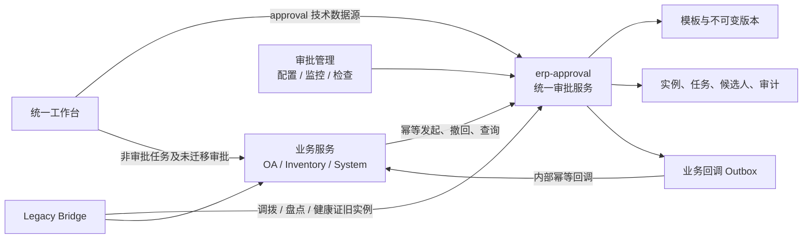

# ERP 统一审批中心实施方案

> 日期：2026-07-14  
> 状态：设计已确认，待分阶段实施  
> 本文只描述实施方案；当前会话不运行测试、不删除数据库数据、不修改业务代码。  
> 本方案覆盖并取代旧方案中“保留 OA 采购与 Flowable 历史”的结论：现有 OA 采购、审批意见及 Flowable 数据均为测试数据，切换时按本文物理删除。

## 1. 目标与范围

建立独立的 `erp-approval` 统一审批服务，把“审批配置、审批运行、审批监控、配置检查”收口到一个中心，同时保留现有工作台作为员工唯一待办入口。

本期目标：

1. 新增统一审批引擎和管理中心，不再建设第二个“待我审批”入口。
2. OA 采购直接切换统一引擎，并物理删除现有 OA 采购及全部 Flowable 测试数据，彻底移除 Flowable。
3. 调拨、盘点、健康证先接入统一管理中心，兼容现有引擎，再按风险由低到高迁移到统一引擎。
4. 所有真正的审批业务都可在“审批管理”查看、配置或监控；合同签署、收货确认等非审批任务仍只进入工作台。
5. 审批流程采用“业务模板 + 有限配置”，不提供任意拖拽流程设计器。

本期不做：自由加签、用户自由转审、会签加减人、条件表达式脚本、跨租户审批、复杂 BPMN 编排。管理员仅可在有审计记录的前提下终止或改派任务。

## 2. 已确认的产品规则

### 2.1 两个入口的职责

| 入口 | 面向人群 | 职责 |
| --- | --- | --- |
| 工作台 / 我的待办 | 全体员工 | 展示并处理审批、执行、确认、风险等个人任务 |
| 系统管理 / 审批管理 | 审批管理员 | 配置流程、查看运行实例、检查配置完整性 |

“审批管理”只保留一个菜单，页面内设三个页签：

- 流程配置：业务模板、适用范围、节点规则、版本发布。
- 运行监控：实例、当前节点、候选人、回调状态、操作轨迹。
- 配置检查：冲突、缺人、权限、组织覆盖、回调健康状态。

### 2.2 通用动作

- 同意：进入下一节点；最后节点同意后等待业务回调成功，再最终完成。
- 退回修改：当前轮次结束，业务单据回到可编辑状态；重新提交时从第一个适用节点开始，并生成新轮次。
- 拒绝：当前轮次和业务申请终止。
- 撤回：仅在本轮尚无人同意前允许申请人撤回。
- 管理员终止/改派：必须填写原因，完整写入审计日志。
- 默认禁止自审；各业务模板只能选择预置的自审处理策略。

退回后的重新提交不复用旧任务：新建审批实例，增加 `business_round`，通过 `root_instance_id`、`previous_instance_id` 串联历史。新轮次采用重新提交时已发布的规则版本，旧轮次仍保留其原始版本快照。

### 2.3 规则匹配与版本

1. 组织范围优先级固定为：门店 > 区域 > 全部。
2. 业务子类型优先级固定为：指定子类型 > 全部子类型。
3. 同一业务、同一范围精度存在多条可命中规则时，阻止发布，不允许依赖人工填写的数值优先级。
4. 已发布版本不可修改，只能复制为新草稿后再次发布。
5. 运行中的实例永久使用启动时的版本和候选人快照。
6. 已被使用的模板/版本不能物理删除，只能停用；运行与审计数据不能在管理页面删除。

### 2.4 审批人来源

统一支持以下受控来源：

- 业务策略：由业务提供明确算法，例如调拨四级、三级负责人。
- 责任岗位：在门店/区域等范围内查找某岗位责任人。
- 组织负责人：查找指定组织层级的负责人。
- 固定用户：仅用于少量特殊流程，发布时明确提示维护风险。

多人结果只允许三种处理模式：唯一最优人、任一人通过、所有人通过。候选人按行保存到候选人表，禁止把用户 ID 拼成 CSV。

## 3. 调拨审批固定模板

调拨保留四级审批结构，顺序不可任意增删：

| 顺序 | 节点 | 查找规则 | 缺人处理 |
| ---: | --- | --- | --- |
| 1 | 四级负责人 | 店长优先；无店长时取店长助理 | 跳过并产生配置告警 |
| 2 | 三级负责人 | 岗位高于店长，低于运营总监和总经理，取排序最接近店长的负责人 | 跳过并产生配置告警 |
| 3 | 运营总监 | 在该门店责任范围内查找 `yyzj` | 必须存在，否则禁止提交 |
| 4 | 总经理 | 在该门店责任范围内查找 `zjl` | 必须存在，否则禁止提交 |

锚点门店：

- 门店返仓：使用来源门店。
- 仓库调拨、异店调货、OE：使用目标门店。

提交人层级跳过规则：若提交人本身命中某审批层级，则跳过该层级及其以下层级；总经理不能发起调拨。运营总监、总经理必须通过责任范围解析，不在代码中写死“灵韵”“金英”等具体姓名。

## 4. 当前项目边界与迁移结论

当前审批实现分散在三个服务：

| 业务 | 当前实现 | 目标处理 |
| --- | --- | --- |
| OA 采购 | `erp-oa` + Flowable BPMN | 第一批直接切统一引擎；现有测试数据物理删除 |
| 调拨 | inventory 自研 rule/node/instance/task | 先桥接展示，最后迁移；保留已有实例和四级规则 |
| 库存盘点 | inventory 自研单节点审批 | 先桥接，健康证后迁移；保留库存快照校验 |
| 健康证 | system 业务状态直接审核 | 先桥接，再作为首个存量业务迁移 |
| 固定资产异常审批 | 当前已停用/无完整运行链路 | 不建立活跃模板，待业务重新启用时再接入 |

合同签署、收货确认、发货、盘点执行等不是审批，不进入审批模板，只继续由统一工作台聚合。

现存调拨审批数据不是本次删除范围。已有调拨实例继续按旧引擎完成，并在审批监控中通过兼容适配器展示；不得改写为新引擎实例。

## 5. 目标架构



统一引擎独立为 `erp-approval`，不放入 `erp-system`、`erp-oa` 或 `erp-inventory`。这样审批配置和运行数据不归属于某个业务服务，也避免业务模块之间形成 Maven 依赖环。

新增模块：

- `erp-api/erp-api-approval`：发起、撤回、状态、轨迹、内部 DTO 和 Feign 契约。
- `erp-modules/erp-approval`：定义管理、规则匹配、审批运行、待办、监控、配置检查和回调分发。
- 服务名 `erp-approval`，网关路径 `/approval/**`，建议本地端口 `9206`。

依赖方向：

- 业务服务依赖 `erp-api-approval`，用于发起/撤回/查询。
- 审批服务依赖 system/inventory/OA 的 API 模块，用于只读业务摘要和内部回调。
- 不允许任何 API 模块反向依赖具体业务 service 模块。

## 6. 核心数据模型

新增迁移：

- `sql/erp_unified_approval_center_20260714.sql`
- `docker/mysql/db/erp_unified_approval_center_20260714.sql`

最低表集合：

| 表 | 作用 | 关键约束 |
| --- | --- | --- |
| `approval_template` | 审批业务目录 | `business_code` 唯一；记录 `NATIVE/LEGACY` 模式 |
| `approval_rule` | 模板下的适用范围 | 不保存人工优先级；停用代替删除 |
| `approval_rule_version` | 不可变发布版本 | `(rule_id, version_no)` 唯一；保存摘要和完整快照 |
| `approval_rule_condition` | 门店、区域、子类型等结构化条件 | 只支持白名单字段和运算符 |
| `approval_version_node` | 版本内有序节点 | 保存策略、多人模式、缺人/自审策略和策略配置 |
| `approval_instance` | 每轮审批实例 | `idempotency_key` 唯一；保存业务、申请人、锚点、版本、轮次、回调状态 |
| `approval_task` | 节点执行任务 | 一个实例/轮次/节点不能出现两组活动任务 |
| `approval_task_candidate` | 任务候选人 | `(task_id, user_id)` 唯一；为工作台查询建组合索引 |
| `approval_action_log` | 不可变操作轨迹 | 保存动作、操作者、原因、前后状态和 request ID |
| `approval_callback_outbox` | 可靠业务回调 | `event_key` 唯一；支持重试、死信和人工重放 |
| `approval_validation_run` | 配置检查批次 | 记录检查范围、发起人和汇总结果 |
| `approval_validation_issue` | 具体配置问题 | 保存业务、范围、严重级别和修复建议 |

实例建议状态：

`RUNNING`、`COMPLETING`、`RETURNING`、`REJECTING`、`APPROVED`、`RETURNED`、`REJECTED`、`WITHDRAWN`、`TERMINATED`、`INVALIDATED`。

其中 `COMPLETING/RETURNING/REJECTING` 表示审批动作已提交、业务回调尚未成功。审批服务不能在回调成功前把实例标记为最终状态，避免“审批显示成功但业务单据没有生效”。

任务建议状态：

`PENDING`、`APPROVED`、`RETURNED`、`REJECTED`、`SKIPPED`、`CANCELLED`、`REASSIGNED`。

所有表按项目现有公共字段规范补充 `create_by/create_time/update_by/update_time`、逻辑状态和必要索引；迁移 SQL 保持项目声明的 MySQL 5.7 兼容范围，不使用仅 MySQL 8 支持的约束语法。

## 7. 核心运行协议

### 7.1 幂等发起

业务服务提交：

```text
businessCode + businessId + businessRound + applicantId
+ anchorDeptId + businessSubtype + variables + routeSnapshot
```

审批服务生成稳定的 `idempotencyKey`。同一个业务轮次重复请求时返回同一实例，禁止重复创建任务。

业务单据采用 `SUBMITTING -> PENDING` 的防重状态转换：

1. 业务服务先以乐观锁把单据置为 `SUBMITTING`。
2. 同步调用审批服务发起；超时可使用同一幂等键安全重试。
3. 成功后写入 `approval_instance_id`、`approval_round` 并置为 `PENDING`。
4. 若创建失败，恢复为可提交状态并向用户显示明确原因。

### 7.2 节点推进

同意非末节点时，在审批服务本地事务内完成当前任务、解析下一节点候选人、建立下一任务和审计日志。找不到可跳过节点时记录 `SKIPPED` 和告警；找不到必选节点时保持当前状态并返回配置错误。

### 7.3 业务结果回调

最后同意、退回、拒绝产生业务结果时：

1. 审批事务把实例置为中间态并写入 `approval_callback_outbox`。
2. 定时分发器通过 `@InnerAuth` 内部接口调用业务服务。
3. 业务回调使用 `event_key` 幂等，更新业务状态或执行库存动作。
4. 回调成功后审批实例才进入最终状态；响应丢失时重复调用不产生副作用。
5. 多次失败进入可监控的死信状态，由管理员修复原因后重放，不能直接篡改实例状态。

项目当前没有统一事件总线的实际使用基础，本期采用“数据库 Outbox + 定时 Feign 分发”，不为审批单独引入 Kafka。

### 7.4 盘点特殊处理

盘点最终同意时，inventory 回调必须重新校验盘点快照并在一个业务事务中应用库存调整：

- 校验通过并成功落账：回调成功，审批最终 `APPROVED`。
- 库存快照已经变化：业务返回明确失效结果，审批最终 `INVALIDATED`，盘点进入可重新生成/提交状态。
- 系统异常：保持 `COMPLETING` 并重试，不能把它误判为业务拒绝。

## 8. 工作台接入原则

前端当前按 inventory、OA、system 三个技术 provider 聚合。新增审批服务后，必须把“技术数据源”和“业务来源”分开：

- 技术 provider：新增 `approval`，用于请求 `/approval/todo`。
- 业务来源：仍显示 inventory、OA、system，不把“审批中心”显示成第四个业务系统。
- 审批 provider 返回的每条任务仍携带真实业务 `source`、`todoType`、`businessId`、`action`。
- 某业务切换统一引擎的同一版本中，旧 provider 必须停止输出该审批待办，避免重复计数。
- 待办稳定键继续使用业务来源、类型、业务 ID 和动作，不能使用每次查询变化的展示字段。

需要补齐 `OA_PURCHASE_APPROVAL` 的桌面和移动端路由定义，并允许路由参数携带 `approvalTaskId`、`approvalInstanceId`，业务页面据此加载统一审批轨迹和可用动作。

## 9. 分阶段实施任务

### 阶段 0：保护当前工作区

当前分支存在大量未提交修改，实施前必须先形成明确文件清单并保护用户现有工作：

- 不执行 `git reset --hard`、`git checkout --` 或全量覆盖。
- 优先在现有变更已归档后创建 `codex/unified-approval-center` 分支；若仍在脏工作区开发，每个任务只改显式列出的文件，并逐文件审查 diff。
- 数据库破坏性脚本独立于普通迁移，禁止放进自动初始化或普通发布 runner。

完成标准：实现分支和旧改动边界清晰，审批任务可独立审查和回滚。

### 阶段 1：搭建审批 API、服务和部署骨架

主要文件：

- 修改：`pom.xml`
- 修改：`erp-api/pom.xml`
- 新增：`erp-api/erp-api-approval/pom.xml`
- 新增：`erp-api/erp-api-approval/src/main/java/com/erp/approval/api/**`
- 修改：`erp-modules/pom.xml`
- 新增：`erp-modules/erp-approval/pom.xml`
- 新增：`erp-modules/erp-approval/src/main/java/com/erp/approval/**`
- 新增：`erp-modules/erp-approval/src/main/resources/bootstrap.yml`
- 修改：`erp-common/erp-common-core/src/main/java/com/erp/common/core/constant/ServiceNameConstants.java`
- 修改：`erp-gateway/src/main/resources/bootstrap.yml`
- 修改：`docker/copy.sh`
- 修改：`docker/docker-compose.yml`
- 修改：`docker/docker-compose.ecs-host.yml`
- 修改：`docker/deploy.sh`、`docker/deploy-ecs.sh`
- 修改：`docs/ALIYUN_ECS_DEPLOYMENT_RUNBOOK.md`

工作内容：

1. 注册 `erp-approval` 模块、服务常量、9206 端口和 `/approval/**` 网关路由。
2. 建立 `RemoteApprovalService` 及 fallback；内部接口统一使用 `SecurityConstants.INNER`。
3. 建立健康检查和最小启动配置。
4. 删除根 POM 中没有实际模块支撑的旧 `erp-api-workflow` 依赖管理项，避免新旧“工作流”概念并存。
5. 补充 Docker 构建、复制、编排和部署说明，但此阶段不接管任何业务。

完成标准：服务可独立启动，未开启任何业务模板时不影响现有审批和待办。

### 阶段 2：建立统一数据模型和内置模板目录

主要文件：

- 新增：`sql/erp_unified_approval_center_20260714.sql`
- 新增：`docker/mysql/db/erp_unified_approval_center_20260714.sql`
- 新增：`erp-modules/erp-approval/src/main/java/com/erp/approval/domain/**`
- 新增：`erp-modules/erp-approval/src/main/java/com/erp/approval/mapper/**`
- 新增：`erp-modules/erp-approval/src/main/resources/mapper/approval/**`

内置业务模板编码：

- `OA_PURCHASE`
- `INV_TRANSFER`
- `INV_STOCK_CHECK`
- `HR_HEALTH_CERTIFICATE`

初始模式：OA 采购为待发布的 `NATIVE`；其余三个为 `LEGACY`。固定资产异常审批不创建活跃模板。

菜单只新增一个“审批管理”，建议位于系统管理下，组件 `approval/manage/index`。权限最小集合：

- `approval:template:list/query/edit/publish`
- `approval:instance:list/query/terminate`
- `approval:task:reassign`
- `approval:validation:list/run`

不新增员工审批菜单，不改变员工从工作台处理任务的路径。

### 阶段 3：实现版本、匹配和候选人解析

主要组件：

- `ApprovalDefinitionService`：草稿、复制版本、发布、停用。
- `ApprovalRuleMatchService`：按固定精度匹配规则并检测歧义。
- `ApprovalCandidateResolverRegistry`：按策略代码调用受控解析器。
- `ApprovalCoverageValidationService`：在发布前按组织和业务子类型检查覆盖。

发布校验至少包括：

1. 同精度规则冲突。
2. 必选节点无候选人或候选人无业务审批权限。
3. 固定用户已停用、离职或越权。
4. 节点顺序、多人模式、必选数量不合法。
5. 业务回调适配器不存在。
6. 调拨每一家有效门店是否存在运营总监和总经理。

调拨候选人算法复用并迁入现有 `TransferApprovalCandidateResolver` 已确认的规则，不重新发明岗位排序。配置检查应能按门店预览四个节点、跳过原因和最终候选人。

### 阶段 4：实现审批运行时、审计和可靠回调

主要组件：

- `ApprovalRuntimeService`：发起、推进、退回、拒绝、撤回。
- `ApprovalTaskService`：任务领取语义、并发防重、改派。
- `ApprovalBusinessCallbackRegistry`：业务回调路由。
- `ApprovalCallbackDispatcher`：Outbox 重试和死信。
- `ApprovalMonitorService`：实例、动作、候选人、回调查询。

所有状态变更必须带乐观锁或条件更新；重复点击、双端同时审批、多人任一通过都只能产生一次有效状态迁移。管理员操作与自动跳过也必须落 `approval_action_log`。

### 阶段 5：实现审批管理页面

主要文件：

- 新增：`erp-ui/src/api/approval/**`
- 新增：`erp-ui/src/views/approval/manage/index.vue`
- 新增：`erp-ui/src/views/approval/manage/components/**`

“流程配置”采用向导式编辑：

1. 选择业务模板。
2. 选择适用范围和业务子类型。
3. 配置模板允许开放的节点参数。
4. 预览具体组织的审批人。
5. 执行配置检查。
6. 发布新版本。

调拨模板只展示固定四级结构，管理员不能删节点或交换顺序；可以查看来源、责任范围、缺人结果和候选人预览。运行监控允许终止、改派和回调重试，但每个动作都要求二次确认和原因。

原 `erp-ui/src/views/inventory/transfer/rules.vue` 在中央页面具备等价能力后隐藏菜单 `4410`，不立即删除后端兼容接口；旧实例归零并完成原生迁移后再清理。

### 阶段 6：接入统一工作台

主要文件：

- 修改：`erp-ui/src/api/workbench/todo.js`
- 修改：`erp-ui/src/store/modules/todo.js`
- 修改：`erp-ui/src/utils/todoAggregator.js`
- 修改：`erp-ui/src/utils/todoRouteResolver.js`
- 修改：`erp-ui/src/views/workbench/todo/index.vue`
- 修改：`erp-ui/src/views/mobile/todo/index.vue`
- 修改：`erp-common/erp-common-core/src/main/java/com/erp/common/core/domain/todo/**`
- 新增/修改：对应 Java 与 `erp-ui/test/unifiedTodo*.test.js` 契约测试

将 provider 列表扩展为 approval/inventory/OA/system，将可见业务来源继续限制为 inventory/OA/system。每迁移一个业务，同版完成“approval 开始输出 + 旧 provider 停止输出 + 路由支持”，不能分两版上线。

### 阶段 7：OA 采购直接切换并彻底移除 Flowable

#### 7.1 先完成新链路

主要文件：

- 修改：`erp-modules/erp-oa/src/main/java/com/erp/oa/service/impl/OaPurchaseServiceImpl.java`
- 修改：`erp-modules/erp-oa/src/main/java/com/erp/oa/controller/OaPurchaseController.java`
- 修改：`erp-modules/erp-oa/src/main/java/com/erp/oa/domain/OaPurchase.java`
- 修改：`erp-modules/erp-oa/src/main/resources/mapper/oa/OaPurchaseMapper.xml`
- 修改：`erp-ui/src/views/oa/purchase/**`
- 修改：OA 移动端采购及待办运行配置

OA 采购单移除 `process_instance_id/current_task_id`，增加 `approval_instance_id`、`approval_round` 和行版本字段。采购状态与统一审批动作一一映射，审批轨迹直接查询 approval API。

OA 初始模板建议仍为“部门负责人 -> 财务负责人”，但财务审批人必须在审批管理中配置并通过覆盖检查。当前数据库未发现可直接确认的财务岗位/角色，因此禁止继续把 `admin` 写死成财务审批人；财务节点未配置完成前，OA 模板不能发布、采购提交入口不能开放。

#### 7.2 删除 Flowable 代码和依赖

删除/修改：

- 删除：`erp-modules/erp-oa/src/main/java/com/erp/oa/config/OaFlowableAutoDeploymentConfig.java`
- 删除：`erp-modules/erp-oa/src/main/resources/processes/purchase-approval.bpmn20.xml`
- 删除：`erp-modules/erp-oa/src/main/java/com/erp/oa/mapper/OaPurchaseCommentMapper.java`
- 删除：`erp-modules/erp-oa/src/main/resources/mapper/oa/OaPurchaseCommentMapper.xml`
- 删除：OA purchase comment domain/service 中只为 Flowable 意见存在的代码
- 修改：`erp-modules/erp-oa/pom.xml`，移除 `flowable.version` 和 `flowable-spring-boot-starter-process`
- 修改：`erp-modules/erp-oa/src/main/resources/bootstrap.yml`，移除 Flowable 配置和对应自动配置排除项
- 修改：`OaPurchaseServiceImpl`，移除 `RuntimeService/TaskService/HistoryService` 及所有 Flowable 查询

完成后执行源码门禁：生产源码、POM、YAML、资源目录中不得再出现 Flowable、BPMN 或 `ACT_` 依赖。

#### 7.3 独立执行物理清理

新增且只允许人工执行：

- `sql/erp_oa_flowable_test_data_purge_20260714.sql`

该脚本不复制、不迁移现有测试数据，执行以下动作：

1. 校验当前数据库名、OA 和 Flowable 表是否符合预期，并输出删除前计数。
2. 停止所有仍加载 Flowable 的旧 OA 实例后，先 `DROP TABLE oa_purchase_comment`，避免旧外键阻断主表清理。
3. `TRUNCATE TABLE oa_purchase`。
4. 修改 `oa_purchase`，删除 Flowable 字段并增加统一审批字段。
5. 按明确表名删除当前实际存在的 41 张 Flowable 表（39 张 `ACT_*`、2 张 `FLW_*`），禁止使用模糊匹配生成 DROP：
   - `ACT_EVT_LOG`
   - `ACT_GE_BYTEARRAY`、`ACT_GE_PROPERTY`
   - `ACT_HI_ACTINST`、`ACT_HI_ATTACHMENT`、`ACT_HI_COMMENT`、`ACT_HI_DETAIL`、`ACT_HI_ENTITYLINK`、`ACT_HI_IDENTITYLINK`、`ACT_HI_PROCINST`、`ACT_HI_TASKINST`、`ACT_HI_TSK_LOG`、`ACT_HI_VARINST`
   - `ACT_ID_BYTEARRAY`、`ACT_ID_GROUP`、`ACT_ID_INFO`、`ACT_ID_MEMBERSHIP`、`ACT_ID_PRIV`、`ACT_ID_PRIV_MAPPING`、`ACT_ID_PROPERTY`、`ACT_ID_TOKEN`、`ACT_ID_USER`
   - `ACT_PROCDEF_INFO`
   - `ACT_RE_DEPLOYMENT`、`ACT_RE_MODEL`、`ACT_RE_PROCDEF`
   - `ACT_RU_ACTINST`、`ACT_RU_DEADLETTER_JOB`、`ACT_RU_ENTITYLINK`、`ACT_RU_EVENT_SUBSCR`、`ACT_RU_EXECUTION`、`ACT_RU_EXTERNAL_JOB`、`ACT_RU_HISTORY_JOB`、`ACT_RU_IDENTITYLINK`、`ACT_RU_JOB`、`ACT_RU_SUSPENDED_JOB`、`ACT_RU_TASK`、`ACT_RU_TIMER_JOB`、`ACT_RU_VARIABLE`
   - `FLW_RU_BATCH`、`FLW_RU_BATCH_PART`
6. 删除后验证 OA 采购为 0、comment 表不存在、`information_schema.tables` 中 `ACT_%` 和 `FLW_%` 均为 0。

此脚本不能放入 `docker/mysql/db/` 自动初始化目录，不能被普通 release runner 隐式调用。旧的发布门禁测试中“绝不删除 OA 数据”的断言已被新决策取代，需要改成“只有该白名单脚本可以执行破坏性清理，其他迁移仍禁止删除”。至少更新：

- `erp-ui/test/unifiedTodoReleaseGate.test.js`
- `erp-ui/test/unifiedTodoBusinessScopeMigration.test.js`
- 对旧方案/脚本中保留 Flowable 历史的说明标注为已被本方案取代，不篡改已经执行过的历史 SQL。

#### 7.4 OA 切换窗口顺序

1. 部署并验证统一审批服务，但保持 OA 提交关闭。
2. 在审批管理配置并发布 OA 模板，财务候选人覆盖检查必须通过。
3. 停止所有旧 OA 服务实例，确认没有进程再访问 ACT 表。
4. 人工执行物理清理脚本。
5. 部署不含 Flowable 的新 OA 服务和前端。
6. 验证新建、提交、工作台处理和审批轨迹后，开放 OA 采购提交。

该窗口删除数据和 ACT 表后不可回滚到 Flowable，只能前向修复。因此必须在执行破坏性脚本前完成新版本构建、配置检查和同结构临时库演练。

### 阶段 8：兼容现有引擎并统一展示

在 approval 服务建立 `LegacyApprovalBridge` 接口，为调拨、盘点、健康证分别提供适配器：

- 列出模板及当前配置摘要。
- 查询运行实例、当前任务和历史动作。
- 把旧实例统一映射到监控 DTO。
- 转发旧引擎仍支持的管理员动作；不支持的动作在 UI 明确禁用。

兼容层只负责统一管理和展示，不复制旧实例到新表，不让 approval provider 重复输出旧待办。旧 provider 继续负责尚未迁移业务的工作台任务。

### 阶段 9：迁移健康证审批

健康证业务状态简单，作为存量业务的第一批迁移：

1. 建立固定业务模板和责任人策略。
2. 将现有“审核通过”映射为同意，将当前“审核拒绝但可重提”语义统一为退回修改。
3. 新提交进入统一引擎；切换前已在审核中的记录继续由旧逻辑完成。
4. system todo provider 只停止输出切换后的原生审批任务。

### 阶段 10：迁移库存盘点审批

1. 建立运营总监审批模板和范围策略。
2. 接入第 7.4 节所述的快照复检及库存调整幂等回调。
3. 新盘点走统一引擎，旧实例继续旧引擎。
4. 确认失效、回调重试、重复点击均不会重复调整库存后再扩大开关范围。

### 阶段 11：最后迁移调拨审批

1. 将已确认的四级候选人解析器注册为统一审批业务策略。
2. 固定四个节点及来源/目标门店锚点规则，发布前对全部有效门店执行覆盖检查。
3. 新调拨进入统一引擎；原 67 个历史/运行实例和旧任务继续旧引擎，不搬迁、不删除。
4. 中央页面上线后隐藏旧“调拨审批配置”菜单；旧接口仅供兼容层和旧实例使用。
5. 旧运行实例清零且经过单独的数据保留决策后，才允许另立清理任务。本方案不授权删除 inventory 的审批历史表。

## 10. 验证与验收计划

以下是实施时必须执行的验证，不代表当前会话已运行。

### 10.1 自动验证

后端按模块分层执行：

```bash
mvn -pl erp-modules/erp-approval -am test
mvn -pl erp-modules/erp-oa -am test
mvn -pl erp-modules/erp-system,erp-modules/erp-inventory -am test
```

前端执行审批管理、工作台 provider/路由、OA 桌面和移动端契约测试，再执行生产构建。数据库在与目标库同版本的临时副本中分别演练：

- 统一审批中心增量迁移可重复执行。
- OA/Flowable 清理脚本只允许执行一次，重复执行应给出清晰结果而非误删其他表。
- 清理后 OA 新结构、统一引擎结构和应用启动一致。
- 普通迁移与 release runner 不包含未授权的 DELETE/TRUNCATE/DROP。

### 10.2 核心业务场景

1. 规则冲突、必选节点缺人、审批人停用时禁止发布或提交。
2. 同一提交请求重试只产生一个实例；重复同意只生效一次。
3. 任一人通过后其他候选任务正确取消；所有人模式必须全部完成。
4. 退回后新轮次从首个适用节点开始，旧轮次轨迹可查看。
5. 首次同意前可撤回，已有同意动作后不能撤回。
6. 业务回调失败时实例停留中间态，修复后可安全重放。
7. 管理员终止、改派和重放都具备原因、操作者和时间审计。
8. 工作台不重复、不漏项，业务来源筛选和桌面/移动端路由一致。
9. OA 新申请不访问任何 ACT 表，不再部署 BPMN。
10. 调拨四级/三级跳过、必选高层、提交人层级跳过、门店返仓锚点全部符合已确认规则。

### 10.3 发布验收

- 审批管理员验收三个页签、版本发布、候选人预览、冲突检查和运行处置。
- OA 申请人、部门负责人、财务负责人验收完整新链路。
- 店长/店助、三级负责人、运营总监、总经理分别验收调拨候选人结果。
- 库存责任人验收盘点最终同意和快照变化失效路径。
- 普通员工只在工作台处理审批，不看到第二个个人审批入口。

## 11. 风险与回滚策略

| 风险 | 控制方式 | 回滚边界 |
| --- | --- | --- |
| 当前工作区变更很多 | 独立分支、显式文件清单、逐文件 diff | 不覆盖或重置用户改动 |
| 跨服务最终状态不一致 | 中间态 + Outbox + 幂等回调 | 回调可重放，不手工改最终状态 |
| 待办重复 | 同版切换 approval/legacy provider | 按业务开关退回旧 provider，但必须先停止新实例 |
| 规则发布后改动影响在途实例 | 不可变版本和候选人快照 | 发布新版本，不改旧版本 |
| OA 财务负责人未配置 | 发布前覆盖检查，提交 fail-closed | 不开放 OA 提交 |
| Flowable 物理删除不可逆 | 独立人工脚本、停旧服务、临时库演练 | 删除后不支持回退 Flowable，只能前向修复 |
| 盘点最终同意重复落账 | 业务 event key 幂等 + 快照复检 | 回调重试不重复调整库存 |
| 旧调拨实例受影响 | Legacy Bridge、按发起时间/引擎模式路由 | 旧实例始终留在旧引擎完成 |

OA 测试数据按已确认决策不做业务迁移或历史保留；执行前只记录计数和脚本结果用于发布审计。除 OA/Flowable 之外，任何存量审批数据的物理删除都不在本方案授权范围内。

## 12. 完成定义

只有同时满足以下条件，统一审批中心才算完成：

1. 一个审批管理菜单覆盖配置、监控、检查，员工仍只使用现有工作台。
2. OA 新采购全程使用统一引擎，代码、依赖、配置、BPMN 和数据库均无 Flowable 残留。
3. 调拨、盘点、健康证都能在中央管理中心看到，并按计划完成原生迁移或明确处于兼容模式。
4. 调拨规则完全符合四级、三级、运营总监、总经理的固定顺序和边界。
5. 规则版本、候选人快照、动作日志和管理员操作可完整追溯。
6. 跨服务回调可重试且不重复产生业务副作用。
7. 工作台无重复审批任务，桌面端和移动端均能正确处理。
8. 所有自动验证、临时库演练和角色验收通过后，才允许逐业务打开原生引擎开关。
