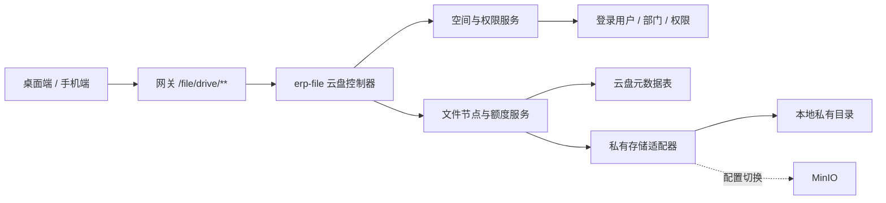

# 企业云盘功能设计

**日期：** 2026-07-11

**状态：** 已完成分段确认，待书面审阅

**范围：** 个人文件、公司公共盘、部门盘、桌面端完整能力与移动端常用能力

## 1. 目标

在现有 ERP 中增加统一的内部云盘，使员工能够在同一个入口管理个人文件、浏览公司公共资料和访问所属部门资料，同时满足以下要求：

- 云盘是跨 OA、人事、进销存和仓库业务的一级能力；
- 个人、公司和部门文件使用一致的目录、搜索、预览、下载和回收站体验；
- 公司盘和部门盘采用分级管理，普通员工默认只读；
- 所有文件使用私有存储和服务端鉴权，不能通过猜测 URL 绕过权限；
- 复用现有 `erp-file` 服务和本地/MinIO 存储基础，不新增微服务；
- 第一版控制范围，不引入复杂协作和外部分享能力。

## 2. 已确认的产品决策

1. 同时提供“我的文件”和共享空间。
2. 共享空间分为公司公共盘和部门盘，不建立自定义协作空间。
3. 第一版包含文件夹、上传、预览、下载、重命名、同空间移动、回收站、搜索和空间用量。
4. 桌面端提供完整功能；手机端提供浏览、搜索、拍照或选文件上传、预览和下载。
5. 公司公共盘由系统管理员或云盘管理员维护；部门盘由本部门被授权人员维护；普通员工默认只读。
6. 云盘作为桌面一级导航，放在“OA管理”之后；手机端入口放在工作台“更多”和“我的”页面。
7. 云盘不依赖当前门店或仓库选择，权限依据登录用户及其当前所属部门计算。
8. 后端直接扩展 `erp-file`，保留现有公共附件接口，不新建 `erp-drive` 微服务。
9. 第一版继续使用服务器私有磁盘，新增独立存储适配器以支持后续切换 MinIO。
10. 图片、PDF、纯文本可在线预览；Office 文件第一版提供文件信息和下载，不增加文档转换服务。
11. 删除文件进入回收站并保留 30 天；彻底删除后才释放空间。
12. 第一版不包含外链分享、评论、文件版本、自定义文件夹授权、收藏和跨空间移动。

## 3. 当前系统基础与缺口

### 3.1 可复用基础

现有系统已经具备：

- 独立的 `erp-file` 文件服务和 `/file/upload`、`/file/delete` 接口；
- 本地文件存储、MinIO 客户端和文件扩展名、大小校验工具；
- 网关 `/file/**` 路由；
- 登录用户、角色、权限和部门信息；
- 后端动态菜单和桌面一级导航；
- Vue 2、Element UI、文件上传组件和移动端工作台；
- 私有文件下载的业务实践，例如合同和签约文件。

### 3.2 必须补齐的能力

现有 `erp-file` 只处理无目录、无元数据的上传与删除，且默认上传到公开静态目录。云盘还缺少：

- 个人、公司和部门空间模型；
- 文件夹树和可搜索文件元数据；
- 服务端空间权限；
- 私有内容流式下载和预览；
- 空间额度与并发占用控制；
- 软删除、恢复、30 天清理和容量释放；
- 操作审计、异常定位和最近使用数据；
- 桌面、移动端页面及动态菜单权限。

## 4. 范围与非目标

### 4.1 第一版包含

- 个人空间、唯一公司公共空间、按部门唯一的部门空间；
- 文件夹创建、列表、面包屑、搜索、上传、下载、受支持格式预览；
- 文件和文件夹重命名、同空间移动、软删除、恢复和彻底删除；
- 最近使用、空间用量、上传进度和明确的失败提示；
- 桌面完整管理界面；
- 手机浏览、搜索、拍照或文件上传、预览和下载；
- 私有存储、服务端权限、审计日志和定时清理；
- 可配置的文件大小、空间额度、存储类型和功能开关。

### 4.2 第一版不包含

- 外链或匿名分享；
- 跨空间移动或复制；
- 文件版本历史、协同编辑、评论、收藏和标签；
- 自定义协作空间和文件夹级人员授权；
- Office 在线转换或 OnlyOffice/Collabora 集成；
- 秒传、分片上传、断点续传和大文件视频流；
- 恶意文件杀毒引擎；
- 将现有合同、头像和业务附件迁移进云盘。

## 5. 入口与信息架构

### 5.1 桌面端

在现有顶部一级导航中增加“云盘”，位置在“OA管理”之后、“人事管理”之前。菜单路由为 `/drive`，由后端动态菜单提供，入口权限为 `drive:access`。

云盘页面左侧空间导航固定包含：

- 我的文件；
- 公司公共盘；
- 部门盘；
- 最近使用；
- 回收站。

主区域包含页面标题、空间说明、面包屑、搜索框、新建文件夹、上传按钮、文件夹与文件列表、容量显示和上传队列。列表默认按“文件夹在前、更新时间倒序”排列，支持名称、大小和更新时间排序。

### 5.2 移动端

新增 `/mobile/drive` 隐藏路由和独立移动页面：

- 在门店、仓库工作台“更多”中增加“云盘”；
- 在“我的”页面增加云盘快捷入口；
- 不增加第六个底部导航项；
- 将 `/mobile/drive` 设为组织上下文可选路由，不因未选择门店或仓库而强制跳转；
- 路由仍检查 `drive:access` 权限。

### 5.3 空间创建和可见性

- 个人空间在用户首次进入云盘时幂等创建；
- 公司公共盘在数据库迁移时创建且全系统唯一；
- 部门空间在首位部门成员访问时幂等创建；
- 没有所属部门的用户只看到个人盘和公司公共盘；
- 员工换部门后立即失去旧部门盘访问权，并获得新部门盘访问权；
- 不使用前端当前门店或仓库 ID 决定云盘权限。

## 6. 总体架构



### 6.1 `erp-file` 扩展

`erp-file` 增加 MySQL、`erp-common-datasource`、MyBatis 和日志依赖，启用数据源自动配置，并增加仅属于云盘的 `com.erp.file.drive` 包。现有公共附件控制器、`ISysFileService` 和 `/file/upload` 行为保持不变。

云盘使用独立 `DriveStorageProvider`，不直接复用现有公开上传实现：

- `LocalDriveStorageProvider` 将内容写入 `${file.path}/private/drive/`；
- `MinioDriveStorageProvider` 按 `drive.storage.type=minio` 启用；
- 存储键由系统生成，不包含可执行路径和原始文件名；
- 私有目录不注册静态资源映射。

### 6.2 网关路由

在现有 `erp-file-static` 路由之前增加云盘 API 路由：

```yaml
- id: erp-file-drive-api
  uri: http://127.0.0.1:9300
  predicates:
    - Path=/file/drive/**
  filters:
    - StripPrefix=1
```

该顺序保证 `/file/drive/**` 进入鉴权控制器，而不是落入公开静态文件路由。现有 `/file/upload`、`/file/delete` 和 `/file/public/**` 路由不变。

### 6.3 后端组件边界

- `DriveController`：参数解析、响应和内容流；
- `DriveSpaceService`：空间发现、幂等创建和额度配置；
- `DriveAuthorizationService`：集中处理个人、公司和部门权限；
- `DriveNodeService`：目录树、搜索、重命名、移动、删除和恢复；
- `DriveUploadService`：文件校验、物理写入、摘要和数据库补偿；
- `DriveQuotaService`：原子容量占用、释放和一致性校验；
- `DriveStorageProvider`：保存、读取、存在性检查和删除物理对象；
- `DriveOperationLogService`：操作审计和最近使用数据；
- `DriveTrashCleanupTask`：处理超过 30 天的回收站节点和失败重试。

每个组件只通过明确接口协作。控制器不直接拼接存储路径，存储实现不判断业务权限，权限服务不读取文件内容。

## 7. 数据模型

### 7.1 `drive_space`

每行代表一个逻辑空间，主要字段：

- `space_id`；
- `space_key`：唯一值，如 `PERSONAL:123`、`COMPANY:ROOT`、`DEPARTMENT:45`；
- `space_type`：`PERSONAL`、`COMPANY`、`DEPARTMENT`；
- `owner_user_id`、`dept_id`；
- `space_name`；
- `quota_bytes`、`used_bytes`；
- `status`、`version`；
- 创建、更新审计字段。

`space_key` 建立唯一索引，保证并发首次访问不会创建重复空间。`used_bytes` 使用数据库条件更新，不能只依赖页面计算。

### 7.2 `drive_node`

文件和文件夹使用同一张节点表，主要字段：

- `node_id`、`space_id`、`parent_id`、`ancestors`；
- `node_type`：`FILE` 或 `FOLDER`；
- `node_name`、`normalized_name`、`extension`；
- `storage_key`、`content_type`、`size_bytes`、`sha256`；
- `status`：`ACTIVE`、`TRASHED`、`PURGING`、`PURGE_FAILED`；
- `active_flag`：活动节点为 `1`，回收站节点为 `NULL`；
- `original_parent_id`、`trash_root_id`、`trashed_by`、`trashed_time`、`purge_after`；
- `version` 和创建、更新审计字段。

空间根目录不创建节点，根级节点使用 `parent_id=0`。唯一索引 `(space_id, parent_id, normalized_name, active_flag)` 防止并发产生同名活动节点，同时允许回收站内保留多个历史同名节点。`ancestors` 用于子树移动、删除和循环检测。删除文件夹时，整棵子树写入同一个 `trash_root_id`，回收站只展示删除批次的根节点。

### 7.3 `drive_operation_log`

记录：

- 操作 ID、空间 ID、节点 ID；
- 操作类型：创建文件夹、上传、打开、预览、下载、重命名、移动、删除、恢复、彻底删除、清理；
- 操作用户、操作部门、请求 ID、IP 和 User-Agent；
- 操作前后摘要、结果、错误码和发生时间。

日志不保存文件内容、访问令牌或真实存储路径。“最近使用”从当前用户成功的打开、预览和下载日志中按节点去重查询。

## 8. 权限模型

| 空间 | 查看、预览、下载 | 新建、上传、重命名、移动、删除 |
|---|---|---|
| 个人空间 | 仅空间所有者 | 仅空间所有者 |
| 公司公共盘 | 所有拥有 `drive:access` 的用户 | `drive:company:manage` 或系统管理员 |
| 部门盘 | 当前登录用户的 `dept_id` 与空间一致 | 部门一致且拥有 `drive:department:manage`，或系统管理员 |

补充规则：

- 所有云盘接口至少要求 `drive:access`；
- `drive:quota:manage` 用于调整空间额度；
- 部门管理权限通过现有角色授权配置，不依赖 `sys_dept.leader` 文本字段；
- 系统管理员是否绕过权限继续遵循现有安全开关，不增加新的隐式绕过；
- 前端传入的 `ownerUserId`、`deptId` 和空间类型不作为可信权限依据；
- 节点操作先从数据库读取节点及空间，再根据登录上下文判断权限；
- 移动只允许在同一空间内完成，目标目录也必须通过写权限和循环检查；
- 菜单和按钮可见性只是体验层，服务端必须重复校验。

数据库迁移创建菜单和权限标识，但不猜测普通业务角色 ID。迁移通过 `role_key=admin` 查找管理员角色并幂等授予全部云盘权限，不依赖固定角色 ID，也不新增隐式权限绕过。上线时通过现有角色管理为普通员工角色授予 `drive:access`，为指定人员授予共享盘管理权限。

## 9. 接口设计

所有路径均为网关外部路径，统一前缀 `/file/drive`：

- `GET /spaces`：返回当前用户可见空间及容量；
- `GET /nodes`：按 `spaceId`、`parentId`、关键字和分页查询活动节点；
- `GET /nodes/{nodeId}`：返回节点详情和可执行操作；
- `POST /folders`：新建文件夹；
- `POST /files`：单文件 multipart 上传，前端队列实现多文件上传；
- `PUT /nodes/{nodeId}/name`：重命名；
- `PUT /nodes/{nodeId}/move`：同空间移动；
- `DELETE /nodes/{nodeId}`：移动到回收站；
- `GET /recent`：返回当前用户最近使用的可访问节点；
- `GET /trash`：按空间查询回收站删除批次根节点；
- `POST /trash/{nodeId}/restore`：恢复节点；
- `DELETE /trash/{nodeId}`：彻底删除；
- `DELETE /trash`：清空当前空间回收站；
- `GET /nodes/{nodeId}/content?mode=preview|download`：鉴权后流式返回内容；
- `PUT /spaces/{spaceId}/quota`：调整额度，仅限 `drive:quota:manage`。

接口返回节点 ID、展示名称和业务元数据，不返回 `storage_key` 或服务器文件路径。文件夹和文件列表返回当前用户的 `canWrite`、`canDelete` 等能力，前端据此显示操作，但后端仍单独校验。

## 10. 核心流程

### 10.1 上传

1. 前端发送目标 `spaceId`、`parentId` 和文件流。
2. 后端读取空间和父目录，确认父目录属于该空间并检查写权限。
3. 校验文件名、扩展名、内容类型、大小和初步剩余额度。
4. 对同名文件生成 `文件名 (1).扩展名` 等不冲突名称；重名文件夹直接返回冲突。
5. 使用随机存储键写入私有存储并计算 SHA-256。
6. 数据库事务中原子增加 `used_bytes` 并插入活动节点；条件更新保证并发上传不会超额。
7. 数据库事务失败时删除刚写入的物理对象；物理写入失败时不创建元数据。
8. 写入成功操作日志并返回节点信息。

### 10.2 预览和下载

1. 只接收 `nodeId`，不接收物理路径。
2. 读取节点和空间，检查节点为活动文件并验证查看权限。
3. 检查物理对象是否存在；不存在时记录 `STORAGE_OBJECT_MISSING` 异常。
4. 预览仅允许图片、PDF 和转义后的纯文本；其他类型返回“不支持在线预览”，页面提供下载。
5. 下载使用安全的 `Content-Disposition` 文件名，并设置 `X-Content-Type-Options: nosniff`。
6. 成功预览或下载写入操作日志，用于最近使用。

### 10.3 重命名和移动

- 名称先去除首尾空白并进行统一规范化，禁止空名称、`.`、`..`、路径分隔符和控制字符；
- 使用节点 `version` 做乐观锁，冲突时提示刷新后重试；
- 移动目标必须是同空间活动文件夹；
- 文件夹不能移动到自身或任意后代目录；
- 移动文件夹时在同一事务内更新其 `parent_id`、`ancestors` 和全部后代路径。

### 10.4 回收站与清理

- 删除节点时将整个子树标记为 `TRASHED`，记录原父目录、统一的 `trash_root_id` 和 `purge_after=删除时间+30天`；
- 回收站中的文件继续计入 `used_bytes`；
- 回收站列表只显示 `node_id=trash_root_id` 的删除批次根节点；恢复和彻底删除始终作用于完整批次子树；
- 恢复时优先回到原目录；原目录不存在、已删除或无写权限时恢复到空间根目录；
- 恢复发生同名冲突时自动添加序号；
- 手工彻底删除和定时清理先将节点标记为 `PURGING`，再删除物理对象；
- 只有物理对象删除成功后才删除元数据并释放容量；物理对象已经不存在时按幂等删除成功处理；其他失败节点进入 `PURGE_FAILED` 并由任务重试。

## 11. 文件与额度规则

默认配置：

- 单文件上限：100 MB；
- 个人空间：2 GB；
- 部门空间：20 GB；
- 公司公共空间：100 GB；
- 回收站保留：30 天；
- 文件名最大长度：200 个字符。

以上数值均通过 `drive.*` 配置调整。目录本身不占额度，文件大小以实际写入字节数为准。

第一版允许常见文档、表格、演示文稿、PDF、图片、纯文本和压缩包。可执行文件、脚本、服务端模板、HTML 和 SVG 等主动内容默认拒绝上传。压缩包和不支持预览的文件始终按附件下载，服务端不会执行或解压用户文件。

## 12. 前端设计

### 12.1 桌面端组件

- `views/drive/index.vue`：页面状态、路由参数和空间切换；
- `DriveSpaceSidebar`：空间、最近使用、回收站和用量；
- `DriveToolbar`：面包屑、搜索、新建、上传和排序；
- `DriveNodeList`：文件夹与文件列表、空状态和权限操作；
- `DriveUploadQueue`：逐文件进度、成功、失败和重试；
- `DrivePreviewDialog`：图片、PDF、文本预览及不支持提示；
- `DriveMoveDialog`：同空间目标目录选择；
- `DriveTrashView`：恢复、彻底删除和清空回收站。

空间和当前目录同步到 URL 查询参数，以便刷新页面后保持位置。搜索仅在当前空间执行，结果显示完整逻辑路径；清空关键字后回到原目录。

### 12.2 移动端组件

移动端采用单列页面：空间切换、搜索、面包屑、文件列表和底部上传入口。上传支持系统文件选择器及移动浏览器可用时的拍照入口。第一版不显示重命名、移动和回收站管理按钮。

### 12.3 状态与反馈

- 首次加载显示骨架屏；
- 空目录、空搜索结果、空回收站分别提供业务化说明；
- 上传失败保留在队列中并允许单项重试；
- 页面刷新不会重复提交已完成上传；
- 权限变化、节点已被他人移动或删除时刷新当前列表并说明原因；
- 存储服务不可用时保留当前列表，不将其展示为空目录。

## 13. 错误处理

后端使用稳定业务错误码，至少包括：

- `DRIVE_DISABLED`；
- `DRIVE_ACCESS_DENIED`；
- `DRIVE_SPACE_NOT_FOUND`；
- `DRIVE_NODE_NOT_FOUND`；
- `DRIVE_NAME_CONFLICT`；
- `DRIVE_INVALID_MOVE`；
- `DRIVE_QUOTA_EXCEEDED`；
- `DRIVE_FILE_TOO_LARGE`；
- `DRIVE_FILE_TYPE_REJECTED`；
- `DRIVE_PREVIEW_UNSUPPORTED`；
- `DRIVE_CONCURRENT_MODIFICATION`；
- `DRIVE_STORAGE_UNAVAILABLE`；
- `DRIVE_STORAGE_OBJECT_MISSING`。

错误响应不包含服务器路径、存储凭据、SQL 或堆栈。存储不可用与文件不存在必须区分，以免暂时故障被错误解释为数据丢失。

## 14. 测试策略

### 14.1 后端单元与服务测试

- 三类空间的查看、写入和越权矩阵；
- 无部门用户、换部门用户和部门管理权限；
- 前端伪造用户、部门、空间和父目录参数；
- 文件名规范化、路径穿越、主动内容扩展名和大小限制；
- 同名文件自动编号、同名文件夹冲突和并发唯一约束；
- 原子额度占用、超额拒绝和上传失败补偿；
- 文件夹循环移动、跨空间移动拒绝和乐观锁冲突；
- 子树软删除、恢复根目录、30 天清理和容量释放；
- 预览白名单、安全响应头、下载文件名和物理对象缺失；
- 操作日志不记录令牌和真实存储路径。

### 14.2 集成测试

- 使用临时私有目录和测试数据库完成真实上传、读取、删除和恢复；
- 模拟数据库提交失败，确认物理对象得到补偿删除；
- 模拟存储删除失败，确认节点进入 `PURGE_FAILED` 且容量不提前释放；
- 验证网关云盘 API 路由优先于静态文件路由；
- 验证现有 `/file/upload` 和 `/file/delete` 回归不变。

### 14.3 前端测试

- 动态一级菜单、路由懒加载和 `drive:access` 边界；
- 空间切换、面包屑、搜索、排序和 URL 状态；
- 权限按钮、同名提示、移动对话框、回收站和容量显示；
- 上传队列、进度、失败重试和页面刷新；
- 图片、PDF、文本预览及 Office 下载降级；
- 移动工作台与“我的”入口、无组织上下文访问和移动端功能边界。

### 14.4 最终验证

- 执行 `erp-file` 及依赖模块 Maven 测试；
- 执行前端完整测试和生产构建；
- 使用桌面和手机视口完成真实登录、上传、预览、下载、权限和回收站流程；
- 对普通员工、部门管理人员、云盘管理员和系统管理员分别验收。

## 15. 上线、备份与回滚

### 15.1 数据库与菜单

- 新增幂等迁移 `sql/erp_cloud_drive_20260711.sql`；
- 同步镜像到 `docker/mysql/db/erp_cloud_drive_20260711.sql`；
- 创建三张表、索引、公司公共空间、一级菜单和权限节点；
- 不删除或迁移任何现有文件记录；
- 通过现有角色管理完成普通员工和共享盘管理权限授权。

### 15.2 功能开关

使用共享 Spring 配置 `drive.enabled`，默认值为 `false`。`erp-system` 和 `erp-file` 读取同一配置源：

- 关闭时，系统路由生成不返回云盘菜单；
- 云盘接口返回稳定的 `DRIVE_DISABLED`；
- 关闭不会删除空间、节点、日志或物理文件；
- 上线顺序为迁移数据库、部署后端、部署前端、配置角色、开启开关。

### 15.3 运行与备份

- 启动时检查私有目录可写、数据库表可用和存储配置完整；
- 定时任务每天处理一次到期回收站和失败清理；
- 监控上传失败、存储不可用、缺失对象、清理失败和磁盘剩余容量；
- 数据库与 `${file.path}/private/drive/` 必须在同一备份策略和恢复点内；
- 切换 MinIO 前先完成对象复制和校验，再更新 `drive.storage.type`。

### 15.4 回滚

出现问题时关闭 `drive.enabled` 并撤销菜单授权。代码和数据库可暂时保留，物理文件不删除，避免功能回滚造成数据丢失。修复后重新开启即可继续使用。

## 16. 验收标准

功能满足以下条件才视为完成：

1. 员工可从桌面一级导航和两个手机入口进入云盘。
2. 用户未选择门店或仓库时仍可正常访问云盘。
3. 普通员工可完整管理自己的个人空间，但不能修改公司盘或部门盘。
4. 部门成员不能访问其他部门盘；被授权人员只能管理自己的部门盘。
5. 云盘管理员可以管理公司公共盘，系统管理员可以完成全部管理操作。
6. 文件上传、预览、下载、重命名、同空间移动、搜索、删除和恢复均按设计工作。
7. 物理存储路径和存储键不出现在接口响应或页面中。
8. 越权下载、路径穿越、主动内容文件、超额上传和目录循环均被服务端拒绝。
9. 回收站保留 30 天，彻底删除成功后容量正确释放。
10. 上传或删除的部分失败不会产生不可解释的元数据、容量或物理对象不一致。
11. 手机端可以浏览、搜索、拍照或选择文件上传、预览和下载。
12. 现有公共附件上传、合同文件、头像和业务文件功能通过回归测试。
13. 前后端自动化测试、生产构建和桌面/手机真实流程验收全部通过。
