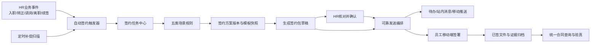
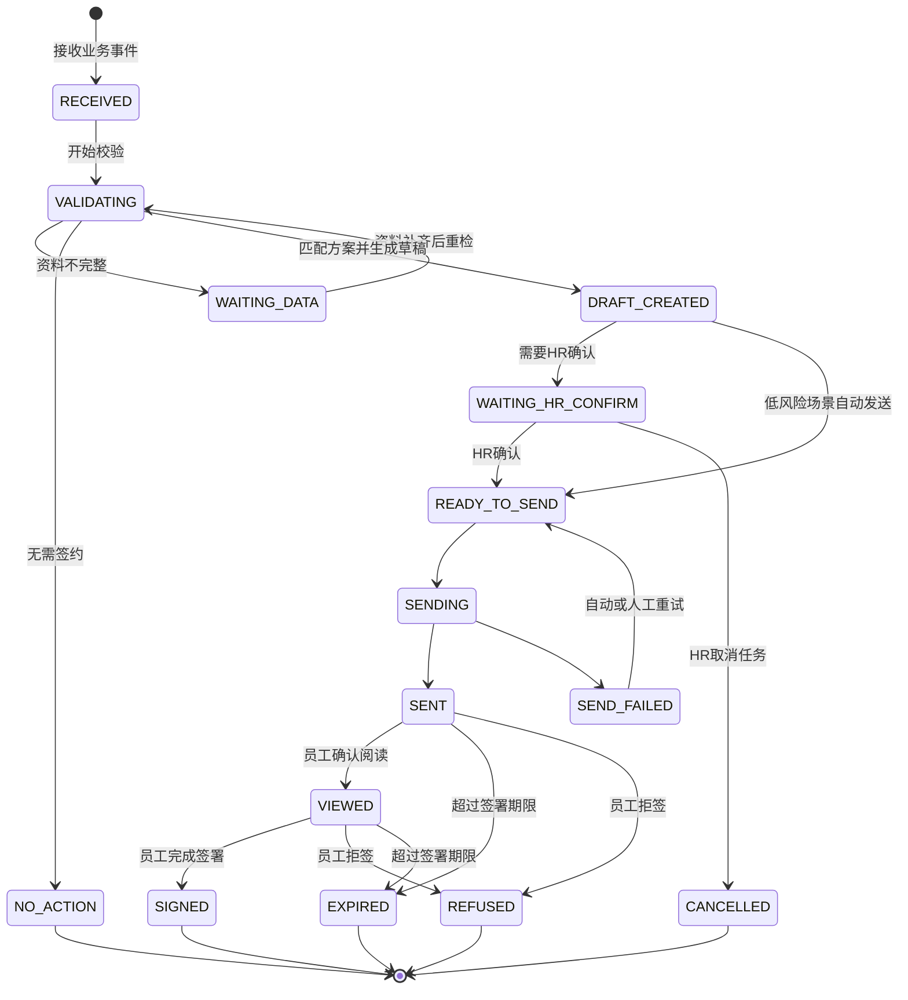

# 统一合同签约与分阶段自动发送设计

**日期：** 2026-07-12

**状态：** 已确认

**范围：** 入职、转正、调岗、离职、续签五类员工签约场景

## 1. 目标

在保留现有员工签约包、移动端签署和旧劳动合同历史证据的前提下，建设统一的合同签约任务体系，实现：

- 五类HR业务事件自动创建签约任务；
- 五类场景自动生成草稿；
- 第一阶段由唯一HR确认后发送；
- 第二阶段仅标准入职和标准续签允许无人值守自动发送；
- 转正、调岗、离职始终由HR确认；
- 员工通过“我的签约”完成阅读、手写签名、确认或拒签；
- HR通过业务化结论完成验真，无需理解技术hash；
- 新旧合同统一展示，但旧数据不做物理迁移；
- 任务、文件、通知、重试和签署证据均可追溯、可验证、可关闭。

## 2. 已确认的产品决策

1. 采用“现有签约包＋统一任务编排层”的增量方案，不重建并迁移全部历史合同。
2. 最终覆盖入职、转正、调岗、离职、续签五类场景。
3. 自动化分阶段实施：先自动草稿和HR确认，再开放低风险自动发送。
4. 第二阶段仅入职和续签可自动发送；转正、调岗、离职继续人工确认。
5. 任务由明确业务动作触发，定时扫描只负责续签到期发现和漏单补偿。
6. 业务侧只配置一个角色“HR合同管理员”，不建立制单人和复核人分离机制。
7. HR只需执行一次“确认发送”；确认后冻结资料和文件版本。
8. 员工提醒使用系统待办、站内消息和移动端推送，不在本期接入短信。
9. 旧劳动合同保留原表、原文件和原验真方式，通过统一查询层展示。
10. hash属于系统和审计证据，HR默认只看到“完整、异常、待验证”等业务结论。

## 3. 当前系统基础与主要缺口

### 3.1 可复用能力

现有系统已经具备：

- `oa_sign_package`签约包及文件、事件表；
- 单员工创建草稿和按岗位批量生成草稿；
- 签约模板和签约方案；
- 草稿人工发送；
- 员工移动端阅读确认、手写签名和一次性签署；
- 私有文件下载；
- 旧劳动合同版本冻结、企业章、签署归档和hash验真；
- 门店范围和员工本人访问控制的基础设施。

### 3.2 必须解决的缺口

- 没有业务事件驱动的自动签约任务；
- 批量能力只生成草稿，发送仍依赖逐份点击；
- 员工档案与签约规则使用不同合同类型、社保类型值；
- 签约方案不会自动按A1-A6/B1-B3选择；
- 方案和模板在草稿生成后仍可能变化；
- 员工实际阅读PDF与当前记录的文件hash没有严格绑定；
- 当前签约后文件与签约前文件可能相同，手写签名主要存在独立证明中；
- 签署确认后端使用包含判断，不是精确匹配；
- 关键状态更新缺少持久化幂等和数据库条件更新；
- 发送、提醒、失败重试、逾期、拒签和续签缺少统一状态机；
- 签约事件中的操作角色不能准确区分系统、HR和员工；
- 旧劳动合同入口与新签约包入口分离；
- 完整前端测试门禁受重复测试文件影响。

## 4. 范围与非目标

### 4.1 本设计包含

- 五类场景业务事件、规则、任务和草稿；
- 单HR确认发送；
- 入职和续签的第二阶段自动发送；
- 方案发布版本与模板快照；
- 文件冻结、已签PDF、签署证明和验真；
- 员工拒签、逾期、重发和异常处理；
- 站内待办、站内消息和移动端推送；
- 新旧合同统一查询；
- 运营指标、开关、影子模式和回滚机制。

### 4.2 本期不包含

- 第三方CA电子签平台接入；
- 短信验证码或短信提醒；
- 将旧劳动合同物理迁移到签约包表；
- 转正、调岗、离职的无人值守自动发送；
- 复杂可配置审批流；
- 多HR制单与复核分离；
- 对已签历史文件进行重生成或重签。

## 5. 总体架构



### 5.1 业务事件接入层

接收确认入职、转正审批完成、调岗生效、确认离职和续签确认事件。普通员工档案保存不直接创建发送动作。事件消费只创建或更新签约任务，不直接调用发送接口。

### 5.2 签约任务中心

任务中心是自动签约的唯一业务入口，负责去重、状态流转、资料校验、方案匹配、草稿、HR确认、发送、失败和完成记录。

### 5.3 场景规则层

每个场景使用独立规则单元，统一接收不可变 `SignRuleInput`，统一返回：

- `ELIGIBLE`：资料完整且唯一匹配；
- `WAITING_DATA`：资料不完整；
- `NO_ACTION`：当前事件不需要签约；
- `MANUAL_REVIEW_REQUIRED`：存在冲突或高风险，只能由HR处理。

### 5.4 方案版本中心

方案发布后产生不可修改版本。任务和签约包引用具体版本，不引用可编辑草稿方案。模板文件、规则和企业章均在确认或自动发送前冻结。

### 5.5 文件与证据服务

文件生成、PDF转换、签名写入、企业章、证书、hash和存储从现有签约包服务中拆出，避免创建、发送、签署和文件处理继续集中在一个服务类。

### 5.6 可靠通知

业务事务只写通知outbox。独立消费者负责生成待办、站内消息和移动推送，通知失败不回滚合同状态。

### 5.7 统一查询

通过查询适配器将新签约包与旧劳动合同转换为统一合同摘要。旧数据保持只读，下载和验真仍调用原服务。

## 6. 角色与权限

业务侧只配置一个角色：`HR合同管理员`。

该角色可以：

- 查看授权门店内员工签约资料；
- 补充和修正签约资料；
- 管理模板、方案版本和自动化开关；
- 生成、编辑和确认草稿；
- 发送、撤回、重发和重试；
- 处理拒签、逾期和异常任务；
- 查看合同、业务化验真结果和任务日志。

员工本人通过登录身份访问自己的合同，不配置额外HR业务角色。系统管理员保留技术超级权限，但不作为日常业务角色。

所有写接口必须在服务端重新确认：

- 当前员工存在且启用；
- 员工属于当前HR可访问组织范围；
- 签约包、任务、方案版本和法律主体范围一致；
- 员工端只能访问本人任务和文件；
- 前端传入的门店、员工和状态均不能作为唯一可信依据。

## 7. 状态机

签约任务状态和签约包状态分开管理。



第一阶段五类场景均进入 `WAITING_HR_CONFIRM`。第二阶段只有标准入职和标准续签在满足自动发送条件时可以从 `DRAFT_CREATED` 进入 `READY_TO_SEND`。其他场景保持HR确认。

## 8. 核心数据模型

### 8.1 `oa_sign_task`

主要字段：

- `task_id`、`task_no`；
- `scenario`、`employee_id`、`shop_dept_id`、`legal_entity_id`；
- `source_type`、`source_business_id`、`source_event_version`；
- `dedupe_key`；
- `status`、`automation_level`、`risk_level`；
- `plan_version_id`、`package_id`；
- `confirmed_by`、`confirmed_time`、`confirmed_snapshot_hash`；
- `sign_deadline`；
- `failure_code`、`failure_detail`；
- `retry_count`、`next_retry_time`；
- `version`乐观锁；
- 创建、发送、完成和取消审计字段。

`dedupe_key`建立唯一索引，例如：

```text
ONBOARD:employeeId:onboardingRecordId:eventVersion
REGULARIZE:employeeId:regularizationRecordId:eventVersion
TRANSFER:employeeId:transferRecordId:eventVersion
OFFBOARD:employeeId:offboardingRecordId:eventVersion
RENEWAL:employeeId:oldContractId:renewalRound
```

### 8.2 `oa_sign_task_event`

记录任务状态变化、业务动作、操作人类型、操作人、前后状态、原因、IP、User-Agent、发生时间、前序事件hash和当前事件hash。

操作人类型只允许：

- `SYSTEM`；
- `HR`；
- `EMPLOYEE`；
- `ADMIN`。

### 8.3 `oa_sign_plan_version`

记录方案发布版本、场景、适用门店和法律主体、规则JSON、默认字段、签署期限、提醒策略、自动发送条件、发布人、发布时间、状态和版本hash。

### 8.4 `oa_sign_plan_version_template`

冻结模板ID、模板版本、模板类型、文件hash、顺序、必签标记、签名定位、企业章定位和模板匹配条件。

### 8.5 `oa_sign_file_evidence`

每份文件记录：

- 原模板hash；
- 填充后源文件hash；
- 员工阅读PDF hash；
- 已签PDF hash；
- 签名图片hash；
- 企业章hash；
- 签署证书hash；
- 文件存储地址、大小、版本和生成时间。

### 8.6 `oa_sign_notification_outbox`

记录通知类型、接收人、业务去重键、载荷、状态、重试次数、下次重试时间、发送结果和错误详情。

### 8.7 现有表扩展

`oa_sign_package`增加：

- `task_id`；
- `plan_version_id`；
- `confirm_status`；
- `document_version`；
- `sign_deadline`；
- `version`。

`oa_sign_package_document`增加或明确映射：

- `review_pdf_url`、`review_pdf_hash`；
- `signed_pdf_url`、`signed_pdf_hash`；
- `signature_file_url`、`signature_hash`；
- `certificate_file_url`、`certificate_hash`；
- `document_version`。

## 9. 字典与资料标准化

签约规则只使用标准化值，不直接依赖HR页面展示文本。

### 9.1 合同类型

- 固定期限劳动合同、无固定期限劳动合同 → `LABOR_CONTRACT`；
- 劳务协议 → `SERVICE_CONTRACT`；
- 实习协议 → `INTERNSHIP_AGREEMENT`；
- 外包合同 → `OUTSOURCING_CONTRACT`。

### 9.2 社保类型

- 本地社保、异地社保 → `SOCIAL_INSURED`；
- 无需缴纳 → `SOCIAL_UNINSURED`；
- 劳务派遣、待确认 → 不能进入标准九类自动匹配。

### 9.3 基础校验

发送前必须校验：

- 手机号格式；
- 证件类型、证件号码格式和身份证校验位；
- 合同开始日期早于结束日期；
- 试用期处于合同期内；
- 入职、转正、调岗、离职生效日期合理；
- 薪资明细与合计一致；
- 门店、部门、岗位、职级和法律主体存在且有效；
- 员工没有同业务事件的未完成重复任务。

## 10. 五类场景规则

### 10.1 入职 `ONBOARD`

触发：HR执行“确认入职”。

必备资料：账号、姓名、手机号、证件、地址、组织、岗位、职级、合同类型、社保类型、入职日期、合同起止日期、薪资和法律主体。

标准劳动/劳务员工继续使用A1-A6/B1-B3匹配。实习、外包、劳务派遣、合同类型或社保类型不确定时进入人工确认，不参与标准自动发送。

第一阶段由HR确认，第二阶段允许符合标准规则且无风险标记的任务自动发送。

### 10.2 转正 `REGULARIZE`

触发：转正审批完成。

根据实际变化生成转正确认书、岗位职责、薪资确认或其他转正材料。冻结转正前后岗位、职级、薪资和组织快照。该场景始终由HR确认。

### 10.3 调岗 `TRANSFER`

触发：调岗审批完成且生效日期确定。

比较调岗前后的门店、部门、岗位、职级、地点、薪资、法律主体和汇报关系。只有发生需要员工确认的变化才创建签约任务。

跨法律主体、跨城市、降职、降薪、自定义补偿或生效日期已过的情况标记高风险。该场景始终由HR确认。

### 10.4 离职 `OFFBOARD`

触发：HR执行“确认离职”，且离职类型和最后工作日已确定。

根据离职类型生成离职确认、交接、结算、保密竞业提醒或解除终止材料。

员工拒绝确认、辞退、违纪解除、劳动争议、赔偿自定义、竞业待决定、工资资产交接未完成时进入异常离职人工队列。该场景始终由HR确认。

### 10.5 续签 `RENEWAL`

合同到期前30天由定时扫描创建续签决策待办，30天可按方案配置。扫描不直接生成合同。HR确认是否续签、新期限、合同类型、岗位职级薪资和法律主体后产生 `RENEWAL_CONFIRMED` 事件。

第一阶段由HR确认。第二阶段只有继续在职、法律主体和合同类型不变、无特殊薪资岗位条款、使用已发布标准方案且距离到期日满足最短签署天数时允许自动发送。

### 10.6 全场景人工降级条件

- 员工资料被手工覆盖；
- 特殊证件或特殊用工类型；
- 自定义条款或人工模板；
- 零个或多个方案命中；
- 方案或模板hash异常；
- 存在同场景未完成任务；
- 生效日期异常；
- 薪资不一致；
- 门店与法律主体关系无法确认。

## 11. 方案与模板治理

### 11.1 方案生命周期

方案状态为：

- `DRAFT`：可编辑，不可用于发送；
- `PUBLISHED`：不可直接编辑，可用于新任务；
- `DISABLED`：停止新任务使用，历史任务继续引用；
- `ARCHIVED`：只供历史查询。

修改已发布方案必须创建新版本。

### 11.2 方案完整性检查

发布前检查：

- 方案场景与模板场景一致；
- 劳动合同和劳务合同模板不能互相混用；
- 社保条件与模板条件一致；
- 模板类型不重复且不存在互斥文件；
- 必需文件齐全；
- 模板文件hash与记录一致；
- 所有必需占位符存在；
- 签名和企业章定位有效；
- 同一适用范围不会与其他已发布方案产生重叠匹配。

### 11.3 HR确认失效条件

HR确认后，下列任一内容变化都会使确认失效：

- 员工、岗位、组织、合同、日期或薪资快照；
- 方案版本；
- 模板版本、文件清单或文件hash；
- 企业章版本；
- 阅读PDF内容。

## 12. 文件生成、签署和证据链

### 12.1 不可变文件链路

每份文件依次生成：

1. `template_source`：原始模板；
2. `rendered_source`：填充后的DOCX/XLSX；
3. `review_pdf`：HR和员工实际阅读的PDF；
4. `signed_pdf`：包含签名、企业章和证据页的最终PDF；
5. `signature_image`：手写签名原图；
6. `sign_certificate`：签约包级证明。

进入确认或发送状态后不得覆盖原路径。修改资料必须生成新的 `document_version`。

### 12.2 PDF要求

- 员工最终签署对象统一为PDF；
- DOCX/XLSX仅作为源文件保存；
- PDF转换必须保留表格、分页、页眉页脚、字体和图片；
- 模板有签名定位时在指定位置写入签名和企业章；
- 没有定位时追加标准签署页，不能生成没有签名的“已签合同”。

### 12.3 阅读确认

员工打开文件时，系统返回文档ID、文档版本、阅读PDF hash和受保护文件。确认阅读记录员工、服务端时间、IP、User-Agent、版本、hash和事件hash。

### 12.4 签署请求

签署请求必须包含：

```json
{
  "packageId": 1001,
  "documentVersion": "SP-1001-V3",
  "documentHashes": [
    {
      "documentId": 501,
      "reviewPdfHash": "sha256-value"
    }
  ],
  "signConfirmText": "本人确认签署本签约包",
  "signatureDataUrl": "data:image/png;base64,...",
  "requestId": "unique-idempotency-id"
}
```

后端重新校验本人、状态、版本、全部文件hash、阅读确认、精确确认短语、签名图片和请求幂等性。

### 12.5 已签PDF和证书

已签PDF写入员工手写签名、冻结企业章、服务端签署时间和证据页，并计算独立hash。

签署证书记录任务号、签约包号、文档版本、员工、用人主体、文件清单、阅读PDF和已签PDF hash、签名hash、企业章hash、签署时间、IP、设备、确认短语、HR确认人和任务事件链根hash。

### 12.6 业务化验真

HR默认只看到：

- 文件完整，验真通过；
- 文件与签署记录不一致；
- 文件缺失，暂时无法验证；
- 历史合同，仅支持旧版验真。

“验证文件”按钮由系统自动计算hash并返回业务结论。完整SHA-256和事件链hash默认折叠，仅技术权限可查看。验真报告使用业务语言，在附录保留技术证据。

## 13. HR合同签约中心

统一入口包含四个页签：

1. `签约任务`：五类任务、状态、期限和异常；
2. `合同档案`：新签约包和旧劳动合同；
3. `模板与方案`：模板、版本、规则和文件清单；
4. `自动化设置`：场景开关、期限、提醒和自动发送范围。

### 13.1 首页指标

- 待补资料；
- 待HR确认；
- 发送失败；
- 已查看未签；
- 即将逾期；
- 员工拒签；
- 本月已完成。

### 13.2 任务详情

按以下顺序展示：

```text
任务基本信息
→ 员工与组织资料
→ 合同与薪资字段
→ 匹配方案
→ 文件清单和预览
→ 系统校验结果
→ 确认发送
```

校验结果使用绿色“可发送”、黄色“需确认”和红色“不能发送”，并提供具体字段原因。

### 13.3 单次确认

HR确认弹窗展示员工、场景、合同类型、期限、文件清单、签署截止时间和风险提示。HR输入登录密码或二次确认短语后提交。系统记录确认人、时间、资料摘要、方案版本和文件摘要。

### 13.4 批量处理

支持批量生成草稿、补共同字段、确认标准入职、重试发送和发送提醒。

批量确认仅允许同场景、同方案版本、校验全部通过、无自定义条款、无人工模板和无风险警告的任务。调岗、离职及存在薪资变化的任务默认逐份确认。

### 13.5 自动化模拟检查

开启自动发送前展示：

- 将自动发送数量；
- 将转人工数量；
- 资料不完整数量；
- 方案冲突数量；
- 每条任务的判断原因。

HR确认模拟结果后才能开启场景自动发送。

## 14. 员工端“我的签约”

统一展示：

- 待处理；
- 已查看；
- 已签署；
- 已拒签；
- 已过期；
- 历史合同。

员工签署流程：

1. 查看合同摘要和期限；
2. 逐份打开阅读PDF；
3. 确认阅读；
4. 手写签名；
5. 输入精确确认短语；
6. 一次签署全部必签文件。

员工可以选择“合同信息有误”并提交拒签原因：个人资料、日期、岗位薪资、条款异议或其他。

拒签后冻结当前版本，HR收到高优先级待办。修改资料后必须生成新版本并重新确认，旧版本不能重新发送。

## 15. 通知与重试

### 15.1 通知规则

| 事件 | 接收人 | 渠道 |
| --- | --- | --- |
| 资料不完整 | HR合同管理员 | 待办＋站内消息 |
| 草稿待确认 | HR合同管理员 | 待办＋站内消息＋移动推送 |
| 合同已发送 | 员工本人 | 我的签约＋站内消息＋移动推送 |
| 临近截止 | 员工本人 | 站内消息＋移动推送 |
| 员工拒签 | HR合同管理员 | 高优先级待办＋移动推送 |
| 合同逾期 | HR合同管理员 | 待办＋站内消息 |
| 发送失败 | HR合同管理员和系统运维 | 异常待办 |
| 签署完成 | HR合同管理员 | 站内消息 |

默认在发送后24小时和截止前24小时各提醒一次。方案版本可以调整提醒时间。

### 15.2 通知去重

通知使用唯一业务键：

```text
SIGN_SENT:packageId:documentVersion
SIGN_REMINDER:packageId:deadline:24H
SIGN_REFUSED:packageId:eventId
```

### 15.3 重试策略

可重试错误使用：

```text
1分钟 → 5分钟 → 30分钟 → 2小时 → 6小时
```

超过最大次数进入失败队列并生成运维待办。

可重试错误包括临时数据库、网络、文件服务、推送超时和PDF转换服务暂时不可用。

不可重试错误包括资料不完整、方案冲突、占位符缺失、hash异常、组织不匹配、日期或薪资非法。不可重试错误进入HR待处理并展示具体修复建议。

## 16. 并发、幂等与自动化控制

### 16.1 条件状态更新

所有关键状态使用状态和版本条件：

```sql
UPDATE oa_sign_task
SET status = 'SENDING', version = version + 1
WHERE task_id = ?
  AND status = 'READY_TO_SEND'
  AND version = ?;
```

发送、签署、拒签、撤回和重试都要求唯一 `requestId`。重复请求返回第一次结果，不重复生成文件、事件和通知。

### 16.2 自动化开关

提供：

- 全局自动签约总开关；
- 门店或法律主体开关；
- 场景开关；
- 方案版本开关。

关闭自动发送后，新任务转为 `WAITING_HR_CONFIRM`；已发送合同继续正常签署。

## 17. 文件存储

- 合同文件存放在私有目录或私有对象存储；
- 文件路径包含任务ID、签约包ID和文档版本；
- 下载必须经过本人或组织范围鉴权；
- 先在临时目录生成全部文件；
- 数据库状态成功后原子转入正式目录；
- 失败任务的临时文件定期清理；
- 已签文件和证书禁止自动清理；
- 建立备份、恢复和定期hash抽检。

## 18. 新旧合同兼容

不迁移旧劳动合同。

统一查询对象至少包含：

- 来源类型；
- 合同或签约包ID；
- 员工、场景、合同类型；
- 状态、发送时间、签署时间；
- 文件数量、证书编号；
- 验真能力和历史标识。

旧劳动合同保持原下载、签署归档和验真接口。旧待签合同也进入员工“我的签约”，避免入口隐藏导致无法处理。

## 19. 分阶段实施

### 阶段0：基线清理与数据审计

- 统一字典和旧值映射；
- 扫描员工缺失资料；
- 检查模板、方案和文件hash；
- 清理重复测试文件；
- 核对线上代码、数据库、JAR和前端版本；
- 盘点旧待签合同。

### 阶段1：文件与证据链

- 阅读PDF hash；
- 精确确认短语；
- 已签PDF；
- 签名与企业章；
- 文件版本；
- 签署证书；
- 业务化验真；
- 私有存储与临时文件清理。

### 阶段2：任务中心与单HR确认

- 任务、事件和去重键；
- 业务事件接入；
- 状态机和乐观锁；
- 待补资料、确认、失败；
- HR一次确认；
- 待办、站内消息和移动推送；
- 重试和自动化开关。

### 阶段3：五类场景自动草稿

按入职、续签、转正、调岗、离职顺序接入。所有场景仍由HR确认发送。

### 阶段4：入职和续签自动发送

先运行影子模式，再按门店和标准方案逐步开放。

影子模式至少连续运行7天，并满足：

- 错误方案命中为0；
- 重复任务为0；
- 文件验真通过率100%；
- HR没有人工更换系统推荐方案；
- 发送成功率不低于99%。

### 阶段5：统一合同查询

接入新旧数据源、历史待签入口、统一列表、统一下载和业务化验真。

### 阶段6：运营报表和持续治理

提供任务量、资料完整率、匹配率、人工降级原因、发送成功率、拒签率、逾期率、签署时长和方案使用情况。

## 20. 测试策略

每个阶段至少包含：

- 场景规则单元测试；
- 状态机和条件更新测试；
- MyBatis真实数据库集成测试；
- 文件生成和hash测试；
- DOCX/XLSX到PDF逐页视觉检查；
- HR确认和员工签署端到端测试；
- 重复事件、重复点击和并发签署测试；
- 门店与员工本人范围测试；
- 通知去重和重试测试；
- SQL升级与回滚测试；
- 历史合同兼容测试；
- 文件备份与恢复验证。

## 21. 验收标准

### 21.1 硬性标准

- 错误合同或错误模板发送数量为0；
- 同一业务事件重复任务数量为0；
- 员工阅读文件hash与发送冻结hash一致；
- 已签PDF、证书和签名拥有独立可验证hash；
- 修改已签文件后验真必定失败；
- HR无需查看hash即可判断文件是否完整；
- 自动发送可以即时关闭；
- 关闭自动发送不影响已发送合同签署；
- 旧合同文件和证据不被修改。

### 21.2 运行指标

- 标准发送成功率不低于99%；
- 通知重复率为0；
- 自动任务可解释率100%，每条任务均能展示匹配或降级原因；
- 自动发送任务的方案版本、模板版本和应用版本可追溯率100%。

## 22. 上线与回滚

- 数据库只做向后兼容增量变更；
- 新功能全部受开关控制；
- 先上线任务记录和影子判断，再开启自动发送；
- 回滚时关闭事件消费和自动发送；
- 待发送任务转为HR确认；
- 已生成、已发送和已签文件不删除、不降级；
- 失败任务保留原因，服务恢复后继续处理；
- 每次发布记录方案版本、模板版本、应用版本和数据库版本对应关系。

## 23. 设计完成定义

本设计完成后，详细实施计划必须拆成可独立交付的阶段计划。每个阶段都需要明确文件清单、数据库迁移、接口契约、TDD步骤、验证命令、提交边界、上线开关和回滚步骤。任何阶段不得以自动发送为由跳过文件证据、状态幂等或权限范围校验。
