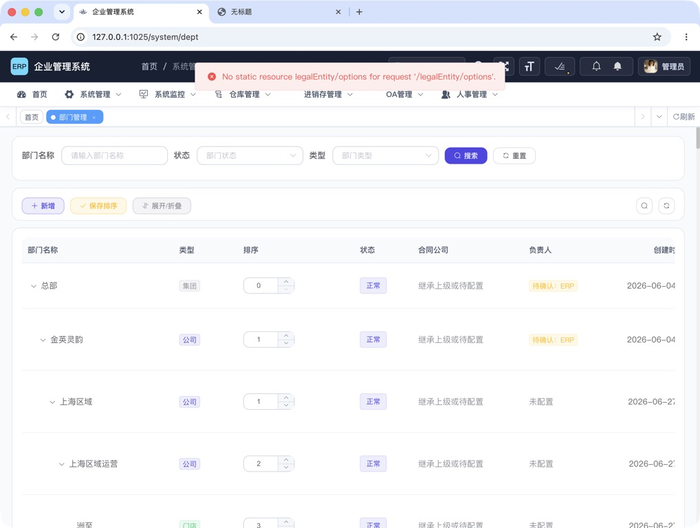
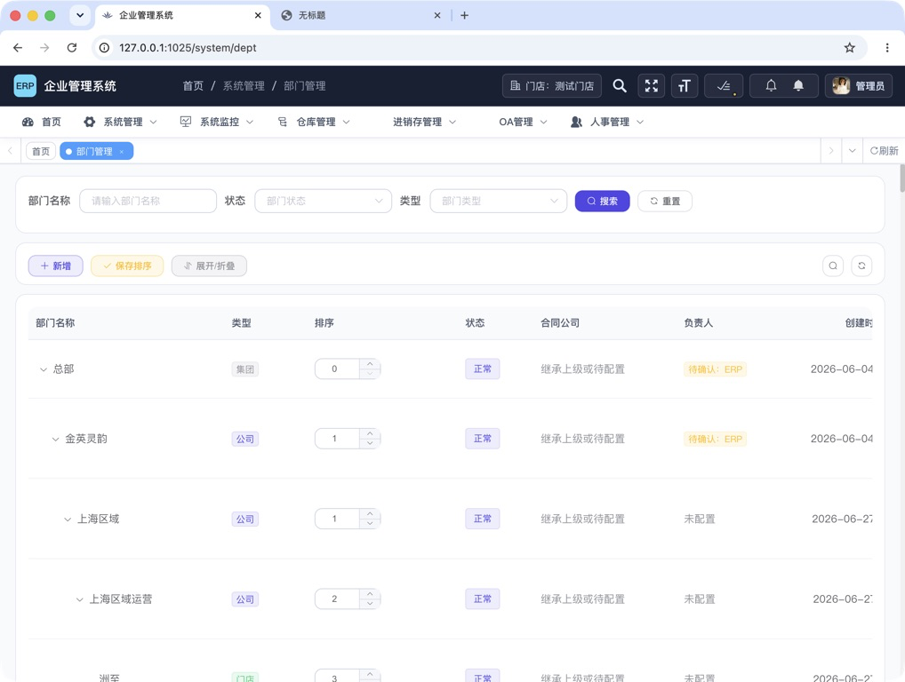
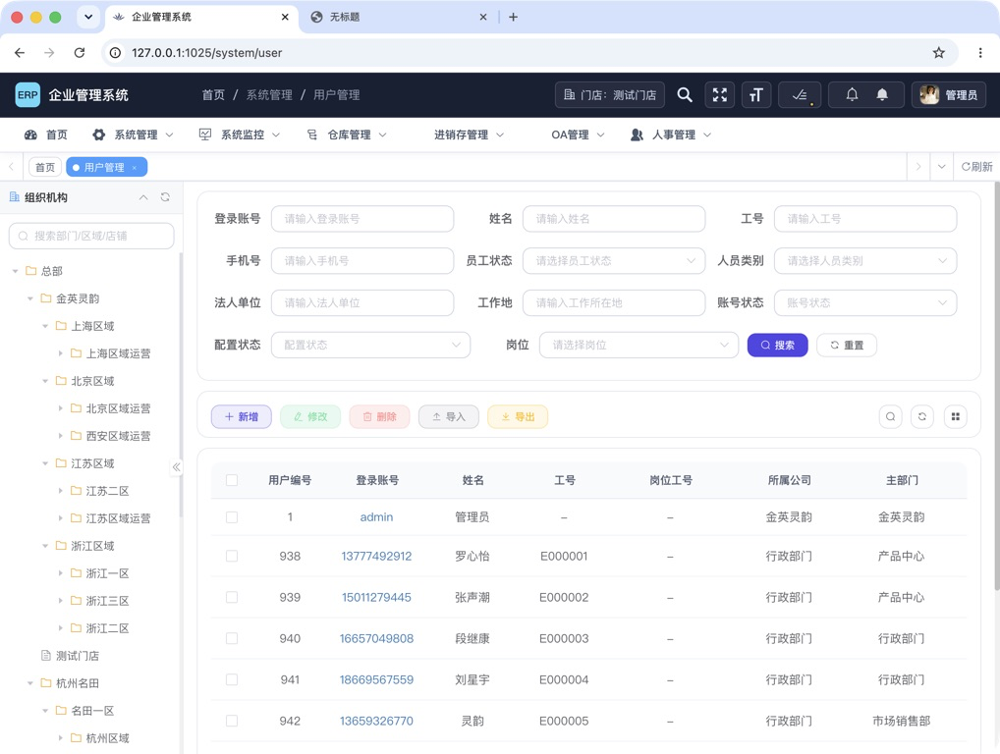
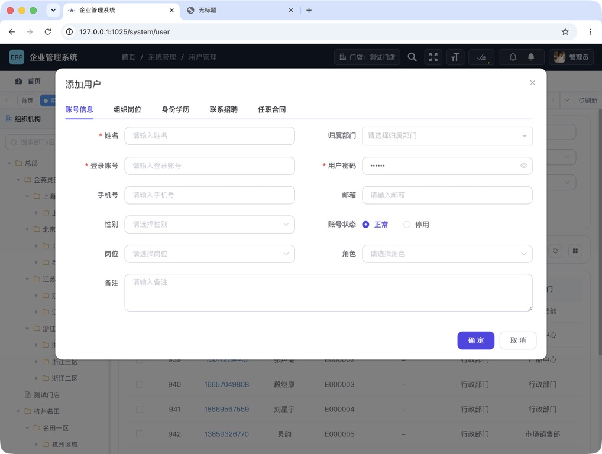
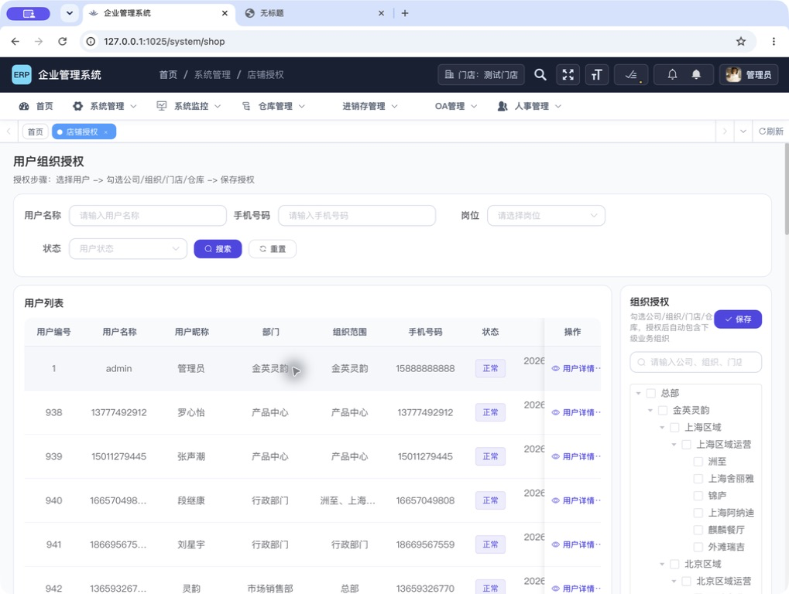
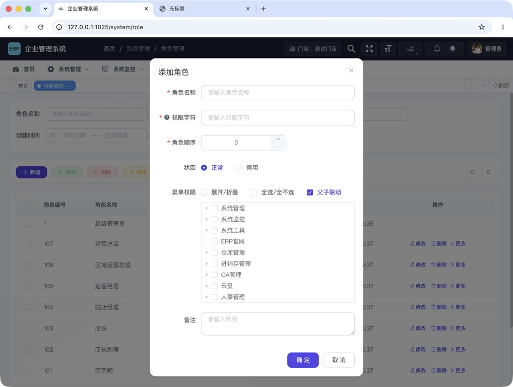
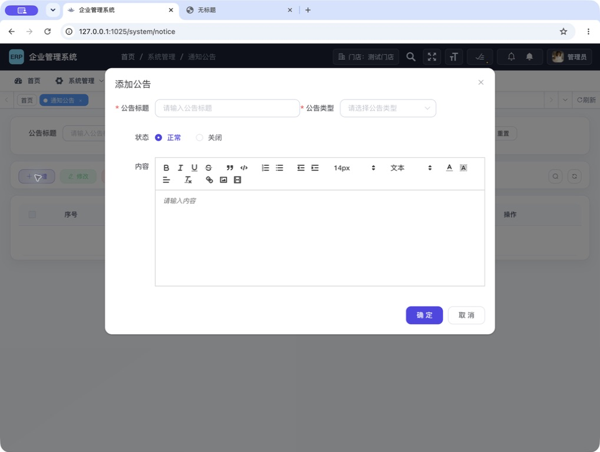
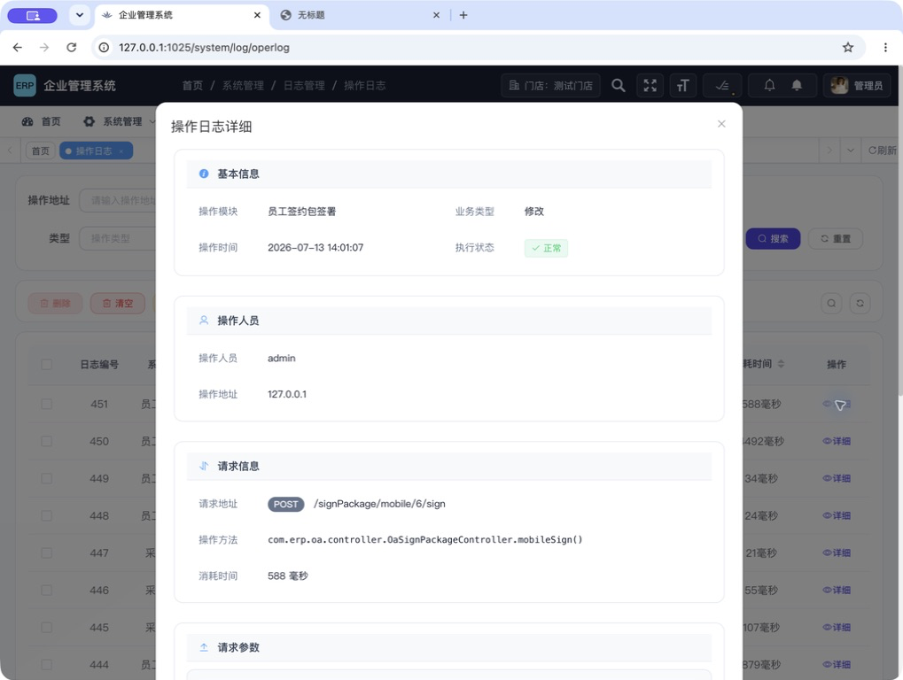

# ERP 系统管理专项检查报告

检查日期：2026-07-14  
检查范围：系统管理桌面端、对应后端权限与发布/测试链路  
检查方式：本机真实服务、真实页面、源码与数据库权限配置交叉核对  
环境约束：未使用虚拟机、Docker 或任何虚拟化环境

## 一、结论

当前系统管理核心功能可以使用，但**不建议把当前状态直接作为生产发布候选**。

用户、角色、部门、菜单、岗位/字典、组织授权、公告、登录日志等基础流程总体可走通；已有的确认弹窗、批量授权、富文本净化和部分数据范围校验也做得不错。真正阻断上线的是以下三类问题：

1. **P0：操作日志保存并返回手写签名、薪资/合同字段、私有文件路径等敏感内容。**
2. **P0：全局初始密码以明文系统参数存在，参数值又可被任意已登录用户按 ID/键名读取。**
3. **P1：权限定义、源码、数据库菜单和发布包存在漂移，导致“授权项无效”和“源码有接口、运行包无接口”。**

建议先完成 P0 和发布/权限 P1，再做易用性改造。否则界面越方便，敏感数据和错误权限传播得越快。

## 二、检查方案

### 2.1 检查维度

| 维度 | 检查内容 | 验证方式 |
| --- | --- | --- |
| 功能完整性 | 列表、查询、新增、编辑、删除、启停、排序、授权、导出、空状态 | 真实页面逐流程走查 |
| 权限边界 | 页面按钮、前端权限、后端注解、数据库菜单权限是否一致 | Vue、Controller、`sys_menu` 三方对照 |
| 数据安全 | 密码、手机号、签名、薪资、合同、请求/响应日志、导出 | 页面、接口对象、数据库聚合检查 |
| 易用性 | 信息密度、操作可见性、错误预防、空状态、批量操作、帮助文本 | 1018×768 真实桌面视口走查 |
| 可访问性 | 控件名称、状态开关、图标按钮、键盘/读屏可理解性 | 浏览器辅助功能树抽查 |
| 可靠性 | 当前源码与运行包、依赖缺失、异常反馈、未保存保护 | 本机服务复验、JAR 类清单对比 |
| 测试门禁 | 系统管理专项、前端全量、后端专项、后端全量 | Node/Maven 测试与线程栈定位 |

### 2.2 覆盖流程

已实际检查：

- 登录页与系统管理入口
- 用户列表、新增用户、状态与密码相关实现
- 角色列表、新增角色、菜单权限树、数据范围实现
- 部门树、合同公司、负责人、批量排序
- 菜单树、新增目录/菜单动态字段、批量排序
- 用户组织/门店/仓库授权：未选用户、已选用户、授权树
- 字典管理、参数设置
- 操作日志列表与详情、登录日志
- 通知公告列表、空状态、新增公告富文本编辑器
- 对应 13 个系统 Controller、权限字符串、服务实现和数据库菜单配置

### 2.3 测试角色建议

后续回归不应只使用超级管理员，至少建立以下固定测试账号：

1. 超级管理员
2. 用户管理员：仅用户查询/新增/编辑，不含组织授权
3. 组织授权管理员：仅用户列表、组织授权查询/修改
4. 角色管理员：角色查询/编辑，不含用户编辑
5. 审计员：日志列表，不含敏感详情/导出
6. 门店负责人：仅本门店及下级数据
7. 只读支持人员：仅查询权限

每个账号都要验证：菜单可见、按钮可见、接口返回、越权请求、数据范围、导出内容五层一致。

## 三、流程健康度

| 流程 | 结果 | 说明 |
| --- | --- | --- |
| 登录与入口 | 部分通过 | 登录及组织选择可用；本次为避开验证码人工识别而在本地运行时关闭验证码，验证码有效性未复验 |
| 用户管理 | 可用但需优化 | 新增/编辑分五个标签，结构清楚；默认视图过滤项过多、关键列被横向挤出、手机号明文 |
| 角色管理 | 基本通过 | 状态变更有确认，菜单权限集中；权限字符/继承语义偏技术，创建时不说明默认数据范围 |
| 部门管理 | 当前源码通过 | 当前源码构建可用；旧发布包缺少合同公司接口，页面曾直接报错 |
| 菜单管理 | 基本通过 | 类型切换后渐进展示字段是优点；技术字段帮助不足，排序未保存无离开提醒 |
| 组织授权 | 基本通过 | 有步骤提示、搜索、空状态、未保存切换确认；右侧树过窄，缺少变更预览和有效权限解释 |
| 字典管理 | 通过 | 查询、列表、缓存刷新和行级操作清晰 |
| 参数设置 | 阻断 | 敏感值明文显示；读取权限过宽；内置参数可先改为非内置再删除 |
| 操作日志 | 阻断 | 通用日志包含高敏请求/响应，列表和导出都会返回 |
| 登录日志 | 通过 | 查询、状态、清理、解锁入口清楚 |
| 通知公告 | 可用但能力不足 | 富文本有服务端净化；没有受众、草稿/发布、定时、预览和发布确认 |
| 可访问性 | 部分通过 | 多个开关和图标按钮缺少业务化名称，公告编辑器存在无名称按钮；未做完整 WCAG 符合性认证 |

## 四、问题清单

### P0-01 操作日志泄露高敏请求与响应

**证据**

- 真实操作日志详情中可读取手写签名图片的 Base64、签约请求标识、薪资/合同字段和私有文件路径。
- 数据库现有 352 条通用操作日志中，至少 2 条包含签名载荷字段，至少 5 条响应包含薪资字段。
- 请求与响应各截断到 2000 字符；敏感数据已泄露，但日志又因截断失去完整审计价值。
- `LogAspect` 默认同时保存请求和响应，中央排除字段仅覆盖常见密码字段。
- `SysOperLog` 将请求参数和响应结果都标记为可导出字段。
- 操作日志列表接口直接返回完整日志对象，没有独立详情权限。

**影响**

- 拥有 `system:operlog:list` 的人员可批量获得签名、合同和薪资信息。
- `system:operlog:export` 会进一步扩大泄露范围。
- Base64 大字段增加数据库、接口和前端传输负担。
- 截断后的签名/响应无法作为可靠审计证据。

**立即处理**

1. 对签约、合同、薪资、密码重置、令牌等端点关闭原始请求/响应保存；只记录业务主键、动作、结果、操作者和耗时。
2. 暂停普通角色的操作日志导出权限。
3. 对历史日志先留受控备份，再执行字段级脱敏或清理；清理动作本身写入独立审计记录。
4. 操作日志列表改用摘要 DTO，不返回 `operParam/jsonResult/errorMsg` 全文。
5. 新建受控详情接口并真正启用 `system:operlog:query`；详情仍只返回脱敏内容。
6. 中央日志策略改为“允许字段清单”，而不是不断增加敏感字段黑名单。

**验收标准**

- 数据库中 `signatureDataUrl`、工资、银行卡、证件号、令牌等模式计数为 0。
- 仅有日志列表权限的账号无法获取请求/响应正文。
- 导出文件默认不含请求、响应和错误堆栈全文。
- 敏感端点自动化测试验证日志中只存在业务摘要。

相关位置：

- `erp-common/erp-common-log/src/main/java/com/erp/common/log/aspect/LogAspect.java`
- `erp-modules/erp-oa/src/main/java/com/erp/oa/controller/OaSignPackageController.java`
- `erp-modules/erp-oa/src/main/java/com/erp/oa/controller/OaLaborContractController.java`
- `erp-api/erp-api-system/src/main/java/com/erp/system/api/domain/SysOperLog.java`

### P0-02 初始密码与系统参数读取边界不安全

**证据**

- 参数列表直接显示全局初始密码值。
- 新增用户时前端读取该参数并自动填入密码框。
- `SysConfigController` 的按 ID 查询和按键名查询只有 `@RequiresLogin`，没有 `system:config:query` 或键名白名单。
- 参数列表会返回所有 `configValue`。

**影响**

- 任意已登录用户都可尝试按可预测 ID/键名读取参数值。
- 新账号使用同一个可预测初始密码，账号创建到首次修改之间存在接管窗口。
- 未来只要有人把令牌、密钥或连接信息放进系统参数，会自动继承同一泄露边界。

**立即处理**

1. 轮换当前全局初始密码，并停止继续使用固定全局初始密码。
2. 改为每个账号随机的一次性临时凭据或邀请激活链接；设置短期过期、首次登录强制修改、使用后失效。
3. 参数列表对敏感项只返回掩码；编辑时不回显原值。
4. 通用 `configKey` 接口改为内部接口；若前端确需主题等公开配置，提供明确白名单的公共配置 DTO。
5. 参数详情至少要求 `system:config:query`，编辑要求 `system:config:edit`。

**验收标准**

- 数据库不再保存可直接用于登录的全局明文初始密码。
- 普通已登录用户读取任意参数 ID/键名返回 403 或白名单值。
- 新账号临时凭据彼此不同、过期后无效、首次使用后失效。
- 页面、接口、日志、导出均不出现密码明文。

相关位置：

- `erp-modules/erp-system/src/main/java/com/erp/system/controller/SysConfigController.java`
- `erp-ui/src/views/system/config/index.vue`
- `erp-ui/src/views/system/user/index.vue`

### P1-01 权限定义存在 5 个孤儿项和实际映射错误

数据库菜单存在、但当前前后端源码没有对应有效使用的权限：

- `system:config:query`
- `system:logininfor:query`
- `system:operlog:query`
- `system:salary:import`
- `system:user:resetPwd`

其中影响最大的情况是：角色编辑器可以授予“重置密码”，但后端重置密码实际要求 `system:user:edit`。这会同时造成两种错误：

- 只授予“重置密码”的角色仍然不能重置密码。
- 拥有普通用户编辑权限的角色自动获得重置密码能力，无法实现最小权限。

**优化方案**

1. 建立单一权限清单，生成或校验数据库菜单、前端按钮和后端注解。
2. 重置密码使用独立 `system:user:resetPwd`。
3. 参数详情使用 `system:config:query`。
4. 操作日志拆分列表与脱敏详情，并启用 `system:operlog:query`。
5. 不准备实现的登录日志详情、薪资导入权限应从菜单中删除，避免误导管理员。
6. CI 增加“数据库权限与源码引用双向差集必须为零”的检查。

### P1-02 发布包与当前源码漂移

**证据**

- 本地发布目录中的系统 JAR 比当前 `target` JAR 少 8 个类。
- 缺失项包括 `SysLegalEntityController`、Mapper 和 Service。
- 使用旧发布包时，部门管理进入即出现 `/legalEntity/options` 找不到资源的错误。
- 切换到当前源码对应的 JAR 后，同一页面复验通过。

**影响**

- 开发环境“源码看起来有功能”，实际发布环境却直接 404。
- 测试结论无法和最终发布物对应。

**优化方案**

1. 发布物必须从干净工作区按提交 SHA 构建，不允许手工复制旧 JAR。
2. JAR Manifest、健康接口和前端页脚暴露版本号/提交 SHA/构建时间。
3. 发布前比较源码构建产物与部署目录校验和。
4. 增加系统管理冒烟：登录后依次请求用户、角色、部门、菜单、参数、日志关键接口。

当前源码构建复验：

### P1-03 全量发布测试门禁目前不可信

**实际结果**

- 系统管理前端专项：1/1 通过。
- 前端 Node 全量：183 项中 180 项通过，3 项签约模块回归失败。
- 系统管理后端专项：79/79 通过。
- 后端系统模块全量：无法完成；单独运行 `SysNoticeReadMapperBindingTest` 也稳定卡住。

**定位结果**

- 线程栈停在 MyBatis `TypeAliasRegistry.registerAliases` / `DefaultVFS` 扫描编译目录。
- 工作区所有 `target` 目录中存在 2375 个带“ 2/3”后缀的冲突副本；系统模块有 616 个重复 `.class`，其中 domain 包 188 个。
- 这些文件已被 `.gitignore` 忽略，但会污染本地测试运行时。

**优化方案**

1. CI 永远从干净检出执行，不复用同步盘中的 `target`。
2. 构建前增加重复产物扫描，发现 `* 2.class`、`* 2.jar` 等立即失败。
3. 修复 3 个前端回归：`signPackageEvidenceUx`、`signPackageModule`、`signTaskCenter`。
4. 将系统管理 UX 测试从“读取源码并断言字符串”升级为组件/浏览器行为测试。

### P1-04 内置参数保护可以被绕过

后端删除时会阻止 `configType=Y` 的内置参数，这是正确保护；但参数编辑弹窗允许把“系统内置”从“是”改成“否”。修改后再删除即可绕过原保护。列表也始终显示删除入口，用户只能在提交后看到错误。

**优化方案**

- 内置属性创建后不可修改，后端也必须拒绝变更。
- 内置行隐藏或禁用删除按钮，并显示“系统依赖，不可删除”的原因。
- 删除确认使用参数名称和影响说明，不只显示参数编号。
- 刷新缓存使用独立权限 `system:config:refresh`，不要复用删除权限。

### P1-05 默认列表过度暴露手机号等个人信息

用户管理和组织授权列表默认显示完整手机号。只要拥有列表权限，就能批量浏览或导出个人信息；这与“为了查找用户需要手机号”不是同一件事。

**优化方案**

- 列表默认掩码显示，详情按权限显示完整值。
- 新增 `system:user:pii:read` 与 `system:user:pii:export`，查看和导出都写审计。
- 搜索仍允许输入完整手机号，但结果展示掩码。
- 组织范围只显示“3 个组织/含 28 个下级”等摘要，点击后在受控抽屉查看明细。

### P2-01 用户管理首屏信息密度过高

在 1018×768 视口下，搜索区有约 10 个过滤项并占据多行；表格只能看到前半部分列，手机号、状态、配置状态和操作需要横向滚动。155 个用户的日常查找因此要在“筛选区—横向滚动—操作列”之间来回移动。

**优化方案**

- 默认只保留账号/姓名、状态、组织三个高频筛选；其余放入“高级筛选”。
- 固定身份列、状态列和操作列；默认隐藏低频 HR 字段。
- 提供列预设：账号管理、入职资料、合同社保、组织授权。
- 记住每位管理员的筛选和列配置。
- 把“未分配角色/未授权范围”做成顶部可点击待办指标。

新增用户的五个标签是正确方向，但建议把初始密码改成安全邀请流程，并在提交前提供“账号、主部门、角色、组织范围”完整性摘要。

### P2-02 组织授权缺少“变更差异”和“最终有效权限”

当前已有步骤提示、树搜索、未选用户空状态、切换用户未保存确认和批量读取，这是优点。主要问题是右侧树在当前视口只有约 200px，层级深时难以判断；同时用户只能看到勾选结果，看不到“新增/移除/继承/超范围保留”的差异。

**优化方案**

- 使用可拖拽分栏，授权树默认至少 360px。
- 保存前展示差异：新增 N、移除 N、继承 N、保留不可编辑 N。
- 节点标记“直接授权/由上级继承/因当前管理员范围不可编辑”。
- 提供“仅显示已选”“展开到匹配项”“清空前二次确认”。
- 新增用户后的引导权限应检查 `system:userShop:list/edit`，当前只检查了 `system:user:edit`。

### P2-03 角色创建没有说明默认数据范围

新增角色弹窗只配置菜单权限，数据范围在角色创建后的“更多”中单独维护。数据库默认是“本部门及以下”，但页面没有说明，管理员容易误以为菜单权限就是完整授权，也难以在提交前审阅最终影响。

**优化方案**

- 将角色创建改为“基本信息 → 菜单权限 → 数据范围 → 成员 → 最终确认”。
- 至少在现有弹窗增加“新角色默认本部门及以下数据权限”的显式说明与入口。
- 权限字符提供例子、用途和不可随意修改的说明。
- 父子联动旁解释继承规则，并在提交前显示菜单/按钮数量。

### P2-04 部门与菜单排序没有未保存保护

页面支持行内修改多个顺序再统一保存，效率不错；但没有脏状态提示，也没有离开页面/刷新/重新查询前的未保存确认。

**优化方案**

- 仅在发生变化后高亮“保存排序”，显示“已修改 N 项”。
- 刷新、筛选、切换页面和关闭标签前提示未保存。
- 保存失败保留本地改动，并明确失败项。

### P2-05 公告管理缺少发布工作流

当前“正常”状态的公告保存后会直接进入所有登录用户的顶部公告列表。页面没有受众范围、草稿/已发布语义、预览、定时发布、到期时间、附件和发布确认。空列表也只有“暂无数据”，没有引导。

**优化方案**

- 状态改为草稿、待发布、已发布、已下线。
- 增加受众：全员、组织/门店、角色、指定人员。
- 增加预览、定时、有效期和发布确认，确认中显示预计接收人数。
- 已发布内容修改采用版本或重新发布，保留历史。
- 空状态提供“新建公告”和“公告将显示在哪里”的说明。

富文本服务端净化已经存在，应保留并继续做 XSS 回归。

### P2-06 可访问性和语言一致性不足

辅助功能树抽查发现：

- 角色状态开关只有通用“切换”，没有“启用/停用 + 角色名”。
- 多个工具栏图标按钮没有可读名称。
- 公告编辑器有若干无名称按钮，部分描述仍是英文命令。
- 对话框关闭按钮显示为 `Close`，其余界面为中文。
- 登录框依赖 placeholder，输入后缺少持续可见标签。

**优化方案**

- 为所有图标按钮、开关、树节点动作补充业务化 `aria-label`。
- 状态开关名称包含对象和目标状态。
- 补齐中文 tooltip，并保证 tooltip 不是唯一说明来源。
- 进行完整键盘回归：Tab 顺序、焦点圈、Esc、Enter、弹窗焦点回收、树键盘操作。

本次是基于真实页面和辅助功能树的风险抽查，不能据此宣称完整符合 WCAG。

## 五、分阶段优化路线

### 阶段 0：停止发布项（0—2 天）

1. 关闭敏感端点原始请求/响应日志，暂停日志敏感导出。
2. 轮换并废弃全局固定初始密码。
3. 收紧配置读取接口，参数列表对敏感值掩码。
4. 用当前源码干净构建并替换漂移的系统发布包。
5. 处理历史敏感日志，留下受控清理审计。

### 阶段 1：权限与发布治理（约 1 周）

1. 清理 5 个孤儿权限，修正重置密码权限。
2. 操作日志拆分列表/详情/导出权限和 DTO。
3. 锁定内置参数属性，增加 PII 查看/导出权限。
4. CI 增加权限差集、JAR 版本、关键接口冒烟和重复构建产物检查。
5. 修复全量测试失败与后端测试卡死环境。

### 阶段 2：高频管理体验（1—2 周）

1. 用户管理基础/高级筛选、列预设、范围摘要。
2. 组织授权可拖拽分栏、有效权限说明、保存差异预览。
3. 角色向导化，并把数据范围纳入创建流程。
4. 排序脏状态和离开保护。

### 阶段 3：公告、可访问性与运营能力（2—4 周）

1. 公告受众、草稿、预览、定时和版本。
2. 全系统图标按钮、开关和富文本编辑器可访问性修复。
3. 建立 7 类固定权限测试账号和浏览器端到端回归。

## 六、验收清单

### 安全与权限

- [ ] 操作日志不保存签名、薪资、证件、银行卡、密码、令牌和完整业务响应
- [ ] 日志列表/详情/导出权限分离，详情和导出均脱敏
- [ ] 普通登录用户不能读取任意系统参数
- [ ] 不存在固定全局初始密码
- [ ] 数据库权限与前后端引用双向差集为 0
- [ ] 内置参数不能改为非内置，也不能删除
- [ ] 手机号默认掩码，完整查看和导出有独立权限与审计

### 功能与易用性

- [ ] 用户高频查询不需要横向滚动到操作列
- [ ] 新建角色时能看见并确认数据范围
- [ ] 组织授权保存前能看见新增/移除/继承差异
- [ ] 排序修改离开页面前会提醒
- [ ] 公告能草稿、预览、选择受众并确认发布

### 发布与测试

- [ ] 部署 JAR 与提交 SHA、构建时间一致
- [ ] `/legalEntity/options` 等系统管理冒烟接口全部通过
- [ ] 前端 183 项全量测试全部通过
- [ ] 后端系统模块从干净工作区完整通过，无卡死
- [ ] `target` 中不存在冲突副本类/JAR
- [ ] 超级管理员、最小权限管理员、审计员、门店负责人均完成端到端回归

### 可访问性

- [ ] 图标按钮和状态开关有唯一、业务化名称
- [ ] 弹窗和树可全键盘操作，焦点进入/退出正确
- [ ] 表单输入后仍有持续可见标签
- [ ] 中文界面不混用无必要的英文控件名称

## 七、证据与限制

截图目录：`docs/audit-screenshots/20260714-system-management/`

参数设置截图包含敏感配置值，仅限本地受控查看，不在报告中直接嵌入：

- [参数设置证据](./audit-screenshots/20260714-system-management/13-config-list.png)

操作日志详情截图只展示详情结构上半部分，敏感请求/响应正文未在报告中展开：

检查限制：

- 本次未使用虚拟机或容器。
- 为避免人工处理验证码，本地网关运行时关闭了验证码；登录布局已检查，验证码安全性和错误路径未验证。
- 未保存或删除任何业务数据；只进行了登录、页面读取、弹窗打开/取消、源码/数据库只读检查与测试运行。
- OA、库存等非系统管理微服务未作为本次功能范围启动；操作日志中的既有业务记录仅作只读敏感性检查。
- 1018×768 是本次主要桌面视口；建议后续补 1366×768、1440×900、1920×1080 和 200% 缩放回归。

