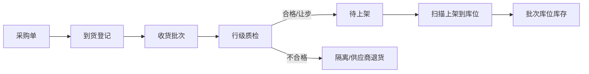
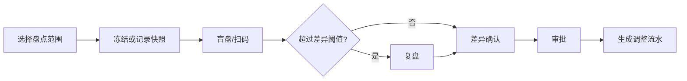

# 仓库管理功能检查与优化方案

> 检查日期：2026-07-13
> 检查环境：本机现有 ERP 服务、MySQL 8、桌面端 1280×720、移动端 390×844
> 检查方式：真实页面走查、只读数据库核对、前后端源码审查、自动化回归
> 约束：未使用虚拟机、Docker 或其他隔离虚拟环境；未提交任何会改变库存或单据状态的操作。

## 1. 结论

当前仓库模块已经具备可运行的采购、收货、质检、库存、调拨、盘点、退货、报表和移动作业入口，组织上下文、权限、幂等、并发锁、负库存保护等基础控制整体不错。

但它目前更接近“按仓库组织汇总的进销存”，还不是一套可完整追溯的仓储管理系统。正式扩大使用前，应先解决 1 个 P0、7 个 P1 问题：

- P0：调拨发货只校验主单状态，没有校验审批实例真实有效；当前审计库已有 2 张审批数据异常但仍可打开“发货”的单据，历史上有 10 张异常审批关联的单据发生过发货。
- P1：采购收货、质检和库存余额没有形成真实的批次、库位、序列号维度；数据库唯一键只允许“一个物料 + 一个仓库”一条库存余额。
- P1：采购质检按整张采购单一次性处理所有待检入库，且默认预选“合格”，不能做行级、批次级、数量级验收。
- P1：“预估毛利”实际为“销售订单金额 - 采购订单金额”，不是销售成本口径毛利，可能误导经营判断。
- P1：移动端把所有 `submitted` 采购单都显示为“待入库”，混合了待收货与待质检；现有数据还存在质检状态与入库记录不一致。
- P1：盘点缺少范围盘点、抽盘、盲盘、多人盘点、扫码/导入和复盘，且将盘亏错误显示为“卖出数量”。
- P1：采购退货默认填入原单全部已收数量，没有扣除历史已退数量；采购支持商品/OE/礼盒，但退货仍只支持商品模型。
- P1（需修复并补集成测试）：本次运行日志出现过一次严格分组模式下的库存待办 SQL 异常；现有测试只验证 MyBatis 绑定和模拟服务，没有在真实 MySQL 上执行完整 15 分支待办 SQL。缩减后的风险分支随后未再次复现，建议按发布阻断项查清而不是直接忽略。

建议顺序是：先关住审批与财务口径风险，再修复收货/质检/退货/盘点的业务语义，最后建设批次、库位、扫码和作业任务能力。

## 2. 检查范围与方案

### 2.1 页面和流程

1. 组织选择与仓库上下文。
2. 仓库工作台、统一待办和快捷入口。
3. 库存总览、筛选、明细、预警和手工调整。
4. 采购单新建、提交、分批收货、质检。
5. 调拨申请、审批展示、分批发货、分批收货、归档记录。
6. 库存盘点创建、实盘、差异、审批。
7. 采购退货创建、提交、确认。
8. 库存报表和经营指标。
9. 移动端仓库工作台、库存、入库列表和入库详情。

### 2.2 技术与数据

1. Vue 页面、操作规则、路由和移动端映射。
2. Controller 权限、幂等和参数边界。
3. Service 状态机、事务、行锁、库存扣减和日志。
4. MyBatis SQL、表结构、唯一键和时间序列化。
5. 现有 MySQL 数据的一致性只读检查。
6. 相关前端回归和库存模块后端测试。

### 2.3 发布前建议采用的固定检查矩阵

| 维度 | 必查内容 | 通过标准 |
|---|---|---|
| 功能 | 正常、部分、拒绝、取消、重复操作 | 每个状态只有合法动作可见且后端同样拒绝非法动作 |
| 库存完整性 | 当前、锁定、可用、流水前后值 | 无负数；`当前 - 锁定 = 可用`；`前值 + 变动 = 后值` |
| 审批完整性 | 主单、审批实例、任务、审批结果 | 发货/调整前四者必须一致，异常数据只能修复不能继续执行 |
| 追溯 | 入库批次、质检批次、库位、序列号、出库批次 | 任一库存可追溯到来源、质检、库位和去向 |
| 权限 | 仓库、门店、全部授权组织、成本权限 | 页面隐藏、接口授权、数据范围三层一致 |
| 并发与幂等 | 重复点击、并发收货、并发发货、并发调整 | 只产生一笔业务结果和一组流水 |
| 易用性 | 1280 桌面、390 移动、键盘、扫码 | 关键状态和动作不遮挡；常用作业少输入、少跳转 |
| 性能 | 10 万库存、100 万流水、长时间区间报表 | 列表、待办、作业接口有明确响应目标并达到目标 |
| 数据治理 | 历史异常、测试数据、备份表、日结核对 | 业务库无测试污染；备份有独立位置和保留策略 |

## 3. 做得好的地方

- 组织选择页会说明门店/仓库对业务的影响，仓库页面普遍展示当前上下文，降低跨组织误操作。
- 收货、发货、库存调整等写接口已有权限校验、幂等注解、事务和行锁；库存服务有乐观锁与负库存保护。
- 调拨支持部分发货、按发货批次收货，并保存发货时成本，避免收货时成本变化造成错价。
- 采购退货后端会校验“本次退货 + 历史已退”不能超过已收数量；本次数据检查未发现超退。
- 库存调整提交前会展示方向、前值、本次值、后值和原因，并提示生成不可直接撤回的流水。
- 移动端仓库工作台信息层次清晰，主要入口使用语义化按钮，仓库上下文和待办入口明确。
- 当前审计库 200 条库存余额没有负库存、可用量公式错误、孤儿商品或流水算术错误，基础账面一致性良好。
- 自动化结果：前端仓库相关 24 组回归全部通过；库存后端 326 个测试全部通过。

## 4. 问题清单

### WH-01｜P0｜审批异常的调拨单仍可发货

**现象**

- 页面显示“审批数据异常，请联系管理员”，同一行仍提供“发货”，并能打开提交对话框。
- 前端 `canShip` 只检查 `approved/reserved/partial_delivered` 和当前组织，不检查审批摘要是否有效：`erp-ui/src/views/inventory/transfer/index.vue:862`。
- 后端 `deliverTransfer` 加锁前后都只检查主单状态，没有检查 `approval_instance_id`、实例所属调拨单和实例状态：`erp-modules/erp-inventory/src/main/java/com/erp/inventory/service/impl/InvTransferServiceImpl.java:326`。
- 现有单元测试甚至直接构造一个没有审批实例的 `approved` 主单并成功发货，因此 326 个测试全绿也无法发现该问题。

**数据证据**

- 当前可发货但审批实例缺失/无效：2 张。
- 已发生发货且审批实例缺失、串单或非 `approved`：10 张。
- 已完成但审批实例无效：10 张。

审计库包含 QA 历史数据，数量不等同于生产影响量，但代码路径本身确认可绕过审批完整性。

**风险**

未经真实审批的库存可以被扣减和发出，属于库存、合规和审计高风险。

**方案**

1. 后端以锁定后的主单为准，强制校验审批实例非空、存在、`transfer_id` 匹配、状态为 `approved`，并确认无未完成审批任务。
2. 审批异常时返回明确业务错误，事务内不得生成发货批次、库存流水或修改明细。
3. 前端 `canShip` 同时要求审批摘要健康；异常行显示“修复审批数据”，不显示“发货”。
4. 清理历史异常数据后增加外键/唯一性约束或定时一致性巡检。
5. 增加真实数据库集成测试和数据修复脚本的 dry-run 模式。

**验收**

- 缺失、串单、运行中、驳回、取消的审批实例均返回 4xx 业务错误。
- 主单状态即使人为改成 `approved` 也不能发货。
- 被拒绝请求前后库存、流水、发货批次和调拨明细完全不变。

### WH-02｜P1｜批次、库位、效期、序列号只是附加字段，不是真实库存维度

**现状**

- `InvStock` 虽有批次、效期、序列号、库位字段，但数据库唯一键是：
  - `(product_id, shop_dept_id, warehouse_id)`；
  - `(item_type, item_id, shop_dept_id, warehouse_id)`。
- 因此同一物料在同一仓库只能有一条余额，不能同时存在两个采购批次、两个库位或两个序列号。
- 采购收货 DTO 只有明细 ID、数量、仓库 ID：`InvReceiveRequest.java:8`、`InvReceiveItem.java:6`。
- `inv_inbound_record` 及 `InvInboundRecord` 没有批次、库位、效期、序列号：`InvInboundRecord.java:6`。
- 收货质检通过后按“物料 + 仓库”直接合并库存：`InvPurchaseServiceImpl.java:457`。
- 手工调整会把输入的批次/库位元数据覆盖到聚合库存行，不能表示拆分余额。

**当前数据**

- 200 条库存中：13 条有批次、11 条有库位、1 条有效期、1 条序列号。
- 没有重复的“物料 + 仓库”余额，原因是唯一键从结构上禁止了多批次。

**风险**

无法可靠做保质期先出、批次召回、库位拣货、序列号追踪和批次级盘点；字段看似存在会造成“已经支持追溯”的错误预期。

**方案**

建议拆为：

- `stock_balance`：物料 + 仓库 + 批次/序列 + 库位的余额；
- `inventory_lot`：供应批次、生产/到期日期、质检状态；
- `warehouse_location`：库区、库位、容量和禁用状态；
- `inventory_serial`：单件序列号及状态；
- `stock_ledger`：不可变动的来源、去向和前后值流水。

收货必须先生成收货批次，再质检、上架；出库按分配批次和库位扣减，默认支持 FEFO。

**验收**

- 同一商品同一仓库可同时保存两个批次、两个到期日和两个库位的独立余额。
- 任何一笔销售/调拨/退货可反查到采购来源、质检记录和具体批次。

### WH-03｜P1｜采购质检是整单结果，且默认预选“合格”

**现象**

- 质检窗只有采购单号、整单结果和备注，默认值为 `passed`：`erp-ui/src/views/inventory/purchase/index.vue:284`、`:347`、`:727`。
- 接口只接收 `qcResult` 和 `qcRemark`：`InvPurchaseController.java:87`。
- 后端把同一采购单所有待检入库记录一次性更新为同一结果：`InvPurchaseServiceImpl.java:446`、`:536`。
- 无入库批次、收货仓库、行项目、抽检数量、合格/不合格数量、缺陷类型、图片或附件。

**风险**

多商品或分批到货时容易误把全部货物判为合格；默认“合格”增加误点概率；拒收只能整体回退本批待检数量。

**方案**

1. 质检对象改为 `inbound_batch_id + line_id`，每行录入收货、抽检、合格、不合格、让步数量。
2. 默认不选结果；拒收/让步必须填写原因，让步接收要求额外权限或审批。
3. 支持缺陷字典、照片、附件、供应商批次和检验标准。
4. 合格量进入待上架，不合格量进入隔离区/退货流程。

### WH-04｜P1｜“预估毛利”不是毛利口径

**证据**

- 页面明确显示“预估毛利 = 销售金额 - 采购金额”：`erp-ui/src/views/inventory/report/index.vue:61`。
- SQL 对所有非取消采购单求明细金额、对所有非取消销售单求明细金额，再相减：`InvReportMapper.xml:59`、`:113`、`:124`、`:136`、`:148`。
- 它没有使用已发货销售收入、已销售商品成本、退货冲销、税费、折扣或期间成本。

**风险**

采购时间和销售时间错配即可出现巨大正负数；本次页面显示负数，但不能据此判断真实经营亏损。

**方案**

- 立即把当前指标改名为“销售订单额 - 采购订单额差额”，增加口径说明，或在正确口径完成前隐藏。
- 正式毛利使用“已确认销售净收入 - 对应出库成本”，按库存流水/出库批次计算，并处理退货与冲销。
- 增加指标下钻，能从汇总进入构成单据；金额统一显示币种。

### WH-05｜P1｜移动端“待入库”混合了收货与质检，现有数据存在状态断裂

**现象与数据**

- 移动采购列表仅按 `status=submitted` 查询，并统一映射为“待入库”。
- 当前 24 张 `submitted` 采购单中，15 张属于待收货，9 张已经标记为待质检。
- 9 张待质检中只有 4 张存在真实的 `pending` 入库记录，另 5 张没有待检入库记录。
- 所以工作台显示“待入库 15”，进入列表却看到 24 张都标为“待入库”；已收货等待质检的详情仍显示“待入库”，操作却是“质检通过”。
- 另有 6 条采购明细的 `received_quantity` 与入库记录合计不一致，样本主要为 QA 历史单据。

**方案**

1. 页面阶段拆为“待收货、部分收货、待质检、质检拒绝、待上架、已完成”。
2. 列表、工作台、统一待办共用同一后端状态投影，不再直接把 `submitted` 当作业务阶段。
3. 写日常对账任务：订单已收量 = 有效入库记录量；`qc_status=pending` 必须存在待检记录。
4. 对 5 张断裂质检单和 6 条收货量不一致记录先 dry-run 分类，再做可审计修复。

### WH-06｜P1｜盘点流程不符合仓库作业语言和高频作业方式

**现象**

- 页面把盘亏显示为“当前页卖出”“卖出数量”：`erp-ui/src/views/inventory/stockCheck/index.vue:22`、`:74`、`:176`、`:714`。
- 新建时只提交日期、当前仓库和备注：`stockCheck/index.vue:724`。
- 未指定商品时后端默认快照当前仓库所有非零商品：`InvStockCheckServiceImpl.java:53`。
- 快照仅有商品维度，没有批次和库位：`InvStockCheckDetailMapper.xml:90`。
- 无全盘/分类盘/库区盘/抽盘、盲盘、多人任务、扫码、Excel 导入、初盘/复盘和盘点冻结。

**方案**

- 文案统一为账面数量、实盘数量、盘盈、盘亏、差异数量、差异金额。
- 创建盘点时选择范围、库区/库位、商品/分类、是否盲盘、盘点人和截止时间。
- 大盘点拆为任务，支持移动扫码和离线暂存；差异超过阈值自动进入复盘。
- 批次模型完成后，盘点维度必须下沉到“物料 + 批次/序列 + 库位”。

### WH-07｜P1｜采购退货默认数量错误，且与采购物料能力不一致

**现象**

- 选择原采购单后，前端把每行最大值和默认退货量都设置为全部 `receivedQuantity`，没有扣除历史已退：`erp-ui/src/views/inventory/purchaseReturn/index.vue:308`。
- 后端会在提交时扣除历史已退并拒绝超退：`InvPurchaseReturnServiceImpl.java:292`。数据安全守住了，但用户常会在最后一步得到错误。
- 表单没有仓库、批次、库位、退货原因、供应商责任、附件和承运信息。
- 采购支持 `product/oe/gift`，退货前端要求 `productId`，退货明细表 `product_id` 非空，服务也按商品聚合：`InvPurchaseReturnServiceImpl.java:250`。OE/礼盒采购无法走同一退货链路。

**方案**

- 后端返回 `returnableQuantity = acceptedQuantity - confirmedReturnQuantity`，前端默认 0，并提供“退全部可退数量”。
- 退货必须选择来源入库批次和出库库位；原因、责任、附件按配置必填。
- 退货明细统一为 `item_type + item_id + purchase_detail_id`，与采购物料模型一致。

### WH-08｜P1（待确认）｜库存待办 SQL 的真实数据库覆盖不足

**观察**

- 本次本地运行日志曾出现一次 `ONLY_FULL_GROUP_BY` 异常，指向风险待办分支选择 `context_dept.dept_id`、分组未显式包含该列。
- 源码风险分支的分组为 `st.shop_dept_id, context_dept.dept_name, context_dept.dept_type`：`InvTodoMapper.xml:713`、`:745`。
- 随后用当前 MySQL 8 对缩减后的两个风险分支执行未再次报错，因此不能把它描述为持续稳定故障。
- 现有 `InvTodoMapperBindingTest` 只解析 XML、生成 Bound SQL 和检查字符串；`InvTodoServiceImplTest` 使用 mock mapper，没有真实 MySQL 集成执行。

**方案**

1. 分组字段显式包含 `context_dept.dept_id`，消除对函数依赖推断的兼容性依赖。
2. 用与生产相同版本和 `sql_mode` 的 MySQL 执行完整 15 分支列表、最近记录、统计三个查询。
3. 统一待办对单个 provider 失败应明确展示“库存待办数据未知/使用缓存”，不能静默显示为 0。

### WH-09｜P2｜桌面端关键列被固定操作列遮挡

采购、调拨、调拨记录等页面在 1280 宽度下使用较宽的 `fixed="right"` 操作列，创建时间、状态、审批摘要和当前责任人被遮挡或挤压。固定列还会生成分离表格，屏幕阅读器难以把操作与原行关联。

**方案**：把低频动作收进“更多”菜单；状态和主动作放在同一可见区域；支持列显隐与保存视图；固定列只保留一个主动作；1280 宽度必须无覆盖。

### WH-10｜P2｜库存调整依赖正负号，容易方向输错

“正数入库、负数出库”要求用户用符号表达业务方向。虽然已有调整前后值和二次确认，但在快速作业中仍容易把扣减录成增加。

**方案**：先选“增加/减少/报损/盘盈/盘亏/纠错”，数量始终输入正数；原因使用字典；批次/库位使用选择器；高风险减少操作要求再次确认或审批。

### WH-11｜P2｜导航存在三套心智模型

- 顶部同时有“仓库管理”和“进销存管理”。
- `inventory/stock/index`、`inventory/transfer/index`、`inventory/transfer/records` 分别存在两套菜单入口。
- “仓库管理”下面没有盘点和报表，而工作台快捷入口又形成第三套入口。

**方案**：按角色保留一个“仓储作业”入口，分为工作台、入库、出库、库存、盘点、调拨、退货、报表、基础资料；销售/采购业务单据仍可从进销存进入，但仓库执行动作只落到仓储作业。

### WH-12｜P2｜收货和采购页面仍有高频操作摩擦

- 收货仓库控件在真实页面显示内部 ID `1245`，禁用控件仍提示“请选择收货仓库”。
- 每行收货数量默认 0，没有“全部剩余/本页全收”。
- 采购提示“采购单、收货和质检都会进入当前仓库库存”，实际创建采购单不会增加库存。
- 列表缺少供应商、日期等常用筛选；金额未显示币种。

**方案**：展示仓库名称和路径；增加“全部剩余”“清空”“扫码收货”；默认 0 保留以防误收；提示改为“质检接收后增加当前仓库库存”；保存常用筛选。

### WH-13｜P2｜报表查询和交互不适合大数据量

报表汇总 SQL 使用多个相互独立的标量子查询，分别扫描库存、采购和销售；数据放大后响应时间会随扫描次数上升。页面没有汇总下钻、报表导出、异步任务和口径版本。

**方案**：使用一次聚合/预聚合事实表；按日结算库存和成本；大时间范围异步导出；每个指标可下钻到构成单据；设置 P95 响应目标并做 10 万库存、100 万流水压测。

### WH-14｜P2｜审计库存在明显测试数据和备份表治理问题

- 当前业务库有 43 张 `inv_*backup*`/`clear_backup` 表。
- 21 张盘点草稿全部超过 7 天，353 条草稿明细未录入实盘。
- 采购、调拨中存在大量 `QA-IOS`、`MOBILE-QA` 记录，并出现 5 张质检状态断裂、6 条收货量不一致。

**方案**：测试数据进入独立环境；业务库备份移至专用备份库/对象存储；设置草稿过期提醒和归档；每天运行只读对账并产出异常工单。

### WH-15｜P2｜移动端可读性和任务定位仍可改进

- 长单号和状态在 390 宽度下逐字换行，降低扫读效率。
- 底部“库存”默认进入预警库存，当前无预警时显示空页，即使仓库实际有 177 条库存，也容易让用户误以为无库存。
- 入库详情提供视觉上接近一键完成的“质检通过”，但没有展示质检范围和批次。

**方案**：长单号中间省略并支持复制；默认进入全部库存并用预警 Tab/徽标提示；任务卡突出业务阶段、待处理量和截止时间；质检必须进入明细确认页。

## 5. 数据健康快照

| 检查项 | 结果 | 判断 |
|---|---:|---|
| 库存余额总数 | 200 | 信息 |
| 主仓库库存余额 | 177 | 信息 |
| 当前/锁定/可用负数 | 0 / 0 / 0 | 通过 |
| `当前 - 锁定 != 可用` | 0 | 通过 |
| 商品库存孤儿记录 | 0 | 通过 |
| 流水 `前值 + 变动 != 后值` | 0 | 通过 |
| 有批次 / 效期 / 序列号 / 库位 | 13 / 1 / 1 / 11 | 追溯覆盖很低 |
| 当前可发货但审批无效 | 2 | 阻断 |
| 已发货且审批关联无效 | 10 | 需核查/修复 |
| `submitted` 采购单 | 24 | 信息 |
| 待收货 / 标记待质检 | 15 / 9 | 列表阶段混用 |
| 待质检但无待检入库记录 | 5 | 异常 |
| 采购明细已收量与入库记录不一致 | 6 | 异常 |
| 超过已收量的有效采购退货 | 0 | 通过 |
| 超过 7 天盘点草稿 | 21 | 需治理 |
| 库存备份表 | 43 | 需迁移 |

## 6. 建议的目标作业流程

## 7. 分阶段落地计划

### 阶段 0：立即止血（0～2 个工作日）

1. 后端阻断审批实例不完整的调拨发货，前端隐藏/禁用发货。
2. 对当前 2 张可发货异常单和 10 张历史发货异常单做 dry-run 核查，人工确认后修复。
3. 暂时隐藏或改名“预估毛利”。
4. 质检默认值改为空；移动采购列表拆分待收货/待质检标签。
5. 补真实 MySQL 待办 SQL 和审批完整性集成测试。

### 阶段 1：业务正确与易用（1～2 周）

1. 采购收货增加全部剩余、仓库名称、收货批次；退货返回真实可退数量。
2. 质检改为收货批次和明细行，支持合格/不合格数量、原因和附件。
3. 盘点改文案并增加范围、盲盘、复盘和扫码/导入入口。
4. 修复桌面表格遮挡、原始 ID、ISO 时间和移动端长单号。
5. 合并重复导航，统一仓库作业入口。
6. 上线每日采购收货、质检、调拨审批、库存流水对账。

### 阶段 2：仓储追溯能力（3～6 周）

1. 设计并迁移物料、批次/序列、库位余额模型。
2. 建立收货、质检、上架、分配、拣货、复核、发货作业任务。
3. 支持 FEFO、批次召回、库位库存、移库和批次盘点。
4. 采购退货、销售出库、调拨全部绑定具体批次和库位。
5. 提供移动扫码和断网暂存/恢复策略。

### 阶段 3：经营与规模化（6～10 周）

1. 用出库成本重建毛利指标，增加口径版本和单据下钻。
2. 建立日结事实表、异步导出和大数据量压测基线。
3. 增加库龄、效期、周转率、缺货、呆滞库存和供应商质检分析。
4. 将 QA 数据和备份表从业务库迁出，建立自动归档与恢复演练。

## 8. 让使用者更方便的具体改进

按收益/成本排序：

1. 收货、发货、盘点支持扫码；单号、商品、批次、库位都可扫。
2. 提供“全部剩余”“本页全收”“清空”“复制上一批次”，减少逐行输入。
3. 常用筛选、列显隐、排序和仓库选择可保存为个人视图。
4. 工作台按“我现在要做什么”展示：待收货、待质检、待上架、待拣货、待复盘，而不是只展示技术状态。
5. 关键页面固定显示当前仓库名称与路径；内部 ID 只在详情或诊断信息中出现。
6. 长操作列改为一个主动作加“更多”，状态异常直接给出原因和修复入口。
7. 移动端支持草稿自动保存、网络恢复续传和重复扫码提示。
8. 差异、拒收、让步、报损使用原因字典，减少自由文本并方便统计。
9. 报表金额带币种、数量带单位，指标可点击下钻到单据。
10. 异常对账自动生成待办，不让管理员靠查库发现数据断裂。

## 9. 回归与验收用例

### 9.1 必须新增的发布阻断用例

1. 主单 `approved`，审批实例为空：发货失败且无任何写入。
2. 主单审批实例属于另一调拨单：发货失败。
3. 审批实例 `running/rejected/cancelled`：发货失败。
4. 同一发货请求并发两次：只生成一张发货批次，只扣一次库存。
5. 同一商品同一仓库两个批次、两个库位：余额和流水互不合并。
6. 同一收货批次两行分别合格和拒收：只接收合格量。
7. 已退 3、已收 10：新退货最大可退为 7，默认输入为 0。
8. 移动待收货数、列表待收货数、统一待办同阶段数量相等。
9. 待质检状态没有待检记录：对账告警且不能展示一键质检。
10. 毛利汇总与出库流水成本、销售退货冲销逐笔对平。

### 9.2 当前自动化结果

- 前端：24 组仓库相关 Node 回归，0 失败。
- 后端：`erp-modules/erp-inventory` 共 326 个测试，0 失败。
- 结论：现有回归能守住较多页面契约和服务状态机，但不能替代真实数据库、完整审批关联、追溯模型和视觉走查。

## 10. 视觉证据索引

完整截图位于 `docs/audit-screenshots/warehouse-20260713/`，均为本次检查现场采集。

1. [选择主仓库](./audit-screenshots/warehouse-20260713/01-select-main-warehouse.png)
2. [仓库工作台](./audit-screenshots/warehouse-20260713/02-warehouse-workbench.png)
3. [库存总览](./audit-screenshots/warehouse-20260713/03-stock-overview.png)
4. [库存调整校验](./audit-screenshots/warehouse-20260713/04-stock-adjust-validation.png)
5. [采购列表](./audit-screenshots/warehouse-20260713/05-purchase-list.png)
6. [新建采购单](./audit-screenshots/warehouse-20260713/06-purchase-create.png)
7. [采购收货](./audit-screenshots/warehouse-20260713/07-purchase-receive.png)
8. [采购质检](./audit-screenshots/warehouse-20260713/08-purchase-qc.png)
9. [调拨列表](./audit-screenshots/warehouse-20260713/09-transfer-list.png)
10. [审批异常仍可发货](./audit-screenshots/warehouse-20260713/10-transfer-approval-anomaly-ship.png)
11. [调拨记录原始时间](./audit-screenshots/warehouse-20260713/11-transfer-records-raw-time.png)
12. [盘点列表](./audit-screenshots/warehouse-20260713/12-stock-check-list.png)
13. [创建盘点](./audit-screenshots/warehouse-20260713/13-stock-check-create.png)
14. [录入实盘](./audit-screenshots/warehouse-20260713/14-stock-check-entry.png)
15. [采购退货列表](./audit-screenshots/warehouse-20260713/15-purchase-return-list.png)
16. [创建采购退货](./audit-screenshots/warehouse-20260713/16-purchase-return-create.png)
17. [库存报表](./audit-screenshots/warehouse-20260713/17-inventory-report.png)
18. [移动仓库工作台](./audit-screenshots/warehouse-20260713/18-mobile-warehouse.png)
19. [移动库存](./audit-screenshots/warehouse-20260713/19-mobile-stock.png)
20. [移动入库列表](./audit-screenshots/warehouse-20260713/20-mobile-inbound.png)
21. [移动入库详情](./audit-screenshots/warehouse-20260713/21-mobile-inbound-detail.png)

## 11. 检查边界

- 使用本机已有登录态和管理员账号，重点检查主仓库；未以多种真实岗位账号逐一复测数据范围。
- 未提交收货、质检、发货、库存调整、盘点或退货，因此没有人为改变当前业务数据。
- 审计库包含大量 QA/历史记录，数据异常数量用于定位和分级，不应直接等同于生产事故数量。
- 未进行生产流量、网络抖动、离线扫码、打印设备和百万级数据压测。
- 未使用任何虚拟机。
