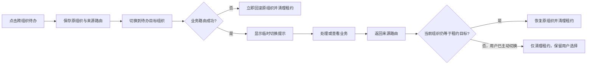

# 待办功能第三阶段详细实施方案（2026-07-13）

## 1. 目标

在不改变现有待办 Provider 权限规则、业务写接口和数据库结构的前提下，完成剩余 3 个 P1 与 3 个 P2 问题：

1. 手机详情首屏直接看到真正的业务主操作。
2. 审批确认层展示足够的结构化复核信息；完整详情加载失败时禁止写操作。
3. 跨组织待办使用临时上下文，返回来源页面后安全恢复原组织。
4. 手机关键词搜索后的分类统计与搜索结果使用同一口径。
5. 桌面和手机明确展示当前固定排序规则。
6. 桌面窄宽度筛选区不再出现“查询”按钮单独换行。

本方案全程使用本机原生进程与真实浏览器，不使用虚拟机、Docker、Testcontainers 或其他虚拟化环境。

## 2. 当前基线与实施判断

- 精确跳转、详情先行、六类统计、组织范围说明、活动筛选、异常态和基础无障碍已经完成，不重复开发。
- `MobileDetailSheet.vue` 当前把业务动作放在可滚动正文末尾，却把“刷新列表/切换上下文”固定在底栏，造成主次层级倒置。
- `MobileActionDialog.vue` 目前只复用 `item.title/code/detail`；`featureMapper.js` 已经有完整详情和成本权限判断，适合增加结构化 `_reviewFields`，无需新增接口。
- 当前详情加载失败后，编辑动作会被阻止，但审批等其他写动作仍可能继续出现。本阶段一并改为“详情未成功加载则写操作失败关闭（fail closed）”。
- `todoNavigator.js` 会把目标组织写入 `sessionStorage`，但没有记录原组织与回程页面；因此返回待办后组织仍被永久改变。
- 库存、OA、系统三个 Provider 的汇总接口已经支持 `keyword`，手机页只是没有把关键词传给汇总请求；关键词统计修复只需前端改动。
- Provider SQL、系统 Provider 和前端聚合器都采用“紧急优先、同级按创建时间升序”。本阶段只把这条权威规则展示出来，不提供无法保证跨 Provider 精确分页的客户端假排序。
- 当前工作区已有大量用户改动，且待办相关文件本身也处于修改状态。实施时只做小范围补丁，不覆盖、不格式化、不暂存任何无关文件。
- 当前专项基线已用本机 Node `v24.14.0` 验证：`unifiedTodoMobile`、`unifiedTodoDesktop`、`unifiedTodoNavigator`、`mobileFeatureMapper`、`mobileFeatureActions`、`mobileFeatureComponentSplit` 均通过。

## 3. 方案边界

### 本阶段包含

- 手机通用业务详情、动作确认和调拨审批复核信息。
- 桌面、手机、顶部待办三种入口的跨组织导航。
- 手机统计关键词口径。
- 桌面与手机排序说明。
- 桌面筛选响应式布局。
- 对应的纯函数、组件契约、生命周期和真实浏览器回归。

### 本阶段不包含

- 不修改审批、驳回、发货、收货等后端写接口及载荷。
- 不修改三类 Provider 的权限、组织数据范围与数据库结构。
- 不增加“最近到达”等可变排序；否则必须同时改造三个 Provider 的服务端排序契约。
- 不把“临期”直接写死为天数；现有 Provider 已按配置生成 `urgent/important/normal`，后续应基于统一优先级契约扩展。
- 不在同一批次做 Element UI 全量按需引入或大规模包体治理，避免把性能重构和待办正确性混在一起。

## 4. 关键架构

### 4.1 手机详情动作分层

- `featureActions.js` 负责声明动作属于 `primary` 还是 `secondary`。
- `index.vue` 只负责按当前权限和单据状态取得动作，再调用统一分组函数。
- `MobileDetailSheet.vue` 的不可滚动底栏最多展示两个主动作；调拨审批必须同时展示“审批通过”和“审批驳回”。
- 编辑、删除、取消以及刷新/切换上下文放入正文末尾的“其他操作”，不再与主动作抢占固定底栏。
- 没有业务主动作时，保留现有“刷新列表/切换上下文”能力。
- 主动作在 `detailLoading`、`detailLoadFailed` 或 `actionLoadingKey` 状态下不可执行。

### 4.2 结构化确认摘要

沿用现有非枚举元数据模式，在映射后的手机单据上增加：

```text
_reviewFields = [
  { label: "调出", value: "中央仓" },
  { label: "调入", value: "北京柏悦" },
  { label: "申请数量", value: "2" },
  { label: "参考总价", value: "¥10.00" },
  { label: "审批节点", value: "运营经理" }
]
```

- 调拨数量优先使用 `totalQuantity/quantity`，缺失时汇总完整详情中的 `details[].quantity`。
- 参考总价继续复用 `resolveTransferTotalAmount`，仅在用户拥有 `inv:cost:view` 时生成。
- `MobileActionDialog.vue` 使用语义化 `dl/dt/dd` 展示字段；没有结构化字段的旧业务回退到 `item.detail`，保证兼容。
- 确认层只展示已由 mapper 权限过滤后的值，不从 DOM 文本或卡片摘要反向解析业务数据。

### 4.3 临时组织上下文租约

新增前端纯工具 `todoContextLease.js`。跨组织跳转前保存原组织、目标组织、来源路由和失效时间；业务路由成功后保留租约，返回来源路由时在全局路由守卫中同步恢复。



租约规则：

- 存储键使用带版本号的 sessionStorage 键，仅保存组织 ID、名称、类型、来源 path/fullPath 和时间戳，不保存令牌或业务内容。
- 默认有效期 30 分钟；过期后只清理，不做延迟恢复。
- 原页面没有有效组织时，回程调用 `clearSelectedDept()`；手机待办本身允许无组织进入。
- 路由切换失败、权限变化或目标路由缺失时立即回滚，不能留下半完成的组织切换。
- 如果业务页期间用户主动切换到了第三个组织，回程不覆盖该选择。
- 如果无法安全写入租约，阻止跨组织跳转并提示“无法安全暂存原组织”，不再静默做永久切换。

## 5. 文件范围

| 批次 | 文件 | 责任 |
| --- | --- | --- |
| A | `erp-ui/src/views/mobile/feature/components/MobileDetailSheet.vue` | 主动作固定底栏、次要操作、详情失败重试 |
| A | `erp-ui/src/views/mobile/feature/components/mobileSheet.scss` | 固定动作区、滚动区、安全区和小屏布局 |
| A | `erp-ui/src/views/mobile/feature/featureActions.js` | 动作主次元数据与统一分组 |
| A/B | `erp-ui/src/views/mobile/feature/index.vue` | 动作分组、详情重试、reviewFields 传递和写操作总守卫 |
| B | `erp-ui/src/views/mobile/feature/featureMapper.js` | `_reviewFields`、调拨总数量与权限过滤 |
| B | `erp-ui/src/views/mobile/feature/components/MobileActionDialog.vue` | 结构化复核摘要 |
| C | 新建 `erp-ui/src/utils/todoContextLease.js` | 租约创建、恢复、回滚、过期和清理纯逻辑 |
| C | `erp-ui/src/utils/todoNavigator.js` | 跨组织跳转接入租约及失败回滚 |
| C | `erp-ui/src/permission.js` | 在路由进入组件前恢复来源上下文 |
| C | `erp-ui/src/layout/components/HeaderTodo/index.vue` | 顶部入口传入租约与提示能力 |
| C | `erp-ui/src/views/workbench/todo/index.vue` | 桌面入口传入租约与提示能力 |
| C | `erp-ui/src/views/mobile/todo/index.vue` | 手机入口、关键词汇总、排序说明 |
| D | `erp-ui/src/utils/todoAggregator.js` | 导出唯一的排序说明常量 |
| D | `erp-ui/src/views/workbench/todo/index.vue` | 排序说明与三段式筛选栅格 |

测试文件：

- 新建 `erp-ui/test/unifiedTodoContextLease.test.js`
- 修改 `erp-ui/test/unifiedTodoNavigator.test.js`
- 修改 `erp-ui/test/unifiedTodoMobile.test.js`
- 修改 `erp-ui/test/unifiedTodoDesktop.test.js`
- 修改 `erp-ui/test/mobileFeatureMapper.test.js`
- 修改 `erp-ui/test/mobileFeatureActions.test.js`
- 修改 `erp-ui/test/mobileFeatureComponentSplit.test.js`

## 6. 分批实施步骤

### 批次 0：建立修改护栏

1. 记录上述文件的当前 `git diff`，后续逐文件核对，避免覆盖已有改动。
2. 不执行 `npm install`，不删除或替换当前 `erp-ui/node_modules`，不处理无关的 Git 状态。
3. 固定使用本机打包运行时：

```bash
NODE=/Users/liuxingyu/.cache/codex-runtimes/codex-primary-runtime/dependencies/node/bin/node
"$NODE" -v
```

预期为 Node 24，满足项目 `>=22 <25` 的约束。当前 `/opt/homebrew/bin/node` 因缺少 `libsimdjson.30.dylib` 不作为本阶段运行时。

### 批次 A：让手机主动作首屏可见

1. 先在 `mobileFeatureActions.test.js` 增加动作分组断言：
   - 调拨审批的通过/驳回都属于主动作。
   - 草稿的编辑/提交为主动作，删除为次要动作。
   - 分组最多返回两个固定主动作，其余进入次要区。
2. 在 `featureActions.js` 增加主次元数据和 `partitionMobileDetailActions` 纯函数，不改变动作 ID、权限或执行载荷。
3. `index.vue` 增加 `detailActionGroups`，分别传给详情组件。
4. `MobileDetailSheet.vue`：
   - 从正文移除主动作列表。
   - 在不可滚动 footer 渲染主动作。
   - 在正文末尾增加可展开的“其他操作”，承载次要业务动作、刷新和切换上下文。
   - 没有主动作时保留原有两个工具按钮。
   - 操作反馈放在 footer 上方的固定状态区，并保留 `aria-live`。
5. `mobileSheet.scss`：
   - footer 使用两列等宽布局，按钮最小高度 44px。
   - 正文增加与 footer 高度匹配的 `scroll-padding-bottom`。
   - 覆盖 320px 小屏、安全区和软键盘 inset，不允许按钮被裁切或重叠。
6. 更新组件拆分契约测试，确认主动作不再出现在 `.detail-sheet-body` 内。

本批验收：390×844 首次打开调拨审批详情且 `scrollTop=0` 时，通过/驳回同时可见；刷新/切换上下文不再占据主底栏。

### 批次 B：补齐确认依据，并让详情失败时禁止写操作

1. 在 `mobileFeatureMapper.test.js` 先增加调拨审批完整详情用例：
   - 数量来自顶层字段与明细汇总两种情况。
   - 有成本权限时显示参考总价，无权限时字段不存在。
   - 调出、调入、数量、节点始终按可用数据生成。
2. `featureMapper.js`：
   - `attachMobileActionMeta` 增加非枚举 `_reviewFields`。
   - 新增 `buildMobileReviewFields` 与 `resolveTransferTotalQuantity`。
   - 调拨/调拨审批至少生成调出、调入、申请数量、参考总价、审批节点。
3. `index.vue` 增加 `selectedReviewFields`，传入 `MobileActionDialog.vue`。
4. `MobileActionDialog.vue`：
   - 使用结构化列表显示复核字段。
   - 字段为空时才回退到 `item.detail`。
   - 保留标题、单号、动作影响、意见必填和现有 payload 逻辑。
5. 把 `openItem` 的详情请求提取为可重试方法；详情组件新增“重新加载详情”事件。
6. 将 `detailLoadFailed` 传到详情组件，并在 `handleDetailAction`、`runDetailAction` 两层统一拒绝所有写操作；只有完整详情成功后才显示或启用主动作。
7. 对详情失败、重试成功、重试失败、确认取消分别补组件契约和方法测试。

本批验收：确认层至少重复展示单号、调出、调入、申请数量、当前节点；有权限时展示参考总价。详情请求失败时不能打开审批确认层，用户可原地重试。

### 批次 C：跨组织待办使用临时上下文

1. 新建 `unifiedTodoContextLease.test.js`，先覆盖：
   - 正常创建与恢复。
   - 原上下文为空时恢复为清空状态。
   - 用户主动切换第三组织时不恢复。
   - 路由失败立即回滚。
   - 租约过期、损坏、版本不匹配时安全清理。
   - 连续点击不同跨组织待办时保留最初来源上下文，不形成租约链。
2. 新建 `todoContextLease.js`，所有核心逻辑写成可注入 storage/clock/context setter 的纯函数，便于 Node 测试。
3. `todoNavigator.js` 在调用 `setSelectedDept` 前创建租约；重新权限/路由校验或 `router.push` 失败时回滚。
4. `permission.js` 在已确认登录、且执行 `shouldSelectShop` 之前尝试恢复与目标路由匹配的租约，确保页面组件读取到的是恢复后的组织。
5. 三个入口都传入租约创建能力和提示回调：
   - 桌面待办中心。
   - 手机待办中心。
   - 顶部待办弹层。
6. 跨组织导航成功后提示：`已临时切换到「北京柏悦」，返回原页面后恢复「原组织」`。
7. 保持 `erp:dept-changed` 事件不变，让 Navbar、待办汇总和页面上下文继续使用现有刷新机制。

本批验收：从 Test Store 打开北京柏悦待办，业务页显示北京柏悦；返回来源页面后恢复 Test Store。若用户在业务页主动切换为第三组织，返回后保留第三组织。

### 批次 D：修正关键词统计口径

1. 在 `unifiedTodoMobile.test.js` 把现有 scoped summary 断言扩展为 `scopeMode + contextDeptId + keyword`。
2. `refreshScopedSummaries` 的请求参数加入规范化后的 `filters.keyword`。
3. `scopedSummaryKey` 加入关键词，防止不同关键词复用旧统计。
4. 保持 `category` 不传给汇总接口：分类网格需要显示同一关键词在全部分类中的分布。
5. 帮助文案动态说明：有关键词时显示“上方数字为当前关键词在各分类中的结果”。
6. 测试连续搜索 A、B、清空三种情况，保证每次列表与统计使用同一关键词且旧响应不能覆盖新状态。

本批验收：搜索 `NO_MATCH` 后列表为 0，六类统计也全部为 0；清空关键词后恢复原统计。

### 批次 E：展示排序规则并修复桌面筛选布局

1. `todoAggregator.js` 导出 `TODO_SORT_LABEL = "紧急优先 · 同级按最早创建"`，文案与 `compareTodos` 同源。
2. 桌面和手机列表标题附近展示该说明；不可用颜色表达唯一含义，屏幕阅读器可读取。
3. 桌面筛选从四个 inline item 改成三个栅格组：
   - 来源。
   - 范围。
   - 关键词输入 + 查询按钮组合。
4. 响应式布局：
   - 宽屏三列。
   - 中等宽度两列，关键词/查询组合独占整行。
   - 小宽度单列。
5. 更新 `unifiedTodoDesktop.test.js`，锁定查询按钮必须位于关键词组合内，并存在中等宽度整行规则。

本批验收：910px 宽度不再出现查询按钮单独占一行；768、910、1024、1280px 均无裁切。

## 7. 关于“紧急/临期快速筛选”的后续方案

本阶段先展示真实排序规则，不立即增加客户端“只看紧急”，原因是跨 Provider 精确分页必须由服务端同时过滤，不能只过滤当前已加载页面。

若核心批次稳定后继续增强，单独实施以下契约：

1. `TodoQuery` 增加白名单 `priority`，`TodoConstants` 增加 `PRIORITIES`。
2. 库存、OA Mapper 在公共过滤段增加 `priority = #{query.priority}`；系统 Provider 在分页前按优先级过滤。
3. 三个 Provider 的 summary/list 同时接受 priority，保证统计与列表一致。
4. `todoFilterQuery.js`、Todo Store 缓存键、桌面/手机 URL 增加 priority。
5. 前端提供“全部优先级/只看紧急/重要”快捷筛选。

该增强会触及三个当前已有大量修改的后端模块，建议作为独立批次和独立回归，不与本阶段 P1 修复混合。

## 8. 自动化验证

### 8.1 专项门禁

```bash
cd /Users/liuxingyu/Desktop/备份/ERP-NEW/erp-ui
NODE=/Users/liuxingyu/.cache/codex-runtimes/codex-primary-runtime/dependencies/node/bin/node

for f in \
  test/mobileFeatureMapper.test.js \
  test/mobileFeatureActions.test.js \
  test/mobileFeatureComponentSplit.test.js \
  test/unifiedTodoContextLease.test.js \
  test/unifiedTodoNavigator.test.js \
  test/unifiedTodoMobile.test.js \
  test/unifiedTodoDesktop.test.js \
  test/unifiedTodoLifecycle.test.js \
  test/unifiedTodoStore.test.js; do
  "$NODE" "$f" || exit 1
done
```

### 8.2 全量前端与生产构建

```bash
cd /Users/liuxingyu/Desktop/备份/ERP-NEW/erp-ui
NODE=/Users/liuxingyu/.cache/codex-runtimes/codex-primary-runtime/dependencies/node/bin/node

"$NODE" scripts/run-node-tests.cjs
"$NODE" scripts/scan-frontend-secrets.cjs
"$NODE" node_modules/@vue/cli-service/bin/vue-cli-service.js build
```

构建完成后记录 app、`chunk-elementUI`、`chunk-libs` 的原始与 gzip 大小。本阶段不以大规模依赖改造解决入口体积提示；包体治理另开批次。

### 8.3 差异检查

```bash
cd /Users/liuxingyu/Desktop/备份/ERP-NEW
git diff --check -- \
  erp-ui/src/utils/todoContextLease.js \
  erp-ui/src/utils/todoNavigator.js \
  erp-ui/src/utils/todoAggregator.js \
  erp-ui/src/permission.js \
  erp-ui/src/layout/components/HeaderTodo/index.vue \
  erp-ui/src/views/workbench/todo/index.vue \
  erp-ui/src/views/mobile/todo/index.vue \
  erp-ui/src/views/mobile/feature
```

不得把 `erp-ui/node_modules` 或其他无关脏文件加入暂存区。

## 9. 本机真实浏览器验收矩阵

| 场景 | 验证点 |
| --- | --- |
| 手机 320×568、360×800、390×844、430×900、480×960 | 主动作可见、底栏不重叠、安全区正确、长内容可滚动 |
| 调拨审批，有/无 `inv:cost:view` | 数量始终显示；金额仅授权用户可见 |
| 详情请求失败、随后重试成功 | 失败时无写入口；成功后动作才出现 |
| 确认层取消 | 返回原详情，字段和滚动状态保留，不提交业务 |
| 无组织、门店、仓库三种来源上下文 | 临时切换与回程恢复正确 |
| 业务页主动切换第三组织 | 回程不覆盖用户主动选择 |
| 目标路由缺失或权限变化 | 不进入业务页，原组织立即恢复 |
| 关键词有结果、无结果、清空 | 列表与六类统计口径一致 |
| 桌面 768、910、1024、1280px | 筛选布局无孤立按钮、无横向溢出 |
| Provider 全健康、单个失败、恢复后 | 未知/缓存语义不退化，搜索和排序说明仍清晰 |

浏览器回归默认只打开详情和确认层并取消，不执行最终审批；如需验证成功路径，只使用明确的本地测试数据。控制台应为 0 条新增错误。

## 10. 完成标准

1. 手机审批详情首屏无需滚动即可看到通过/驳回。
2. 详情未完整加载时不存在可触发的写操作，并有原地重试入口。
3. 调拨确认层具备组织、数量、金额权限控制和当前节点信息。
4. 跨组织跳转成功、失败、返回和用户主动切换四类路径都不会留下错误上下文。
5. 关键词统计与列表一致，不再出现列表 0、统计 48 的状态。
6. 桌面与手机都能看到固定排序依据；不提供误导性的仅当前页排序。
7. 910px 桌面筛选布局通过视觉验收。
8. 专项测试、全量测试、生产构建、`git diff --check` 和真实浏览器矩阵全部通过。
9. 无虚拟机、容器或业务生产数据写入；无关工作区改动保持原样。

## 11. 建议执行顺序与检查点

1. **检查点一：批次 A+B**——先完成手机动作与确认安全，专项测试和手机视觉回归通过后再继续。
2. **检查点二：批次 C**——单独完成上下文租约，重点验证失败回滚和主动切换保护。
3. **检查点三：批次 D+E**——完成关键词统计、排序说明与桌面布局。
4. **最终门禁**——全量测试、生产构建、本机真实浏览器矩阵和差异审查。

每个检查点都可独立回滚：动作布局、reviewFields、上下文租约、统计口径和桌面 CSS 之间不共享持久化数据，也不需要数据库迁移。
