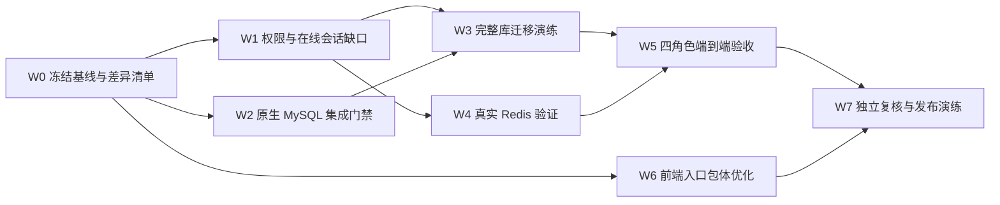

# 系统管理发布前收口详细方案

> 编制日期：2026-07-13
> 最后更新：2026-07-14
> 适用分支：`codex/system-management-hardening-20260713`
> 基线提交：`b694659d`
> 前置成果：R0～R5 已完成首轮实现，详见 `docs/系统管理实施验收报告-20260713.md`
> 约束：不得使用虚拟机、Docker、Testcontainers；不得直接在生产数据库或生产 Redis 上做破坏性验证

## 0. 执行状态

| 工作包 | 状态 | 2026-07-14 结果 |
|---|---|---|
| W0 基线与证据 | 已完成 | 独立工作树/分支、证据目录和工具链记录已建立 |
| W1 权限与在线会话 | 已完成 | 权限粒度、数据范围、强制下线和会话撤销已收口 |
| W2 原生 MySQL 门禁 | 本机完成，外部条件待办 | MySQL 8.0.45 上 4 套件 26 项通过；真实 MySQL 5.7 尚无可用实例 |
| W3 完整库迁移演练 | 已完成 | 454 表副本首次、幂等、回滚、再前滚和审计通过 |
| W4 原生 Redis 门禁 | 已完成 | 100/1,000/10,000 会话门禁通过，无 KEYS、慢命令或残留键 |
| W5 四角色验收 | 已完成 | 40 条 API 断言、14 份浏览器证据，控制台错误 0 |
| W6 前端包体 | 已完成 | 入口 raw 1444.69 KiB，低于 1600 KiB 目标 |
| W7 复核与发布资料 | 本地完成，签字待办 | 代码/静态/回滚资料已复核；提交、生产窗口和运维签字未获执行指令 |

## 1. 结论

本方案编制时识别了 7 类发布缺口。经 2026-07-14 收口，6 类本机可执行问题已经完成，真实 MySQL 5.7 和生产运维签字仍属于外部发布条件：

1. 已关闭：4 个事务/并发测试已改为原生 MySQL 集成测试，普通全量测试不再排除旧 Testcontainers 类。
2. 外部阻断：本机只有 MySQL 8.0.45，仍不能替代真实 MySQL 5.7 执行证据。
3. 已关闭：在线列表和会话撤销均使用有上限 SCAN/MGET，并完成 1 万会话门禁。
4. 已关闭：导入模板、重置密码、双向角色授权、缓存刷新和门店授权权限已对齐。
5. 已关闭：完整结构副本和四类隔离角色的 API/浏览器验收已通过。
6. 已关闭：生产入口已拆分并增加真实预算门禁，raw 1444.69 KiB。
7. 本地部分已关闭：代码、迁移、回滚和运行时复核已完成；提交、推送、部署和生产签字未执行。

当前发布判定为“有条件通过/生产 No-Go”。取得真实 MySQL 5.7 环境（或生产 8.0 书面确认）并完成运维签字后，按第 13 节门禁转为 Go；任何 P0 门禁未通过都不得发布。

## 2. 当前基线与不重复实施范围

### 2.1 已完成并保留的成果

| 范围 | 已完成状态 | 本方案只做什么 |
|---|---|---|
| 数据范围 | 非法值 fail-close，角色、菜单、部门服务层防绕过 | 复核剩余授权入口和四角色真实效果 |
| 凭据生命周期 | 随机一次性密码、强制改密、响应禁缓存、重置后撤销会话 | 验证真实 Redis、收紧重置密码独立权限 |
| 审计日志 | 脱敏、详情权限、锁定状态、POST 解锁、归档批次 | 做真实角色验收并制定旧 GET 解锁下线条件 |
| 用户/角色/组织体验 | 用户向导、差量修改、范围预览、批量排序与离开提醒 | 修正权限显示与接口权限不一致 |
| 配置/薪资/调拨 | 乐观锁、影响预览、版本修订、规则模拟和冲突检查 | 做完整库迁移、并发与端到端验证 |
| SQL | 正向、镜像、回滚脚本已生成并在本机隔离库验证 | 做完整结构副本、重复执行、回滚再前滚和 5.7 证明 |

### 2.2 明确非目标

- 不升级 Vue 3，不替换 Element UI，不重写系统管理模块。
- 不重构整个 Redis 使用层；只处理系统管理和会话相关的阻塞风险。
- 不重写薪资计算引擎、审批引擎或组织模型。
- 不在本次收口中修改真实生产角色、生产账号、生产业务数据。
- 不通过提高前端包体阈值来消除警告。
- 不使用虚拟机、容器或 Testcontainers；测试依赖本机原生服务或独立非生产原生数据库。

## 3. 优先级、依赖关系与发布判定



| 工作包 | 优先级 | 发布阻断 | 预计投入 | 关键产物 |
|---|---:|---:|---:|---|
| W0 基线冻结与证据目录 | P0 | 是 | 0.5 人日 | 差异清单、工具链记录、证据目录 |
| W1 剩余权限与在线会话修复 | P0 | 是 | 1.5～2.5 人日 | 权限矩阵、代码与 SQL、回归测试 |
| W2 原生 MySQL 集成门禁 | P0 | 是 | 2～3 人日 | 无容器集成测试、5.7/8.0 迁移报告 |
| W3 完整结构副本迁移演练 | P0 | 是 | 1～1.5 人日 | 前后快照、幂等和回滚证据 |
| W4 真实 Redis 正确性与性能 | P0 | 是 | 1～1.5 人日 | 基准数据、并发验证、慢命令检查 |
| W5 四类角色端到端验收 | P0 | 是 | 1.5～2 人日 | 验收矩阵、截图/API/SQL 证据 |
| W6 前端入口包体收口 | P1 | 是 | 1～2 人日 | 真实 entrypoint 门禁与优化报告 |
| W7 独立复核、发布与回滚演练 | P0 | 是 | 1 人日 | 审查结论、发布清单、回滚演练 |

## 4. W0：冻结基线、保护现有改动、建立证据目录

### 4.1 实施步骤

1. 继续在独立工作树实施，不在原始脏工作区直接合并或覆盖：
   - 工作树：`/Users/liuxingyu/.config/superpowers/worktrees/ERP-NEW/system-management-hardening-20260713`
   - 分支：`codex/system-management-hardening-20260713`
2. 保存以下基线结果：
   - `git status --short`、`git diff --stat`、新增文件清单；
   - JDK、Maven、Node、npm、MySQL、Redis 实际版本；
   - 前端 159 项测试、生产构建结果；
   - 后端 25 模块、2022 项测试结果以及当前明确排除的 4 个类；
   - 正向 SQL、发布镜像、回滚 SQL 的 SHA-256。
3. 建立不提交敏感内容的证据目录 `artifacts/system-management-release-20260713/`，仅保存脱敏后的日志、统计、截图索引和校验和；数据库转储、密码、令牌不得进入 Git。
4. 在开始追加迁移前先确认现有正向脚本是否已被任何共享环境执行：
   - 若从未执行，可以在首发前修改现有 `erp_system_management_hardening_20260713.sql` 并重新生成校验和；
   - 若已有任何共享环境执行过当前 SHA，则禁止修改原脚本，新增 `erp_system_management_release_closure_20260713.sql`、镜像和对应回滚脚本。

### 4.2 验收

- 原始工作区的用户改动未被覆盖或清理。
- 证据中不存在口令、连接串、Cookie、Token、身份证号、银行卡号或未脱敏员工数据。
- 后续每一项验收都能关联到代码提交、脚本 SHA 和运行环境版本。

## 5. W1：关闭剩余权限粒度和在线会话缺口

### 5.1 权限收口矩阵

| 操作 | 当前问题 | 目标权限 | 后端文件 | 前端文件 |
|---|---|---|---|---|
| 下载用户导入模板 | 仅要求登录，低权限用户可下载管理模板 | `system:user:import` | `SysUserController.java` | `views/system/user/index.vue`、`ExcelImportDialog` 相关测试 |
| 管理员重置密码 | 后端和按钮复用 `system:user:edit`，但项目已有 `system:user:resetPwd` | `system:user:resetPwd` | `SysUserController.java` | `views/system/user/index.vue` |
| 给用户分配角色 | 查询用 `query`、保存用 `edit`，无法单独授权 | 新增 `system:user:authRole`，查询与写入统一使用 | `SysUserController.java` | `views/system/user/authRole.vue`、路由/按钮权限 |
| 给角色分配用户 | 查看用 `role:list`、变更用 `role:edit` | 新增 `system:role:authUser` | `SysRoleController.java` | `views/system/role/authUser.vue`、选择用户组件 |
| 刷新参数缓存 | 复用删除权限 | 新增 `system:config:refresh` | `SysConfigController.java` | `views/system/config/index.vue` |
| 刷新字典缓存 | 复用删除权限 | 新增 `system:dict:refresh` | `SysDictTypeController.java` | `views/system/dict/index.vue` |
| 门店/组织授权 | 页面入口、用户候选列表、保存按钮权限依赖不一致 | 页面读取 `system:userShop:list/query`，保存 `system:userShop:edit` | `SysUserShopController.java`，新增最小用户候选接口 | `views/system/shop/index.vue`、`views/system/user/index.vue`、移动端导航 |
| 用户/角色状态开关 | 无编辑权限时仍可能显示可操作控件 | 与后端现有 `system:user:edit`、`system:role:edit` 完全一致 | 保持后端校验并补测试 | `views/system/user/index.vue`、`views/system/role/index.vue` |

### 5.2 具体实现

1. 对上表每个操作同时修改 Controller 注解、前端 `v-hasPermi`/禁用状态、移动端动作权限和 SQL 菜单权限；不能只隐藏按钮而保留可直接调用的接口。
2. 新增用户授权和角色授权权限时，迁移脚本只创建权限记录，不默认授予所有角色。发布前由业务负责人按角色矩阵显式选择。
3. 门店授权页面不能为了展示用户下拉而要求完整 `system:user:list`：
   - 在 `SysUserShopController` 下增加返回 `SysUserOptionVo` 的数据范围内候选接口；
   - 只返回 `userId`、用户名、昵称、部门/岗位展示所需最小字段；
   - 权限使用 `system:userShop:list`，保存仍需 `system:userShop:edit`；
   - 删除 `views/system/shop/index.vue` 对通用 `listUser` 的依赖。
4. 状态开关不新增不必要的权限字符串，前端按现有编辑权限隐藏或只读；后端继续执行数据范围、管理员保护和影响行数检查。
5. 旧 `GET /logininfor/unlock/{userName}` 仅保留一个兼容周期：记录调用指标；共享环境连续 14 天调用数为 0 后删除，只保留 POST 写操作。

### 5.3 在线用户和强制下线

涉及文件：

- `erp-modules/erp-system/src/main/java/com/erp/system/controller/SysUserOnlineController.java`
- `erp-common/erp-common-redis/src/main/java/com/erp/common/redis/service/RedisService.java`
- `erp-common/erp-common-security/src/main/java/com/erp/common/security/service/TokenService.java`
- `erp-ui/src/views/monitor/online/index.vue`
- `erp-ui/src/api/monitor/online.js`

实施要求：

1. 将在线列表的 `redisService.keys(login_tokens:*)` 改为增量 SCAN；禁止在任何会话查询和撤销路径调用 Redis `KEYS`。
2. Redis 扫描 API 增加批次大小、最大扫描量和结果截断标记，默认批次 500；页面显示“结果已截断/继续加载”，不能把截断结果伪装成完整总数。
3. 在线列表使用游标式加载或明确的安全上限，不再一次性将所有会话反序列化后倒序；过滤条件应在服务端执行并对空值、过期键、反序列化失败记录做容错。
4. 强制下线前从 Token 对应的 `LoginUser` 校验目标身份：
   - 默认禁止操作者误强退自己的当前会话；
   - 不允许普通管理员强退超级管理员或数据范围外账号；
   - Token 不存在时返回幂等成功或明确“已离线”，不能抛 500；
   - 操作日志记录目标用户 ID、会话 ID 摘要和结果，不记录完整 Token。
5. 对同一用户多会话撤销先保留 SCAN 兼容实现；若 W4 在 1 万会话下不满足基准，再增加 `login_user_sessions:{userId}` 索引集合，使重置密码可按用户直接撤销，登录/续期/退出均维护索引，并保留一次兼容扫描清理旧会话。

### 5.4 测试与验收

- 扩充 `SysControllerAuthBoundaryTest`，逐个反射断言权限注解。
- 新增权限矩阵测试：无权限 403、有读无写只能查看、有专用权限可执行、越数据范围仍拒绝。
- 新增 `SysUserOnlineControllerTest`：证明不调用 `keys()`，覆盖空/损坏会话、筛选、截断、自身会话、超级管理员保护、重复强退。
- 前端测试覆盖按钮显示、状态开关只读、直接路由、移动端动作和 403 提示。
- SQL 重复执行两次不产生重复菜单权限；新增高危权限默认不广泛授权。

## 6. W2：用原生 MySQL 替代 Docker/Testcontainers 集成门禁

### 6.1 当前必须替换的测试和脚本

以下 4 个类当前包含 `@Testcontainers(disabledWithoutDocker = false)` 和 `MySQLContainer("mysql:5.7.44")`：

- `HrEmployeeTransferTransactionTest.java`
- `HrOffboardingTransactionTest.java`
- `HrOnboardingTransactionTest.java`
- `HrSignEventOutboxMySql57Test.java`

此外：

- `erp-modules/erp-system/pom.xml` 包含 Testcontainers 依赖和 `hr-onboarding-migration-it` Docker 门禁；
- `scripts/verify-hr-onboarding-migration.sh` 明确调用 Docker 分别启动 MySQL 5.7 和 8.0。

### 6.2 改造方案

1. 删除 `erp-system` 测试范围内的 Testcontainers JUnit/MySQL 依赖、注解、静态容器和 `@DynamicPropertySource`。
2. 将 4 个类改名为 `*IT`，由 Maven Failsafe 在显式 `native-mysql-it` Profile 中执行；普通 `mvn test` 跑全部单元测试且不再手工排除任何 `*Test`。
3. 新增共享支持类：
   - `erp-modules/erp-system/src/test/java/com/erp/system/testsupport/NativeMySqlIntegrationTestSupport.java`
   - 负责校验连接目标、创建唯一隔离库、执行对应 schema SQL、事务清理和最终删除隔离库；
   - 数据库名必须带 `erp_it_` 前缀和随机后缀；拒绝 `information_schema`、`mysql`、`sys`、项目生产库名和空库名。
4. 新增 `scripts/run-native-mysql-integration-tests.sh`：
   - 从 `ERP_IT_MYSQL_HOST/PORT/USER/PASSWORD` 读取连接信息；
   - 默认只允许 `127.0.0.1`/`localhost`，远端仅在显式 `ERP_IT_ALLOW_REMOTE_NONPROD=1` 且库名前缀校验通过时允许；
   - 运行日志不回显密码，优先使用临时权限文件或 `MYSQL_PWD` 子进程环境；
   - `trap` 清理隔离库；任何测试未执行、被跳过或环境缺失均返回非零，不允许用 assumption 静默跳过。
5. 将 `hr-onboarding-migration-it` 改为原生数据库门禁：
   - 重构 `scripts/verify-hr-onboarding-migration.sh`，每次只连接一个外部原生 MySQL；
   - 通过 `EXPECTED_MYSQL_VERSION_PREFIX=5.7` 或 `8.0` 校验实际版本；
   - 在独立库中执行失败场景、首次迁移、重复迁移和断言，最终清理；
   - 分别对本机 MySQL 8.0 和独立非生产原生 MySQL 5.7 执行。

### 6.3 MySQL 5.7 的现实约束

本机当前原生 MySQL 是 8.0.45。在不允许虚拟机、Docker/Testcontainers 的前提下，无法用本机 8.0 结果冒充 MySQL 5.7 证明。因此发布前必须满足以下二选一：

1. 提供一台裸机、现有物理测试服务器或云厂商非生产原生 MySQL 5.7 实例，仅授予创建/删除 `erp_it_%` 隔离库的测试账号；推荐方案。
2. 若生产已正式升级到 MySQL 8.0，则由运维书面确认生产版本并取消 5.7 兼容门禁。

若两项均不满足，其他工作可以继续，但发布状态必须保持“条件未满足”，不能宣称 MySQL 5.7 已验收。

### 6.4 验收命令与结果要求

预期最终命令形态：

```bash
export JAVA_HOME=/opt/homebrew/opt/openjdk@17/libexec/openjdk.jdk/Contents/Home
mvn clean test

ERP_IT_MYSQL_HOST=127.0.0.1 \
ERP_IT_MYSQL_PORT=3306 \
ERP_IT_MYSQL_USER=erp_it \
ERP_IT_MYSQL_PASSWORD='由本机安全环境注入' \
scripts/run-native-mysql-integration-tests.sh
```

验收条件：

- 4 个原事务/并发场景全部实际执行，0 跳过、0 失败；
- MySQL 8.0 与真实 5.7 的迁移报告都记录实际版本和脚本 SHA；
- 测试前后不存在遗留 `erp_it_%` 库；
- Maven 不再下载或加载 Testcontainers；
- 全量后端测试无需 `!Hr...Test` 排除表达式。

## 7. W3：完整结构副本的迁移、幂等与回滚演练

### 7.1 数据准备

1. 使用最近一次经过脱敏的完整结构备份建立隔离库 `erp_system_release_rehearsal_20260713_<suffix>`；若只能从生产备份获取，转储文件必须加密、限制访问、完成后按制度销毁。
2. 不允许使用当前生产库或仍承载日常联调的数据库直接演练。
3. 至少包含以下表的真实结构和足够关联数据：
   - `sys_user`、`sys_config`、`sys_menu`、`sys_role_menu`、`sys_role`；
   - `sys_salary_scheme`、`sys_salary_scheme_item`；
   - `sys_oper_log`、`sys_logininfor`；
   - 与入职、离职、调动、审批规则相关的结构。

### 7.2 新增审计脚本

新增 `scripts/audit-system-management-migration.sh`，不要把系统管理断言硬塞进现有偏 OA/库存的 `db_schema_drift_audit.sh`。脚本只读并输出：

- MySQL 版本、字符集、排序规则、目标库名；
- 迁移所需表/列/索引是否存在，旧冲突结构是否存在；
- `must_change_password` 分布和空值数量；
- 新增权限菜单是否唯一及角色授权差异；
- `sys_salary_scheme_revision`、`sys_audit_archive_batch` 结构、索引和行数；
- 配置版本字段、薪资版本字段、关键索引；
- 受影响表行数、最小/最大主键、可复核摘要；
- SQL 正向脚本与发布镜像 SHA 是否一致。

### 7.3 演练顺序

1. 记录迁移前只读快照和受影响表的可恢复备份。
2. 运行正向 SQL，保存输出和耗时。
3. 执行审计脚本，运行后端 Mapper/服务测试和关键 API 烟测。
4. 第二次执行同一正向 SQL，验证幂等：无重复列、索引、权限、修订或归档记录。
5. 执行回滚脚本，仅验证脚本声明的可逆内容；确认不可逆业务数据没有被破坏性删除。
6. 再次执行正向 SQL，证明“回滚后可重新发布”。
7. 比较行数、权限差异、随机抽样行及引用完整性；生成 `SQL_APPLY_OK`、`SQL_ROLLBACK_OK`、`SQL_REAPPLY_OK` 三个明确结论。

### 7.4 Go/No-Go 条件

- 正向脚本首次、重复、回滚、再前滚全部成功。
- 存量用户全部保持 `must_change_password='0'`，只有本次创建/重置/导入的测试账号为 `1`。
- 新增高危权限没有被无差别授予普通角色。
- 两个新增治理表、薪资版本和配置版本结构完全符合 Mapper。
- 回滚后已有用户、角色、薪资方案和日志行数无异常减少。
- 任一断言失败即 No-Go；不得现场手工改生产数据后继续发布。

## 8. W4：真实 Redis 正确性、性能和并发验收

### 8.1 环境与数据隔离

1. 使用本机原生 Redis 或独立非生产 Redis，使用测试专用 DB/键前缀；禁止连接生产写实例。
2. 脚本不得执行 `FLUSHALL`、`FLUSHDB` 或无前缀删除。
3. 新增 `TokenServiceRedisIT` 和 `SysUserOnlineControllerRedisIT`，只清理本次生成的唯一前缀键。

### 8.2 数据集与场景

按 100、1,000、10,000 个会话三档造数，每档包含：

- 同一目标用户的 1、5、20 个会话；
- 其他普通用户、超级管理员和已过期键；
- 不同 TTL、缺失字段、损坏序列化值；
- 会话撤销同时新增目标用户会话的并发场景。

验证：

1. 重置密码后只撤销目标用户的全部旧会话，其他用户及其他业务键不变，TTL 不被意外刷新。
2. 在线列表筛选、继续加载、空值容错、强退幂等和自身会话保护正确。
3. 通过 Redis `commandstats`、慢日志或测试代理证明没有执行 `KEYS`；没有权限读取统计时，至少通过代码测试和命令日志双重证明。
4. 每档记录预热后多次执行的 p50、p95、最大耗时和 Redis CPU/阻塞情况；先建立本机基线，再把“p95 不比基线回退超过 20%、无明显主线程阻塞”写入持续门禁。
5. 若 10,000 会话下扫描撤销仍不能满足业务可接受耗时，则执行 W1 中的每用户会话索引方案，不能仅提高超时时间。

### 8.3 失败与降级行为

- Redis 不可用时，重置密码不得出现“数据库密码已变更但管理员误以为会话已全部撤销”的静默成功；应返回可识别错误、记录告警并提供受控重试。
- 已完成数据库密码更新但会话清理失败时，必须有补偿任务或管理端重试入口；补偿动作同样记录审计日志。
- 页面查询 Redis 异常时显示“在线状态暂不可用”，不能显示空列表冒充无人在线。

## 9. W5：超级管理员、系统管理员、HR、门店负责人端到端验收

### 9.1 测试账户和数据原则

- 仅在 W3 的完整结构副本中创建四类测试角色和账号，不修改生产角色。
- 每个账号使用唯一前缀，测试结束删除账号、角色映射、会话和临时导出文件。
- 使用真实浏览器执行桌面端主流程，并抽查移动端入口；可复用项目现有 `playwright-cli`/QA 脚本方式，不要求容器。
- 每个用例保存：页面截图、请求方法/URL/状态码、关键响应摘要、SQL 前后差异和 Redis 键变化；敏感字段必须脱敏。

### 9.2 角色矩阵

| 场景 | 超级管理员 | 普通系统管理员 | HR | 门店负责人 |
|---|---|---|---|---|
| 用户/角色/菜单/配置管理 | 全部允许，仍受高危确认 | 仅获授权功能和数据范围 | 默认拒绝系统高危操作 | 拒绝 |
| 用户导入/重置密码/授权角色 | 允许 | 按专用权限分别控制 | 仅业务明确授权时允许 | 拒绝 |
| HR 敏感字段查看/导入/导出 | 允许并审计 | 默认脱敏/拒绝敏感导出 | 按 HR 专用权限允许 | 脱敏或拒绝 |
| 门店授权 | 可查看和修改 | 仅管理范围内 | 仅业务授权时 | 不得扩大自身范围 |
| 操作/登录日志详情 | 允许 | 列表与详情权限分离 | 默认只读必要日志 | 拒绝 |
| 账号解锁、日志归档/清理 | 专用权限且二次确认 | 未授权则拒绝 | 拒绝 | 拒绝 |
| 薪资紧急修改/回滚 | 专用权限、填写原因 | 默认拒绝 | 获 `system:salary:emergency` 才允许 | 拒绝 |
| 调拨规则校验与模拟 | 按库存权限 | 按权限 | 按业务需要 | 只允许自身范围或拒绝 |

### 9.3 必测业务链路

1. 创建用户 → 一次性密码只显示一次 → 首次登录只能改密/退出 → 改密后正常进入系统 → 旧密码和旧会话失效。
2. 管理员重置他人密码 → 所有旧会话撤销 → 临时密码响应无缓存 → 目标用户必须再次改密。
3. 用户导入：成功、部分失败、重复用户名、敏感字段越权、公式注入、结果文件一次性下载。
4. 角色数据范围：全部、自定义部门、本部门、本部门及以下、仅本人；直接调用接口不能越权。
5. 用户授权角色、角色授权用户、门店授权：只读权限不能写，专用写权限仍不能越数据范围。
6. 配置修改：敏感值不回显、缺版本号拒绝、并发旧版本返回 409、刷新缓存使用独立权限。
7. 操作/登录日志：列表不返回大正文，详情专用权限，脱敏有效，POST 解锁有前后状态，归档批次可核对。
8. 薪资方案：影响预览、已生效方案保护、紧急权限+原因、修订历史、回滚并发校验。
9. 调拨审批规则：无效目标部门、候选人冲突、模拟结果、并发更新影响行数检查。
10. 直接 URL/API 负向测试：隐藏菜单不等于授权；无权限统一 403，不能返回数据后再由前端隐藏。

### 9.4 通过标准

- 四角色所有允许/拒绝项与矩阵完全一致。
- 不出现跨门店、跨部门或 HR 敏感数据泄漏。
- 所有高危操作均有权限、确认、审计和可理解反馈。
- 401、403、409、Redis 不可用和重复提交都有明确用户提示，不出现白屏或无限加载。

## 10. W6：前端真实入口包体门禁与优化

### 10.1 当前问题

`erp-ui/vue.config.js` 的生产门槛为：

- 单资源 `maxAssetSize = 800 KiB`；
- 入口 `maxEntrypointSize = 1700 KiB`。

当前构建提示 `app` 入口约 1.68 MiB，已经没有安全余量。`erp-ui/test/productionAssetBudget.test.js` 只断言配置值和单个异步资源，并未解析实际 webpack entrypoint；因此构建仍可能成功而入口继续增长。

### 10.2 实施步骤

1. 先运行 `vue-cli-service build --report-json`，保存 `report.json` 并按 app、chunk-libs、Element UI、业务模块列出真实初始加载组成。
2. 新增 `erp-ui/scripts/check-production-entrypoint-budget.cjs`：
   - 读取构建统计而不是源代码常量；
   - 汇总 app 入口引用的 JS/CSS 原始体积和 gzip 体积；
   - 超过 1700 KiB 立即非零退出；
   - 目标值设置为不高于 1600 KiB，给后续改动保留约 6% 以上余量；
   - `report.json`、构建目录不提交 Git，只提交摘要。
3. 在 `erp-ui/package.json` 增加可重复命令，例如 `build:report`、`check:entry-budget`、`verify:prod`，CI 顺序为测试 → 构建统计 → 包体门禁。
4. 依据报告再优化，不预先猜测依赖：优先处理系统管理页面的同步导入、仅管理端使用的组件、重复工具库和可安全懒加载模块；保持登录、权限初始化、错误页等首屏必需代码同步。
5. 不通过调高 1700 KiB、关闭 webpack performance hints 或删除测试解决问题。

### 10.3 验收

- `app` 入口原始总量不高于 1600 KiB，且 1700 KiB 硬门禁真实生效。
- 现有单个异步资源和 gzip 上限继续通过。
- 159 项前端测试、敏感信息扫描、生产构建全部通过。
- 登录、强制改密、用户向导、角色范围、配置/薪资/调拨页面首次进入无缺块、无 404、无明显交互回退。

## 11. W7：全量回归、独立复核、提交与发布演练

### 11.1 最终自动化门禁

1. 后端：JDK 17 下运行 `mvn clean test`，不得再排除 4 个 `*Test`；原生数据库集成测试通过独立 Profile 执行且 0 跳过。
2. 前端：`npm test`、敏感信息扫描、`verify:prod` 全部通过。
3. 静态检查：`git diff --check`、所有变更 XML 解析、SQL 镜像 SHA、Shell 语法检查通过。
4. 原生 MySQL：8.0 全部通过；生产仍是 5.7 时，真实非生产 5.7 报告必须通过。
5. 原生 Redis：100/1,000/10,000 会话正确性与基准通过，无 `KEYS`。
6. W3 迁移演练和 W5 四角色矩阵全部通过。

### 11.2 独立代码复核重点

- Controller 权限与前端按钮/路由是否一一对应，服务层是否仍可绕过。
- 数据范围拼接是否 fail-close，管理员豁免是否只对真正超级管理员生效。
- 临时密码、Token、日志正文是否可能进入日志、缓存、导出文件或浏览器缓存。
- 密码更新和会话撤销的部分失败是否有明确补偿。
- 配置/薪资/调拨并发更新是否检查版本号和数据库影响行数。
- SQL 是否 MySQL 5.7 兼容、幂等、权限不广泛授权、回滚声明真实。
- Redis SCAN 是否有边界、截断、异常和并发处理。
- 前端包体优化是否改变登录和权限加载顺序。

### 11.3 提交策略

在用户明确授权提交后，建议按可复核的逻辑提交，而不是把所有收口混成一个提交：

1. `test(system): replace container gates with native mysql`
2. `fix(system): close remaining authorization and online session gaps`
3. `test(system): add migration redis and role release gates`
4. `perf(ui): enforce production entrypoint budget`
5. `docs(system): add release and rollback evidence`

当前 R0～R5 大量未提交改动应先形成一个经过复核的基线提交，或按已有工作包分段暂存；若同一文件跨多个工作包，优先按完整行为提交，避免危险的机械分块。原始分支存在用户未提交改动时，不得直接合并；先由用户确认如何保存原始改动，再在干净集成分支上合并/拣选并重新跑全部门禁。

## 12. 发布步骤、观察指标与回滚

### 12.1 发布前 24 小时

1. 冻结系统管理相关 SQL 和代码 SHA，确认生产 MySQL/Redis 实际版本、备份目录、恢复负责人和维护窗口。
2. 备份受影响表，并在非生产环境完成一次实际恢复验证；“有备份文件”不等于“可恢复”。
3. 由业务负责人签署生产角色权限映射；新增高危权限默认不授予。
4. 准备四类只读/低风险验收账号，不创建或修改真实业务高权限账号。

### 12.2 发布顺序

1. 进入维护窗口，阻止系统管理高危写操作。
2. 再次记录受影响表行数、权限映射和脚本 SHA。
3. 执行 SQL 并运行只读审计脚本；任何断言失败立即停止。
4. 发布后端并验证健康检查、配置读取、Redis、数据库连接。
5. 发布前端并验证登录、强制改密和权限菜单。
6. 按“超级管理员 → HR → 普通系统管理员 → 门店负责人”顺序做最小烟测。
7. 解除维护限制，进入 3～7 天观察期。

### 12.3 观察指标

- 系统管理接口 5xx、401、403、409 比例及路径分布；
- 强制改密失败、临时密码重置、会话撤销补偿次数；
- Redis SCAN 耗时、慢命令、阻塞客户端和会话键数量；
- 配置/薪资乐观锁冲突数、规则校验失败原因；
- 日志脱敏命中、详情查看、解锁、归档批次和失败记录；
- 前端 chunk 404、加载失败、白屏和系统管理页面错误率。

阈值使用“发布前 7 天同时间段基线 + 明确绝对上限”双重判定；没有历史基线时，先在非生产压测建立基线，不临时拍脑袋放宽告警。

### 12.4 回滚触发条件

- 权限绕过、跨数据范围或敏感数据泄漏：立即关闭相关入口，优先回滚应用并保留审计证据。
- 密码状态错误导致批量用户无法登录：暂停账号写操作，按迁移前快照核对，不直接批量清空状态。
- SQL 结构/Mapper 不一致或数据引用异常：停止后续发布，按演练过的回滚步骤处理。
- Redis 会话撤销造成明显阻塞：关闭管理端批量撤销入口，回退应用并执行受控补偿。
- 仅前端交互/包体问题：先回退前端，后端兼容接口保留一个发布周期。

数据库回滚只处理脚本明确声明的可逆结构和权限；已经发生的密码修改、审计归档、薪资修订和业务操作不做破坏性反向恢复。

## 13. 最终发布检查清单

- [ ] 原始工作区和本分支差异已保护，代码与 SQL SHA 已冻结。
- [ ] 权限矩阵中的 8 类不一致已修复，后端直接调用负向测试通过。
- [ ] 在线列表和会话撤销路径不存在 Redis `KEYS`。
- [ ] 4 个原 Testcontainers 测试已改为原生 MySQL 集成测试且实际执行。
- [ ] 本机 MySQL 8.0 与真实非生产 MySQL 5.7 门禁通过，或生产版本已书面确认不再需要 5.7。
- [ ] 完整结构副本完成首次、重复、回滚、再前滚演练。
- [ ] Redis 100/1,000/10,000 会话正确性、并发和性能证据通过。
- [ ] 超级管理员、普通系统管理员、HR、门店负责人验收矩阵全部通过。
- [ ] 前端真实 app 入口不高于 1600 KiB，1700 KiB 硬门禁生效。
- [ ] 后端、前端、XML、SQL、Shell、敏感信息扫描全部通过。
- [ ] 独立代码复核无 P0/P1 未解决项。
- [ ] 生产权限授予、备份恢复、维护窗口、回滚负责人已签字确认。
- [ ] 未在生产数据库或 Redis 上进行破坏性试验，未使用虚拟机、Docker 或 Testcontainers。

只有全部勾选后，系统管理改造才可从“实现完成”转为“具备发布条件”。
