# 进销存管理检查与优化方案

检查日期：2026-07-13
检查对象：ERP-NEW 桌面端进销存/仓库管理模块、`erp-inventory` 服务、当前本地业务库
检查方式：本地真实浏览器操作、代码核验、数据库一致性查询、现有自动化回归
限制条件：全程未使用虚拟机；未提交任何采购、销售、调拨、盘点或库存调整，避免改变业务数据。

## 一、结论

当前系统的库存底账和核心状态控制总体扎实，但经营报表口径、主数据关联和桌面端操作体验还不适合直接作为正式经营依据。

建议把当前状态判断为：

- 库存底账一致性：健康。200 条库存记录未发现负库存、重复自然键、孤儿物料、组织维度错位、成本乘积不一致或“可用库存 ≠ 当前库存 - 锁定库存”。
- 采购、调拨、退货状态守卫：基本健康。后端已有当前组织写入约束、幂等提交、行锁和退货数量上限校验。
- 报表可信度：严重风险。系统直接把“销售金额 - 采购金额”展示为“预估毛利”，同时把草稿、已提交等未实现业务都计入金额，且未扣除退货。
- 库存预警有效性：风险。183 个有效商品中 177 个安全下限为 0，页面因此显示 0 个库存预警，预警功能实质上没有发挥作用。
- 主数据和录单效率：风险。桌面端销售仍手输客户名称，采购依赖商品上的供应商文本；订单表没有客户/供应商 ID，容易产生同名、别名和统计拆分。
- 易用性和可访问性：需要系统优化。常见 1280×720 宽度下，采购、销售、调拨的关键信息与操作列出现换行、遮挡和割裂。

上线/正式使用前建议至少完成 P0 项；P1 项应进入紧随其后的一个完整迭代。

## 二、检查范围和方案

本次采用四层检查法：

1. 业务流程层：组织选择、工作台、商品、采购、采购退货、库存、库存流水、盘点、调拨/要货、销售、销售退货、发货通知、报表。
2. 规则层：组织上下文、状态流转、幂等、库存扣减、退货上限、写入范围、审批与待办。
3. 数据层：库存恒等式、重复键、孤儿数据、主数据完整度、状态积压、测试数据污染、日期和价格缺失。
4. 使用体验层：入口清晰度、筛选效率、默认值、禁用状态、表格可读性、反馈、键盘/读屏风险。

检查阶段执行的基线回归：

- 后端：`mvn -pl erp-modules/erp-inventory -am test`，326 项通过，0 失败。
- 前端：`npm test`，151 项通过，0 失败。
- 需要注意：现有报表测试只检查 SQL/页面中存在相关字段和关键字，没有校验金额口径，所以自动化全绿不代表经营数字正确。

## 三、逐步流程检查

### 步骤 1：选择当前组织 — 健康

组织选择页能搜索、展示完整路径、区分门店/仓库，并说明不同组织可执行的业务。这个入口有效降低了跨组织误操作。

优化点：树控件在可访问性快照中包含大量图标字形，当前选中状态也会落在祖先节点；需要补充键盘导航和读屏检查。

### 步骤 2：门店工作台与商品入口 — 基本可用，入口含义不一致

工作台能展示当前组织、待办数量和快捷操作，信息层级清楚。

“商品资料”的说明是“维护商品与分类资料”，但门店进入后实际跳到仓库管理路径 `/cangku/product`，页面又是只读状态。这会让门店用户误以为可以维护商品。

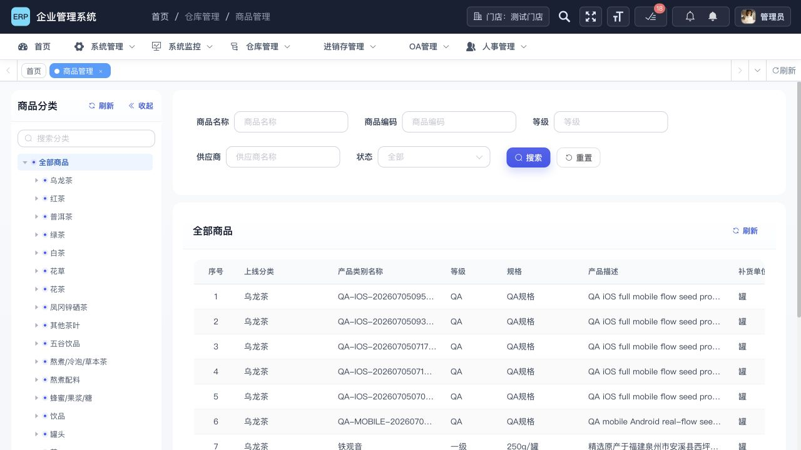

建议：门店入口改名为“查看商品资料”，说明改为“查询商品、编码和规格”；有维护权限时才显示“维护商品资料”，并保持菜单归属一致。

### 步骤 3：采购与入库 — 规则较完整，选料和表格需优化

采购页明确提示“采购单、收货和质检都会进入当前仓库库存”，组织语义清楚；采购日期也会默认当天。

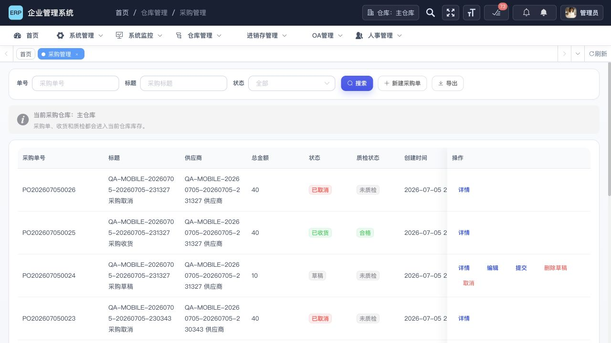

物料选择器要求先选商品/OE/礼盒，后端和提交前也会拦截无供应商物料，这是好的。但“添加到明细”在没有类型、没有选中行时仍显示为可点击，点击后才报错；商品表长编码、长供应商名称严重换行。

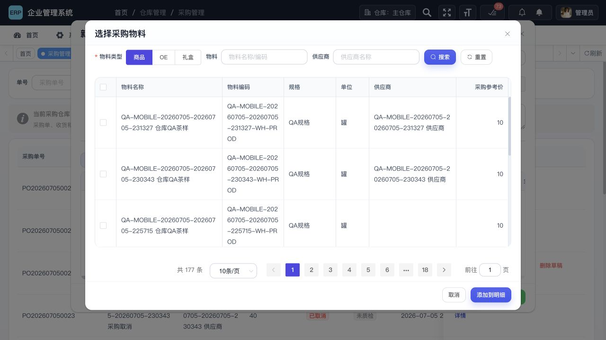

建议：按钮在 `未选类型 || 未选行` 时直接禁用；缺供应商行不可勾选并显示原因；列表默认把编码/名称/供应商作为三列主信息，其余放入展开详情。

### 步骤 4：库存查询、可见库存与流水 — 底账健康，范围交互矛盾

当前仓库库存能显示库存、可用、锁定和预警，底账数据经数据库核对无一致性异常。

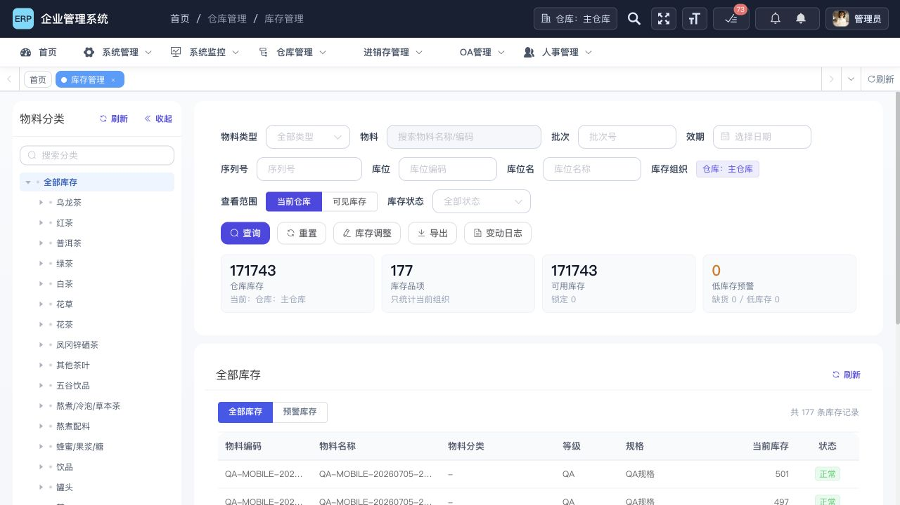

切换到“可见库存”后，页面明确写着“只读查看；库存调整请切回当前仓库范围”，但顶部“库存调整”仍然可点击并打开完整调整框。前后端最终会强制写入当前仓库，不会把门店库存直接改掉，但用户很容易误判自己正在调整当前看到的跨组织行。

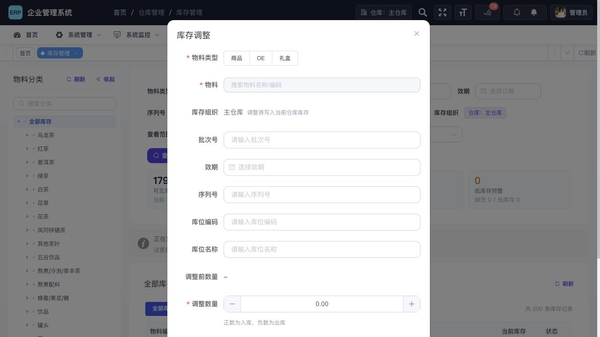

从可见库存进入“变动日志”后，日志自动收窄为当前仓库，且没有明显范围提示或门店筛选，用户无法解释为什么刚才看到的门店库存没有对应流水。

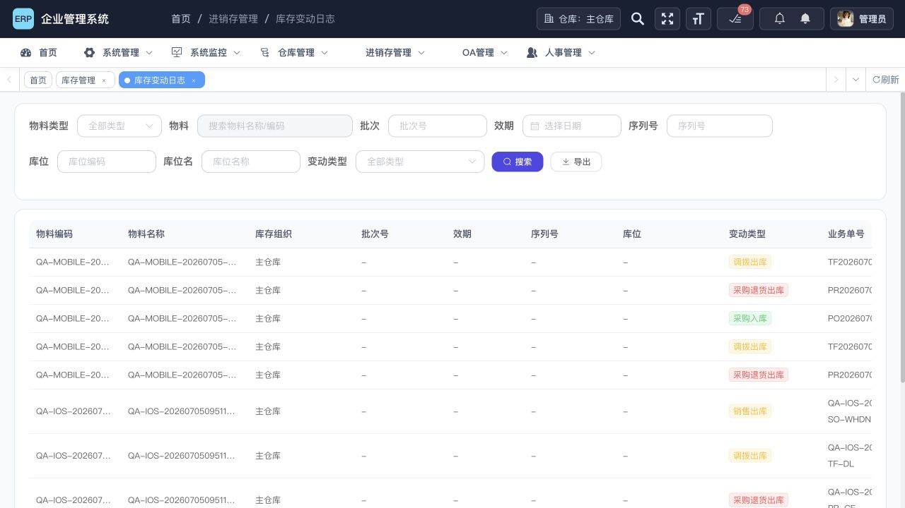

建议：可见库存范围内隐藏/禁用“库存调整”；若从跨组织页面进入流水，带入组织筛选或先提示“日志已切回当前仓库”；流水表补充“操作人”列，数据已经存在 `create_by`。

### 步骤 5：库存盘点 — 审批机制较好，盘点范围和术语需改

盘点支持草稿、实盘录入、差异审批、驳回重盘、快照变化失效，业务保护较完整。

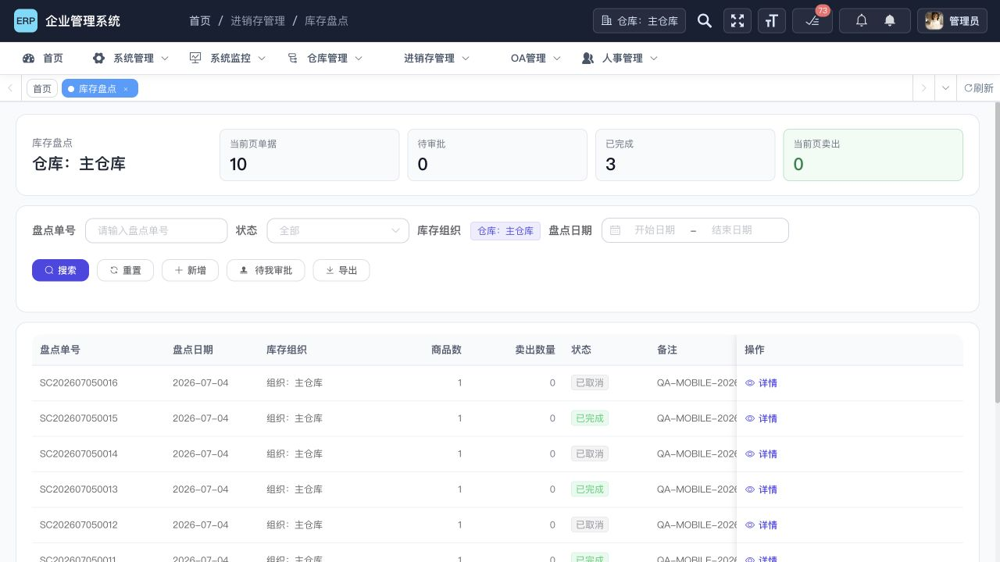

新建时只能选择日期和备注，随后会把当前组织全部库存一次性装入。后端其实已经支持按商品 ID 创建局部盘点，但桌面端没有暴露这个能力。主仓库当前有 177 个库存品项，全量盘点会明显增加录入成本。

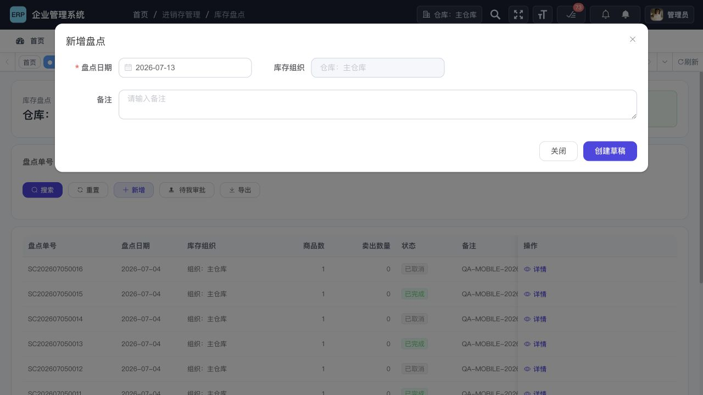

页面把 `账面数量 - 实盘数量` 叫作“卖出数量”。这个差额也可能来自损耗、错发、盗损或漏录，正确术语应为“盘亏数量”；`实盘 - 账面` 应为“盘盈数量”。

建议：创建前增加“全部 / 分类 / 指定商品 / 库位”范围；支持扫码连续录入和“未盘/已盘/有差异”过滤；术语统一改为盘盈/盘亏。

### 步骤 6：仓库调拨与门店要货 — 流程完整，列表可读性和积压需处理

调拨页能区分待审核、待发货、待收货和差异，当前责任也有语义。主要问题是固定左右列把一个业务行拆成三张表，1280 像素宽度下审批进度、当前责任、创建时间和操作互相挤压，单号也发生断行。

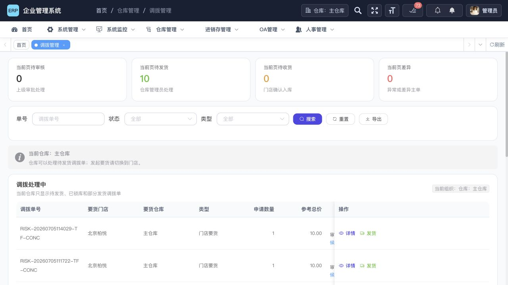

门店侧能发起要货，表单会先要求选择要货仓库，并能从仓库库存选择物料、显示仓库可用量和参考成本，方向正确。

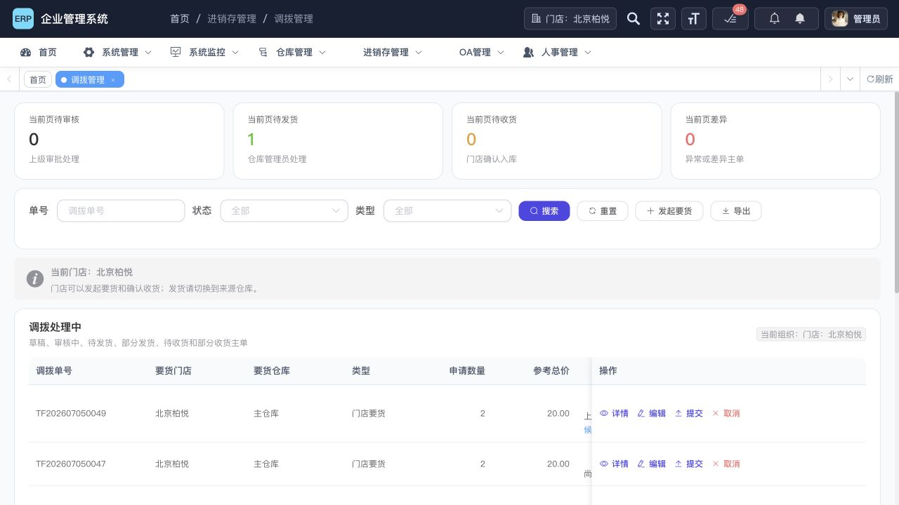

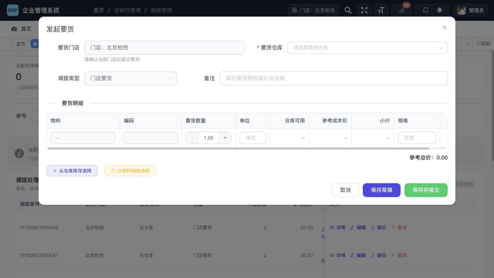

当前库中有 62 张调拨草稿、16 张已审批待后续处理、16 张待发货通知等积压，最早未完成调拨创建于 2026-06-14。若这是共享验收或生产数据，应增加超时标记、批量催办和责任人筛选。

### 步骤 7：销售与发货 — 状态流程可用，客户和价格主数据风险较高

销售列表支持草稿、提交、生成发货通知、出库和取消，但筛选缺少客户和业务日期；表格操作列过宽，标题、客户和时间被压缩。

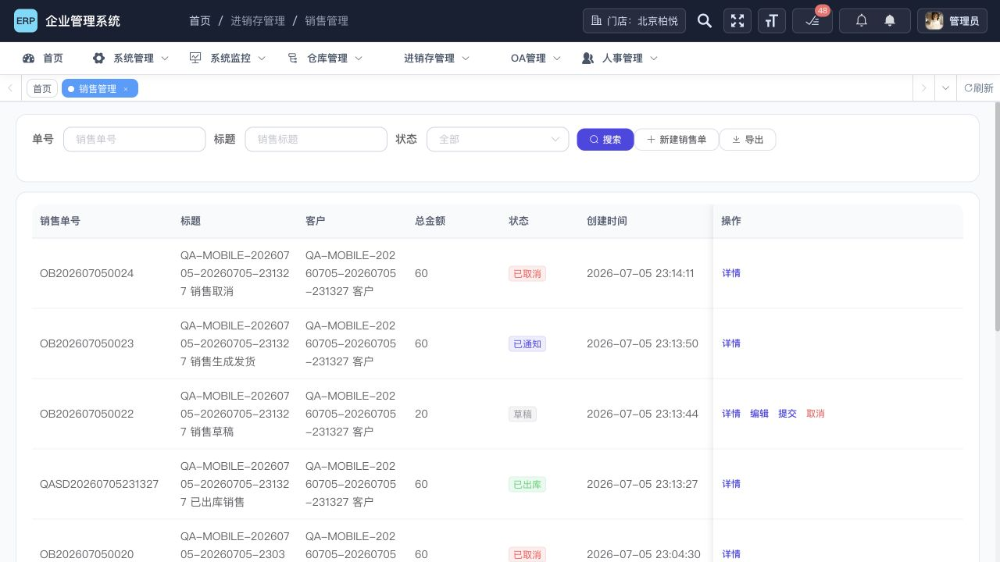

桌面端新建销售单要求手输客户文本，未复用已存在的客户档案；销售日期初始为空；商品默认售价取商品档案，而 183 个有效商品中有 167 个售价为 0。前后端都允许 0 元销售，当前数据虽然没有 0 元销售明细，但新单存在误提交风险。

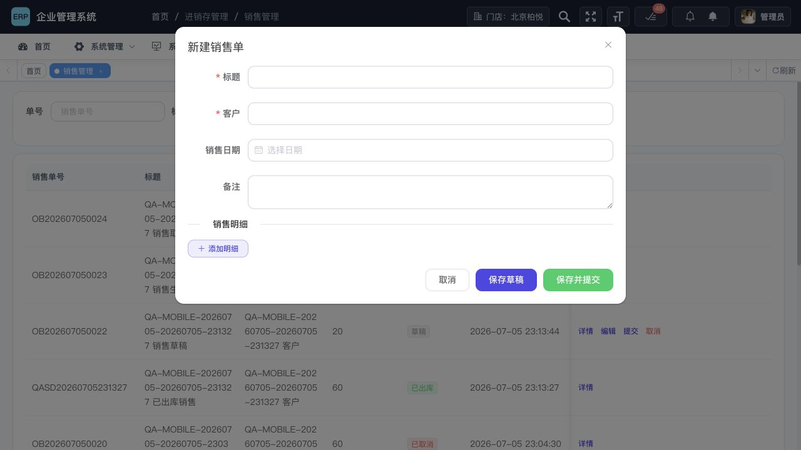

手机端配置已经有客户选择器和快速建客能力，桌面端应直接复用同一套业务能力，而不是继续维护纯文本客户。

发货通知在主仓库上下文中显示的是销售门店名称，却把列名写成“库存组织”。应拆成“销售门店”和“发货仓库”，并在列表顶部说明当前仓库只看到需要本仓发货的通知。

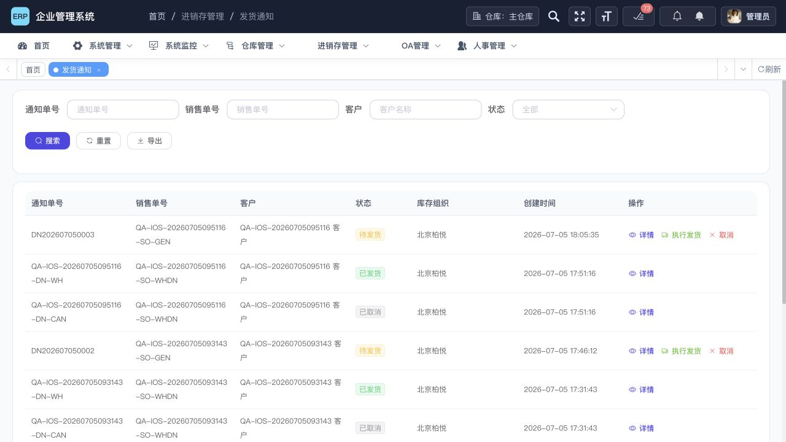

### 步骤 8：销售退货与采购退货 — 数量保护良好，来源字段应锁定

退货后端会按原单明细重算商品、单价、金额，并校验累计退货不超过已发/已收数量，这是重要优点。

但销售退货的客户、采购退货的供应商在选中原单后仍可编辑，后端也没有从原单重新覆盖或校验表头名称；退货日期不是必填，当前 16 张销售退货中有 4 张无日期，21 张采购退货中有 6 张无日期。

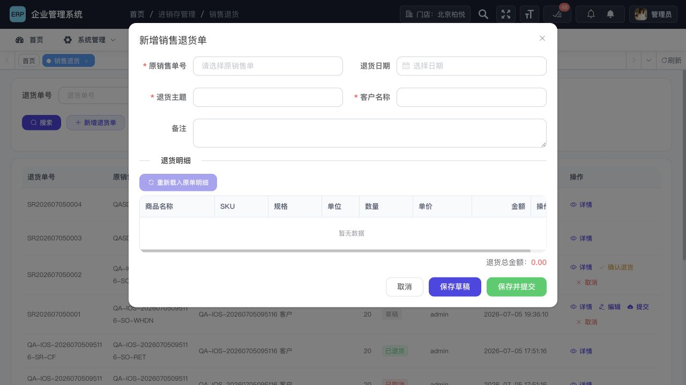

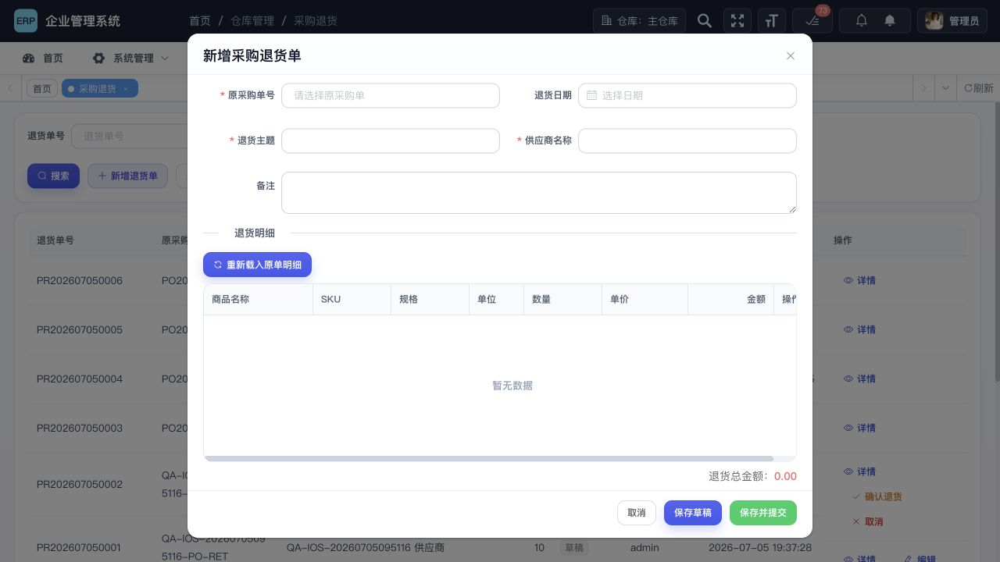

建议：客户/供应商改为来源快照只读字段；后端保存时按原单重建；退货日期默认当天且必填；明细默认数量不要直接填满全部可退量，改为 0 或 1，降低整单误退风险。

### 步骤 9：报表中心 — 严重问题，不能按现口径用于经营决策

门店报表显示：采购 0、销售 2,115.12、预估毛利 2,115.12；主仓库显示：采购 3,920.40、销售 20.00、预估毛利 -3,900.40。

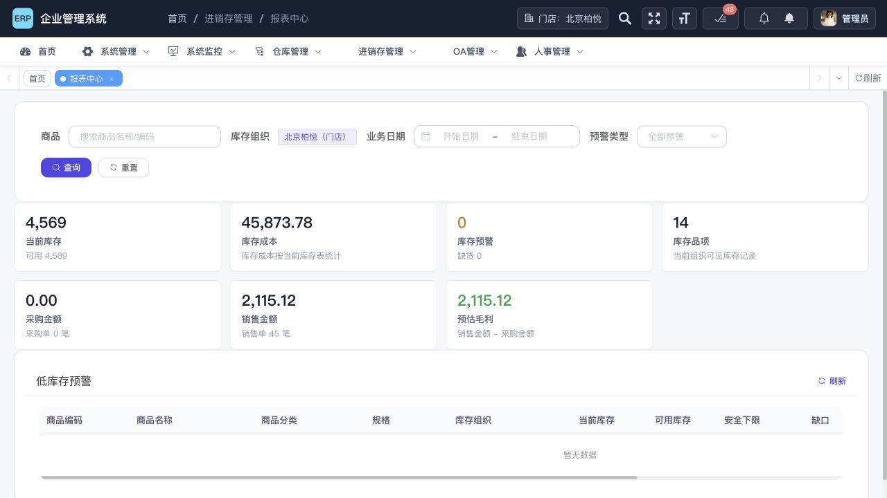

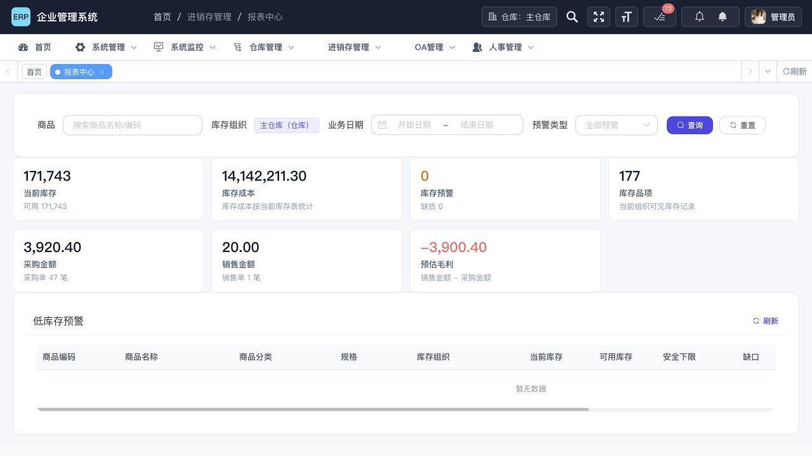

核验代码和数据后确认：

- `gross_margin = sales_amount - purchase_amount`，采购金额被错误当作销售成本。
- 采购/销售只排除了 cancelled，因此草稿、已提交、已通知等尚未完成的单据也计入金额。
- 销售退货和采购退货完全没有从报表金额中扣除。
- “当前库存 171,743”把罐、袋、斤、箱、包、瓶等至少 14 种单位直接相加，没有可解释的统一单位。
- 低库存规则按商品安全下限判断，但 177/183 个商品安全下限为 0，所以页面显示 0 个预警。

这不是展示文案问题，而是统计定义错误。必须先统一业务口径，再修改 SQL、页面和测试。

### 步骤 10：数据与自动化 — 库存一致性好，测试环境数据需要隔离

库存数据检查通过：

- 负当前库存：0；负可用库存：0；负锁定库存：0。
- 可用库存恒等式异常：0。
- 成本金额异常：0。
- 重复库存自然键：0。
- 孤儿商品/OE/礼盒：0。
- 库存组织维度不一致：0。

主数据和业务数据需要治理：

- 商品：10 个无分类、4 个无供应商、177 个安全下限为 0、167 个售价不大于 0。
- QA 数据占比：采购单 29/53、销售单 37/55、采购退货 16/21、销售退货 14/16、调拨 41/122、发货通知 12/22、商品 16/183。
- 待处理数据主要创建于 2026-07-04 至 2026-07-05，当前已积压约 8～9 天；部分调拨更早。

如果当前库是开发库，这些属于测试数据隔离问题；如果是共享验收/生产样本库，则会污染报表、待办和用户判断，必须在正式使用前清理。

## 四、问题清单与优先级

| 编号 | 优先级 | 问题 | 主要影响 | 建议 |
|---|---|---|---|---|
| RPT-01 | P0 | 用销售额减采购额计算毛利 | 直接误导经营决策 | 改为净销售收入 - 已实现销售成本 |
| RPT-02 | P0 | 草稿/已提交/已通知金额计入报表，退货未扣除 | 未实现业务被当作收入/成本 | 按状态和实际数量统计，纳入退货 |
| RPT-03 | P0 | 多种单位库存直接合计 | 总库存数字不可解释 | 按单位分组，或只展示品项数/标准换算量 |
| PRICE-01 | P1 | 167/183 个商品售价为 0，系统允许 0 元销售 | 易误发免费单 | 价格主数据必填；0 元走赠品/特批流程 |
| ALERT-01 | P1 | 177/183 个商品安全库存为 0 | 低库存预警失效 | 批量维护阈值，增加“阈值未配置”告警 |
| MASTER-01 | P1 | 销售/采购只保存客户/供应商名称文本 | 同名、改名、统计拆分 | 增加 ID 关联，同时保留名称快照 |
| RETURN-01 | P1 | 退货客户/供应商可改，日期可空 | 来源数据和统计日期不可靠 | 来源字段只读并由后端重建；日期必填 |
| SCOPE-01 | P1 | 可见库存标记只读但仍可打开调整 | 用户误判调整对象 | 跨组织范围禁用调整，明确切回入口 |
| SCOPE-02 | P1 | 可见库存到流水后范围自动收窄 | 前后列表无法解释 | 传递筛选或显示范围切换提示 |
| COUNT-01 | P1 | 新建盘点默认全量，未使用后端局部盘点能力 | 177 项全量录入成本高 | 创建前选分类/商品/库位 |
| COUNT-02 | P1 | 盘亏被标成“卖出” | 业务含义错误 | 改为盘亏/盘盈 |
| OPS-01 | P1 | 待发货、待审批、草稿积压且无超时突出 | 任务容易滞留 | SLA、超时颜色、责任人和批量催办 |
| DATA-01 | P1 | QA 数据大量混入当前业务库 | 报表、待办、搜索结果失真 | 独立测试租户/库，自动清理并禁止入正式库 |
| UX-01 | P2 | 宽表在 1280 宽度换行/遮挡 | 用户看不到状态和操作上下文 | 单号不换行、操作收进“更多”、横向滚动 |
| UX-02 | P2 | 商品快捷入口对门店宣称可维护但实际只读 | 入口预期错误 | 按权限改名和说明 |
| UX-03 | P2 | 销售缺客户/日期筛选，采购部分列表缺重置 | 查单效率低 | 统一查询栏和已选条件标签 |
| UX-04 | P2 | 发货通知把销售门店称为库存组织 | 组织语义混乱 | 同时展示销售门店和发货仓库 |
| A11Y-01 | P2 | 图标字形进入按钮名称、部分输入无可访问名称、固定列拆表 | 读屏和键盘操作困难 | 补 aria-label/label-for，修正语义表格并手测 |

## 五、整改方案

### 第一阶段：修正经营数字（P0）

1. 先确认并写入统一口径：
   - 销售收入：只统计已实际发货数量 × 销售价。
   - 销售退货：只扣已确认退货金额。
   - 销售成本：按销售出库库存流水的实际成本计算，退货入库冲回成本。
   - 毛利：净销售收入 - 净销售成本；采购额只作为采购分析指标，不参与毛利公式。
   - 采购金额拆成“已下单未收”“已收货入库”“已退货”三类。
2. 库存数量按单位分组展示；首页总卡改为“库存品项数”，避免跨单位求和。
3. 报表 SQL 增加状态、实际数量和退货条件；所有筛选统一使用业务日期。
4. 增加数据库夹具测试，不再只断言 SQL 中包含某个词。

报表验收样例：已发货销售 150 元、销售退货 20 元、出库成本 90 元、退货冲回成本 12 元，则净销售 130 元、净成本 78 元、毛利 52 元；任何草稿采购/销售都不能改变这三个数字。

### 第二阶段：补主数据和录单防错（P1）

1. 订单增加 `customer_id` / `supplier_id`，名称作为历史快照保留；桌面端复用手机端已有实体选择器和快速建客。
2. 退货表头从原单派生并只读，后端忽略客户端传入的客户/供应商名称；退货日期默认当天且必填。
3. 商品主数据增加批量维护：分类、供应商、售价、安全库存上下限。
4. 商品销售价为 0 时禁止普通销售提交；确需赠送时使用“赠品/免费样品”业务类型、权限和原因。
5. 缺安全库存阈值单独作为配置缺失提示，不能静默显示“0 个预警”。

### 第三阶段：缩短一线操作路径（P1/P2）

1. 库存：跨组织视图隐藏调整；范围状态固定在页面标题和导出文件名中；流水保留来源范围。
2. 盘点：创建前选择范围，支持扫码、批量设为账面数、只看未盘/差异；使用盘盈/盘亏术语。
3. 调拨：单号、门店、仓库、状态/责任作为常驻列；操作收进“更多”；超时单置顶并显示已等待天数。
4. 销售/采购：统一搜索、重置、日期范围、客户/供应商筛选；标题和日期自动默认但允许修改。
5. 发货：列表同时展示销售门店和实际发货仓库，确认框继续保留扣减仓库和数量说明。

### 第四阶段：数据、可访问性与持续检查

1. QA 数据放入独立 schema/租户；测试结束按前缀和 run-id 自动清理，生产写入层拒绝 `QA-*` / `RISK-*` 测试标识。
2. 每日检查待办 SLA：待审批、待发货、待收货、差异单、长期草稿；通知当前责任人。
3. 表单 label 与控件建立程序化关联；图标按钮提供纯文本可访问名称；全流程做键盘和读屏手测。
4. 在 CI 增加业务口径、组织矩阵、响应式截图和可访问性回归。

## 六、建议的持续检查清单

### 每次发布必测

- 门店/仓库/无效组织三类上下文的菜单、查询、写入和导出。
- 采购：草稿 → 提交 → 收货 → 质检 → 退货，含部分收货和重复提交。
- 销售：草稿 → 提交 → 发货通知 → 部分/全部发货 → 退货，含库存不足和并发提交。
- 调拨：要货 → 多级审批 → 部分发货 → 部分收货 → 差异处理。
- 盘点：无差异、盘盈、盘亏、审批驳回、库存快照变化失效。
- 报表：状态、日期、组织、商品、退货、成本口径和单位分组。
- 导出：导出行数、筛选范围、敏感成本权限和文件名组织标识。

### 每日数据检查

- 负库存、可用恒等式、重复库存键、孤儿物料、成本乘积异常。
- 0 元销售、无供应商采购、无日期退货、退货超过原单已发/已收数量。
- 安全库存未配置、售价未配置、分类未配置、客户/供应商未关联。
- 超过 SLA 的待审批、待发货、待收货、差异和草稿。

## 七、2026-07-13 整改执行结果

本轮已完成并纳入提交：

- 报表改为按实际收货、实际出库和已确认退货统计；毛利改为“净销售收入 - 净销售成本”，库存总量改为品项数，并单列安全库存阈值未配置数。
- 销售退货优先按原销售单实际出库成本冲回，历史出库日志缺失时才回退当前库存成本；报表遇到净销售成本为负时会提示复核历史退货成本。
- 销售单、采购单增加客户/供应商主数据 ID，后端按有效档案重建名称快照；普通销售禁止零售价商品。
- 销售退货、采购退货的来源客户/供应商改为只读快照，后端从原单重建，退货日期默认当天并必填。
- 跨组织库存范围禁用调整，库存流水明确当前组织范围并增加操作人；库存汇总不再把不同单位直接相加。
- 盘点支持全部库存、按商品分类、指定商品三种创建范围，统一使用盘盈/盘亏术语。
- 发货通知拆分销售门店和发货仓库，门店工作台商品入口改为“查看商品资料”，采购选择物料前先选择供应商。

数据库迁移已在本地 MySQL 重复执行验证，可幂等运行：

- 销售单 55 条中 51 条关联到唯一客户档案，4 条未解析记录均为历史 QA 数据。
- 采购单 53 条中 50 条关联到唯一供应商档案，3 条未解析记录均为历史 QA 数据。
- 两个外键均已建立，并使用 `ON DELETE SET NULL` 保留历史名称快照。
- 未自动改写无法唯一匹配的历史记录，也未自动重算历史库存流水，避免在缺少业务凭证时修改账务事实。

提交候选版本的独立回归结果：

- 后端：`mvn -pl erp-modules/erp-inventory -am test`，329 项通过，0 失败。
- 前端：`npm test`，152 项通过，0 失败。
- 生产构建：`npm run build:prod` 成功；保留项目原有的入口包体积提示（app 约 1.68 MiB）。
- 报表动态 SQL 已连接本地真实数据库执行，迁移脚本已重复执行；全程未使用虚拟机。

仍需由业务侧后续处理：批量维护售价和安全库存阈值、清理/隔离 QA 数据、核对历史负销售成本、处理超时单据，以及开展更广泛的表格响应式和无障碍专项优化。
- 正式库中出现 QA/RISK/test 前缀的数据。

## 七、验收标准

- P0 问题全部关闭，报表夹具结果与财务/业务确认口径一致。
- 新旧自动化全部通过；新增报表计算、0 元销售、退货来源锁定、跨组织调整和盘点范围测试。
- 库存一致性检查继续保持 0 异常。
- 1280×720 下采购、销售、调拨主表无关键信息重叠，单号和状态可直接阅读，操作可完成。
- 门店、仓库和普通角色分别验证；无权限角色既看不到按钮，直接调用接口也被拒绝。
- 键盘可完成组织选择、查询、新建、选择物料、保存和关闭；读屏能读出字段名、按钮名、错误和当前范围。
- 正式/共享验收环境中不再出现 QA 测试单污染业务报表和待办。

## 八、证据边界

本次使用当前管理员会话、本地服务和当前数据库完成检查。未执行会改变业务数据的最终提交，也未做以下验证：真实普通角色全矩阵、条码枪/打印机、极限并发压测、真实读屏软件、移动端运行时、导出文件逐列核对。因此这些项目应纳入整改后的验收轮次。

本次截图共保存在：`docs/audit-screenshots/inventory-20260713/`。
