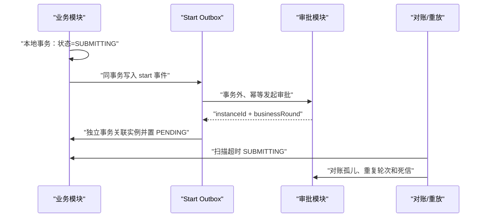
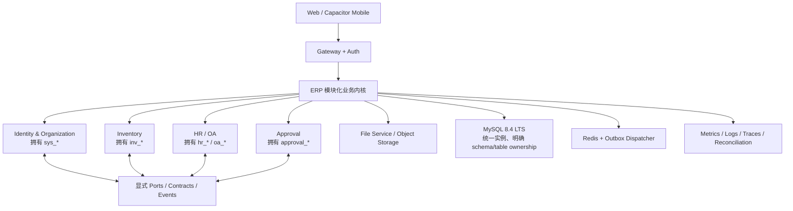

# ERP 项目整体改造方案

> 日期：2026-07-16  
> 基线：分支 `7月13号`，HEAD `b694659d`，当前未提交工作区  
> 定位：这是跨仓库、交付、数据库、后端架构、前端体验与运行治理的总方案；已有的人事、库存、合同、待办、云盘等专项文档继续作为领域附件。  
> 初始审查边界：下文第一至十一节记录的是实施前基线，当时只执行静态检查、现有前后端测试和发布静态门禁，尚未修改业务代码。随后已在 `codex/erp-product-optimization` 分支按风险优先级实施多轮整改；实际完成项、复验结果和未执行的环境级门禁以第十二节为准。全过程没有操作生产环境，也不把代码层 UX 结论表述为完整运行态或完整 WCAG 验收。

## 一、结论先行

这个项目值得继续改造，不建议推倒重写。

现有长板包括：Java 17 / Spring Boot 4 技术基线较新，业务功能覆盖丰富，已有 feature flag、幂等键、乐观锁、回调 outbox、迁移清单、产物校验、包体预算和大量回归资产。真正拖累项目的不是“后端技术过旧”，而是以下四件事：

1. 当前工作区和发布范围不可控，无法稳定回答“这次到底发布什么”。
2. 名义上的微服务共享一个数据库并大量跨域读写，形成分布式单体。
3. 审批发起跨越两个本地事务，存在远端成功、本地回滚后的孤儿实例风险。
4. 前端停留在已结束维护的 Vue 2 / Vue CLI 体系，且大页面、静态字符串测试和路由权限重复配置已经限制继续扩展。

推荐采用 **“先止血、再收敛、后渐进升级”** 的路线：

- 先把当前 1,490 个变更项固化成可追溯的干净基线，所有门禁归零。
- 短期治理现有微服务边界；中期把 System、OA、Inventory、Approval 收敛成严格模块化的业务内核，Gateway、Auth、File、Monitor 保持独立。
- 数据库先建立唯一迁移账本，再从 MySQL 5.7 迁往 MySQL 8.4 LTS 的影子环境。
- 前端先拆领域、补真实交互门禁和统一 Feature Manifest，再按业务切片迁到 Vue 3 / Vite / TypeScript；不做一次性全量替换。

在阶段 0～2 完成前，建议暂停新增大功能，只允许基线恢复、发布止血和 P0 一致性修复。

## 二、审查基线与关键事实

| 维度 | 当前事实 | 判断 |
| --- | --- | --- |
| 工作区 | 601 modified、23 deleted、866 个未跟踪文件，共 1,490 项 | 不能直接作为发布候选或大改基线 |
| 仓库体积 | `.git` 约 11GB，pack 约 10.36GiB | 构建产物进入历史，clone、备份和协作成本过高 |
| 二进制 | Git 跟踪 9 个部署 JAR，约 1.06GB；HEAD 中还有约 919MB 的历史发布 tar | 制品与源码没有分离 |
| 前端 | Vue 2.6.12、Vue CLI 4.4.6、Webpack 4、Element UI 2 | Vue 2 已 EOL，Vue CLI 处于维护模式 |
| 前端规模 | 约 226 个 SFC；18 个 SFC 超过 1,000 行，移动万能页 3,387 行 | 业务回归半径过大 |
| 前端测试 | 实测 194 项，14 项失败；176 项主要读取源码字符串 | 数量多，但运行态保障不足 |
| 后端测试 | 本次核心模块共执行 2,160 项，12 failures、5 errors；File 模块通过 | 当前后端基线为红色 |
| 审批模块 | 约 90 个主 Java 文件，Java 测试为 0 | 核心切流模块缺少动态行为保障 |
| 数据库 | 核心服务都连接 `BossERP_NEW`；仓库有 111 份 SQL、约 498 处 DDL | 缺唯一迁移历史和表所有权 |
| 服务耦合 | 13 个 Feign Client；OA、Inventory、Approval、System 互相依赖合同并跨域 SQL | 当前是分布式单体，不是真正自治微服务 |
| 工具链 | `java -version` 为 17，但 Maven 实际运行于 JDK 25；Node 实际为 26，超出项目声明的 `<25` | 构建不可复现，存在生产 JRE 17 兼容风险 |
| 发布 | 新业务静态门禁因迁移副本不一致失败；`git diff --check` 有 2 处错误 | 禁止绕过门禁发布 |
| CI | 未发现仓库级 CI 配置；关键发布、manifest、监控文件仍未跟踪 | 发布保证主要依赖本机状态 |

本次实测命令：

```bash
cd erp-ui && npm test

mvn -T 1C \
  -pl erp-modules/erp-system,erp-modules/erp-oa,erp-modules/erp-inventory,erp-modules/erp-file,erp-modules/erp-approval \
  -am test

bash scripts/verify-new-business-release.sh --static
git diff --check
```

## 三、P0：任何架构升级前必须先解决

### P0-1 发布范围与工作区失控

当前分支把人事、合同、待办、库存、云盘、审批、SQL、部署包和验证证据混在同一个未提交工作区中。阶段 0 不能使用 `reset --hard`、`clean` 或覆盖操作，应先生成全量清单和哈希，再按领域拆分候选提交或归档。

额外仓库问题：

- HEAD 把 `erp-ui/node_modules` 记录为指向本机绝对路径的符号链接，当前工作区又把它替换为实际目录。
- Git 跟踪部署 JAR 和历史 tar；`.gitignore` 只能阻止新文件，不能清理已有历史。
- 存在 `index 2.vue`、`remote_* 2.sh` 等 Finder 式副本，且前端门禁已因此失败。

完成门槛：干净 checkout 可在第二台机器重复构建；发布候选 `git status` 为空；所有文件都能追溯到提交和 manifest。

### P0-2 当前前后端和发布门禁均为红色

前端 14 个失败横跨调拨审批、OA 移动路由、签约中心、统一待办、发布 seed 和源码卫生。后端失败集中在 System、OA、Inventory 的待办合同、权限、健康证和调拨/盘点行为。它们可能包含“实现错”“测试过期”“中途重构缺文件”三类，必须逐项分类，不能简单删除测试。

静态发布门禁还检测到 `erp_hr_employee_position_number_20260714.sql` 的源文件与 release 副本不一致。任何一项失败都应阻止候选版本获得“可发布”状态。

完成门槛：

- 前端 194/194 通过；后端目标模块 failures/errors 都为 0。
- `git diff --check` 为 0。
- static/local/full 三种门禁语义明确，未执行的必需步骤必须 fail-closed。
- 生产构建元数据 `commit/time` 由统一脚本注入，不靠人工记忆。

### P0-3 审批发起存在跨服务事务断裂

以下业务方法在本地 `@Transactional` 中同步调用审批服务，远端审批实例独立提交后才回写本地业务状态：

- `erp-modules/erp-oa/src/main/java/com/erp/oa/service/impl/OaPurchaseServiceImpl.java:121-165`
- `erp-modules/erp-inventory/src/main/java/com/erp/inventory/service/impl/InvTransferServiceImpl.java:169-227`
- `erp-modules/erp-inventory/src/main/java/com/erp/inventory/service/impl/InvStockCheckServiceImpl.java:400-470`
- `erp-modules/erp-system/src/main/java/com/erp/system/service/impl/HrHealthCertificateServiceImpl.java:146-190`
- `erp-modules/erp-approval/src/main/java/com/erp/approval/service/ApprovalRuntimeService.java:78-225`

当远端成功、本地更新失败或回滚时，会留下孤儿审批实例。建议统一改为审批 start-outbox / inbox saga：



完成门槛：孤儿实例为 0、同一 business-round 重复实例为 0、超时 `SUBMITTING` 为 0、callback dead 为 0，并有失败注入测试证明远端/本地任一侧失败都可恢复。

### P0-4 审批迁移把 schema、seed 和 cutover 混在一起

`sql/erp_unified_approval_center_20260714.sql:934-1009` 会把盘点、调拨模板切到 `NATIVE` 并自动把 feature flag 置为 true；该 SQL 又位于 `docker/mysql/bootstrap-files.list`。

必须拆成四个版本契约：

1. expand/schema；
2. seed/rule，但开关保持 false；
3. 独立、人工确认的 cutover；
4. 关闭入口与旧代码兼容的 rollback/runbook。

DDL/bootstrap 永远不能顺带开启生产业务路径。审批模块需要先补状态矩阵、幂等、并发、回调失败、重放和真实 MySQL 集成测试。

### P0-5 发布包、运行定义和业务文件存在数据风险

当前发布链需要一次集中止血：

- 发布归档没有统一排除 `docker/mysql/seed/`、数据库 dump、Excel/CSV、备份和运行数据；本地 seed 含账号/人员类数据，不能进入发布包。
- 生产 host 发布器的服务清单遗漏 `approval`，却会打包 approval JAR，可能出现“制品存在但服务未启动”。
- Systemd 启动器和 unit 没有完整版本化，发布器从上一版本复制运行脚本。
- `uploadPath` 随 release 目录复制，代码回滚切换旧 symlink 后，发布期间新增文件可能不可见。
- 当前 Nginx 只监听 80；正式 Web/原生应用应先完成 HTTPS、证书续期和 80→443。
- `.env.example` 不能完整渲染 ECS Compose，示例契约与生产拓扑不闭合。

完成门槛：发布采用显式 allowlist；运行数据全部位于共享持久卷/对象存储；服务清单由 manifest 生成；每个服务都有真实 readiness；HTTPS 登录、上传、下载、推送深链均通过。

## 四、三种战略路线

| 路线 | 做法 | 优点 | 代价/风险 | 结论 |
| --- | --- | --- | --- | --- |
| A. 继续修补现有微服务 | 保留所有部署单元，增加表所有权、Outbox、合同测试和 CI | 短期变化最小 | 分布式事务和运维成本长期保留，仍难独立发布 | 适合作为止血阶段 |
| B. 模块化业务内核 | System、OA、Inventory、Approval 合并为一个部署单元，保留严格 Maven 模块与端口；Gateway/Auth/File/Monitor 独立 | 符合当前单仓、共享库、同版本发布的真实形态；大量一致性回到本地事务 | 需要架构规则防止退化成无结构单体 | **推荐战略目标** |
| C. 真正微服务化 | 每域独立 schema、发布、团队、SLO，通过版本合同和事件投影协作 | 自治和隔离最强 | 数据迁移、分布式一致性、运维和可观测性成本最高 | 只有独立团队/扩缩容/合规证据成立时采用 |

推荐顺序是 **先 A 止血，后 B 收敛**。模块边界、合同和事件接口继续保留；未来若某个域确实需要独立扩缩容，再从 B 中有证据地提取成 C。

前端也采用同样原则：先稳定当前 Vue 2，完成领域拆分和测试升级；再通过小规模兼容性 spike 选择 `@vue/compat` 或双壳/路由级切片，最终收敛到 Vue 3、Vite、Pinia、Element Plus 和 TypeScript。禁止在当前红色基线上一次性迁移 226 个 SFC。

## 五、目标架构



关键规则：

- 允许同一个 MySQL 实例，但每张表必须有唯一 owner；跨域写为 0。
- 跨域读优先使用 API、只读投影或明确审批过的 view；不能在 mapper 中随意 join 其他域。
- `erp-contract-core` 只包含纯 DTO、常量和响应信封；持久化实体、密码、完整 HR 档案不得成为跨服务合同。
- 所有模块依赖方向由 Maven/ArchUnit 自动检查，禁止环依赖。
- 审批、通知、文件和对账采用幂等事件；不为了“微服务”引入不必要的新中间件，先复用数据库 outbox。

## 六、分阶段执行计划

### 阶段 0：保护现场并恢复绿色基线（3～5 个工作日）

目标：得到唯一、可构建、可审查的候选基线，同时不丢失当前任何用户改动。

工作：

1. 生成 1,490 项变更清单、路径分类、大小、SHA-256 和所属业务域。
2. 在仓库外做只读快照；按 System/HR/OA/Inventory/Approval/File/UI/Deploy/SQL 拆分候选提交或补丁。
3. 移除所有 `* 2.*` 副本和绝对路径 `node_modules` 符号链接，但必须先核对内容再处理。
4. 增加 Maven Wrapper、`--release 17`、Enforcer/Toolchains；固定 Node 22 或 24、npm 和 Java 17。
5. 对 14 个前端失败及后端 12 failures/5 errors 做分类并归零。
6. 修复 release SQL 副本、尾随空格、构建元数据注入和静态门禁。

验收：干净 clone 在固定工具链中完整通过；第二次构建产物哈希可解释；工作区和发布 manifest 一一对应。

回滚：本阶段不重写历史、不删除数据库、不触碰生产；任何清理前都保留路径清单和内容哈希。

### 阶段 1：交付、制品和运行止血（1～2 周）

目标：禁止从脏工作区发布，让源码、制品、配置和运行数据完全分离。

工作：

1. 建立一条跨项目统一的 `verify-release`，替代不断增长的 feature-specific 发布脚本入口。
2. 接入 PR CI：源码卫生、DLP/secret scan、Maven test、前端 test/build、Compose config、迁移校验。
3. 接入 release CI：真实数据库测试、OCI 镜像、完整 manifest、镜像 digest、SBOM、签名和归档验证。
4. 停止提交 JAR/tar；先从当前分支移除跟踪，Git 历史清理另开维护窗口。
5. 发布包改为 allowlist，强制排除 seed、dump、Excel/CSV、`.env`、备份、日志、上传目录。
6. 版本化 Systemd/启动器/服务清单，补 `approval`；失败的 readiness/API 检查不得被 `|| true` 吞掉。
7. 把 `uploadPath` 迁到共享持久卷或对象存储。
8. 完成 HTTPS、证书续期、80→443 和移动端生产链路验证。

验收：任何一项未执行或失败都不能生成可发布标记；manifest 覆盖全部服务和制品；代码回滚不影响发布后新增文件。

### 阶段 2：审批一致性与权限边界（1～2 周）

目标：先消除会产生业务事实不一致的缺陷，再谈模块拆分。

工作：

1. 实现审批 start-outbox/inbox、超时扫描、孤儿对账和人工重放。
2. 拆分 approval schema/seed/cutover，所有开关默认 false。
3. 为 approval 增加单元、MySQL IT、并发、回滚和失败注入测试。
4. 让 approval readiness 校验 schema、模板、回调注册、outbox lag，而不是固定返回 ready。
5. 修复移动路由 `meta.permissions` 已声明但守卫未消费的 fail-open 行为；未分类路由默认拒绝。
6. 建立统一 Feature Manifest，生成桌面/移动入口、权限、feature flag、deep link 和测试清单。

验收：审批状态矩阵覆盖 100%；孤儿/重复实例为 0；58 条移动路由 100% 显式分类；负向越权 E2E 全通过。

### 阶段 3：数据库迁移治理与 MySQL 8.4（2～3 周）

目标：让数据库状态可证明、可重复、可恢复。

工作：

1. 从生产 schema 快照建立只读 baseline；未来增量迁移进入唯一目录和唯一 migration ledger。
2. 引入 Flyway 或等价迁移账本，由发布 job 单次执行，多个业务进程不得并发自动迁移。
3. 已执行 migration 不再修改；修正使用新的 roll-forward 版本。
4. 合并 `sql/`、`docker/mysql/db/`、release 副本的重复真源；Docker bootstrap 由脱敏 schema baseline + 有序 migrations 组成。
5. 建立表所有权矩阵；第一阶段跨域写 SQL 清零，跨域读建立白名单和替代计划。
6. 在 MySQL 8.4 LTS 影子库执行 Upgrade Checker、字符集/排序规则检查、迁移、全量测试、慢查询基线、备份恢复和双写/对账演练。
7. 选择受支持的中转或逻辑导入路径，禁止从 5.7 直接盲目原地跨级。

验收：迁移 checksum 和执行历史唯一；空库可自举；生产克隆库可完成失败恢复；MySQL 8.4 下核心流程、并发和性能门槛通过。

回滚：采用 expand/contract；紧急回滚优先关闭入口并回退应用，保留新增结构和业务事实，不在事故窗口直接 DROP。

### 阶段 4：后端模块化业务内核（3～6 周）

目标：消除分布式单体最昂贵的部分，同时保留未来拆服务的接缝。

工作：

1. 新建最小 `erp-contract-core`，分离 Feign transport、领域对象和持久化实体。
2. 按 `identity-organization`、`inventory`、`hr-oa`、`approval` 建立 package-by-feature 和依赖规则。
3. 把 OA 直接更新 System 表、Approval 直接扫描用户/角色/菜单等行为改成 owner API 或本地投影。
4. 先固定事务边界，再拆热点：`OaSignPackageServiceImpl`、`HrLifecycleServiceImpl`、`InvTransferApprovalServiceImpl`、`InvPurchaseServiceImpl`、`SysUserServiceImpl`。
5. 统一状态语义、错误码和 API 响应；清理无业务使用的 Seata 依赖或明确其唯一策略。
6. 将 System/OA/Inventory/Approval 合并成一个可部署业务内核的可行性在 staging 量化；若收益不足，可暂时保留物理服务，但模块规则不变。

验收：跨域写为 0、依赖违规为 0、Maven 环为 0；最大 10 个热点类体积下降至少 50%；关键写路径都有真实 MySQL 测试。

### 阶段 5：前端领域化和 Vue 3 渐进迁移（4～8 周）

目标：在业务不中断的前提下淘汰 Vue 2 / Vue CLI，并降低页面回归半径。

建议目录：

```text
src/
  app/                 # 启动、路由、守卫、状态编排
  features/
    inventory/
    oa/
    hr/
    approval/
    system/
  shared/
    ui/
    tokens/
    contracts/
  mobile/              # 壳、导航、深链、原生桥接
```

工作：

1. 先从 SFC 抽出 API、业务规则、状态机和 formatter，新增 TypeScript 类型，不立即替换所有 UI。
2. 把 3,387 行移动万能页及调拨、签约、盘点大页按领域控制器和视图组件拆分。
3. 建四层测试：纯函数/契约、组件交互、Playwright 关键流程、axe + 关键截图回归。
4. 统一 768/992 两套移动判定，纳入 Capacitor/iPad、横竖屏和 deep link。
5. 修复核心导航的 click-only `div/span`、全局焦点轮廓、localStorage JSON 白屏等基础问题。
6. 先选一个低风险业务切片做 Vue 3/Vite/Pinia/Element Plus spike；通过 feature flag 保留旧页面回退。
7. 建议迁移顺序：通知/只读管理页 → HR 基础档案 → OA 非签约流程 → 库存查询 → 调拨/盘点/签约等高风险流程。

验收：超 1,000 行 SFC 第一轮降到不超过 5 个、最终为 0；核心非语义点击为 0；关键流程 serious/critical axe 问题为 0；所有高频路由有 gzip 预算和 RUM 指标。

### 阶段 6：可观测性、灰度与灾备（持续，首轮 1～2 周）

目标：让“业务正确”能被生产数据持续证明。

工作：

1. 正式部署指标 registry、Prometheus/Alertmanager 或等价平台；门禁验证规则已加载，不只验证 YAML 存在。
2. 版本化 reconciliation timer，监控 outbox、孤儿审批、库存守恒、跨店拒绝、上传失败和 dead letter。
3. 日志加入 trace/request/release/business ID，建立发布标记和业务 dashboard。
4. 单门店/单仓库灰度，连续对账后扩大；演练“关闭新入口但在途业务继续完成”。
5. 建异机备份/PITR、季度恢复演练和经过实测的 RTO/RPO。

验收：连续 7 天核心对账差异为 0；审批成功率不低于 99.9%；dead letter 为 0；回滚演练在 15 分钟内恢复旧代码且不丢文件事实。

## 七、第一批建议任务（下一轮直接执行）

建议先开一个只做“基线恢复”的批次，不混入 Vue 3 或新业务：

1. 固化 1,490 项工作区变更清单和仓库外只读快照。
2. 固定 Java 17、Maven、Node 22/24、npm；补 Wrapper、Enforcer 和 `--release 17`。
3. 把前端 14 个失败、后端 12 failures/5 errors逐项分类并归零。
4. 修复 static release gate、SQL 副本、构建 commit/time 和 2 处 whitespace。
5. 阻止 seed/dump/Excel/上传目录进入发布包，纳管 approval 服务和运行定义。
6. 把 `uploadPath` 迁出 release 目录；完成 HTTPS。
7. 拆分 approval schema/seed/cutover，禁止自动开启 native flag。
8. 为 approval 建立第一组状态机、幂等、远端成功/本地失败测试。
9. 建统一 CI 入口，干净 clone 通过后才进入后续架构和前端改造。

## 八、量化看板

| 指标 | 当前 | 阶段目标 |
| --- | ---: | ---: |
| 可追溯工作区变更 | 1,490 项混合 | 100% 归属提交/归档/manifest |
| 前端测试 | 180/194 | 194/194 |
| 后端核心测试 | 12 failures + 5 errors | 0 |
| Approval Java 测试 | 0 文件 | 状态矩阵、并发、回滚、IT 全覆盖 |
| Git pack | 10.36GiB | 停止增长；历史维护后新 clone <1GiB |
| 跨域写 SQL | 多处 | 0 |
| 孤儿/重复审批 | 未建立统一度量 | 0 |
| 超 1,000 行 SFC | 18 | 第一轮 ≤5，最终 0 |
| 移动路由显式分类 | 至少 4 条权限声明未被守卫消费 | 58/58 |
| 浏览器关键流程门禁 | 未进入 npm 主门禁 | 至少 10 条核心流程 |
| 自动无障碍门禁 | 无 axe | serious/critical = 0 |
| MySQL | 5.7 兼容为主，初始化模型分裂 | 8.4 LTS 生产基线、唯一账本 |
| 制品追溯 | JAR/tar 在 Git，manifest 不完整 | 全服务 digest + commit + SBOM + 签名 |

## 九、关键风险与回滚原则

- 当前工作区属于用户资产；任何实施都不得先清理后补救。
- Git 历史重写必须单独维护窗口：镜像备份、冻结合并、通知所有协作者、全部 clone 重新拉取。
- 数据库坚持 expand/contract；应用回滚不等于数据库回滚。
- 审批切流必须人工开关、单业务/单组织灰度，migration 不得自动切流。
- 前端每个新业务切片都保留 feature flag 和旧路由回退，直至 E2E、RUM 和用户验收通过。
- 上传文件、数据库、日志等业务事实永远独立于 release 目录和代码 symlink。
- 测试失败不能通过删除断言、放宽 `|| true` 或标记 skip 来“变绿”；必须记录是实现修复还是合同更新。

## 十、外部技术依据

- Vue 官方说明 Vue 2 已于 2023-12-31 结束支持：<https://v2.vuejs.org/eol/>
- Vue CLI 官方已标记为 Maintenance Mode，并推荐 Vite：<https://cli.vuejs.org/guide/installation.html>
- Vue 官方迁移指南建议 Vue 3 采用 Vite、Pinia 等新工具链：<https://v3-migration.vuejs.org/recommendations.html>
- Flyway 版本化迁移按顺序仅执行一次，并用 checksum 检测已执行脚本被修改：<https://documentation.red-gate.com/fd/versioned-migrations-273973333.html>
- MySQL 官方说明 5.7 已进入 Sustaining Support：<https://www.mysql.com/support/eol-notice.html>
- MySQL 官方把 8.4 定义为 LTS，适合需要稳定行为和长期支持的生产环境：<https://dev.mysql.com/doc/refman/8.4/en/mysql-releases.html>

## 十一、建议决策

建议批准以下总方向：

1. **战略路线：先 A 止血，后 B 模块化业务内核。**
2. **下一轮范围：只执行阶段 0 和阶段 1 的第一部分，不加入新业务。**
3. **前端目标：Vue 3/Vite/TypeScript，但必须在绿色基线和领域拆分后渐进实施。**
4. **数据库目标：唯一迁移账本 + MySQL 8.4 LTS 影子迁移，不做盲目原地升级。**

完成阶段 0 后，再基于干净基线给出逐文件、逐提交的第一批实施计划。

## 十二、实施结果与最终复验（2026-07-16）

> 本节是本轮实际执行记录。前述第一至十一节保留最初审计时的基线、风险判断和长期路线，不应被解读为本轮所有长期架构工作均已完成。

### 12.1 分支与用户资产保护

- 已在原始分支 `7月13号` 的当前工作区上创建并切换到 `codex/erp-product-optimization`。
- 全程保留用户已有的大量未提交变更，没有执行清理、重置、覆盖或历史重写；因此本轮也没有擅自暂存或提交混合工作区。
- 所有改动均在当前分支内完成，并通过差异、静态门禁、自动化测试、真实 MySQL 8.0 和浏览器运行态复验交叉验证。

### 12.2 已完成的产品与交互改进

1. **前端路由与失败反馈**
   - 动态路由加载失败不再被吞掉，可明确报错并重试；路由层只忽略真正的重复导航。
   - 首页、仪表盘、销售、采购和移动签约的网络失败均提供可见反馈与重试入口，避免把失败误呈现为空数据或成功状态。
   - 仪表盘权限回退不再泄露无权访问的数据；统一待办与首页组织上下文租约保持一致。
2. **表单、按钮与并发交互**
   - 销售、采购提交从校验开始即进入互斥状态，防止重复点击、重复请求和弹窗误关闭。
   - 销售/采购列表、采购质检均加入请求序列与快照校验，较早返回的旧请求不能覆盖新筛选结果。
   - 销售新增弹窗关闭后将焦点恢复到触发按钮；刷新失败使用 `role=alert` 提示并可重新刷新。
3. **采购与签约数据正确性**
   - 采购收货补齐数量、时间和过期响应校验，服务端到货时间设为必填，并限制输入规模。
   - 移动签约 PDF 门禁校验 MIME、文件头、EOF、包/文档/版本/哈希及当前 DOM 上下文；旧响应和辅助文件不能误解锁签署。
   - 文件及非文件失败均提供明确原因和重试路径。
4. **审批与跨组织权限**
   - 统一待办按组织和部门上下文过滤；审批动作加入幂等保护。
   - 调拨、盘点、OA 采购、健康四个领域建立持久化审批启动 outbox：业务与 outbox 同事务、提交后派发、定时补偿、远端成功独立落账、CAS 收口、早到回调和失败重试。
   - 固化远端业务轮次，校验正数实例 ID；轮次错配、实例冲突、业务不存在、状态/版本变化等永久冲突不会被普通重放错误推进。
   - 列表、汇总和人工重放分别纳入专用权限与数据范围；管理员可发现孤儿记录，受限用户不可越域查看或重放。
   - Drive 文件事实增加 SHA-256 完整性校验。
5. **运维可用性**
   - 提交后即时派发和查询异常只记录并交由调度恢复，不再让已经提交成功的业务请求向用户伪装成失败。
   - 四域运维权限默认只授予管理员；健康审批 seed 重跑会保留管理员主动禁用状态。

### 12.3 数据库与发布链路改进

- 自动发布迁移清单由 13 项补齐为 **18 项**，覆盖健康、团队、职位、库存、门店退货、差异单、补货、固定资产、客服、统一审批 expand/schema/seed 及四域 outbox。
- 宿主、远端和 Docker 发布清单均拒绝 3 个不安全 cutover/清理脚本；旧的高风险审批脚本移入 `docker/mysql/manual/`，必须人工评审后执行。
- 统一审批 schema 与 seed 拆分，10 个切流开关默认关闭；自动迁移只扩展结构，不自动开启业务流量。
- 18 份源 SQL、Docker SQL 和 release SQL 已保持逐字节一致，并校验依赖闭包、顺序、哈希、镜像和 feature flag。
- 迁移前置校验区分“可选新表”和“必须存在的备份表”，既支持空库安装，也保留升级库的表存在性与备份证据。
- 三个已有 outbox 的增量列使用兼容 MySQL 5.7/8.0 的幂等动态 `ALTER`；已在 MySQL 8.0 上验证旧表升级与重复执行。

### 12.4 最终验证结果

| 验证面 | 最终结果 |
| --- | --- |
| 前端 Node 自动化 | **203/203 通过** |
| 前端生产构建 | 通过；主包预算 **1.48 MiB / 1.500 MiB**，release metadata 与敏感信息扫描通过 |
| 后端 Maven 自动化 | **2,413** 项：0 failure、0 error、3 项环境相关 skip |
| 四域 outbox 专项 | **140/140 通过**；静态合同 **5/5 通过** |
| 发布静态总门禁 | **68/68 Python 合同通过**，全部 shell/Node 发布门禁通过 |
| 发布迁移 | **18 项**顺序、依赖、哈希、镜像、默认关闭检查通过 |
| MySQL 8.0.45 实库 | 18 项迁移连续执行两遍成功；12 个审批表、4 个 start-outbox、10 个开关均关闭 |
| 权限种子 | 管理员运维授权 8 项、非管理员 0 项；健康管理员禁用状态经 seed 重跑保持不变 |
| 升级兼容性 | 旧调拨/盘点/OA outbox 表重复迁移后只补齐 3 个目标列，无重复列 |

发布门禁证据：`output/new-business-release/20260715T225420Z/summary.json`。

### 12.5 浏览器证据与关键流程

以下证据来自本地真实应用、已登录管理员和测试门店上下文；截图用于记录页面与状态，自动化测试和控制台检查用于验证交互行为：

1. [系统入口与组织选择](audit-screenshots/overall-20260716/01-entry.png)
2. [组织上下文已选择](audit-screenshots/overall-20260716/02-organization-selected.png)
3. [门店仪表盘](audit-screenshots/overall-20260716/03-store-dashboard.png)
4. [销售单列表与数据状态](audit-screenshots/overall-20260716/04-sales-list.png)
5. [销售新增弹窗、取消与焦点恢复](audit-screenshots/overall-20260716/05-sales-create-dialog.png)
6. [统一待办与审批入口](audit-screenshots/overall-20260716/06-unified-todo.png)

销售新增弹窗已在运行态完成“打开 → 取消 → 焦点返回触发按钮”复验，相关浏览器 console warning/error 均为空。

### 12.6 复审结论与剩余边界

本轮先后进行了实现复审、问题修正和独立终审。最终前端交互、四域审批 outbox 和发布迁移三个专项中，未再发现可复现、证据充分的 P0/P1/P2 问题；这表示本轮审计范围已收口，不代表未来需求变化、生产数据或未覆盖模块永远不会出现新问题。

仍需在有对应环境和发布授权后完成的事项：

- Docker 当前不可用，未实际运行 MySQL 5.7/8.0 Testcontainers；本轮只完成 MySQL 8.0.45 实库双跑和 5.7/8.0 兼容 SQL 静态/升级验证。
- 尚未在真实生产/ECS 执行发布、备份恢复、证书/HTTPS、人工 cutover 或开启任何 feature flag。
- 未执行真实 Spring AOP + 管理员/两个部门的端到端数据范围测试；当前由单元、合同、SQL 和 MySQL 实库验证覆盖。
- 当前环境没有 `promtool`，因此告警规则只完成仓库静态门禁。
- 本轮检查了关键页面、键盘焦点和错误反馈，但没有宣称完成全站 WCAG 合规审计。

基于上述边界，本轮可以安全交付为：**开发分支已完成、默认切流关闭、发布材料可复验，等待具备生产权限后按发布手册灰度执行。**
